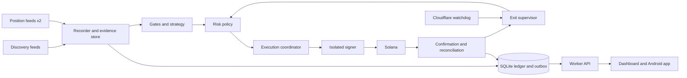

# Zeroed architecture

Zeroed is a personal Solana meme-token trading bot with an always-on worker, a web dashboard and an Android app. This document is what builders build from. It started as a planning brief (October 3, 2026) and was rewritten the same day from ten research reports in `docs/research/`. Every fact that changed links to its source report. Summaries of the reports are in `docs/RESEARCH.md`; every decision and its reason is in `docs/DECISIONS.md`.

Where this document and `CLAUDE.md` differ, `CLAUDE.md` wins.

## 1. Summary

1. **Our own measured study found no profitable rule.** We recorded 518 pump.fun graduations survivorship-free and tested 72 entry and exit rules after costs. **0 of 72 had a positive mean; 65 of 72 had a 95% CI entirely below zero.** The median graduate was **+101% at 5 minutes and −93% at 1 hour**; 71–76% lost at least 80% within the hour. An independent audit confirmed the result ([empirical.md](research/empirical.md), Bottom line and Audit). Published studies agree: in a 41k-token dataset, buying at the migration price and selling at a random time within the hour lost about 61–65% on average, before fees, on a rebalanced test sample, so it is a rough upper bound, not an executable P&L ([venues.md](research/venues.md) §5.3; corrected in [risk.md](research/risk.md) Fact-check F1).
2. **So the bot ships in paper mode, and its default answer is "no trade".** No graduation-window entries. Three other universes are tested first on a transaction-level historical backtest that runs the same engine code as live and cannot see the future (§3, §16). A strategy reaches live trading only through the promotion gates (§14) and the owner's pre-funding gate (§15).
3. **Venue fees are the main cost at $2–$5.** pump.fun curve and young PumpSwap pools charge 1.20–1.25% per side. A round trip costs about **2.8–3.0%** before slippage, so a setup needs a conservative gross edge well above 3% ([execution.md](research/execution.md) §8).
4. **The bot is built to scale, but proves itself small first.** Bankroll, trade sizes, loss limits and position count are configuration. The $20 bankroll and $2–$5 trades are the trial setting only (`CLAUDE.md`).
5. **Free data is enough for paper mode.** Discovery from two free feeds; exits get the fastest path. First paid upgrade is Helius Developer ($49/month), only when logs show it is needed ([data.md](research/data.md) §0).
6. **Running cost for the live canary is about $6/month** (one Frankfurt VPS, SQLite, free Cloudflare watchdog) ([security.md](research/security.md) §7). Any spend needs the owner's approval.

What the bot is and is not:
- Spot only. No leverage, martingale, averaging down, cross-chain execution or self-changing strategies.
- Not a first-block sniper. Same-block snipes are mostly deployer-funded insiders; a retail bot is their exit liquidity ([safety.md](research/safety.md) §3.1, [data.md](research/data.md) §6).
- Optimises net expectancy and loss containment, not win rate. Nine 1% gains and one 30% loss lose 21% of one notional before fees.

## 2. Capability levels

The dashboard always shows which level each capability has reached. Default is paper.

| Level | Means |
| --- | --- |
| Backtested | The strategy passed the historical backtest gates (§14 G1–G2) |
| Connected | Live data flows; nothing is traded |
| Paper | Decisions on live data; fills simulated by the paper fill model (§11) |
| Execution-tested | Every paper entry and exit is also built as a real transaction and simulated on mainnet, never sent (§16, TEST-2) |
| Live-authorized | The owner funded the wallet, set the live limits and switched the session to live. Only after §15 passes |

## 3. Strategy stance

### 3.1 What the evidence rules out

| Window | Evidence | Decision |
| --- | --- | --- |
| Launch and first block | >50% of tokens sniped in the creation block, often by deployer-funded wallets; 1,012 persistent sniper rings ([safety.md](research/safety.md) §3.1) | Never trade |
| Bonding curve | Late-curve buyers buy from insiders; graduation depth drops ~26% ([venues.md](research/venues.md) §2.2, §6) | Paper research only (no entries) |
| Graduation to +60 min | 0 of 72 rules positive; +5 min momentum is the most negative signal measured; BOOST spends 17.6 SOL of scheduled buy-and-burn in the first 5 minutes, which insiders sell into ([empirical.md](research/empirical.md) Q2–Q3, [venues.md](research/venues.md) §2.6) | No entries. Record and label only, for research |

The "least bad" mig+60m rules still lost 7–9% per trade, mostly because the tokens were already dead and the trade paid costs on a flat price ([empirical.md](research/empirical.md) Q3).

### 3.2 Universes tested first (backtest, then paper)

Each universe is selected survivorship-free at a fixed age (never from a trending list), and each runs beside **S0, a random-entry control** with the same filters and exits. A strategy counts only if it beats S0 out of sample ([risk.md](research/risk.md) §8).

| ID | Universe | Why it is worth testing | Setup to test (hypothesis) |
| --- | --- | --- | --- |
| U1 | **Survivors**: canonical PumpSwap SOL pools aged 24 h–14 days, liquidity ≥ $50k, market cap ≥ 1,470 SOL | Selected after the dump window; Jupiter's young-token fee no longer applies; pool fee ≤ 1.15% per side, so the round trip is cheaper; the study recommends this universe next ([empirical.md](research/empirical.md) "Implications" 5, [risk.md](research/risk.md) S2) | Range breakout with volume and holder growth (risk S2) |
| U2 | **Post-graduation reclaim**: graduates aged 60–240 min that still pass every hard reject | Most graduates are dead by 60 min, so the survivors are a different population; this tests whether any of them carry real demand ([risk.md](research/risk.md) S1, [venues.md](research/venues.md) §6 phase 4) | Flush, higher low, reclaim of VWAP since migration, positive SOL-weighted net flow from independent wallets |
| U3 | **Smart-money confluence** | **Excluded** (2026-10-04): RES-2 lost about 11% a trade over 178 buys, and 0 of 120 variants had a positive mean ([copytrading.md](research/copytrading.md)) | Not tested further |

U1 needs history that starts at least 14 days before the first decision day, so its tokens' full lives are in the dataset (DATA-1 must cover that lead-in).

The graduation window (§3.1) keeps being recorded and labelled so the study can be re-run weekly on fresh, untouched windows ([empirical.md](research/empirical.md) "Measure, do not assume").

### 3.3 Abstain first

On top of every strategy: skip if any critical evidence is unknown or stale, the regime gate is off (§6.4), the cost gate fails, or the risk budget cannot be reserved. Zero trades is an acceptable paper result; an empty feasible-size interval means "do not trade".

## 4. Venues

| Order | Venue | State | Reason |
| --- | --- | --- | --- |
| 1 | **PumpSwap canonical pools, SOL quote** (`pAMMBay6oceH9fJKBRHGP5D4bD4sWpmSwMn52FMfXEA`) | Allowlisted | Deepest meme liquidity ($321M/day); published IDL and events; LP burned at migration; fee tiers visible in every event ([venues.md](research/venues.md) §1, §3) |
| 2 | pump.fun bonding curve (`6EF8rrecthR5Dkzon8Nwu78hRvfCKubJ14M5uBEwF6P`) | Decoded and recorded; no entries (§3.1) | Exactly quotable, but where insiders sell |
| 3 | Raydium LaunchLab → CPMM, Meteora DBC → DAMM v2 | Blocked until a per-pool fee decoder exists and is tested | Platform fees up to 5%, DBC anti-sniper fees up to 99%, Token-2022 transfer fees and hooks, up to 90% of DBC liquidity unlockable ([venues.md](research/venues.md) §4, [safety.md](research/safety.md) §2.3) |
| — | StonkFun, Bags, Believe, Heaven, boop.fun, Moonshot, Raydium AMM v4 | Not allowlisted | Non-SOL quotes or too little volume to exit ([venues.md](research/venues.md) §4.3) |

Always rejected in the first release: mayhem-mode coins (2B supply, a protocol agent trades for 24 h), USDC- or stock-quoted coins, non-canonical PumpSwap pools (withdrawable LP). A PumpSwap pool is canonical when `index == 0` and `pool.creator == PDA(["pool-authority", mint], pump program)` ([safety.md](research/safety.md) §2.1).

Mechanics the decoders must follow ([venues.md](research/venues.md) §2.6, [execution.md](research/execution.md) §3.3):
- **PumpSwap signed reserves.** Price every quote on `effective quote = quote vault amount + virtual_quote_reserves`, where `virtual_quote_reserves` is a signed i128 that can be negative from 2026-09-30. Using the vault balance alone misprices.
- **Fees from chain, never hard-coded.** Read the pump FeeConfig (`8Wf5TiAheLUqBrKXeYg2JtAFFMWtKdG2BSFgqUcPVwTt`) and the PumpSwap FeeConfig (`5PHirr8joyTMp9JMm6nW7hNDVyEYdkzDqazxPD7RaTjx`) at startup and on change; tier by market cap `quoteReserve × supply / baseReserve`; each component rounded up. Never read the creator fee from `Global` (it reads 5 bps while trades pay 30 bps; [venues.md](research/venues.md) Fact-check F1). Current tiers: curve 1.25%; canonical pool 1.25% below 420 SOL, 1.20% to 1,470 SOL, falling in steps to 0.30% at 98,240 SOL; non-canonical 0.30%.
- **New instructions and mints.** `buy_v2`/`sell_v2` (all accounts mandatory), `create_v2` makes **Token-2022** mints, BOOST events (a fresh graduate's pool holds ~67.4 SOL real plus ~17.6 SOL virtual quote reserve until BOOST spends it, so price on effective reserves; [venues.md](research/venues.md) Fact-check F4–F5), holder-reward coins, v1 transactions (readers pass `maxSupportedTransactionVersion: 1`).
- Pump changed account layouts on 2025-09-01, 2026-04-28 and 2026-09-30. Pin the IDL commit; a daily canary simulation catches the next change.

The venue allowlist is re-checked monthly: competitor launchpads surge and fade within weeks ([venues.md](research/venues.md) §4.2).

## 5. Costs

### 5.1 Fee facts (changed from the brief)

| Item | Now | Source |
| --- | --- | --- |
| Venue fees | 1.20–1.25% per side on the curve and young PumpSwap pools; the round trip is 2.4–2.5% in venue fees alone | [execution.md](research/execution.md) §3.2 |
| Jupiter `/order` (Order and Execute, formerly Ultra) | Documented 10 bps, or 50 bps for tokens under 24 h. **22 live quotes on 5 tokens under 24 h old all returned 10 bps.** Read `feeBps` on every quote; assume neither value | [execution.md](research/execution.md) §2.2 |
| Jupiter `/build` (Router, formerly Metis) | No Jupiter platform fee; cannot use `/execute` | same |
| Jupiter RTSE slippage | Chose **20%** for fresh pump tokens. Always pass our own `slippageBps` | same §2.5 |
| Base fee | 5,000 lamports per signature, charged on failed transactions too; priority fee billed on the requested CU limit | same §4.1 |
| Rent (SIMD-0437) | 5,080 lamports/byte since 2026-09-11: 165-byte token account **1,488,440 lamports**, Token-2022 pump ATA (170 bytes) **1,513,840**; volume accumulators 1,346,200 each, once per wallet. Further cuts expected with Agave 4.4 (Nov 2026). Always read `getMinimumBalanceForRentExemption` | same §6 |
| Fast-lane senders | Helius Sender Max and Jupiter `tx.jup.ag` charge a flat 0.001 SOL tip: 6% of a $2 leg. **Rejected.** Helius Sender SWQoS-only needs a 5,000-lamport tip | same §4.3 |

Itemised $2 round trip on a fresh curve: venue fees $0.050, impact $0.002, network (2 transactions) $0.007, total **$0.059 (2.97%)**. On a 1.20% PumpSwap pool: **$0.056 (2.80%)**. On Raydium CPMM it would be about 1.0% ([execution.md](research/execution.md) §8). Price impact at $2–$5 is under 0.3%; adverse moves while landing cost more.

### 5.2 Expected net P&L

`Expected net P&L(q) = q × (g − v) − F`

- q is notional, v the proportional round-trip cost from executable quotes at size q, F the fixed cost (base and priority fees, tips, expected failed attempts, unrecovered rent, one-time accounts).
- **g must be the mean of the full return distribution, catastrophic tail included** (rugs, blocked exits, gaps through the stop). A g estimated from winners and stopped losers only overstates the edge ([risk.md](research/risk.md) §1.1). The expected loss on a losing trade is `L(q) = q · [P_cat + (1 − P_cat)(s + σ_slip)] + q·v + F`.
- If g ≤ v, reject. Otherwise trade only sizes where q·(g − v) > F, inside every cap (§7). Never raise a limit to cover fees.
- CORE-2 (`packages/core/src/costs`) implements this with exact integer quotes.

### 5.3 Cost gate

Reject when the modelled round trip (venue fees both sides + router fee both sides + quoted impact both sides + F/q) exceeds **5%** or **one third of the strategy's median target** ([risk.md](research/risk.md)'s R12). Close the token account in the same transaction as the full sell, so rent is never a cost ([execution.md](research/execution.md) §6).

## 6. Data and evidence

### 6.1 Data stack

| Role | Source | Cost and limits | Source report |
| --- | --- | --- | --- |
| Discovery: creates and migrations | **PumpPortal** free `subscribeNewToken` + `subscribeMigration`, one connection only | Free; missed 13.6% of creates in a measured run; one-hour bans for extra connections | [data.md](research/data.md) §3.1, §7.1 |
| Discovery: second feed | `logsSubscribe` on the pump mint-authority PDA (creates) and the migration authority (migration candidates: only ~70% of its transactions are real migrations, so a migration counts only when `CompletePumpAmmMigrationEvent` is present, deduplicated by mint; [venues.md](research/venues.md) Fact-check F8); Helius Parsed Streams for graduations (1 credit/event, `confirmed`); Jupiter `/tokens/v2/recent` polled every 20–30 s | Free tiers | [data.md](research/data.md) §8.1, [venues.md](research/venues.md) §2.5 |
| Shortlist state (≤ 20 tokens) | `accountSubscribe` on curve or pool + vaults, on **Alchemy Free** WebSocket | ~70k credits/month equivalent; trade-level logs only for the top 1–3, time-limited | [data.md](research/data.md) §7.3, §8.1B |
| Open position (top priority) | `accountSubscribe` + `logsSubscribe` + `slotSubscribe` on **two providers** (Helius and Alchemy), first copy wins, deduplicated by (slot, signature); stale after 2–3 missing slots | Free | [data.md](research/data.md) §8.1C |
| Quotes | Local integer quotes from pool state (primary); Jupiter `/build` and `/order` as fallbacks | Jupiter free key: 1 RPS main bucket shared by Swap, Price and Tokens; `/execute` 50 RPS separate | [execution.md](research/execution.md) §2.3 |
| Context only | DexScreener (cached up to 60 s; 300/min on pairs, search, token-pairs and `tokens/v1`, 60/min on profiles, boosts and orders; its WebSocket carries only profiles and boosts), GeckoTerminal (p50 67 s lag) | Never a trigger. DexScreener limits corrected in [data.md](research/data.md) Fact-check F15 | [data.md](research/data.md) §3 |
| Security cross-checks | RugCheck (~0.4 s on 2–40 s old tokens), GoPlus (authority fields only), Jupiter `audit.devMints` | Free; never the gate of record | [safety.md](research/safety.md) §7 |

**Ruled out at this budget:** the full pump-program log stream (184 tx/s, ~14M Helius credits/month, 14× the free plan), PumpPortal trade streams (~$217/day at measured rates), Parsed Streams for trades, Birdeye WebSockets ($199/month), raw shreds ([data.md](research/data.md) §7.1, §8.3).

**Helius Free facts that shape the design:** 1M credits/month, 10 RPS, WebSockets now metered at 2 credits per 0.1 MB (~50 GB/month), 5 WebSocket connections, 1 `sendTransaction`/s, no `transactionSubscribe` ([data.md](research/data.md) §1).

**Upgrades, only on measured need:** Helius Developer $49/month (`transactionSubscribe`, `preprocessedSubscribe` early warning on the open pool, 10M credits) when the position feed is stale too often, credits pass 70%, or exit slippage is consistently worse than the decision-time quote. gRPC only if A/B first-arrival tests show >100 ms losses that change fills ([data.md](research/data.md) §8.2); Helius LaserStream gRPC needs Business ($499/month) and runs in 9 regions including Frankfurt ([data.md](research/data.md) Fact-check F4).

### 6.2 Quota scheduler (in code, not documentation)

One token-bucket scheduler per provider with four priority classes; discovery is shed first ([data.md](research/data.md) §8.1D):

| Class | Covers |
| --- | --- |
| P0 | Exits and reconciliation |
| P1 | Open-position monitoring |
| P2 | Shortlist |
| P3 | Discovery |

- Jupiter free main bucket (60/min): discovery and Tokens ≤ 6/min; ≥ 30/min held for `/order` while a position is open; read `x-ratelimit-remaining` on every response.
- Helius: ≥ 5 RPS reserved for P0–P1; daily credit budget tracked; **new entries halt at 70% of the monthly budget**.
- Helius WebSocket connections: position, shortlist or graduations, Parsed Streams, two spare for reconnects.
- PumpPortal: exactly one connection, backoff that respects the one-hour ban.

### 6.3 Evidence rules (kept from the brief, tightened)

- Every observation stores provider, mint, pool, slot, event time, **receipt time**, commitment and quality flags. Raw payloads are kept so any decision can be rebuilt from what was known then.
- Features use only events with `slot ≤ as_of_slot` and `receipt_ts ≤ decision_ts`. A test shifts all events by +1 slot and checks no feature changes ([quant.md](research/quant.md) §8 Gate 0).
- Freshness: mint and pool state read at slot ≥ head − 2 and quotes under 2 s old at decision ([safety.md](research/safety.md) H12). Unknown or stale critical evidence blocks entries.
- Two feeds that use the same upstream pool are one source, not two. Deduplicate by signature and instruction.
- Store the whole universe seen at decision time, including dead, rugged and rejected tokens. Label from our own discovery log, never from an aggregator list ([quant.md](research/quant.md) §1.4).

### 6.4 Regime gate (hypothesis, tested in the backtest)

Live entries only when all hold; otherwise paper only, exits keep running ([venues.md](research/venues.md) §7, [risk.md](research/risk.md) §5.4):
- survival of recent graduates (pool effective quote reserves above 30 SOL at +30 min) ≥ its 14-day median;
- pump.fun curve volume (last full day) ≥ its 365-day 25th percentile;
- SOL 24 h change > −8%;
- the bot's own execution health is green (failure share, landing delay, quote-versus-fill error).

Off after two consecutive failed checks. Each condition is logged as a feature so its value can be measured.

The backtest applies the same gate with the same code, from historical series read as of the simulated moment (§16.3): graduate survival from the DATA-1 dataset (its 14-day lead-in supplies the first median); curve volume from DefiLlama's daily pump.fun series, using the last full UTC day only (DefiLlama revises past values, so every fetch is stored with its fetch date and the backtest uses the stored snapshot, never a fresh download); SOL's 24 h change from an hourly SOL/USD series. Live reads the same sources (not a different provider), so the two agree. Execution health has no history: it is a live-only veto (§16.3).

### 6.5 Historical dataset, window and regimes (supervisor, 2026-10-04)

- **Window:** 60 decision days, 2026-08-03 to 2026-10-01, plus a 14-day lead-in from 2026-07-20 (`CLAUDE.md` target ≥ 60). 2026-10-02 and later are never practice or decision days; 10-02 to 10-19 (plus a margin day) are holdout evaluation days, fetched and checked by the same path.
- **Regime boundaries** (UPG-1b, [venues.md](research/venues.md) §2.7). The dataset, the backtest and every report label these:
  - **B2**, 2026-07-21 14:23 UTC: BOOST on. About 20% of migration liquidity is held back and bought-and-burned in the first 5 minutes.
  - **B3**, 2026-09-09 19:30 UTC: fee and creator-fee configuration changed.
  - **B4**, 2026-09-12 15:24 UTC: holder rewards. Trade events grew 16 bytes; fees and layouts match today's only after this point.
  - **B5**, 2026-10-02 15:47 UTC: unpublished upgrade with an 8-byte event tail.
- **What is kept:**
  - every curve trade and every canonical PumpSwap pool trade, as rows;
  - raw transaction records for the 5% hash sample only;
  - every create, migration and pool event;
  - the hourly census.
  
  This gives 100% of the U1/U2 universes and of every deployer's prior mints for H14, and no row's existence depends on the future (DECISIONS 2026-10-04).
- **Download:** one polite lane, at most 80 MB/s, newest day first, because the live worker's seed needs the latest 14 days. Each day is published as `data-day-YYYY-MM-DD` as soon as its QA, decoder parity and determinism checks pass. A backtest window is assembled 3 days at a time (runner disk).
- **Inputs the archive cannot give, fetched by RPC with a strict as-of filter, and cached as hashed supplements so backtest reruns are identical:**
  - H13 funding (dev and first 20 buyers: FACTS-1);
  - the H14 rug half for a candidate's deployer (RUG-1c on-demand check).
  
  Live uses the same code, so live and backtest agree.

## 7. Evidence gates

### 7.1 Hard rejects (any one fails → no entry), cheapest first

Ranked by evidence strength, then cost. All read from our own chain reads first; third-party scores never replace them ([safety.md](research/safety.md) §9.1, [empirical.md](research/empirical.md) "Hard rejects").

| # | Reject when | Cost | Evidence |
| --- | --- | --- | --- |
| H1 | Mint program not SPL Token or Token-2022 | 1 account read | Unknown semantics |
| H2 | Mint authority not null | 0 | Dilution rug |
| H3 | Freeze authority not null | 0 | Freeze honeypot |
| H4 | Any Token-2022 extension outside the allowlist {MetadataPointer, TokenMetadata, GroupPointer, TokenGroup, GroupMemberPointer, TokenGroupMember, DefaultAccountState=Initialized with null freeze authority}. Blocks PermanentDelegate, TransferHook, Pausable, NonTransferable, TransferFeeConfig, MintCloseAuthority, Confidential*, ScaledUiAmount, InterestBearing, PermissionedBurn and any unknown type | 0 | Each can make a token unsellable ([safety.md](research/safety.md) §1.3). A PermanentDelegate can be revoked by the current delegate and then never set again ([safety.md](research/safety.md) Fact-check F4); the trial still blocks the extension whether or not it is revoked (safest choice; pump mints do not carry it) |
| H5 | Venue or pool not allowlisted (§4), not canonical, mayhem mode, or non-SOL quote | 1 read + PDA | Non-canonical LP is withdrawable |
| H6 | LP withdrawable | 0–1 | Liquidity withdrawal is 20.4% of rugs |
| H7 | Curve complete but not migrated | 0 | Stuck state |
| H8 | **Dust pool**: under 5 SOL at migration, or effective quote reserves below the liquidity floor (§8) now | 0 | Dust pools: median −96% at +1 h; 21.6% of migrations ([empirical.md](research/empirical.md) Q1) |
| H9 | **Instant graduation**: creation to graduation under 5 minutes | 0 (cached) | 76% of graduations; median −97% at +1 h vs −66% ([empirical.md](research/empirical.md) Q2) |
| H10 | Inside the excluded window: before migration + 60 min | 0 | §3.1 |
| H11 | **Post-migration pump chase**: price above migration price at +5 min (for U2) or a 1-minute candle above +25% in the last 3 minutes | 0 | Most negative signal measured: median −97% at +1 h |
| H12 | Concentration after excluding curve ATA, pool vaults, mayhem vault (`BwWK17cb…`), lockers, burns and program accounts: any single holder or the dev ≥ **40%** always rejects; defaults reject above 10% single holder or 30% top-10 (the tighter of [risk.md](research/risk.md) R21's 30% and [safety.md](research/safety.md) H11's 35%; calibrate in the backtest) | 1–2 | Instant graduations held 47–79% with the dev ([empirical.md](research/empirical.md) Q2 live); [safety.md](research/safety.md) H11, §4 |
| H13 | Insider supply (dev + creation-slot buyers + deployer-funded wallets) above 15% of circulating, or the dev's linked cluster above 5% (the tighter value from [risk.md](research/risk.md) R21; hypotheses, calibrate) | 0 at decision (precomputed) | Bundled accounts held 36.5% on average ([safety.md](research/safety.md) H10) |
| H14 | Serial deployer: > 2 mints in 24 h, or a prior rug within the fixed 14-day lookback of our own index (the same window live and in the backtest; Jupiter `devMints` is a cross-check only). The live index is backfilled for 14 days before the worker trusts it; until then, and for any deployer outside its coverage, the input is unknown and H16 rejects | 0 (own index) | Syndicates have a median of 48.5 tokens ([safety.md](research/safety.md) H9) |
| H15 | Round-trip simulation (buy then sell in one transaction) fails, or loses more than modelled fees + impact + tolerance; no reverse route at size | 1 call | "Sellable now at expected cost". It cannot prove later sellability; H2–H4 cover that. **Live-only veto** (§16.3): the backtest applies the exact local round-trip quote instead |
| H16 | Evidence stale or unknown (§6.3), or a third-party cross-check (RugCheck, GoPlus, Jupiter `audit`) disagrees with our own read of authorities | 0 | Brief rule. Staleness applies in both modes (dataset gaps are flagged, never filled); the cross-check part is a **live-only veto** (§16.3) |

### 7.2 Soft features (scored, logged for calibration)

Ranked by expected value per millisecond ([safety.md](research/safety.md) §9.2, [quant.md](research/quant.md) §4):
1. Flow quality: SOL per trade, net SOL inflow from non-flagged wallets, buy/sell SOL ratio. Raw buyer counts are inflated by sniper cohorts (+16% buyers, no significant SOL lift) and wash trades (21.4% of pre-migration transactions in MELT; the often-quoted 17% from another study is not reproducible from its own counts, [risk.md](research/risk.md) Fact-check F3), so they are never used raw.
2. Bundle statistics: creation-slot buyers, Jito tip in the launch slot, same-transaction dev buy.
3. Wash and bot metrics: two-sided wallet share, round-trip ratio, size entropy, micro-trade share, funder concentration, fresh-wallet share.
4. Deployer history: `devMigrations / devMints`, share of prior tokens that kept liquidity.
5. Independent holder growth (cohort wallets excluded).
6. Metadata: mutable update authority, duplicate name or URI across recent mints (copycats graduate 10× less often), social links (weak).
7. Third-party scores. RugCheck's "single holder" flag is ignored when the holder is a known vault (false positive on 6 of 7 mayhem tokens).

Before validation the dashboard shows "rule score" with the reasons. Probabilities appear only after calibration (§13).

## 8. Risk policy

All values below are **configuration, versioned as a policy**. A policy cannot change while a session runs and can never be changed by a model. Code never raises a limit; only the owner does, after the bot has proven itself (`CLAUDE.md`). The live limits themselves (daily and session loss, per-trade loss, emergency slippage, spending authority) are set by the owner before live activation; the values below are the paper defaults and the proposal for the trial.

Limits are written as a fraction of the bankroll B with a dollar value for the trial (B = $20), so they scale when the owner raises B. Sources: [risk.md](research/risk.md) §7 unless noted.

| # | Control | Default | At B = $20 |
| --- | --- | --- | --- |
| R1 | Bankroll B | Owner-set | $20 |
| R2 | Trade size range | q_min, q_max owner-set; phase 1 trades at q_min only | $2 to $5; $2 in phase 1 |
| R3 | Open positions | 1, counting an unresolved entry | 1 |
| R4 | SOL operations reserve | Computed live: token-account rent + missing one-time accounts + WSOL float + 5 exit attempts at the exit fee cap; floor 0.015 SOL. Entries blocked below it | ≥ 0.015 SOL |
| R5 | Planned risk per trade (1R) | q × s + costs ≤ 2.75% of B; stop distance s ≤ 20% | ≤ $0.55 |
| R6 | Full-loss reservation | Before entry, with C = maximum costs of the trade: (a) `q + C ≤ E − 0.7·HWM` (a full loss cannot take equity below the kill line); (b) `L_week + q + C ≤ 0.20·E_week_start` | — |
| R7 | Daily loss trigger | Entry allowed only while `L_day + C < 0.075·B` (L_day = today's realized + marked loss); otherwise entries pause until midnight Melbourne time; exits keep running. Worst case for the day = trigger + one position's principal and costs | −$1.50 |
| R8 | Consecutive losses | 2 → 2 h cooldown; 3 → paused for the day; 5 in any 20 → paused until reviewed | — |
| R9 | Weekly loss trigger | 20% of week-start equity → paused for the week, review required. The week starts Monday 00:00 Melbourne time | −$4 |
| R10 | Kill switch | E ≤ 0.7·HWM → entries disabled; only the owner re-arms, after a written review | ≤ $14 |
| R11 | Entries | 3 live entries per day; 1 per mint per day; no re-entry on a stopped mint for 24 h. The backtest and paper evaluation have no cap | — |
| R12 | Liquidity floor | Pool liquidity ≥ max($15k, 1,000 × q); U1 also ≥ $50k | ≥ $15k |
| R13 | Executable-depth cap | Largest q whose quoted entry + exit impact ≤ 1% at current reserves; caps scale with the pool | — |
| R14 | Cost gate | §5.3 | ≤ 5% |
| R15 | No martingale | Never add to a loser, never raise q after a loss, never edit policy mid-session | — |
| R16 | Regime gate | §6.4 | — |

Equity E, the high-water mark HWM and all loss figures are measured **net of deposits and withdrawals**: a deposit raises E and HWM by its amount, a withdrawal lowers both, so neither trips a trigger nor moves the kill line relative to trading results.

Sizing: `maximum q = min(q_max, stop-stress size, full-loss allowance after costs, executable-depth cap, cash after reserve, remaining risk budget)`. Trade only if that maximum is at least q_min and the expected net (§5.2) is positive. A tight stop never overrides the full-loss allowance. Sizes step up only by the owner after G5 (§14); any 10% drawdown from the high-water mark returns to q_min.

Why these numbers: at $2 the professional 2%-of-capital rule ($0.40) cannot be met, so the policy compensates at portfolio level. Monte Carlo over 100 trades: with a near-zero edge, P(bankroll ≤ $10) is 9.5% at $2 and 35.5% at $5 without limits, and 0.04% and 5.2% with a $3 (15%) daily stop and a −30% kill switch ([risk.md](research/risk.md) §1.6). RISK-1 re-ran the simulation with R6 to R10 as coded ([risk.md](research/risk.md) §1.6): no path reaches $10 or the kill switch; R6(a) stops entries at about 84% of the high-water mark, R6(b) blocks $5 entries until week-start equity is at least $29, and R8's 5-in-20 review pauses most paths within about 10 trades. Kelly gives no usable size before hundreds of trades (§1.3 there).

The trading day for limits and the P&L calendar is the owner's day, Melbourne time.

## 9. Exits

A stop means **attempt an exit under a defined policy**; it cannot guarantee a price when liquidity disappears, transfers are blocked or the network fails.

| Exit | Rule (paper defaults) | Source |
| --- | --- | --- |
| Trigger value | Always the **executable liquidation value** of the position: our size sold into current pool state, net of fees. Never a last-trade print or a candle | brief; [risk.md](research/risk.md) §2.2 |
| Price stop | Structure-based, distance ≤ s_max (20%) and ≤ 3 × ATR(14, 1-minute); skip the trade if the structure needs more. Never widen a stop | [risk.md](research/risk.md)'s R7 |
| Thesis and flow stops | Exit if the deployer or a linked cluster sells > 2% of supply, pool liquidity falls 30% from entry, the reverse quote fails twice, a sell route disappears (`NO_ROUTES_FOUND`), or net SOL flow is negative for 5 consecutive minutes. These usually fire before the price stop | [risk.md](research/risk.md)'s R9, [data.md](research/data.md) §2.3 |
| Time stop | Exit if not ≥ +0.5R by T_flat (15–30 min by strategy); hard T_max 120 min in phase 1 | [risk.md](research/risk.md)'s R10 |
| Profit taking at q_min | At most two exit transactions: a partial ≥ 50% at ≥ +1.5R (or +100%), then the runner on break-even + costs and a chandelier trail (3 × ATR14 on 1-minute bars). Up to three exits from 2 × q_min | [risk.md](research/risk.md) §3 |
| Escalation ladder | Normal: priority fee 20k lamports, min-out ≤ 8% below trigger value. Then 60k, then 150k lamports with min-out ≤ 25%, then the owner's emergency cap. At most 5 attempts per exit at ≤ 0.0005 SOL each. Then show "Exit blocked" and keep watching | [execution.md](research/execution.md) §10, [risk.md](research/risk.md)'s R8 |

One exit owner holds the quantity being sold, so a stop and a take-profit cannot oversell (CORE-1). A daily cutoff or pause never blocks a protective exit. Every exit sells the full balance and closes the token account in the same transaction unless it is a partial.

## 10. Execution and landing

- **Adapters, in order:** direct pump curve and PumpSwap builders with local integer quotes; Jupiter `/build` (no platform fee) with explicit `slippageBps` and a clamped CU price; Jupiter `/order` only for venues without a direct adapter, with `slippageBps` overridden, `signatureFeePayer == taker` enforced and `feeBps` read per quote ([execution.md](research/execution.md) §10).
- **Landing:** Helius Sender SWQoS-only (5,000-lamport tip, 0 credits, free plan) with `mev-protect=true`, plus a parallel send of the same bytes to our RPC. Reject any path with a flat tip of 0.001 SOL or more.
- **MEV:** tight min-out from the local quote (entry 2–3%) is the main protection; add the `jitodontfront` read-only account. Jito tip percentiles swung 3–5× within a minute on 2026-10-03, so tips are read live from the tip-floor endpoint and capped, never hard-coded ([execution.md](research/execution.md) Fact-check F10). Sandwiching one $2–$5 trade on pump venues costs an attacker more in fees than it can extract ([execution.md](research/execution.md) §5).
- **Fees:** entry priority fee cap about 50k lamports in total; exit ladder in §9; CU limit from offline calibration (p99 × 1.1) of our own instruction set, not 200k defaults. Successful pump trades paid a median 13,334 lamports priority ([execution.md](research/execution.md) §4.2).
- **Confirmation:** persist signed bytes, signature and `lastValidBlockHeight` before the first send; rebroadcast the same bytes every 1–2 s with `maxRetries: 0`; watch with `signatureSubscribe` and `getSignatureStatuses` every 400–800 ms; on `confirmed`, reconcile real balance changes; sign a replacement only after block height passes `lastValidBlockHeight` and a final status read with `searchTransactionHistory` ([execution.md](research/execution.md) §4.4). Slots are now ~0.27–0.32 s, so a blockhash lives about 40–48 s, not 60–90 s; every timeout is in block height, never wall-clock ([execution.md](research/execution.md) Fact-check F12).
- **Libraries:** `@solana/kit` 8.x and `@solana-program/*` only; instruction builders generated from the pinned pump IDLs with Codama and committed; Kit's own base58 codec, never `bs58`; the pump SDKs only as a test oracle. `@solana/web3.js` is not used ([execution.md](research/execution.md) §7).
- **Not used:** Jupiter Trigger V2 (custodial Privy vault, $10 minimum, 20% default stop slippage) ([execution.md](research/execution.md) §2.8); durable nonces.

## 11. Order state and recovery

Intent lifecycle (built in CORE-1):

`candidate → eligible → risk approved → exposure reserved → prepared → signed → submitted → pending or unknown → confirmed fill or failed or expired unfilled → reconciled`, plus `rejected`, `cancelled` and `abandoned`.

Position lifecycle: `opening → open → exit requested → exit pending → open with reduced quantity or closed or exit blocked`.

- An RPC success means accepted for processing, not filled. On a timeout the result is **unknown**: check signature status and real balances; never sign a second trade with a fresh blockhash until the first is terminal.
- Transactional outbox, unique intent keys, atomic exposure reservations, and a lease with a fencing token enforced in the signer. On restart, reconcile every unresolved intent and balance before any entry.
- "Cancel" stops an unsent intent only. A broadcast transaction cannot be cancelled.

**Paper fill model.** A paper fill is a model, not proof a transaction would land ([quant.md](research/quant.md) §7):
- pool state rebuilt per slot from swap events (`TradeEvent`, `BuyEvent`/`SellEvent` carry post-trade reserves);
- our trade placed **after** every trade in its landing slot;
- latency drawn from our measured distribution (p50 and p90 scenarios);
- each attempt lands with probability p_land (defaults until we have our own data: 0.66 PumpSwap, 0.49 curve), a failed attempt pays base + priority fee, blockhash expiry respected;
- blocked exits recorded as `blocked`, valued at the end of the escalation ladder or 0;
- three scenarios: base, conservative (slippage × 1.5, p90 latency, close-based take-profit, no rent recovery) and optimistic. **Promotion uses conservative only.** The wick-versus-close choice alone moved one rule from −20.5% to +0.5% per trade.
- An audit sample logs a real Jupiter quote at the simulated fill moment to keep the model honest.

## 12. System, hosting and security

| Part | Choice | Source |
| --- | --- | --- |
| Worker | One always-on TypeScript process (Node 22): adapters, scheduler, gates, risk, coordinator, exit supervisor, reconciliation, API | brief |
| Ledger | **SQLite in WAL mode** via built-in `node:sqlite`, one writer, `synchronous=FULL`; hourly encrypted snapshot to Cloudflare R2. Same outbox and atomic reservations as Postgres (`BEGIN IMMEDIATE`, `UNIQUE`). Replaces Postgres: hosted free Postgres sleeps, pauses or expires, and one worker needs no second writer | [security.md](research/security.md) §4.3 |
| Host | Vultr Frankfurt High Performance, 1 vCPU, 1 GB, **about US$6/month** (Frankfurt holds ~35% of leader slots); Hetzner CX23 Nuremberg as backup and RAM upgrade. **Approved by the owner 2026-10-03** | [security.md](research/security.md) §4 |
| Watchdog | Cloudflare Worker (on its free `workers.dev` address, so no domain is needed) with a cron every minute + Durable Object heartbeat and lease (free); Healthchecks.io as a second dead-man switch; Telegram alerts. Checks heartbeat age, slot lag against a different RPC, on-chain position versus reported, stop breached with no exit attempt, unresolved intents past expiry, low reserve | [security.md](research/security.md) §5 |
| Dry-run rehearsal | Until the VPS runs, the 48 h dry run can be rehearsed on chained GitHub Actions jobs with state carried between them (RUN-1). Lower fidelity; it counts for no pre-funding item, only a VPS run qualifies (§15). Free because `macdarenz-droid/Meme-snipe` is public (verified 2026-10-03) | §20 RUN-1 |
| Standby (phase 2) | Exit-only worker on a second provider; its signer may only sell to SOL. A split brain cannot double-buy | same §5.3 |
| Dashboard access | No inbound ports; Cloudflare Tunnel + Access (email OTP + MFA) on a domain in the owner's Cloudflare account. Until a domain exists the dashboard is not published from the host: the dry run runs headless (Telegram `/status`, evidence reports in the repo) and the app shows those reports; passkey step-up in the app before paper→live, raising a limit, changing the withdrawal address (then a 24 h delay with notice) or withdrawing. The web tier only writes commands to the database; the worker checks them | same §6 |
| Telegram commands | `/pause` and `/status` only. Never resume, raise limits, withdraw or disable the signer | same §5.2 |

Never serverless, a browser tab or a cron job as the owner of exits.

### 12.1 Signer

- **A separate process with zero npm dependencies**: `node:crypto` Ed25519 (37 µs per signature measured), `node:net` Unix socket only, its own systemd unit and user, no network (`RestrictAddressFamilies=AF_UNIX`, `IPAddressDeny=any`), key loaded from an encrypted systemd credential. The key is generated on the server and never derived from the owner's seed ([security.md](research/security.md) §1–3).
- **Default-deny policy inside the signer** before every signature: fee payer is the bot; every program a static key from the allowlist (System, Compute Budget, SPL Token, Token-2022, ATA, pump, PumpSwap, Jupiter v6); per-program instruction allowlist; no `Approve`, `SetAuthority`, durable nonce or transfer to a non-bot owner; tips only to pinned tip accounts within caps; **every user-side account must be a static key, never loaded from an address lookup table**; SOL out ≤ reserved exposure + fee cap; one signature per intent and blockhash; fencing token; its own spend counters and rate limits that survive restarts ([security.md](research/security.md) §2.2).
- The worker also simulates and checks balance changes before asking for a signature; the on-chain protection is the swap's min-out.
- **Withdrawals go only to the one saved owner address.** Funds above the configured cap are swept there automatically. Changing the address needs a passkey and a 24 h delay.
- Paid custody (Turnkey $0.10/signature, Privy, KMS) is not used at this size: neither policy engine resolves lookup-table addresses, so our own checks are needed anyway. Upgrade to AWS KMS Ed25519 (~$1/month) when the bankroll passes ~$500 ([security.md](research/security.md) §1.2).
- Rotate the key every 90 days or on any dependency compromise report.

### 12.2 Secrets entry

No secret ever passes through chat, the repo, logs, analytics or a model prompt, and the owner never copies a key into a console.
- **Bot wallet:** generated on the host by the signer itself; only the public address leaves the host.
- **API keys (decided 2026-10-03):** the owner stores them as **GitHub repository secrets** (write-only; only this repo's workflows can read them):

| Secret | Used for |
| --- | --- |
| `HELIUS_API_KEY` | RPC, Sender, priority-fee estimates, position WebSocket |
| `ALCHEMY_API_KEY` | Second WebSocket provider (shortlist, position) |
| `JUPITER_API_KEY` | Quotes, `/execute`, Tokens |
| `TELEGRAM_BOT_TOKEN` | Alerts and `/pause`, `/status` |
| `DEPLOY_CODE` | One-time 6-word code the server shows at install; the key handoff is encrypted for it, and the server wipes its copy after use (OPS-1a) |
| `CLOUDFLARE_API_TOKEN`, `CLOUDFLARE_ACCOUNT_ID` | Deploying the watchdog (OPS-1b) |

- The GitHub Actions dry-run rehearsal (RUN-1) reads them as environment secrets directly; its logs and artifacts never contain them (checked by a test).
- The VPS receives them through the deploy handoff in OPS-1: encrypted on GitHub to a key that exists only on the host, so the plain values exist only inside GitHub's secret store and on the host (in an encrypted systemd credential readable only by the worker's user).
- Rotation: the owner updates the secret in GitHub and re-runs the deploy workflow; the host replaces its credential and restarts the worker after reconciling.
- No dashboard page accepts keys: that would route them through the browser. Adding one later needs the owner's approval and working dashboard auth first.
- Agents only ever see the names of the secrets, never their values. Workflows never echo them; logs are masked.

### 12.3 Supply chain

Exact pins and a frozen lockfile; pnpm `minimumReleaseAge: 10080` (7 days), `trustPolicy: no-downgrade`, no dependency build scripts, `blockExoticSubdeps: true` (all set explicitly: on pnpm 10 `blockExoticSubdeps` defaults to false and `minimumReleaseAge` to 0; [security.md](research/security.md) Fact-check F9); per-uid egress allowlist for the worker; no keypair files at default paths ([security.md](research/security.md) §3.3). The Dec 2024 web3.js backdoor targeted bots holding keys; that is why the signer has no dependencies.

### 12.4 Worker process contract

Defined by RUN-1 (2026-10-03); WORKER-1 implements it, and `packages/runner/stub/worker.ts` implements it for RUN-1's tests and pipeline rehearsals (it reports `stub: true`, and a run with it never passes). Types and checks: `packages/runner/src/contract.ts`.

| Part | Contract |
| --- | --- |
| Entry | `node packages/worker/src/main.ts` from the release root (Node 22, type stripping). `--reconcile` settles every open intent against the chain, writes `<state>/open_intents` (the count; the OPS-1 update gate reads it) and exits: the host unit's `ExecStartPre`. The normal start reconciles again, and journals a successful `reconcile` before any entry. |
| State dir | `STATE_DIRECTORY` (systemd) or `ZEROED_STATE_DIR`. Holds `ledger.sqlite` (LEDGER-1), `journal.jsonl`, `recorder/` (raw live inputs in the backtest dataset format, one file per boot or rotation), `open_intents`, `drill.token` (0600, written at start when drills are on) and `clean_stop` (written on a graceful stop, removed at start). |
| Config | `ZEROED_MODE=paper` (unset or anything else exits 2; live is never set from the environment). `ZEROED_RECORDER=on` and `ZEROED_SIMULATE=on` for the dry run from its first minute. `ZEROED_HEALTH_ADDR` (default `127.0.0.1:8787`, loopback only, else exit 2). `ZEROED_DRILLS=on` enables the drill endpoint. `ZEROED_RUN_ID`, `ZEROED_RUN_LABEL`, `ZEROED_GIT_SHA` go into the `start` line. `git_sha`: `ZEROED_GIT_SHA` when set (fallback), otherwise the worker reads its own release at start (`readlink /opt/zeroed/current`, whose folder is named by its commit); the runner's `one_commit` check on the host relies on this, so a deploy mid-run shows as a second commit. `WATCHDOG_URL`, `ZEROED_HEARTBEAT_MS` as in OPS-1. |
| Credentials | Files `helius_api_key`, `alchemy_api_key`, `jupiter_api_key`, `telegram_bot_token` under `CREDENTIALS_DIRECTORY` (host), or the upper-case environment variables (GitHub Actions). Never printed, recorded, journaled or put in a URL that is logged. Stdout limit: the worker's stdout and stderr hold no secret and no URL with a key; in the fallback they go only to `logs/worker.log`, which is scanned before upload, while the job log shows the runner's own lines (copied to `logs/runner-<n>.log`, scanned after the fact: a hit there means the value was already public, so that key is rotated). Public or keyless endpoints where they serve. No signing key: the runner refuses to start when an environment name looks like key material, and the health reply carries `signing_key: false`. |
| Health | `GET /health` → JSON: the heartbeat fields of [security.md](research/security.md) §5.2 (`seq`, `ts`, `git_sha`, `policy_version`, `last_processed_slot`, `feed_ages_ms`, `open_position`, `unresolved_intents`, `signer`, `lease_epoch`, `sol_reserve`, `paused`) plus `boot`, `pid`, `uptime_s`, `rss_bytes`, `mode`, `recorder`, `simulation`, `reconciled`, `entries_halted`, `halt_reasons`, `feeds` (per feed: `connected`, `age_ms`, `critical`, `dropped_by_drill`), `journal_seq`, `signing_key`; `exit_capable` (reconciled, an exit quote source and a landing path up: an exit could go now); `open_position.trade`, `.mark` (the latest price, a plain decimal string), `.mark_slot` and `.mark_ts` (when it was seen; a mark older than 30 s is unmeasured); `unresolved_intents.trades` (an entry in flight has an intent and no position); `quota` (one entry per provider, Helius, Alchemy and Jupiter at least: FEED-1's scheduler counters plus `credits_by_class` P0–P3 that sum to `credits_used`, all whole numbers, and the plan's `monthly_credits`, null for rate-only providers; counters start at 0 each boot); `lookups.counts` (historical-lookup latency histogram over the bucket bounds in `LOOKUP_BOUNDS_MS`). The feed names are fixed for the whole run (the runner fails `feeds_fixed`, or refuses a resume, when they change). `reconciled` is true once the start reconcile succeeded; a reconcile that cannot settle every intent exits 3 instead of serving `reconciled: false`. The same payload, HMAC-signed, is the heartbeat POSTed to the watchdog. |
| Drills | `POST /drill/drop-feed` with `{feed, ms}` and header `x-zeroed-drill-token` (the `drill.token` file): close that feed and keep it closed for `ms`, then reconnect; 202 on accept, 404 when drills are off. Losing a `critical` feed halts entries (§18) while exits and monitoring continue. |
| Journal | `journal.jsonl`, one JSON line per event, appended synchronously so a kill can tear only the last line (repaired at start with a `journal_repair` line). `seq` runs 1, 2, 3 … across restarts; each boot opens with `start`; `decision`, `entry`, `exit`, `halt` and `resume` carry `reasons`; each paper entry and exit is preceded by its `simulation` line (`trade`, `leg`, then TEST-2's `DryRunRecord` fields with bigints as decimal strings: `outcome`, `success`, `error`, `standIn`, `quotedOut`, `simulatedOut`, `amountErrorE4`, `quoteAgeSlots`, `rentDeclared`, `rentPaid`, `balancesFrom`); a line without a known `outcome` fails journal completeness. `decision` lines that reject carry GATE-1's typed `gate_reasons` (`gate`, `code`, …) next to the text `reasons`. `coverage_gap` lines mark discovery coverage holes: one when the gap opens (`stream`: creates, trades or rugs; `gap_id`; `from_ts`; `to_ts` null; `reason`) and one when it closes (same `gap_id`, `to_ts` set), so a kill cannot lose a gap. After a restart, one `exposure` line per trade that was open or in flight at the kill (`trade`, `from_ts`, `to_ts`, `worst_move_bps`) gives the worst price move over the down window, rebuilt from chain history. The run report scores these lines with TEST-2's `dryRunReport` into an item 4 block (each bound, outcomes, closes omitted, stand-in legs, median quote age), which counts only for a VPS run with the real worker. A quota and coverage block (credits by provider and class with a linear 30-day projection judged against the runner's own `FREE_PLANS` (Helius 1M credits, Alchemy 30M CU, Jupiter rate-only; a worker figure that disagrees fails), with every boot required to report every plan provider with valid counters; lookup latency median and p95, coverage gaps by stream with each boot's down window counted in every stream and a gap open at a stop running to the next start, rejection rate by gate reason with H16 not-covered named) fails the run when a projection passes a free plan or any P0 or P1 request was shed. Every restart drill with an open position reports its unprotected exposure: kill → reconciled → exit capable, and the worst price move in that window (the two fresh marks, or the worker's chain rebuild when worse). A move that cannot be measured, or (real worker) an exposed trade without its chain rebuild, fails the run. |
| Signals | SIGTERM or SIGINT: stop entries, finish the journal and recorder, checkpoint the ledger, write `clean_stop`, exit 0 within 25 s (the unit's `TimeoutStopSec=30`). SIGKILL is the restart drill. |
| Exit codes | 0 clean stop; 1 crash; 2 config refused (mode not paper, non-loopback health, missing state dir); 3 reconcile failed (intents left unresolved). The runner's own: 0 done, 1 crash, 2 refused, 4 aborted; the host unit never restarts 2 or 4. |

The runner (`packages/runner`) checks the first health reply (paper, recorder on, simulation on, no signing key, feeds listed) and refuses the run otherwise. It fixes the drill plan before any drill: at least 6 restarts at evenly spaced times (each kills at the first open trade or unresolved intent within its window) and one drop per reported feed, halfway between restarts. Evidence goes to `evidence/dryrun/<label>-<UTC start>-<commit12>/`: `run.json` (commit, plan), `samples.jsonl`, `drills.json`, `recorded.json` (sha256 of every recorded file and where it is kept), `journal.jsonl`, `report.json` and `REPORT.md`. On the host, a merged `packages/runner/qualifying-run.json` (`{"run": "<name>"}`) starts `zeroed-dryrun@<name>` once (pull-based, `zeroed-dryrun-tick.timer`), and the same name resumes it after a reboot or a runner crash; the runner never creates a run on its own, and `run.json` records the unit (`systemd:zeroed-worker.service`) instead of an entry. In the fallback, the "Dry-run rehearsal" workflow chains the jobs: at most 72 h and the jobs the run needs plus 2; only a commit on the integration branch (or the run's own ref head) and only the worker or stub entry run with the keys; restored state that names another label or commit is refused before the worker starts; a 48 h rehearsal fails the 99% uptime check by design, because the gaps between jobs count as down time.

### 12.5 Worker failure is an exposure the stop cannot control (2026-10-04)

There is one trading VPS. The external watchdog detects a dead worker and alerts the owner, but it cannot sell. While the worker is down, an open position has no working stop. RUN-1c measures this window in every restart drill that has a position open: kill → reconciled → able to exit, plus the worst price move seen during it. TEST-3 and RISK-1b's loss scenarios include it. An exit-only standby is deferred: at this bankroll, measured recovery with small exposure comes first. If one is added later, it needs exclusive signing, fencing and reconciliation of already-signed transactions before takeover; it never relies on a second sell failing for lack of tokens. A shorter holding time is not outage protection, because its timer cannot sell while the worker is dead. Drills are kept separate by cause (process crash, reboot, RPC loss, host loss) and recovery is timed to "reconciled and able to exit" (RUN-1d, OPS-1d).

## 13. Labels and validation

### 13.1 Labels

Execution-aware triple barrier per candidate and barrier configuration, evaluated on executable liquidation value replayed slot by slot, never on candles ([quant.md](research/quant.md) §1.2). Fields: `y_tb`, `r_net` (all costs), touch and exit slots, MFE, MAE, `blocked`, attempts, `entry_filled`, `y_meta` (net > 0), `y_severe` (net ≤ −50% or blocked), `censored` when the window was not fully observed. Store several configurations during research; each counts as a trial in the registry. **Exactly one pre-registered configuration per universe** (rules, thresholds, barriers, exits) may enter the holdout.

Rejected candidates are labelled too, so the rules can be audited for what they miss. The schema proposal is in [quant.md](research/quant.md) §9 (approved by the supervisor after review, see LEDGER-1).

### 13.2 Validation protocol

- Time-ordered walk-forward with purging, an embargo of at least the longest holding horizon (start at 2 h), grouping by creator and funder cluster, and day-block bootstrap for uncertainty.
- On the historical dataset (≥ 30 days, target 60+): rules fixed and written down first, walk-forward folds, then a final untouched later holdout evaluated once. The holdout must be long enough to hold n ≥ max(300, n_power) trades (§14).
- **An experiment registry** counts every rule, threshold, barrier and feature set ever tried; the deflated Sharpe ratio and the probability of backtest overfitting are computed from it. With 72 variants on 100 trades each, a per-trade Sharpe of 0.24 is the expected best result of pure noise ([quant.md](research/quant.md) §2.4).
- Models (later): the rules propose, a calibrated secondary model may only remove trades (meta-labelling). Platt below ~1,000 labelled rows, then isotonic or Venn–Abers; calibration slope must be in [0.8, 1.25]; abstention: choose which trades to accept with conformal selection under false-discovery control; conformal risk control only bounds the expected loss of the procedure on a new point, not the loss among accepted trades, and adaptive conformal inference only gives time-averaged miscoverage under drift ([quant.md](research/quant.md) Fact-check F13).
- Drift: models lose skill within weeks (AUROC 0.86 → 0.46 on the next fortnight, though partly because that study's labels were unreliable, [quant.md](research/quant.md) Fact-check F1) and do not transfer across venues. Daily refit and recalibration; any platform change (program upgrade, IDL, fee config, new quote asset or coin flag) makes affected candidates paper-only until ≥ 200 new labelled candidates pass the gates again ([quant.md](research/quant.md) §6).

## 14. Promotion gates

Order: historical backtest (walk-forward, then one untouched holdout) → 48-hour live dry run consistent with the backtest → $2 live canary → owner decision on larger sizes. Demotion is automatic. Thresholds may be tightened by anyone, loosened only by the owner ([quant.md](research/quant.md) §8, `CLAUDE.md`).

The evidence comes from the **transaction-level historical backtest** (§16.2), not from waiting on live trades: at 3 live entries a day, 300 trades would take over three months. The backtest runs the same engine code as live, blind to the future, on survivorship-free on-chain data (DATA-1 dataset), and takes every eligible candidate (no daily entry cap).

**Sample size, with the power correction from the audit.** The study's first estimate (60–140 trades) sized a confidence interval at 50% power; at 80% power the counts roughly double ([empirical.md](research/empirical.md) Audit #8). The textbook figure for independent trades and one z-test, `⌈((1.96 + 0.84)·σ̂/0.05)²⌉`, is about 321 trades at σ̂ = 0.32 and about 1,500 at σ̂ = 0.69. G2 does not run that test: it uses a day-block bootstrap (trades on one day are correlated, which widens the interval), a comparison with S0 and a Holm correction. So **n_power is found by simulation of the exact G2 rule**: STATS-1 resamples walk-forward returns in day blocks (each block keeps the strategy's trades and the S0 trades of the same day together, so the paired comparison keeps its pairing), shifts the strategy's mean to +5% net (the smallest edge worth trading), applies the full G2 decision with the number of universes fixed in advance in the registry (the Holm family size cannot change after the simulation), and takes the smallest n that passes in ≥ 80% of simulations. The holdout must hold **n ≥ max(300, n_power)**: the owner's 300 is a floor, not a target. σ̂ and the day structure come from the walk-forward folds, never from the holdout.

**Holdout discipline** ([quant.md](research/quant.md) §2, review of 2026-10-03):
- Exactly one pre-registered configuration per universe enters the holdout; with up to three universes (U1–U3), G2 uses a Holm correction across those that enter (family-wise α = 0.05).
- **The holdout is sealed.** The backtester runs the holdout into a separate sealed ledger file: fills, exits and P&L are written there but never displayed, logged or read; the registry records only the file's hash and, per universe, the candidate and entry counts. **Before the seal opens nothing else is visible: never exit counts, fills or P&L** (an exit count hints at outcomes). The size check reads those two counts alone. The seal is opened (by the scoring stage, once) only after the counts show n ≥ max(300, n_power) for every universe that enters. If n is short, the sealed file stays closed and the answer is "not proven yet" (collect more history); n is never lowered.
- Fixed holdout end: E = 2026-10-20, registered before any holdout count is known. There is one sealed ledger with one endpoint for all universes, and an observation-only tail after the entry cutoff. The holdout is opened once, only after a G1 pass, and opening is mandatory once the counts are met. If it is short of max(300, n_power, closed form) or of 10 trade days, the result is "not proven". Attempts share one error budget, recorded in the registry: attempt 1 at family α = 0.04, attempt k ≥ 2 at 0.01 / 2^(k−1) on a new later window. The bound holds only under valid testing for each attempt's registered selection, stopping and dependence (DECISIONS, consensus of the three reviews).
- One look only: a holdout that was opened, unsealed early, inspected in any way (a hash mismatch, a read of the sealed file outside the scoring stage, a log line with a P&L value) or re-run with a different configuration counts as **burned** in the registry. New proof needs a new, later window that has never been run. There is no interim or futility look.
- The e-process is not part of G2 (it is built for repeated looks); it runs where looks really are repeated: G5 and demotion.
- **The holdout lies entirely after the last regime boundary before it (B4, 2026-09-12 15:24 UTC; supervisor, 2026-10-04).** Walk-forward results are reported per regime (B2–B3, B3–B4, after B4), never pooled silently; S0 runs per regime; costs are charged as of each trade's slot, from the fees in force then.

| Gate | Passes when (all) |
| --- | --- |
| G0 Data and engine validity (always on) | Dataset is survivorship-free and its coverage audit passes (≥ 95% of migrations seen by a second source, and every migration that was seen but not decoded is counted and reported: the study's audit found 28 dropped silently, possibly 5–9%); the leak test and the +1-slot shift test pass; 10 replays give identical decision logs; the live/backtest parity test passes; labels are scored in the separate stage and pass the coverage audit (unobserved windows are `censored`, never 0) |
| G1 Walk-forward (research) | Rules, thresholds and barriers fixed and written down before the holdout is opened; walk-forward mean net > 0 at the one-sided 95% lower bound (day-block bootstrap, conservative scenario); DSR ≥ 0.95 and PBO ≤ 0.25 from the experiment registry; top 1% of trades ≤ 50% of P&L; no day > 25% of P&L; `y_severe` ≤ 10% (upper bound ≤ 15%); blocked-exit upper bound ≤ 5%; calibration checks if a model is used; beats the random control S0 |
| G2 Holdout (proof, owner rule 6) | Untouched later holdout, scored once, conservative scenario, per universe at its Holm-adjusted level: **n ≥ max(300, n_power) out-of-sample trades with the day-block-bootstrap 95% CI of mean net return above zero**, and the CI of the paired difference against S0 above zero (S0 run on the same eligible candidates and days, averaged over ≥ 200 seeds). Reported but not gating: whether the holdout mean sits inside the walk-forward's 90% predictive interval (a miss triggers a written review) |
| G3 Live dry-run consistency | From the **qualifying** dry run (§15): candidate rates per hour and the reject mix by reason match the backtest within their 95% intervals; the live-only veto rate is ≤ 10% of eligible candidates (95% upper bound reported; justification in §16.3); the measured veto bias v·|Δ|₉₅ ≤ 5 points, where Δ is the mean net of vetoed candidates minus that of kept trades and |Δ|₉₅ its 95% upper bound; vetoed candidates are scored as counterfactual trades offline after the run (TEST-3); with fewer than 10 vetoed candidates Δ is taken as the conservative 50 points, so v ≤ 10% decides; with fewer than 10 kept trades the kept mean is the backtest holdout mean; if v·|Δ|₉₅ > 5 points, G3 fails; median |paper fill − simulated transaction amount| ≤ 0.5 points; the parity test passes on the recorded data. If the run has ≥ 30 paper trades, their mean net must also lie inside the holdout's 90% predictive interval for that count; with fewer trades (expected: 48 h holds few eligible setups) consistency rests on the rates and reject mix, and the run says so |
| G4 Canary mechanics (≥ 30 live trades at q_min) | 0 double buys, 0 unreconciled balances, 0 signer policy bypasses; ≤ 3 of 30 first-attempt landing failures and every exit eventually lands; 0 blocked exits; live-minus-paper median ≥ −1 point on the same candidates. Live P&L is reported, not used as proof of edge |
| G5 Proposal to the owner for larger sizes | ≥ 100 live trades; live e-process ≥ 10 and the backtest gates still passing on the newest data; impact < 0.5% at the proposed size; no platform change in 7 days. **The owner decides** |
| Demotion (any one) | Reverse e-process ≥ 20; drift alarm on calibration or log loss; miscoverage > 2× target over 100 decisions; a platform change (then re-run the backtest on ≥ 200 post-change candidates); two blocked exits in 30 days; any owner loss limit. Demotion means paper only; exits continue |

Runner strategies with an untruncated right tail cannot be validated at this scale (nominal 95% intervals covered only 80–84%); evaluate capped returns and require partial take-profits ([quant.md](research/quant.md) §5.3).

A backtest is still a model: it cannot see failed landings caused by our own transaction, MEV against us, or provider outages. The conservative scenario, the dry-run consistency check (G3) and the canary (G4) cover that gap.

## 15. Pre-funding gate (owner rule)

No deposit is asked for until all six pass on the same commit, with evidence kept in the repo (`CLAUDE.md`, changed 2026-10-03 to backtest on history instead of waiting 7 days). Where each is produced:

| # | Requirement (`CLAUDE.md`) | Produced by |
| --- | --- | --- |
| 1 | Deterministic replay: the same market data replayed 10 times gives identical decision logs | BT-1 (historical), TEST-1 (recorded live) |
| 2 | Historical backtest: ≥ 30 days (target 60+) of survivorship-free on-chain data, replayed transaction by transaction through the same engine code as live, with zero crashes, illegal states or unreconciled intents. Named check: **ledger replay check**: every stored intent, position and book event sequence is replayed through the CORE-1 reducer and must reproduce the stored states exactly; any illegal or diverging sequence fails the gate | DATA-1 dataset + BT-1 + BT-2; the check itself is built in LEDGER-1 |
| 3 | Live dry run: the full worker on live feeds for ≥ 48 h, started as soon as the worker exists and run in parallel with other work, with restart and disconnect drills; ≥ 99% uptime; every decision logged with its reasons | WORKER-1 + RUN-1 on the VPS (OPS-1) |
| 4 | Dry-run execution: during the live dry run, every paper entry and exit built as a real transaction and simulated on mainnet (never sent); ≥ 95% simulate successfully and amounts match the local quote within tolerance (median ≤ 0.5 points, each ≤ 2 points) | TEST-2, inside the same qualifying run |
| 5 | Fault injection: timeouts, stale feeds, rate limits and restarts mid-trade pass the acceptance cases (§18) | TEST-3 (CI) plus the drills inside the qualifying run |
| 6 | A proven strategy: in the historical backtest, rules fixed in advance, walk-forward, and a later untouched holdout with ≥ 300 out-of-sample trades whose 95% CI of mean net return is above zero (sample designed for 80% power: n ≥ max(300, n_power)); and the live dry-run paper trades stay consistent with the backtest | BT-2 + STATS-1 (G1, G2) and G3 from the qualifying run |

**One qualifying dry run.** Items 3 and 4, the drills of item 5, G3 and the parity data must all come from the same run on the same commit, on the **VPS** (Frankfurt), started with the recorder and simulation on from its first minute. The GitHub Actions run (RUN-1 fallback) is a rehearsal: it finds bugs early and its evidence is kept, labelled "rehearsal", but it counts for none of the six items.

**Shakedown first.** Without a registered strategy the worker makes no entries, so the first VPS run is an S0 shakedown with a paper-only edge setting (live mode refuses it). It proves the worker, the drills, the recorder and the simulation, and counts for none of the six items. The qualifying run starts on the commit that carries BT-2's registered configurations.

Also required by the owner's "blind backtest" rule, and part of the evidence for items 1, 2 and 6: the **leak test** and the **live/backtest parity test** (§16.1).

Without item 6 the app stays in paper mode and asks for no deposit. Even then, live activation, the live limits and funding are the owner's actions.

## 16. Testing architecture

### 16.1 One engine, blind to the future (owner rule)

The engine is one deterministic, event-driven core that never reads the wall clock, the network or the database directly. It sees the world only through two injected interfaces:
- **Clock**: the current simulated or real moment (slot and time).
- **Feed**: events delivered in (slot, transaction index, receipt time) order, plus "as of" lookups that answer only with data at or before the current moment.

Live and backtest run the **same engine code**; only the Feed and Clock are swapped (live: provider adapters and the system clock; backtest: the historical dataset and a simulated clock). Rules that make leaks impossible rather than unlikely:
- The backtest Feed holds the future in a store the engine has no handle to; it releases each event only when the simulated clock reaches it.
- Every lookup (pool state, holders, deployer history, regime inputs, cluster labels) is "as of" the current moment, including slow-changing data such as cluster assignments and fee configs.
- **Outcomes are scored in a separate stage after the run** (the labeller in STATS-1 reads the full history; the engine process never loads it).
- Randomness only from a recorded seed.

Proofs (both required, in CI):
- **Leak test:** plant a future-only marker (an event, an account state and a label) at time T in a dataset; the run fails if any module observes it, or any decision changes, before T.
- **Parity test:** data recorded by the live dry run is replayed through the backtester and must reproduce the live decision log exactly (byte-identical after normalising wall-clock fields).

### 16.2 Transaction-level backtester

- Input: the DATA-1 historical dataset (pump curve and PumpSwap, every transaction, survivorship-free, ≥ 30 days, target 60+), plus the decoded account states and fee configs over time.
- The simulated clock steps through slots; pool state is rebuilt per slot from swap events (`TradeEvent`, `BuyEvent`/`SellEvent` carry post-trade reserves).
- **Our order is inserted into the real trade sequence** at its landing slot after the modelled latency, placed after every real trade in that slot (conservative), and later trades see the reserves our trade changed.
- Fills use the exact integer quote math (CORE-2) and the §11 paper fill model: landing probability, failed-attempt fees, blockhash expiry, blocked exits, three scenarios.
- Discovery delay is modelled too (our measured feed lag), so the engine learns of a token when the live bot would have.
- Output: the decision log, simulated fills and the ledger, then labels from the separate scoring stage, then the gate report from STATS-1.

### 16.3 Inputs: live and historical

Every input a decision reads, with its historical source. Rule: a live-only input is never *required* in the backtest (otherwise every historical candidate would fail "unknown"). It is a **live-only veto**: in live it may only remove a trade, never add one; in the backtest it is absent. That biases the backtest in either direction (it keeps trades live would refuse, some of which the backtest may wrongly show as sellable). The bias in mean net is at most the veto share v times the gap Δ between vetoed and kept trades; with Δ up to ~50 points (the `y_severe` level), v ≤ 10% keeps the bias within 5 points, the smallest edge worth trading. So the bias note is written into every backtest report, and G3 caps the live veto rate at 10%.

| Input (where used) | Live source | Historical source (as of the simulated moment) |
| --- | --- | --- |
| Mint program, authorities, extensions (H1–H4) | Mint account read | Mint state at creation plus every later authority or extension change, from DATA-1 |
| Venue, canonical pool, mayhem, quote mint, LP state (H5–H7) | Pool and curve accounts | Migrate transaction, pool account at creation, LP events, from DATA-1 |
| Reserves, price, impact, fees (H8, H15 quote, §5) | Account updates and FeeConfig reads | Post-trade reserves in swap events; FeeConfig history (both programs); Global history |
| Creation time, graduation time, migration price (H9–H11) | Events | Create and migrate events |
| Holder balances and concentration (H12) | `getTokenLargestAccounts` + owner classification | Rebuilt from every token movement of the mint (trades, plain transfers, burns) |
| Insider supply, bundles, funders (H13, soft 2–3) | Own stream + background funder lookups | Creation-slot transactions (slots s0 to s0+2, incl. Jito tip transfers) and the first funding transaction of the dev and first 20 buyers, from DATA-1 |
| Deployer history (H14, soft 4) | Own index, fixed 14-day lookback | Same index built from the dataset's lead-in |
| Flow, wash and bot metrics (soft 1, 3, 5) | Own stream | Trade events |
| Metadata and socials (soft 6) | Create event + URI fetch | Create event; URIs are content-addressed (IPFS) so fetching them later returns the same content; non-IPFS URIs marked "unverifiable as of" and excluded |
| Freshness (H16 staleness) | Receipt times and slot lag | Dataset gaps flagged by DATA-1's coverage audit; candidates inside a gap are rejected the same way |
| Regime: graduate survival, curve volume, SOL change (§6.4) | Same series as the backtest | Dataset; DefiLlama daily pump.fun volume history; hourly SOL/USD history |
| Discovery latency, landing, failures (§11) | Measured | Modelled from the measured live distributions |
| **Live-only vetoes** | H15 `simulateTransaction`; H16 third-party cross-checks (RugCheck, GoPlus, Jupiter `audit`); Jupiter quotes and `feeBps` (the backtest prices direct venue routes only); execution health (§6.4) | None (absent; bias noted) |

**DATA-1 must include** (sent to the DATA-1 session): every transaction touching each mint in the universe (not only swaps: plain transfers, burns, authority and extension changes); mint state at creation; pool accounts at creation with the canonical flag; LP deposit and withdraw events; BOOST events; FeeConfig and pump `Global` history with change slots; the full transactions of slots s0 to s0+2 for each creation; the first funding transaction of the dev and the first 20 buyers; a lead-in of at least 14 days before the first decision day; a coverage report listing gaps by slot range and migrations seen but not decoded; DefiLlama daily volume history for pump.fun and PumpSwap (at least 365 days back from the first decision day), stored with its fetch date (past values are revised); hourly SOL/USD for the whole window; metadata URIs of each mint.

### 16.4 Test layers

| Layer | What it proves | Card |
| --- | --- | --- |
| Unit and property tests | Integer math, lifecycle transitions (random event sequences never reach an illegal state), gates, sizing | every card |
| Golden vectors | Local quotes equal the amounts in real mainnet events; decoders match the pinned IDL | CORE-2, DEC-1 |
| Leak and +1-slot shift tests | The engine cannot see the future | ENG-1, BT-1 |
| Deterministic replay | 10 runs on the same data give identical decision-log hashes | BT-1, TEST-1 |
| Historical backtest | Pre-funding items 2 and 6 | BT-1, BT-2 |
| Market recorder and parity | Live inputs recorded with receipt time from the dry run's first minute; replay reproduces live decisions exactly | WORKER-1 (recorder), TEST-1 (parity) |
| Dry-run simulation | Each paper entry and exit built with the real builders and passed to `simulateTransaction` on mainnet; success rate and amount error recorded | TEST-2 (called by WORKER-1) |
| Fault injection | Scripted faults in the Feed, adapters and clock: timeouts after a send, a stale feed, 429s, a worker kill mid-trade, a restart with a signed but unsent transaction, a feed gap | TEST-3 |
| Live dry run | ≥ 48 h on the VPS with restart and disconnect drills, uptime, memory and journal checks (rehearsal on GitHub Actions first) | RUN-1, OPS-1, TEST-3 |
| Copy guard | The web build fails on any flagged AI word (owner rule) | WEB-1 |

## 17. Dashboard and Android app

Built as a Vite + React web app (WEB-1, `apps/web`) and wrapped for Android with Capacitor (APP-1). The worker API is the only data source; the browser never holds keys.

Use a calm, compact working interface influenced by Linear and Vercel: clear typography, subtle separators, restrained corners, tabular numbers, and one quiet accent colour. Reserve green and red for money. Avoid neon token marketing, oversized KPI cards and fabricated performance scores. Geist Sans with tabular numerals; monospace only for addresses and timestamps. Desktop: a narrow navigation rail and an optional evidence panel. Mobile: bottom tabs and full-screen detail sheets. 16px body text, at least 44px touch targets, visible focus, text enlargement without overflow. Motion and transitions throughout, with blurred backdrops behind opened panels; reduced-motion respected.

**Themes (owner, 2026-10-03): two only, Paper and Silent Black.** No other themes, accent pickers or custom colours. The first open follows the device's light/dark setting; after that the owner's choice is remembered. Both themes share one set of semantic tokens, so every screen, chart and state works in both:

| Token | Paper | Silent Black |
| --- | --- | --- |
| Background | #F7F7F5 (warm paper white) | #08090A (near-black, no glow) |
| Surface | #FFFFFF | #0F1012 |
| Raised surface | #F1F1EE | #16181B |
| Border | #E3E3DF | #1F2226 |
| Primary text | #0D0F12 | #ECEFF3 |
| Secondary text | #5E636B | #8A9099 |
| Accent (actions only) | #2B61E8 | #5B8CFF |
| Gain / loss (money only) | #0D7C44 / #C53939 | #3FB97A / #E5605E |

Silent Black stays quiet: no neon, glow or gradients on surfaces; depth comes from one step of surface lightness and hairline borders. Paper is a soft off-white, not pure #FFFFFF, to cut glare. Blurred backdrops behind opened panels use the theme's background at partial opacity. WCAG AA is checked by `apps/web/test/contrast.test.ts` against `apps/web/src/theme/tokens.css`. The proposed Paper accent (#2F6BFF), gain (#0F8A4B) and loss (#C93A3A) fell below 4.5:1 on Paper surfaces and were darkened to the values above (WEB-1, 2026-10-03). Gain and loss are not separable for red-green colour blindness, so every coloured amount also carries its sign (+/−).

Name, mark and icon rules: `docs/BRAND.md`. No AI wording anywhere in the app (`CLAUDE.md`); labels are short and specific ("Today", "Open trade", "Daily loss").

Persistent shell: **Home, Snipe, Wallet**; a clear Paper/Live label; session status; data age; a "Pause new entries" control.

| Screen | Content |
| --- | --- |
| Home | Discovered tokens with mint, age, venue, liquidity, volume, holders, safety state and data age; promoted listings marked. Opening a row shows evidence, current executable costs, missing checks and the reasons for each gate result. A trending position never implies a buy |
| Snipe | Session setup, policy summary, Start paper session, later the explicit live switch; the candidate funnel (seen, rejected by reason, entered); decision journal; the open position with entry, liquidation value, active exit rules, costs and worker status. "No trade" outcomes explained |
| Wallet | Bot wallet balance, protected SOL reserve, locked rent, open exposure, fees; Deposit and Withdraw (§19). Never a seed-phrase input |
| P&L calendar | One cell per day (Melbourne time) with net P&L, trade count and pauses; paper and live never mixed |
| Trade history | Every trade with full details: strategy and policy version, evidence snapshot, planned and realized R, MFE/MAE, quote versus fill, fees split, exit reason, transaction links |
| Profit charts | Cumulative net P&L (paper and live separate), R distribution, drawdown from high-water mark, costs over time, funnel over time |

Honest numbers: until a statistic has its sample (§14), show "Not enough trades" instead. Never show an uncalibrated confidence.

Worker API contract (UI-2): `apps/web/src/api/contract.ts`. Money travels as decimal strings in US dollars (at most 6 places) and is summed as bigint micro-dollars; every response and record carries its mode (backtest, paper or live), and the app rejects any response that mixes modes. The Snipe screen has a Backtest / Paper / Live switch; statistics stay hidden below 300 backtest, 30 paper or 30 live trades, or the worker's larger requirement. Until the worker exists the screens run on fixtures (Samples screen); with no `VITE_WORKER_URL` the app shows the offline state. Backtest report file: schema version 1 in `packages/core/src/report` (types only, shared with BT-1). It covers walk-forward or research runs and has no field for the sealed holdout. The preview build reads the newest file from the `backtest` release (`latest-report.json`); the app validates it strictly and shows "No backtest yet" when it is missing or an error when it fails the check. GitHub release downloads send no CORS header, so the Android app fetches the file through Capacitor's native HTTP.

Three separate actions: **Pause new entries** keeps exits running; **Close positions** requests bounded exits and reports any that do not fill; **Disable signing** blocks signatures and warns that exits can no longer run.

Visible states: waiting for evidence, no eligible candidate, stale data, rate limited, unknown transaction result, exit pending, exit blocked, low fee reserve, paused, regime off.

**Live and trial views (owner request, 2026-10-04):**
- **Live view.** The app reads the worker API on the VPS through Tailscale.
  - The worker binds its API to loopback only.
  - `tailscale serve` publishes it to the owner's tailnet over HTTPS at `zeroed.<tailnet>.ts.net`. Funnel stays off, no inbound port opens, and the app accepts only that HTTPS host.
  - Every record shows its mode (paper).
- **Trial backtest view.** BT-2 publishes a cumulative trial report to the `backtest` release as each practice day is tested, labelled as a trial in progress and not a verdict.
  - Holdout days are never run or shown before the one sealed holdout run.
  - A day is tested only once its 14-day look-back exists.
- The two views never mix, and the history is never replayed on the VPS, so the qualifying dry run stays clean.

## 18. Acceptance cases

The build is incomplete until each is handled and covered by a test (TEST-3 runs them as fault injections):

- The feed dies for 5 minutes with a position open and the pool falls 40%: an independent timer sees the stale state, the worker fetches a coherent quote snapshot (pool, vaults, mint, fee state) through an independently healthy path, and while that path and the execution path are up the exit goes out within the set time; otherwise the critical alert fires (WATCH-1).
- An API timeout after a buy landed: reconcile without buying twice.
- Two workers resume one intent: the fenced signer accepts only the current owner.
- A stop and a take-profit trigger together: one exit intent, quantity reconciled.
- Liquidity disappears before the stop: report blocked honestly; never fabricate a fill.
- Data freezes or a provider rate-limits: halt entries; keep exit quota and monitoring.
- The browser closes: supervision continues.
- The worker restarts with a pending transaction: recover signatures and balances before any entry.
- A transaction contains an unexpected transfer, approval, program or lookup-table address in a user position: rejected before signing.
- Token-account rent would lock too much capital: rejected before entry.
- Quoted costs exceed the feasible size: no trade.
- A daily cutoff trips: entries pause, protection continues.
- A platform change (new IDL, fee config or coin flag): affected candidates go paper-only.

## 19. Deposit and Withdraw

Stripe's onramp does not serve Australia (US and EU only, `usd`/`eur` only), so funding goes through an Australian exchange ([funding.md](research/funding.md) §1, Verification).

**Deposit screen:** the bot wallet address, QR code, copy button and current balance, then a choice of two exchanges with steps and costs:

| Exchange | Deposit (AUD → SOL in your wallet) | Withdraw (SOL → AUD) | Notes |
| --- | --- | --- | --- |
| **Independent Reserve** | PayID free; 0.5% trade fee; 0.001 SOL withdrawal: about A$0.27 in fees on A$20 (1.4% with half the spread) | PayID A$1.50, or EFT free from A$50 | Mandatory address book of your own wallets |
| **Kraken** | PayID free (min A$5); Pro 0.40–0.80%; 0.005 SOL withdrawal: about A$1.02 on A$20 | Free AUD withdrawal (A$5 min; secondary source) | Cheaper to cash out small amounts |

Steps shown: buy SOL on the exchange, withdraw to your own wallet, send the bot's allowance to the bot wallet. The bot never pulls funds.

**Withdraw screen:** sends only to the one saved owner address, after a passkey step-up; amount within available funds minus the reserve. Changing the saved address waits 24 h with a notice.

Rules: no exchange API keys in the bot; no card or bank SDK near the signer; the trade journal keeps what the ATO needs for each swap (signature, time, mint, amounts, AUD values and their price source, fees). In-app buying (Banxa) is possible only if a business is registered, and is not planned. Before using an exchange, check it on AUSTRAC's VASP register (owner action).

## 20. Build plan

Done or in progress: units (exact bigint money), CORE-1 lifecycle (PR #3), CORE-2 AMM quotes and costs (PR #2), WEB-1 dashboard shell (PR #1), APP-1 Android preview build, **DATA-1 historical dataset** (pump curve and PumpSwap, transaction-level, survivorship-free; branch `claude/data-historical`).

Cards are ordered by dependency in waves; cards in one wave can run in parallel. The backtester is placed as early as its dependencies allow: the harness (BT-1) lands in Wave B and can run the random control S0 on DATA-1 data immediately; the full strategy backtest (BT-2) runs as soon as gates, risk and exits exist. Estimates are build time including tests, with ±50% uncertainty. Complexity "high" runs on Opus 5.5 with ultracode, "low" on Sonnet 5.5 at medium effort, each confirmed from the session record (`CLAUDE.md`). Every card: tests fail before and pass after, `pnpm check` green, merges the base branch before review, and no new dependency without the supervisor's OK.

Critical paths: the proof, ENG-1 + DEC-1 → BT-1 → (GATE-1, RISK-1, EXIT-1) → BT-2; the dry run, (FEED-1, TX-1) → TEST-2 → WORKER-1 + RUN-1 on the OPS-1 host.

### Wave A (start now)

**ENG-1 Engine core: Clock, Feed and the as-of store** · high · 1.5–2 h · depends on CORE-1
- Goal: §16.1. The deterministic event loop that live and backtest share.
- Files: `packages/core/src/engine/**`.
- Accept: the engine reads time only from `Clock` and data only from `Feed`; a lint rule or test fails on any `Date.now`, `Math.random`, network or file access under `packages/core/src` outside adapters; events delivered in (slot, tx index, receipt time) order; as-of lookups refuse future keys; seeded randomness; the leak test harness (planted future marker) and the +1-slot shift test exist and pass on a stub strategy.

**CFG-1 Configuration and policy versions** · low · 45 min · depends on CORE-1, CORE-2
- Goal: every limit in §8, the gate thresholds in §7 and the exit ladder in §9 are one versioned configuration, locked during a session. (CORE-2 removes its own `MIN_TRADE_USD`/`MAX_TRADE_USD` constants before merge; this card holds everything RISK-1, GATE-1 and EXIT-1 read.)
- Files: `packages/core/src/config/**`.
- Accept: no money limit is a code constant (a test greps `packages/core/src` for dollar literals outside config); a policy has a version hash; a change during a running session is refused; code can only load, never raise, limits.

**DEC-1 Chain decoders** · high · 2–3 h · depends on CORE-2
- Goal: decode everything the gates, quotes, backtester and replay read. Shared with DATA-1's dataset format (agree the decoded event shape with that session first).
- Files: `packages/core/src/chain/**` (pump `Global`, `BondingCurve`, PumpSwap `Pool`, FeeConfig, Token-2022 mint and every extension type, `TradeEvent`, `BuyEvent`, `SellEvent`, `CreateEvent`, `CompletePumpAmmMigrationEvent`, BOOST events; v0 and v1 message parsing with lookup tables); generated builders from the pinned IDL with Codama (needs the supervisor's OK for the dev dependency).
- Accept: golden vectors from mainnet accounts and events for each type; signed i128 `virtual_quote_reserves` including negative values; unknown Token-2022 extension types decode as "unknown" (never skipped); canonical-pool PDA check; mayhem flag.

**LEDGER-1 Ledger and storage** · high · 2 h · depends on CORE-1 · supervisor approves the data shape after review (no personal data; `CLAUDE.md` ruling)
- Goal: append-only SQLite ledger: observations, feature snapshots, decisions, intents, attempts, fills, positions, reservations, fees and rent, labels, experiment registry, gate results, operator commands. The backtester writes the same ledger to a separate file.
- Files: `packages/core/src/ledger/**`, migrations.
- Accept: `node:sqlite`, WAL, one writer, `synchronous=FULL`; outbox and unique intent keys; atomic reservation in one `BEGIN IMMEDIATE`; crash mid-transaction leaves no partial state (test kills the process); schema matches [quant.md](research/quant.md) §9 adapted to SQLite; labels live in tables the engine has no read access to; **ledger replay check** (`ledger:replay` command): every stored intent, position and book event sequence is replayed through the CORE-1 reducer and must reproduce the stored states exactly, failing on any illegal or diverging sequence (tests include a tampered event and a reordered sequence that must fail).

**STATS-1 Labels, statistics and promotion gates** · high · 2.5–3.5 h · depends on nothing (pure)
- Goal: the separate scoring stage and the numbers behind §13–§15.
- Files: `packages/core/src/stats/**`.
- Accept: triple-barrier labeller on executable value, run after the engine and outside it; day-block bootstrap CI; `n_power` by simulating the full G2 rule (§14); Holm correction; paired comparison against S0 over seeds; holdout registry (sealed-ledger hash, per-universe candidate and entry counts only, seal state, opened-at, burned flag; a scoring call on a mismatched hash fails and burns); betting e-process and its reverse (for G5 and demotion); deflated Sharpe and PBO from a trial registry; Clopper–Pearson bounds; predictive intervals for G2 and G3; each gate G0–G5 and demotion as a pure function returning pass and reasons. Checked against the simulations in [quant.md](research/quant.md) §5 (e.g. false-positive rate ≤ α at zero edge).

### Wave B

**BT-1 Transaction-level backtester and paper fill model** · high · 3–4.5 h · depends on ENG-1, DEC-1, CORE-2, LEDGER-1, DATA-1 dataset format
- Goal: §16.2 and the §11 paper fill model; the same fill model serves live paper mode.
- Files: `packages/backtest/**` (harness), `packages/core/src/fills/**` (fill model).
- Accept: reads the DATA-1 dataset and drives the real engine through a simulated clock; per-slot pool state from events; our order inserted into the real trade sequence after modelled discovery and landing latency, after all real trades in its slot, with later trades seeing our impact; landing, failed-attempt fees, expiry and blocked exits from a recorded seed; base, conservative and optimistic scenarios; a holdout mode that writes to a sealed ledger and exposes only its hash and the per-universe candidate and entry counts, never exit counts, fills or P&L (§14); 10 runs give identical decision-log hashes; the leak test passes on real data; runs S0 (random control) end to end on ≥ 30 days and reports crashes, illegal states and unreconciled intents (must be 0); throughput reported (target: 30 days in under an hour on one core).

**RISK-1 Risk policy and sizing** · high · 1.5–2 h · depends on CFG-1, CORE-2 · risk reviewer pass required (`packages/core/src/risk/**`)
- Goal: §8 as code.
- Accept: every control R1–R16 has a test that fails before and passes after; reservation of full loss plus costs before entry; daily, weekly and kill triggers on realized + marked equity with Melbourne-day boundaries from the injected Clock; exits never blocked; limits only tighten in code.

**GATE-1 Evidence gates** · high · 2–3 h · depends on DEC-1, CFG-1, ENG-1
- Goal: §7 hard rejects and soft features, and the regime gate (§6.4), all computed from as-of lookups.
- Files: `packages/core/src/gates/**`.
- Accept: each hard reject has a fixture that triggers it and one that passes; holder concentration excludes curve ATA, vaults, mayhem vault, lockers, burns and program accounts; unknown, stale or degraded input (incl. CORE-1's `fork-suspect`, `provider-degraded`, `partial`, `estimated` flags) → reject with a reason; every result carries reasons for the journal.

**FEED-1 Live provider adapters and quota scheduler** · high · 2–3 h · depends on DEC-1, ENG-1
- Goal: §6.1–§6.2, implemented as the live `Feed`.
- Files: `packages/worker/src/providers/**`, `packages/worker/src/scheduler/**`.
- Accept: PumpPortal (one connection), RPC `logsSubscribe`/`accountSubscribe`/`slotSubscribe`, Parsed Streams, Jupiter (Tokens, `/order`, `/build`), RugCheck; dedup by signature; reconnect with backfill; token buckets with P0–P3 where P3 is shed first; 70% credit halt; emits the same event types as the backtest Feed; every adapter injectable for fault tests. No keys in the repo.

**TX-1 Transaction builders and landing client** · high · 2 h · depends on DEC-1
- Goal: build unsigned buy and sell transactions (with ATA create and close, compute budget, tip, `jitodontfront`) and the send/confirm loop of §10.
- Accept: built transactions pass the signer policy checks (shared decoder); rebroadcast of identical bytes, replacement only after expiry; CU limit from calibration; no `@solana/web3.js`.

### Wave C

**EXIT-1 Exit engine** · high · 2 h · depends on RISK-1, BT-1 (fill model), CORE-1
- Goal: §9.
- Accept: triggers on executable liquidation value only; flow and thesis stops; time stop; partial plus runner rules by size; escalation ladder with caps; "exit blocked" state; one exit owner; tests for simultaneous triggers and a pool drained inside one update.

**TEST-2 Dry-run transaction simulation** · high · 1.5–2 h · depends on TX-1, FEED-1 (RPC client), ENG-1
- Goal: pre-funding item 4, as a module the worker calls on every paper entry and exit from the first minute of the dry run.
- Files: `packages/worker/src/dryrun/**`.
- Accept: each paper entry and exit is built with the TX-1 builders and passed to `simulateTransaction` (`sigVerify: false`, `replaceRecentBlockhash: true`, current `minContextSlot`); it is never sent (the dry-run build has no send path at all, proven by a test that fails if any send function is reachable); per trade it records success, error, and |simulated amount − local quote| in percentage points; the report computes the success share (pass ≥ 95%) and the amount error (pass: median ≤ 0.5 points and every trade ≤ 2 points; the same 0.5-point bound as G3).

**OPS-1 Host, deploy, watchdog and alerts (VPS)** · high · 2–2.5 h · depends on nothing hard (built against a stub service; the real worker drops in) · hosting approved by the owner 2026-10-03 (Vultr Frankfurt, Hetzner backup); owner has Cloudflare and Telegram accounts; a domain is not assumed
- Goal: the §12 host ready before the worker exists, so the qualifying dry run (§15) can start on the VPS the moment WORKER-1 and RUN-1 merge; no secret copied by hand, no domain required.
- **Install (pull-based, started once by the owner):** the owner pastes one command into the Vultr web console. It downloads the install script from a pinned commit of this public repo, checks its SHA-256 against the value printed in the README, creates the worker and signer users and systemd units, enables unattended security updates, closes all inbound ports (SSH key-only or off), generates the host's **age** key pair (private half stays on the host, root-only) and prints only the host's **public** key and a pairing code.
- **Secret handoff (deploy workflow):** the owner runs the "Deploy" workflow in GitHub and pastes the host's public key into its form (a public key is not a secret). The workflow reads the four repository secrets (§12.2), encrypts them to that public key with age, and publishes the ciphertext as a short-lived release asset tagged with the pairing code. The host polls for it, decrypts, stores the values in encrypted systemd credentials, confirms by Telegram, and the workflow deletes the asset after confirmation or after 15 minutes. Code updates use the same pull path: the host fetches a signed tag from the repo and verifies it before restarting (reconcile first). Trade-off, recorded: ciphertext is briefly public; only the host's private key can open it.
- **No domain needed:** the watchdog runs on the free `workers.dev` address; the worker posts its HMAC-signed heartbeat there and alerts go to Telegram. Dashboard publishing via Tunnel + Access waits for a domain; until then the dry run is headless.
- Accept: the install and deploy flows work end to end on a fresh host with test secrets; no secret appears in any log, artifact, commit or the console; systemd units with the §12.1 hardening; Cloudflare cron watchdog and Durable Object heartbeat; Telegram `/pause` and `/status` only; hourly encrypted backup; restore drill; rotation by re-running the deploy workflow.

**UI-2 Dashboard data screens** · high · 2–3 h · depends on WEB-1; worker API contract (starts on fixtures)
- Goal: §17 screens with real data: funnel, journal, open position, P&L calendar, trade history, profit charts, states, and a backtest report view.
- Accept: both themes; mobile and desktop; "Not enough trades" until samples exist; copy guard passes; backtest, paper and live never mixed.

**FUND-1 Deposit and Withdraw** · low · 1–1.5 h · depends on WEB-1
- Goal: §19 screens. Withdraw builds a transfer only to the saved owner address; signing arrives with SIGN-1.
- Accept: address, QR and copy; two exchanges with steps and costs; withdraw form refuses any other address; passkey step-up hook.

### Wave D (the dry run starts the moment WORKER-1 and RUN-1 merge)

**BT-2 Historical backtest and strategy study** · high · 2–3 h build, then run time · depends on BT-1, GATE-1, RISK-1, EXIT-1, STATS-1, DATA-1 dataset (≥ 30 days plus the 14-day lead-in)
- Goal: pre-funding items 2 and 6. Run U1, U2 (and U3 after RES-2) against S0 through the real engine.
- Accept: exactly one configuration per universe registered before the holdout is opened (experiment registry); walk-forward folds with purge and embargo; one untouched later holdout, run sealed (§14), size-checked from candidate and entry counts only, opened once by the scoring stage and then marked burned in the registry; conservative scenario; Holm correction across the universes that enter; G0, G1 and G2 reports written to the repo with the exact commit and dataset hash; the live-only-veto bias note (§16.3) in the report; the ledger replay check passes on the backtest ledger (§15 item 2); a "not proven" result is reported as such, never tuned on the holdout.

**WORKER-1 Always-on worker, recorder and API** · high · 2.5–3.5 h · depends on FEED-1, GATE-1, RISK-1, EXIT-1, BT-1, LEDGER-1, TX-1, TEST-2
- Goal: the engine on the live Feed, unattended, with everything the qualifying dry run needs from its first minute: the market recorder and the dry-run simulation hook.
- Files: `packages/worker/**`.
- Accept: paper sessions on live data; every decision journaled with reasons; **the recorder writes every raw live input (feed messages, account updates, slots, receipt times) in the backtest dataset format from process start**; every paper entry and exit goes through TEST-2's simulation; live-only vetoes (§16.3) logged with their rate; restart recovery before entries; heartbeat payload of [security.md](research/security.md) §5.2; API for funnel, journal, positions, P&L by day, charts, states and backtest reports; commands limited to pause, close and session control, each recorded with its auth level.

**RUN-1 Dry-run runner (VPS and zero-cost fallback)** · high · 1.5–2 h · depends on WORKER-1's process contract (built in parallel against a stub), OPS-1
- Goal: start and supervise the 48 h dry run with its drills, on the VPS (qualifying) or on GitHub Actions (rehearsal), and collect the evidence.
- Accept (both modes): the run starts with recorder and simulation on; scripted restart drills (kill and restart mid-trade at least 3 times) and disconnect drills (drop each feed at least once) at pre-set times; uptime, memory, journal completeness, drill outcomes and the recorded data written to the evidence folder with the commit hash.
- Accept (fallback mode, used until the VPS runs): chained GitHub Actions jobs (free standard-runner minutes: the repo is public, verified 2026-10-03; if it ever goes private, GitHub Free's 2,000 minutes a month do not cover 48 h). Each job reads the four secrets as environment secrets, runs the worker for up to ~5 h 50 min, saves state (ledger snapshot, recorder files, open paper positions and intents) as an artifact, and triggers the next job, which restores and reconciles before any entry; each job boundary is an extra restart drill. Public repo, so artifacts and logs are world-readable: they hold only public market data, the bot's paper decisions and the ledger, never a secret (a test scans every artifact and log for the secret values and fails the job). Public or keyless endpoints where possible. No signing key exists.
- The fallback is **lower fidelity** and labelled as rehearsal: runner region is not Frankfurt, shared runner IPs hit rate limits sooner, the public RPC is "not intended for production", handover gaps count against uptime, and GitHub may cancel or delay jobs. **It does not count for §15 items 3, 4 or G3**; it shakes out bugs early and its recorded data can feed TEST-1.

### Wave E

**TEST-1 Replay and live/backtest parity** · high · 1.5–2 h · depends on WORKER-1 (recorder), BT-1
- Goal: pre-funding item 1 on live data and the owner's parity proof.
- Accept: the ledger replay check passes on the qualifying dry run's ledger; data recorded by the qualifying dry run, replayed through BT-1, reproduces the live decision log exactly (byte-identical after normalising wall-clock fields); 10 replays identical; any divergence reported with the first differing event.

**TEST-3 Fault injection and the G3 report** · high · 1.5–2 h · depends on WORKER-1, RUN-1, STATS-1
- Goal: pre-funding item 5 and the G3 consistency report from the qualifying run.
- Accept: each case in §18 is a scripted fault in CI with an expected outcome; the G3 report compares the qualifying dry run with the backtest holdout (mean net when the dry run has enough trades, otherwise candidate rates per hour and the reject mix, see §14) and reports the live-only veto rate; it measures Δ on the dry-run data and checks v·|Δ|₉₅ ≤ 5 points (95% upper bound of |Δ|), failing G3 if it does not hold; with fewer than 10 vetoed candidates Δ = 50 points, with fewer than 10 kept trades the kept mean is the backtest holdout mean. **Counterfactual trades are computed after the run, offline**: in the scoring stage, outside the worker process, the recorded data is replayed from each veto moment through BT-1's fill model and the exit rules. They hold no R3 position slot, R6 reservation, R11 entry count or provider quota, and are written only to a separate counterfactual file, never to the live ledger or decision log. A test proves the live decision log is byte-identical with counterfactual scoring on and off.

### Added 2026-10-04 (from build findings and owner requests)

| Card | What | Why |
| --- | --- | --- |
| FACTS-1 | Producers for every gate fact (mint, pool, LP, curve, migration, candles, holders, insiders, xcheck, sim, soft, SOL/USD, regime inputs, execution health) through the quota scheduler. Event-derived facts are pure, so live and backtest share them; state-read facts are live-only vetoes. Owns the H13 funding lookup | Nothing produced GATE-1's facts live, so every candidate failed H16 |
| SEED-1 | Seeds DeployerIndex at start-up from published days, then from RPC (newest first, under a credit cap), with a gap mode for downtime backfill | Without it H14 is not-covered for 14 days after any start |
| RUG-1c | On-demand per-deployer rug check by RPC under a credit cap, live and backtest (cached supplement) | Neither the free live feed nor the day releases see every prior mint's trades |
| LEDGER-1c | Account version (derived from append-only row counts) checked inside the reservation transaction; one-transaction snapshot read; paper and live refuse unversioned writes | Closes the stale-snapshot double entry |
| GATE-1c | H5 refuses unexplained event tails on the pool and curve tapes | B5 left an unpublished 8-byte field |
| UPG-1 / UPG-1b | B5 identified; regime boundaries B2–B4 found; decoders, quotes and signer checked against them | Trade economics changed inside the window |
| RUN-1b | Item-4 block in the runner report; bad lines can't leave the denominator | Pre-funding item 4 is scored, not trusted |
| OPS-1c, OPS-1d | Server sets the Telegram webhook after pairing; webhook retry, key-mismatch alerts, re-pair; `install.sh --update`; RUN-1 units; evidence relay through the watchdog; Tailscale serve | Setup fixes and the live view |
| APP-2 | App server setting and live screens over the tailnet | Owner wants to watch the paper trades |
| RES-3 | Signal research on practice days only; at most one configuration per universe for BT-2 to register | Owner wants decisions built on measured data |
| DATA-1 follow-ups | Retention (100% curve and canonical pool rows); QA allows the pre-B4 layout; the 60-day window | Pre-funding item 6 needs ≥ 300 holdout trades |

### Later (after the pre-funding gate is close)

**SIGN-1 Isolated signer** · high · 3 h · owner approves (`packages/signer/**`) · depends on TX-1, OPS-1
- §12.1 in full, with golden vectors from Kit in dev only and a policy test for every deny rule.

Totals: Wave A 9–11 h, Wave B 10.5–14.5 h, Wave C 8.5–11 h, Wave D 6–8.5 h, Wave E 3–4 h, SIGN-1 3 h. About 40–52 h of build time; in waves of 3–5 parallel builders roughly 16–21 h of wall time plus reviews (±50%). Calendar time added on top: the backtest run itself (hours), the ≥ 48 h qualifying dry run (starts when WORKER-1 and RUN-1 merge, runs in parallel with Wave E), and DATA-1's collection of history (its own estimate).

## 21. Open items

Owner actions (no agent can do them):
- Done 2026-10-03: hosting approved (Vultr Frankfurt about US$6/month, Hetzner backup); Cloudflare and Telegram accounts exist.
- Done 2026-10-04: the Vultr server is installed from the PR #36 line, keys handed off, Telegram paired, `/status` answered. Still to come: one re-paste of OPS-1d's install line (after that, host changes arrive by update), and Tailscale on the phone plus a one-time approval of the server for the live view.
- No domain (owner rule, `CLAUDE.md`): the watchdog is on `workers.dev`, and the live view uses Tailscale serve.
- Check the chosen exchange on AUSTRAC's VASP register; check "Zeroed" on IP Australia before public launch.

Measured during paper mode: our own latency and landing rates; PumpPortal's missing creates over 24 h; graduation rate and survival under BOOST; σ̂ and intra-day correlation of backtest returns; Sender SWQoS-only landing under congestion; Nuremberg versus Frankfurt latency; whether Jupiter's 50 bps young-token fee appears.

API details change monthly. Public documentation shows advertised behaviour; authenticated limits, fees and coverage are verified by the adapters and the daily canary.
