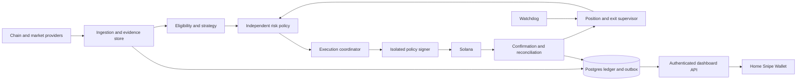

# Solana Meme Coin Trading Bot Architecture and Research

This brief defines a fully online, personal Solana meme-token trading bot with three screens: Home, Snipe, and Wallet. It is a planning and research handoff for a separate building agent. No application, live bot, wallet connection, or trading authorization is included.

The user confirmed a **$20 trading bankroll and $2–$5 per trade**. Use $2 as the initial default and $5 as the maximum entry notional, subject to cost and risk checks. Treat that as trading capital; hosting, paid data, and AI spending are separate and currently unallocated.

**Recommendation:** build a selective spot-trading system that verifies liquidity, sellability, and economics before entry. Start with live observation and paper execution. A $20 trial can test order handling and costs; it cannot establish a durable trading edge. No high win rate or return has been demonstrated.

## Product and trading objective

The desired experience is simple: configure limits, start a session, and let the backend discover, enter, supervise, and exit eligible positions while the browser is closed.

Optimize **net expectancy and loss containment**, not win rate alone. Nine gains of 1% and one loss of 30% lose money before fees when positions have equal notional. Report win rate together with average win/loss, total net P&L, drawdown, tail losses, blocked exits, and fill reliability.

The initial strategy should target confirmed liquidity and observable buying demand on a small allowlist of supported venues. Avoid first-block launch sniping in the trial. Fastest entry, strongest evidence, and smallest infrastructure budget are competing goals. Token-age windows and signal thresholds are hypotheses to test, not fixed truths.

Spot only. No leverage, martingale, averaging down, cross-chain execution, or unrestricted autonomous strategy changes in the first release.

## Economics of the 20 dollar trial

A cheap RPC transaction does not imply a cheap trade. Count both entry and exit: swap/platform fees, spread, price impact, priority fees, tips, failed attempts, and account creation requirements.

Current Jupiter documentation lists a **50 basis point platform fee for swaps involving tokens less than 24 hours old** on the managed Order and Execute path. Two swaps can therefore consume roughly 1% of unchanged notional before other costs. This is a documented pricing condition, not a permanent assumption; use the returned fee fields and current documentation. The Build path has no Jupiter platform fee, but requires more execution work and still incurs other costs. [Jupiter Swap V2](https://developers.jup.ag/docs/swap/index.md), [Order and Execute fees](https://developers.jup.ag/docs/swap/order-and-execute.md).

Solana documents a base fee of **5,000 lamports per signature**, plus priority fees. Token accounts also require a storage deposit. A classic 165-byte token account commonly requires 0.00203928 SOL under the documented formula; query the actual rent exemption amount and account size, especially for Token-2022. This deposit ties up capital and is generally reclaimable only when closure conditions are met. Restricted tokens or dust can strand it. Do not report every deposit as a permanent fee, or assume every deposit is immediately recoverable. [Fees](https://solana.com/docs/core/fees), [Account storage](https://solana.com/docs/core/accounts), [Rent quote](https://solana.com/docs/rpc/http/getminimumbalanceforrentexemption), [Account closure](https://solana.com/docs/tokens/basics/close-account).

Use this simplified screening model, then validate with size-dependent executable quotes:

`Expected net P&L(q) = q × (g − v) − F`

Here q is trade notional, g is a conservative estimated gross return, v is proportional round-trip cost, and F is fixed nonrecoverable cost including expected failed attempts. If g ≤ v, reject. Otherwise the simplified break-even size is `F / (g − v)`; add an uncertainty margin. Independently compute the maximum size allowed by loss, liquidity, cash, and exposure limits. **If the feasible size interval is empty, do not trade. Never increase risk limits just to cover fees.**

Illustration only: $0.02 fixed cost and a hypothetical 3% edge after proportional costs produce $0.04 expected net P&L on a $2 trade, or $0.13 on a $5 trade. Neither the edge nor the cost is a measured forecast. A small error in estimated edge can erase the result.

Apply the requested range as a constraint: choose a size between $2 and $5 only when it fits all checks; otherwise skip. Do not silently exceed $5 or place sub-$2 trades. Each position exposes 10–25% of the initial bankroll before costs, and that entire token position can become worthless.

## Initial data stack

| Source | Purpose | Initial decision and limitation |
| --- | --- | --- |
| Helius RPC and standard Solana WebSockets | Mint and pool state, transactions, balances, authority checks, subscriptions | Start here. The documented free plan offers 1 million credits monthly and 10 RPC requests per second. Credits vary by method; this is not full-chain coverage or a latency guarantee. |
| Jupiter Tokens V2 | Recent pools, token identity, categories and discovery metadata | Start here. Organic score is a relative ranking, not a win probability. Resolve identity by mint, never ticker alone. |
| DEX Screener | Home discovery, pair liquidity and activity context | Supplement discovery. Some endpoints expose paid boosts or profiles; promotion is not organic demand or evidence of safety. |
| Jupiter Swap V2 | Executable entry/reverse quotes and swap construction | Start with an adapter. Compare total cost and operational reliability of managed Order and Execute against Build before selecting the production path. |
| GoPlus Solana and Rugcheck | Independent security observations | Supplement direct chain checks. Missing or stale results are unknown, not safe; coverage must be tested on target mints. |
| Birdeye | Enriched market, holder, listing and trading data | Optional upgrade after measuring additional value. Endpoint and WebSocket access depend on plan; do not assume the free tier supplies all required feeds. |
| Jito | Optional transaction landing path | Later experiment. Tips and auctions add cost; bundles do not guarantee inclusion or exit liquidity. |
| Social sources and an AI API | Narrative extraction and explanation | Defer. Add only with authorized source access and evidence of incremental predictive value. |

Sources: [Helius billing](https://www.helius.dev/docs/billing/plans), [Helius WebSockets](https://www.helius.dev/docs/rpc/websocket), [Jupiter Tokens](https://developers.jup.ag/docs/tokens/index), [DEX Screener API](https://docs.dexscreener.com/api/reference), [Jupiter Swap](https://developers.jup.ag/docs/swap/index.md), [GoPlus Solana](https://docs.gopluslabs.io/reference/solanatokensecurityusingget), [Rugcheck API](https://api.rugcheck.xyz/swagger/doc.json), [Birdeye](https://docs.birdeye.so/), [Jito](https://docs.jito.wtf/lowlatencytxnsend/).

Provider access and quotas must be rechecked during implementation. This research checked public documentation, not authenticated production feeds or measured end-to-end latency.

Current Jupiter rate documentation lists 1 request per second for a free API key in the shared main bucket and a separate 50 requests per second bucket for `/execute`; quotas are organisation-scoped. Use a key and verify endpoint requirements. Free-tier constraints favor few candidates and one open position. [Jupiter rate limits](https://developers.jup.ag/docs/portal/rate-limits).

## Data collection and quality rules

Collect six complementary evidence groups: token permissions and extensions; executable market depth; trades and wallet flows; ownership and deployer history; liquidity changes and migration state; execution quality and network conditions.

Every observation needs provider, mint, pool, chain slot where available, event time, receipt time, commitment level, and quality flags. Keep raw evidence so a later decision can be reconstructed using only information available at the time.

Maintain freshness budgets by evidence type. A mint-authority observation and an execution quote need different refresh policies. Recheck critical state and quotes immediately before entry. Reconnect, backfill gaps, deduplicate, and track forks. Unknown critical evidence blocks entries. Reserve provider quota and request priority for open-position monitoring and exits before discovery.

Do not count agreement between aggregators as independent proof when they use the same upstream pools. Deduplicate by transaction signature and instruction identity where possible. Store the complete contemporaneously discovered universe, including dead, rugged, delisted, rejected, and untradeable tokens.

Use a two-stage pipeline: broad inexpensive discovery, then deeper checks on a small candidate shortlist. The free-tier design is a selective scanner, not a promise to observe every new Solana token immediately.

## Decision engine and intelligence

1. **Discover and resolve identity.** Identify mint, token program, pool, venue, quote asset, creator or deployer where known, and creation slot. A trending listing starts investigation; it does not authorize a buy.

2. **Apply mandatory eligibility checks.** Require supported programs/extensions, acceptable authority state, sufficient size-dependent liquidity, an executable reverse route, and complete fresh critical evidence. Unsupported transfer hooks, permanent delegates, freeze controls, nontransferability, or unexplained privileges should fail the initial allowlist policy. A current reverse quote and simulation reduce uncertainty; neither proves future sellability.

3. **Measure manipulation and concentration.** Evaluate unique funded buyers, repeated sizing, cyclic trades, common funders, deployer history, linked-wallet supply, and liquidity withdrawal behavior. Exclude identified pool vaults and burn addresses from naive holder concentration. Wallet clustering is uncertain evidence. Burned LP tokens alone do not prove safety, particularly for concentrated-liquidity structures.

4. **Estimate outcomes and costs.** Start with an interpretable rules baseline. Later, train separate models for return distribution over defined holding horizons, severe drawdown, exit availability, slippage, and fill failure. Tabular gradient-boosted models are a practical first candidate.

5. **Require positive conservative net expectancy.** Combine measured costs, calibrated predictions, uncertainty, and current market regime. Abstain when evidence is incomplete, conditions are outside validated experience, or downside limits fail.

6. **Request independent risk approval.** The prediction model can propose a trade. It cannot change wallet permissions, increase budgets, remove stops, or sign.

Do not display an uncalibrated score such as “93% AI confidence.” Before validation, label it “rule score” with visible reasons. After validation, show an explicitly defined probability and horizon, calibration date, and sample limitations.

An LLM may extract structured claims from websites/posts, classify narratives, identify duplicated promotion, and explain the decision log. Keep it out of the latency-sensitive signing and risk path. Treat token names, websites, and social posts as untrusted content that cannot issue operational instructions. Test each new data source with an out-of-sample ablation: keep it only if it improves net results or risk detection after its cost.

Relevant token risks: [Solana extensions](https://solana.com/docs/tokens/extensions), [Permanent delegate](https://solana.com/docs/tokens/extensions/permanent-delegate).

## Risk policy and requested position sizes

The user specified **$20 capital and $2–$5 per trade**. Design for a $2 default entry and a $5 maximum. One open or unresolved position at a time is the proposed initial configuration. Increasing size must depend on executable depth, costs, validated strategy conditions, and risk budgets; never on recent losses or an LLM confidence score.

| Control | Builder specification |
| --- | --- |
| Default mode | Live observation and paper execution before funded activation |
| Trading capital | $20 in a separate bot wallet; infrastructure budget is separate |
| Entry notional | $2 default; $5 maximum; skip if no size inside this range passes every constraint |
| Open positions | One, counting unresolved entry orders |
| Catastrophic exposure | A token can lose its full $2–$5 principal, plus execution costs and stranded deposits |
| Daily and session loss limits | Required configuration before live activation; distinguish a drawdown pause trigger from a worst-case loss budget |
| SOL operations reserve | Compute actual account-creation needs, entry fees, and multiple bounded exit/retry attempts; protect it from entry spending |
| Stop distance and holding horizon | Select through evaluation and fit to the chosen planned-risk budget; no untested universal percentage |
| Fees and slippage | Explicit ceilings for normal and emergency operation; never unlimited |
| Trade frequency | Bounded per session/day; a starting hypothesis is at most three entry intents daily, to be evaluated |

Size using all constraints:

`Maximum permitted notional = minimum of $5, stop-stress sizing, full-loss allowance after costs, executable-depth cap, available cash and remaining portfolio risk budget.`

Trade only if that maximum supports at least $2 and conservative net expectancy is positive. A tight stop cannot override the independent full-loss allowance. A hypothetical 10% stop on $2–$5 targets $0.20–$0.50 price loss before costs; the actual loss can still reach the whole position. This is an explanation of mechanics, not a selected stop policy.

For a daily drawdown trigger, $2 would equal 10% of starting capital; this is an example for the user to choose later, not a configured live limit. A $5 position can gap through that trigger. If the desired daily limit instead means a worst-case budget, reserve full position principal and permitted costs against its remaining amount before entry; that may prohibit a $5 trade or further trades that day. Never label a pause trigger as a guaranteed maximum loss.

Reserve exposure and permitted costs atomically before submission. Include realized losses, fees, and conservative liquidation marks in drawdown. Track SOL/USD movement and storage deposits separately. Do not let a daily cutoff disable already-authorized protective exits.

The planning task authorizes no live trades. Final daily/session limits, planned loss per trade, emergency slippage, and spending authority remain configuration decisions before live activation.

## Entry and exit execution

Persist the entry intent, reserved exposure, and exit policy before sending the buy. Verify the current quote, fee budget, route, token state, and exact transaction. Decode instructions and resolved address lookup tables before signing; check mints, amounts, recipients, minimum output, allowed programs, tips, approvals, and unexpected transfers.

Support price stop, trailing stop, take profit, maximum holding time, loss of the entry thesis, liquidity deterioration, and emergency close. Trigger protection from executable liquidation value or validated pool state rather than an isolated last-trade chart price. Activate position supervision from actual balances as soon as an entry may have landed and reconcile the confirmed quantity.

A stop means **attempt an exit under a defined policy**. It cannot guarantee a price or loss limit when liquidity disappears, transfers are blocked, or the network fails. A stop-limit may remain unfilled. Define bounded escalation: refresh route, increase fees within a ceiling, increase slippage within a separate ceiling, try an approved alternative venue, then show “exit blocked” if still impossible.

Jupiter Trigger V2 currently supports stop-loss, OCO, and OTOCO using **Privy-managed custodial vaults**. Documentation lists a **$10 minimum price order** and **20% default slippage for stop-loss/buy-above orders** unless customized. That minimum is at least half this bankroll, so exclude it from the proposed $20 trial. Revisit only as an explicit custody and execution choice. [Trigger V2](https://developers.jup.ag/docs/trigger/index.md).

The initial design therefore uses a persistent backend exit supervisor plus an independent watchdog. This avoids the Trigger minimum, but creates an operational responsibility: a worker or host outage can interrupt exits. Do not advertise guaranteed protection. An independent deployment failure domain is a later reliability requirement, subject to its operating cost.

## Durable order state and recovery

Use a persistent lifecycle:

`candidate → eligible → risk approved → exposure reserved → prepared → signed → submitted → pending or unknown → confirmed fill or failure or expired unfilled → reconciled`

Position lifecycle:

`opening → open → exit requested → exit pending → open with reduced quantity or closed or exit blocked`

An RPC success response means acceptance for processing, not a confirmed fill. Store intent ID, signed transaction bytes, signature, quote context, request ID, blockhash, and last valid block height before broadcast. Solana recent-blockhash transactions expire by block height; RFQ routes may have different expiry fields. Honor the route-specific semantics.

On timeout, mark the result unknown. Check transaction status and actual balances through healthy RPCs. Rebroadcasting the same signed bytes differs from signing a replacement. Do not immediately create another transaction with a fresh blockhash: both economic trades could land. Replace only after establishing terminal failure or expiry and reconciling exposure.

Use a Postgres transactional outbox, unique intent keys, atomic exposure reservations, and a lease with fencing enforced at the signer. One exit owner controls the available position quantity so a stop and take-profit cannot independently oversell. On restart, reconcile unresolved orders and balances before allowing entries. Record commitment levels and reconcile fork changes.

“Cancel” can stop an unsent intent. Changing a database flag does not cancel a transaction already broadcast.

Sources: [Solana confirmation and expiration](https://solana.com/developers/guides/advanced/confirmation), [sendTransaction](https://solana.com/docs/rpc/http/sendtransaction), [Jupiter route execution](https://developers.jup.ag/docs/swap/order-and-execute.md).

## Online system architecture

Use a modular application first; the $20 trial does not justify Kafka, Kubernetes, or a microservice fleet.

| Component | Recommended responsibility |
| --- | --- |
| Next.js or equivalent web UI | The three requested screens, authenticated commands, streamed state, stale-data indicators |
| Always-on TypeScript backend | Provider adapters, candidate rules, risk policy, order coordinator, exit supervisor and reconciliation |
| Postgres | Evidence metadata, immutable decisions, intents, fills, positions, policy versions, session state and outbox |
| Isolated signer | Enforce transaction and spend policy; deny unauthorized recipients/programs; keep secrets outside the UI and AI |
| Watchdog and monitoring | Worker heartbeat, unresolved transactions, stale feeds, low SOL reserve, blocked exits and restart recovery |
| Batch analysis process | Historical replay and later model training; versioned artifacts promoted deliberately |

Host the trading worker on an always-on service. Frontend hosting may be separate. Request-driven serverless handlers, a browser tab, or a periodic cron job must not be the sole owner of position exits.

The first deployment can keep most application modules together, but a watchdog on the same failed host is not independent protection. Build the interfaces so a second worker and failure domain can be added with fenced ownership.

Minimum durable records: token/pool identity; provider observations; versioned feature snapshots; candidate decisions and rejection reasons; policy/model versions; quote snapshots; trade intents; transaction attempts; balance/fill deltas; positions and exit policies; risk reservations; fees/storage ledger; operator actions. Record decisions reproducibly without logging secrets.

## Wallet and authorization design

Connecting a browser wallet enables identification, balances, and user-approved signatures. It **does not automatically permit unattended trading** after the browser closes.

Separate the owner wallet from a minimally funded trading wallet. For the proposed personal MVP, use a hardened isolated signer with encryption/key protection, restrictive service identity, policy enforcement, audited access, and emergency revocation. Keep the main wallet seed phrase out of the product entirely. Never place a private key in frontend code, browser storage, analytics, logs, or an LLM prompt.

A delegated account or audited vault is a possible later approach, but verify actual Solana support. Generic session keys are not a universal wallet feature; an SPL token allowance alone does not authorize all required swaps and SOL fee spending.

Start read-only and paper mode. The eventual live workflow must show the exact funded wallet, allowed spend, session duration, risk policy, and signing authority before activation. Disabling the signer can also disable protective exits; distinguish that action from pausing entries or closing positions.

## Dashboard design specification

Use a calm, compact working interface influenced by Linear and Vercel: charcoal surfaces, clear typography, subtle separators, restrained corners, tabular numbers, and one quiet accent color. Reserve green/red for financial or operational meaning. Avoid neon-heavy token marketing, oversized KPI cards, and fabricated performance scores. Support readable mobile layouts and keyboard operation. Proposed design tokens: background #0D0F12, surface #14171C, border #262B33, primary text #ECEFF3, with a restrained blue action accent. Use Geist Sans and tabular numerals; reserve monospace for addresses and timestamps. Start with a 216px desktop navigation rail and an optional 360px evidence panel; on mobile use three bottom tabs and a full-screen detail sheet. Use 16px body text, 14px regular controls and labels, and at least 44px touch targets. Validate contrast, focus visibility, overflow and text enlargement. These are proposed values, not measured copies of the references.

**Themes (owner, 2026-10-03): two only, Paper and Silent Black.** No other themes, accent pickers or custom colours. The first open follows the device's light/dark setting; after that the owner's choice is remembered. Both themes share one set of semantic tokens, so every screen, chart and state works in both:

| Token | Paper | Silent Black |
| --- | --- | --- |
| Background | #F7F7F5 (warm paper white) | #08090A (near-black, no glow) |
| Surface | #FFFFFF | #0F1012 |
| Raised surface | #F1F1EE | #16181B |
| Border | #E3E3DF | #1F2226 |
| Primary text | #0D0F12 | #ECEFF3 |
| Secondary text | #5E636B | #8A9099 |
| Accent (actions only) | #2B61E8 | #5B8CFF |
| Gain / loss (money only) | #0D7C44 / #C53939 | #3FB97A / #E5605E |

Silent Black stays quiet: no neon, glow or gradients on surfaces; depth comes from one step of surface lightness and hairline borders. Paper is a soft off-white, not pure #FFFFFF, to cut glare. Blurred backdrops behind opened panels use the theme's background at partial opacity. WCAG AA is checked by `apps/web/test/contrast.test.ts` against `apps/web/src/theme/tokens.css`. The proposed Paper accent (#2F6BFF), gain (#0F8A4B) and loss (#C93A3A) fell below 4.5:1 on Paper surfaces and were darkened to the values above (WEB-1, 2026-10-03). Gain and loss are not separable for red-green colour blindness, so every coloured amount also carries its sign (+/−).

Persistent shell: a narrow navigation rail for **Home, Snipe, Wallet**; a clear Paper/Live mode label; session status; data freshness; and an accessible “Pause new entries” control. Token detail and journal panels can stay inside these screens.

| Screen | Essential content and behavior |
| --- | --- |
| Home | Trending/discovered token table with symbol and mint, age, venue, liquidity, volume, holder context, security state and data age. Clearly distinguish promoted listings. Row selection opens evidence, current executable costs, missing checks and reasons for eligibility or rejection. Trending position never implies buy approval. |
| Snipe | Session setup, funded capital, policy summary, Start paper session, eventual explicit live activation, candidate funnel, decision journal and active position. Show entry, current liquidation estimate, exit condition, total costs, and protection/worker status. Explain “No trade” outcomes. |
| Wallet | Owner connection versus bot wallet, available trading funds, protected SOL reserve, locked storage deposits, open exposure, fees and transaction history. Funding and withdrawal controls need separate authenticated authorization. Never offer a seed-phrase input. |

Separate three actions: **Pause new entries** keeps exits running; **Close positions** requests bounded exits and reports unfilled outcomes; **Disable signing** blocks further signatures and explicitly warns that exits can no longer execute.

Operational states must be visible: waiting for evidence, no eligible candidate, stale data, rate limited, unknown transaction result, exit pending, exit blocked, insufficient fee reserve, wallet disconnected, and session paused.

The $20 dashboard should emphasize dollars at risk, actual costs, and execution outcomes. Use no invented profit chart or measured win rate. Display “Insufficient evidence” until the evaluation sample supports a statistic.

## Design references and application

The following are references to adapt, not templates to copy:

- [Linear](https://linear.app/) and [Linear views](https://linear.app/docs/custom-views): focused navigation, compact list workflows, contextual detail. Apply to candidate scanning and the decision journal.

- [Vercel Geist](https://vercel.com/geist/introduction): restrained color, consistent component states and data tables. Apply to the shell, risk controls and clear operational feedback.

- [Raycast](https://www.raycast.com/): efficient keyboard workflows. Apply to navigation and non-destructive commands; financial actions still need explicit, legible controls.

- [Resend](https://resend.com/): event-oriented debugging and operational history. Apply to a readable order timeline with attempts, confirmation, fees and failure reasons.

- [TradingView paper trading](https://www.tradingview.com/trading/): paper/live distinction, positions, order history and account state. Apply to honest mode labeling and execution visibility.

- Height is a historical aesthetic reference. An [archived official announcement](https://web.archive.org/web/20250327110001/https://height.app/) states service ended September 24, 2025. Do not base a new integration on Height being available.

Public product pages and documentation informed these recommendations; authenticated product interiors were not audited.

## Validation and build sequence

1. **Data and read-only UI.** Implement identity, adapters, timestamps, quality flags, Home discovery, wallet balance inspection, and cost/storage accounting. Confirm provider coverage and plan limits for the intended venues.

2. **Decision recorder and paper bot.** Implement deterministic checks, risk reservations, explicit rejection reasons, versioned strategies, paper execution assumptions, session controls, and the order journal.

3. **Historical replay and live shadow evaluation.** Use chronological walk-forward splits with overlapping outcome windows purged. Separate related deployer/funder groups. Include dead tokens and receipt-time data to prevent survivorship and look-ahead bias.

4. **Execution reliability.** Add the isolated signer and complete reconciliation only after the unsigned decision flow is inspectable. Run failure-injection tests without funded production authority.

5. **Tiny live canary.** Only after explicit live authorization and a nonempty economic size interval. Use $2 initial entries within the requested $2–$5 range, only after loss and fee limits are selected. Measure actual costs and fills, and stop new entries on unresolved outcomes. A $20 canary tests mechanics, not statistical profitability.

6. **Improve intelligence.** Train and calibrate models only after useful labeled evidence exists. Add Birdeye, faster streams, social analysis, or an LLM individually when their incremental value justifies cost.

Backtests must include both sides of fees, latency, impact, failed attempts, unavailable exits, migrations, and gaps. Candles alone cannot reliably reconstruct whether a stop or target happened first; use conservative assumptions or transaction-level replay. A paper fill is a model, not proof a live transaction would land.

Before scaling, predeclare and assess net expectancy with uncertainty, drawdown/tail loss, calibration, fill success, actual versus expected slippage, blocked-exit frequency, and operating cost. Use an untouched later holdout and report sample size and dependency between trades. Neither a calendar duration nor a high win rate alone is a promotion gate.

## Acceptance criteria for the building agent

The build is incomplete until these cases are handled:

- An API timeout occurs after a buy landed: reconcile without buying twice.

- Two workers resume one intent: the fenced signer accepts only the current owner.

- A stop and take-profit trigger together: reserve one exit intent and reconcile quantity.

- Liquidity disappears before the stop: report blocked execution honestly; never fabricate a fill.

- Data freezes or a provider rate-limits: halt entries and preserve exit quota and monitoring.

- The browser closes: backend supervision continues.

- The backend restarts with a pending transaction: recover signatures and balances before entry.

- A transaction contains an unexpected transfer, approval, or program: reject before signing.

- Token-account storage locks too much capital: reject before entry; account for legitimate recovery separately.

- Quote costs exceed the feasible trade size: remain in paper mode.

- A daily cutoff trips: pause entries while continuing authorized protection.

Deliver a clear distinction between connected, paper-tested, execution-tested, and live-authorized capabilities. Default to paper. Do not claim a profitable strategy, guaranteed stop, or measured accuracy without the corresponding evidence.

Research date: October 3, 2026. Saved text and structure were read back; the rendered Page layout and diagram were not previewed. API details are mutable. Public documentation establishes advertised behavior; authenticated endpoint compatibility, availability, licensing, fees, latency and token coverage remain implementation verification tasks.

