# Database schema (ERD)

Generated from `packages/engine/src/m24/schema.ts` by `erdMarkdown()` (B-M24-02); do not edit by hand. A test fails
when this file and the schema differ. The schema is created by the numbered migrations in
`packages/engine/src/m24/migrations/`. Lines join a column to the table whose key it names; the database declares
no foreign keys.

```mermaid
erDiagram
  run {
    TEXT run_id PK
    TEXT mode
    TEXT strategy_id
    TEXT trial_key
    TEXT dataset_hashes
    TEXT git_commit
    INTEGER seed
    TEXT status
    INTEGER started_at
    INTEGER ended_at
    TEXT bundle_sha256
    INTEGER bundle_signature_ok
    INTEGER imported_at
    INTEGER data_from
    INTEGER data_to
    INTEGER trades_count
    INTEGER low_coverage
    TEXT gate_ids_evaluated
    INTEGER created_at
  }
  system_state {
    INTEGER id PK
    TEXT mode
    TEXT trading_state
    INTEGER state_version
    INTEGER mode_since
    INTEGER cooldown_until
    INTEGER created_at
    INTEGER updated_at
  }
  config_version {
    TEXT config_version PK
    INTEGER version_no UK
    TEXT json
    INTEGER applied_at
    TEXT applied_by
    INTEGER created_at
  }
  strategy {
    TEXT strategy_id PK
    INTEGER version PK
    TEXT params_hash
    TEXT enabled_modes
    INTEGER created_at
    INTEGER updated_at
  }
  token {
    TEXT mint PK
    TEXT token_program
    INTEGER decimals
    TEXT symbol
    TEXT name
    TEXT metadata_update_authority
    INTEGER first_seen_at
    INTEGER symbol_collision_count
    INTEGER refreshed_at
    INTEGER created_at
  }
  mint_class {
    TEXT mint PK
    TEXT class
    INTEGER since
    TEXT set_by
    INTEGER created_at
  }
  pool {
    TEXT pool_id PK
    TEXT venue
    TEXT base_mint
    TEXT quote_mint
    INTEGER is_canonical
    INTEGER created_slot
    INTEGER quarantined_at
    TEXT quarantine_reason
    INTEGER created_at
    INTEGER updated_at
  }
  screen_result {
    TEXT screen_id PK
    TEXT mint
    TEXT pool_id
    INTEGER as_of_slot
    TEXT verdict
    TEXT checks_json
    TEXT purpose
    INTEGER created_at
  }
  candidate {
    TEXT candidate_id PK
    TEXT mint UK
    TEXT pool_id UK
    TEXT venue
    TEXT state
    TEXT reasons
    INTEGER cooldown_until
    INTEGER first_seen_at
    TEXT last_screen_id
    INTEGER version
    INTEGER created_at
    INTEGER updated_at
  }
  signal {
    TEXT candidate_id PK
    TEXT strategy_id
    TEXT score
    TEXT score_unit
    TEXT decision
    INTEGER decided_at
    REAL decision_latency_ms
    TEXT risk_checks_json
    INTEGER intended_size_lamports
    INTEGER expected_cost_bps
    REAL quote_age_ms
    INTEGER created_at
  }
  order_intent {
    TEXT intent_id PK
    TEXT idempotency_key UK
    TEXT position_id
    TEXT side
    TEXT mint
    TEXT pool_id
    TEXT amount_in
    INTEGER min_out_bps
    INTEGER max_slippage_bps
    TEXT reason
    TEXT urgency
    TEXT state
    INTEGER version
    TEXT mode
    TEXT purpose
    INTEGER created_at
    INTEGER updated_at
  }
  tx_attempt {
    TEXT attempt_id PK
    TEXT intent_id
    INTEGER attempt_no
    INTEGER rung
    TEXT path
    INTEGER cu_limit
    INTEGER cu_price
    TEXT tips_json
    TEXT sell_amount_base
    INTEGER balance_read_slot
    INTEGER last_valid_block_height
    TEXT status
    TEXT failure_class
    TEXT signature UK
    INTEGER slot
    TEXT err
    INTEGER fee_lamports
    TEXT expiry_proof_json
    INTEGER first_sent_at
    INTEGER confirmed_at
    TEXT signed_tx_b64
    TEXT classification_json
    TEXT lvbh_source
    TEXT route
    INTEGER jupiter_fee_bps
    INTEGER version
    INTEGER created_at
    INTEGER updated_at
  }
  fill {
    TEXT fill_id PK
    TEXT attempt_id
    TEXT intent_id
    TEXT position_id
    TEXT side
    TEXT signature
    INTEGER sol_delta_lamports
    TEXT token_delta_base
    INTEGER venue_fee_lamports
    INTEGER network_fee_lamports
    INTEGER tip_lamports
    INTEGER simulated
    TEXT source
    INTEGER slot
    INTEGER block_time
    INTEGER at
    INTEGER created_at
  }
  position {
    TEXT position_id PK
    TEXT mode
    TEXT strategy_id
    TEXT mint
    TEXT pool_id
    TEXT state
    TEXT size_base
    INTEGER entry_cost_lamports
    TEXT entry_price_sol_per_token
    TEXT exit_plan_json
    TEXT triggers_json
    TEXT high_water
    TEXT close_failed_reason
    TEXT source
    INTEGER opened_at
    INTEGER closed_at
    INTEGER version
    INTEGER created_at
    INTEGER updated_at
  }
  position_event {
    TEXT event_id PK
    TEXT position_id
    TEXT from_state
    TEXT to_state
    TEXT cause
    INTEGER at
    INTEGER created_at
  }
  trade {
    TEXT trade_id PK
    TEXT position_id
    TEXT run_id
    TEXT mode
    INTEGER simulated
    TEXT strategy_id
    TEXT mint
    TEXT symbol
    INTEGER decimals
    INTEGER opened_at
    INTEGER closed_at
    REAL hold_ms
    TEXT size_base
    TEXT entry_price_sol_per_token
    TEXT exit_price_sol_per_token
    INTEGER gross_pnl_lamports
    INTEGER cost_network_base_lamports
    INTEGER cost_priority_lamports
    INTEGER cost_tips_lamports
    INTEGER cost_venue_fees_lamports
    INTEGER cost_failed_tx_lamports
    INTEGER total_costs_lamports
    INTEGER implicit_slippage_lamports
    INTEGER net_pnl_lamports
    INTEGER net_pnl_bps
    INTEGER net_pnl_usd_e6
    TEXT exit_reason
    TEXT source
    TEXT label
    TEXT entry_signatures
    TEXT exit_signatures
    INTEGER sol_usd_at_close_e6
    TEXT price_source
    TEXT wallet_pubkey
    TEXT supersedes_trade_id
    INTEGER created_at
  }
  cash_flow {
    TEXT flow_id PK
    TEXT kind
    INTEGER lamports
    TEXT from_pubkey
    TEXT to_pubkey
    TEXT signature
    INTEGER slot
    INTEGER at
    TEXT source
    INTEGER created_at
  }
  sandwich_check {
    TEXT fill_id PK
    INTEGER slot
    INTEGER sandwiched
    INTEGER same_pool_before
    INTEGER same_pool_after
    TEXT reason
    INTEGER created_at
  }
  cost_item {
    TEXT cost_id PK
    TEXT attempt_id UK
    TEXT kind UK
    INTEGER lamports
    TEXT source
    INTEGER created_at
  }
  fixed_cost_item {
    TEXT item_id PK
    TEXT label
    INTEGER monthly_usd_e6
    TEXT source
    INTEGER active_from
    INTEGER active_to
    INTEGER created_at
    INTEGER updated_at
  }
  price_reference {
    TEXT asset PK
    INTEGER at PK
    INTEGER usd_e6
    TEXT source
    INTEGER created_at
  }
  reservation {
    TEXT reservation_id PK
    TEXT intent_id UK
    INTEGER lamports
    INTEGER released_at
    INTEGER actual_lamports
    INTEGER created_at
  }
  token_account {
    TEXT owner PK
    TEXT mint PK
    TEXT token_program PK
    TEXT ata
    INTEGER exists
    INTEGER rent_lamports
    INTEGER closed_at
    INTEGER janitor_attempts
    INTEGER created_at
    INTEGER updated_at
  }
  wallet_snapshot {
    TEXT wallet PK
    INTEGER at PK
    TEXT granularity
    INTEGER sol_lamports
    TEXT tokens_json
    INTEGER slot
    INTEGER created_at
  }
  reconcile_run {
    INTEGER run_at PK
    INTEGER sol_diff_lamports
    TEXT token_diffs_json
    TEXT orphans_json
    INTEGER created_at
  }
  limit_def {
    TEXT limit_id PK
    TEXT short_code UK
    TEXT label
    TEXT scope
    TEXT scope_id
    TEXT kind
    TEXT unit
    TEXT display_unit
    INTEGER value
    INTEGER ceiling
    TEXT action_on_breach
    INTEGER editable
    INTEGER created_at
    INTEGER updated_at
  }
  limit_state {
    TEXT limit_id PK
    TEXT state
    INTEGER usage
    INTEGER last_breach_at
    INTEGER created_at
    INTEGER updated_at
  }
  breaker_event {
    TEXT event_id PK
    TEXT breaker_id
    INTEGER tripped
    TEXT reason
    INTEGER at
    INTEGER created_at
  }
  command {
    TEXT command_id PK
    TEXT type
    TEXT params_json
    TEXT status
    TEXT action_class
    INTEGER effective_at
    TEXT actor
    INTEGER state_version_before
    INTEGER state_version_after
    TEXT reason_code
    INTEGER created_at
    INTEGER updated_at
  }
  audit_event {
    TEXT event_id PK
    INTEGER seq UK
    INTEGER at
    TEXT mode
    TEXT actor_json
    TEXT action
    TEXT action_class
    TEXT target
    TEXT before
    TEXT after
    TEXT reason_text
    TEXT command_id
    TEXT result
    TEXT dialog_version
    TEXT dialog_text_hash
    TEXT session_ref
    TEXT prev_hash
    TEXT hash UK
    INTEGER created_at
  }
  alert {
    TEXT alert_id PK
    TEXT dedupe_key
    TEXT severity
    TEXT category
    TEXT title
    TEXT body
    TEXT state
    INTEGER occurrences
    TEXT entity
    TEXT acked_by
    INTEGER acked_at
    INTEGER snoozed_until
    INTEGER requires_ack
    INTEGER created_at
    INTEGER updated_at
  }
  trial_registry {
    TEXT trial_id PK
    TEXT trial_key UK
    TEXT kind UK
    TEXT strategy_id
    TEXT affects_returns_json
    TEXT dataset_hashes
    TEXT returns_per_day_json
    TEXT returns_per_trade_json
    TEXT metrics_json
    TEXT run_id
    INTEGER created_at
  }
  strategy_stage {
    TEXT strategy_id PK
    INTEGER stage_entered_at PK
    TEXT stage
    INTEGER strategy_version
    TEXT trial_key
    TEXT windows_used_json
    TEXT entered_by
    TEXT reason
    INTEGER created_at
  }
  gate_evaluation {
    TEXT eval_id PK
    TEXT strategy_id
    TEXT stage
    TEXT target_mode
    TEXT trial_key
    TEXT gates_json
    TEXT windows_json
    INTEGER all_pass
    INTEGER at
    INTEGER created_at
  }
  bar_1m {
    TEXT pool_id PK
    INTEGER minute PK
    TEXT open
    TEXT high
    TEXT low
    TEXT close
    INTEGER close_depth_lamports
    INTEGER snapshots
    INTEGER created_at
  }
  equity_point {
    INTEGER minute PK
    TEXT mode PK
    INTEGER equity_lamports
    TEXT flow_adjusted_index
    INTEGER drawdown_bps
    INTEGER created_at
  }
  quarantine {
    TEXT id PK
    TEXT program_id UK
    TEXT discriminator UK
    TEXT raw_b64
    TEXT signature
    INTEGER first_seen
    INTEGER created_at
  }
  metric_rollup_1m {
    TEXT metric PK
    INTEGER labels_hash PK
    INTEGER minute PK
    TEXT scope
    INTEGER count
    REAL sum
    REAL p50
    REAL p95
    REAL p99
    INTEGER created_at
  }
  outbox {
    INTEGER seq PK
    TEXT topic
    TEXT payload_json
    INTEGER created_at
    INTEGER published_at
  }
  cost_item_correction {
    TEXT correction_id PK
    TEXT cost_id
    INTEGER lamports
    TEXT source
    INTEGER at
    INTEGER created_at
  }
  kv_state {
    TEXT key PK
    TEXT value_json
    INTEGER created_at
    INTEGER updated_at
  }
  retention_clock {
    INTEGER id PK
    INTEGER now_ms
  }
  schema_migrations {
    INTEGER version PK
    TEXT sha256
    INTEGER applied_at
  }
  audit_import_cursor {
    TEXT source PK
    INTEGER last_seq
    INTEGER created_at
    INTEGER updated_at
  }
  enumerated_pool {
    TEXT pool_id PK
    TEXT base_mint
    INTEGER is_canonical
    INTEGER first_enumerated_at
    INTEGER last_refresh_at
    INTEGER last_quote_real_lamports
    TEXT last_quote_virtual
    TEXT last_base_reserve_base
    TEXT last_supply_base
    INTEGER last_market_cap_lamports
    INTEGER last_refresh_slot
    INTEGER created_at
    INTEGER updated_at
  }
  discovery_cursor {
    TEXT source PK
    TEXT cursor
    INTEGER created_at
    INTEGER updated_at
  }
  coverage_report {
    TEXT day_utc PK
    TEXT json
    INTEGER low_coverage
    TEXT manifest_sha256
    INTEGER created_at
  }
  rpc_usage {
    TEXT provider PK
    TEXT month PK
    INTEGER units_used
    INTEGER created_at
    INTEGER updated_at
  }
  universe_manifest {
    TEXT day_utc PK
    TEXT sha256
    TEXT path
    INTEGER created_at
  }
  shadow_result {
    TEXT shadow_id PK
    TEXT attempt_id
    TEXT kind
    TEXT pool_id
    INTEGER notional_lamports
    TEXT model_out
    TEXT simulated_out
    REAL error_bps
    INTEGER context_slot
    TEXT status
    INTEGER at
    INTEGER created_at
  }
  candidate_event {
    TEXT event_id PK
    TEXT candidate_id
    TEXT pool_id
    TEXT mint
    TEXT from_state
    TEXT to_state
    TEXT reason
    INTEGER at
    INTEGER created_at
  }
  blacklist {
    TEXT mint PK
    TEXT reason
    INTEGER until
    TEXT set_by
    INTEGER created_at
    INTEGER updated_at
  }
  watch_tail {
    TEXT pool_id PK
    INTEGER until
    TEXT reason
    INTEGER evicted_at
    INTEGER created_at
    INTEGER updated_at
  }
  token ||--o{ mint_class : mint
  token ||--o{ screen_result : mint
  pool ||--o{ screen_result : pool_id
  token ||--o{ candidate : mint
  pool ||--o{ candidate : pool_id
  candidate ||--o{ signal : candidate_id
  position ||--o{ order_intent : position_id
  token ||--o{ order_intent : mint
  pool ||--o{ order_intent : pool_id
  order_intent ||--o{ tx_attempt : intent_id
  tx_attempt ||--o{ fill : attempt_id
  order_intent ||--o{ fill : intent_id
  position ||--o{ fill : position_id
  token ||--o{ position : mint
  pool ||--o{ position : pool_id
  position ||--o{ position_event : position_id
  position ||--o{ trade : position_id
  run ||--o{ trade : run_id
  token ||--o{ trade : mint
  fill ||--o{ sandwich_check : fill_id
  tx_attempt ||--o{ cost_item : attempt_id
  order_intent ||--o{ reservation : intent_id
  token ||--o{ token_account : mint
  limit_def ||--o{ limit_state : limit_id
  command ||--o{ audit_event : command_id
  run ||--o{ trial_registry : run_id
  pool ||--o{ bar_1m : pool_id
  cost_item ||--o{ cost_item_correction : cost_id
  pool ||--o{ enumerated_pool : pool_id
  tx_attempt ||--o{ shadow_result : attempt_id
  pool ||--o{ shadow_result : pool_id
  candidate ||--o{ candidate_event : candidate_id
  pool ||--o{ candidate_event : pool_id
  token ||--o{ candidate_event : mint
  token ||--o{ blacklist : mint
  pool ||--o{ watch_tail : pool_id
```

