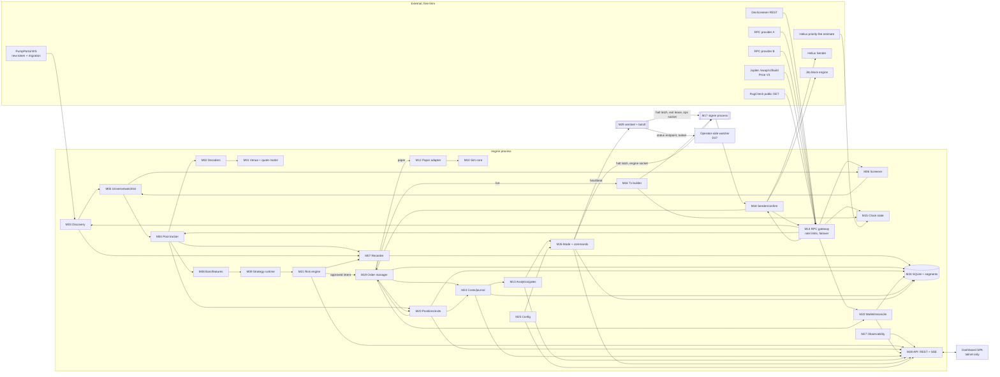

# Architecture

Edited in Meme-snipe from 2026-10-07 (card Z0D); source commit `74e7258` of `macdarenz-droid/Snipe-solana` `main`.

Solana meme-coin trading bot with an operator dashboard: system design, decision branches and the module map the build tickets will follow.

- Author role: lead architect. Written 2026-10-06; revised the same day to resolve two independent architecture reviews (findings CA-01..CA-33 and CB-01..CB-27; section 20 is the revision log). Design only; no production code. Code-like fragments are interface specifications in TypeScript syntax, not implementations.
- Inputs: the verified fact register (IDs `EX-*`, `LD-*`, `DA-*`, `TH-*`, `ST-*`, and from 2026-10-07 `RS-*` for this repo's own research results, marked pending review until a fresh reviewer re-checks them, and `VF-*` for the M0/M1 verification of 2026-10-07, cited inline as [ID]), the dashboard document `UI.md` (its view models VM-01..VM-20 and its decisions D-UI-nn), and the researchers' implications (used as reasoning, never as facts).
- Labels used in this document:

| Label | Meaning |
|---|---|
| [XX-nn] | A fact from the verified register (status confirmed, corrected or added_by_verifier). |
| **DERIVED** | Arithmetic on cited facts, done in this session. The inputs are cited next to it. |
| **PARAMETER** | A value this design chooses or assumes as an input (for example the SOL/USD price). Not a claim about the world. |
| **POLICY** | A design choice (for example a risk limit). Not evidence. Tunable, and owned by the risk owner. |
| **ASSUMPTION** | Something believed but not verified, with its impact if wrong. Every one is listed again in section 17. |
| **UNVERIFIED** | Could not be confirmed from the register. Do not rely on it. |
| **VERIFY:** | A third-party interface detail (method name, argument, label, limit) that the implementer must confirm against the current official source before coding. The design never invents it. |

Nothing in this document is financial advice, and nothing in it implies the bot will make money.

## 0. Honest summary

### What the system is

A single-operator, small-capital (under US$1,000) Solana trading system that:

1. watches a bounded set of liquid meme-coin pools using free-tier data sources,
2. screens every token against hard on-chain safety rules (authorities, Token-2022 extensions, liquidity-pool ownership, holder concentration, a simulated buy-then-sell),
3. runs one strategy at a time through a fixed evidence pipeline: backtest, replay, paper, live-small, live, with numeric statistical gates between stages,
4. executes swaps with locally computed quotes, explicit on-chain minimum-output bounds, low-cost transaction landing, and an idempotent order state machine whose source of truth is the chain,
5. enforces risk limits in two independent places (the in-process risk engine and a separate signer process that classifies every transaction itself), and
6. serves the operator dashboard defined in `UI.md` over a private network only, with a separate alert path that does not depend on the engine (D27).

It is built in gated phases (section 18): the cheap measurements that can kill the main strategy come first, and the live execution and custody work is built only after the paper gates pass.

### What it can do

- Measure, honestly and after every cost, whether a strategy has an edge, and refuse to risk real funds until it does. The cost model charges venue fees, base and priority fees, tips, failed-transaction fees, price impact and a sandwich allowance (sections 2 and 9).
- Cap losses when it is wrong: per-trade, per-day and drawdown limits, a hot-wallet balance cap, a kill switch that the signer enforces even if the main engine hangs (sections 8 and 12).
- Run its whole default stack for about US$12 per month of fixed cost (section 11).

### What it cannot do

- **It cannot guarantee profit, and the evidence read for this design does not show that any retail-latency meme-coin strategy has a positive after-cost edge.** The register contains direct negative evidence for several popular approaches:
  - Buying a bonding-curve token and holding to graduation is below break-even even before fees [ST-02], and conditioning on top wallets does not lift it above break-even [ST-V01].
  - Buying at migration lost more than 60% on random selection and about 30% with the best risk model, with negative absolute returns for every approach tested [ST-11]; about 73% of migrated coins fell below 40% of the migration price within 20 minutes in the pre-BOOST data [ST-10].
  - Copy-trading returns fall from about 14% for the leader to about 3% for a zero-latency copier in a favourable simulation, and turn negative with statistical wallet selection [ST-13]; even a zero-latency copier pays more on every buy [ST-V02].
  - Same-block sniping profits documented in the register are deployer-funded insider activity [ST-12, TH-34], which is out of bounds, and the creator buys in the create transaction in 98.7% of migrated launches [ST-09].
- It cannot compete on speed with staked, co-located or insider participants. A <$1k bankroll cannot pay for that infrastructure (section 11), and priority fee or tip size was reported not to change inclusion time in one validator's data [ST-23].
- It cannot fully protect a position while the engine or the host is down. AMM pools have no resting stop orders; stops are evaluated by the bot. The design narrows the gap but does not close it: an engine that refuses to start enters an exits-only safe mode or hands its positions to the sentinel (section 7.6); the sentinel flattens live positions if the engine has not recovered within 120 s (M29); and an operator-side watcher raises an alarm when the host stops answering (D27). **Residual risk:** if the whole host is down, or the signer is locked after a reboot (D26), no exit can be signed at all. The loss in that case is bounded only by the open exposure (`MAXEXP`: 2% of `E` in live-small) and by how fast the operator responds. The `UI.md` copy "Open positions stay protected by server-side stops during a restart" (U-15) is therefore **false for this design** and must be changed (section 19).
- It may not find enough eligible pools. MR-01 needs pools with fees of 30 bps per side or less; on PumpSwap that means a market cap of at least 98,240 SOL [EX-07], and live trading in v1 is limited to PumpSwap until direct Raydium adapters exist (D18). How many such pools exist is unknown (A-24) and is the first thing the build measures (Phase 0, section 18).

### The biggest risks, in order

1. **No edge exists** for the chosen strategy at this size and latency, or the edge is smaller than the fixed monthly cost spread over the trades (section 2.4, conclusion 9). Mitigation: the promotion gates (section 3.4), which include the fixed cost, and a phased build that measures the universe and move sizes before building live execution (section 18). The most likely correct outcome of this project is that the paper-trading gate fails and no real money is risked beyond the live-small stage.
2. **Token-level fraud**: rug pulls, freeze or transfer-fee traps, insider dumps. Base rates are hostile: 76.4% of H1-2025 DEX tokens were labelled rug candidates and that is a lower bound [TH-29, TH-V02]; median rug lifespan is about 35 minutes [TH-30]. Mitigation: default-reject screening (section 8.4) and small positions sized to survive a total loss.
3. **Cost drag** that is larger than the gross edge. Per-side venue fees range from about 0.005% (Raydium CPMM's lowest config) to 4% or more [EX-05, EX-07, EX-17, EX-22, EX-23]; the Premium landing scenario (a 0.001 SOL tip plus a 1,000,000 µlamports/CU priority-fee parameter) costs 754 bps of a $5 round trip, of which the tip alone is 600 bps (section 2). Mitigation: venue fee ceilings and lean landing by default.
4. **Key compromise and supply-chain attacks** that target exactly this kind of software [TH-37, TH-38, TH-39, TH-40, TH-41]. Mitigation: a separate minimal signer, a capped hot wallet, sweeps to cold storage, pinned and audited dependencies (section 12).
5. **Venue and interface churn**: pump.fun has made repeated breaking changes [EX-11], admins can disable trading or change fees [EX-12, TH-19, TH-V04], and the v1 transaction format changed what readers must handle [LD-04, LD-05]. Mitigation: pinned IDLs, fee read from chain per trade, quarantine of unknown layouts, fail-closed behaviour.
6. **Overfitting and regime change**: a pre-registered graduation model fell from AUROC 0.86 to 0.46 out of time [ST-24]; pump.fun's BOOST mechanism changed migration dynamics on 21 July 2026 [ST-06]. Mitigation: trial registry, deflated statistics, regime-tagged data, rolling revalidation (section 3).

## 1. Requirements, non-goals, constraints

### 1.1 Functional requirements

| ID | Requirement |
|---|---|
| FR-01 | Discover candidate tokens and pools on allowlisted Solana venues and keep a bounded watchlist with current pool state. |
| FR-02 | Screen every token with on-chain reads before any order; reject by default when any check is unknown. |
| FR-03 | Run strategy plugins that emit scored signals; the same strategy code runs in backtest, replay, paper, live-small and live. |
| FR-04 | Size and risk-check every entry; enforce per-trade, per-token, portfolio, daily and drawdown limits. |
| FR-05 | Build, sign, send and confirm swap transactions with bounded slippage, explicit fees and idempotent retries. |
| FR-06 | Manage exits: stop, target, trailing stop, time stop, liquidity collapse, authority change, cannot-sell, emergency liquidation. |
| FR-07 | Reconcile all positions, balances and costs against the chain; the chain is the source of truth. |
| FR-08 | Record every decision, check, order, attempt, fill and cost in an append-only journal that supports tax-style reporting. |
| FR-09 | Record market data for replay and research. |
| FR-10 | Compute after-cost performance with confidence intervals and evaluate promotion gates. |
| FR-11 | Serve every view model in `UI.md` (VM-01..VM-20, plus VM-21 added in section 19) and accept the commands in VM-19. |
| FR-12 | Provide a kill switch that works when the dashboard or engine is unreachable. |

### 1.2 Non-goals (explicitly out of scope)

- Launch sniping in the creation block or the first blocks after creation (evidence in section 3; may exist only as a research measurement in replay).
- Any market manipulation or predatory flow: sandwiching or front-running other users, wash trading, spoofing, coordinated pumps, bundled self-launches, paid promotion. The system must not contain code paths for these. The signer's instruction allowlist (section 12) makes "create a token", "add liquidity" and "transfer to arbitrary wallets" unsignable.
- Token creation, liquidity provision, lending, perps, cross-chain.
- Discretionary manual trading from the dashboard (UI Q-13: no).
- Multi-user custody or managing anyone else's funds.
- Any chain other than Solana.

### 1.3 Constraints

| ID | Constraint | Source |
|---|---|---|
| C-01 | Total capital under US$1,000 (bankroll `E` below). | User |
| C-02 | Solana only. | User |
| C-03 | Fixed monthly cost comes straight out of returns. | User |
| C-04 | No sandwiching, front-running, wash trading, spoofing, coordinated pumps, bundled self-launches or paid promotion. | Brief rule 4 |
| C-05 | No secrets in examples, logs or documents. | Brief rule 5 |
| C-06 | A strategy must prove a positive after-cost edge in simulation and paper before risking funds. | Brief rule 3 |

### 1.4 Budgets

**Fixed monthly cost.**

- Default target: **US$12 per month** (one VPS, everything else on free tiers; section 11).
- Hard ceiling (POLICY): **US$25 per month, and never more than 3% of current equity `E` per month**, whichever is lower. This ceiling is **enforced**, not only warned: M26 refuses any promotion out of paper while `fixed_monthly / E > 3%` (gate P-9), and M21 raises a critical alert in live modes when it is breached (section 8.2).
- Minimum bankroll that this implies (DERIVED: fixed ÷ 0.03): **$400 for the $12 default stack**; about **$234** with the Cherry Servers €6 ($7.02) shared VPS [LD-V07] (D07 option b, availability by location unverified). Below that, the system may run research and paper, but cannot go live. Research and paper can also run on the operator's own machine at $0 fixed cost (Phase 0-2, section 18).
- Owner decision (D07, 2026-10-06): the host is a dedicated Vultr instance at **US$10.00 per month**, so the default stack's fixed cost is $10 and the minimum live bankroll is about **$334** (DERIVED: 10 ÷ 0.03). The $12 figures in this section and in section 2.4 stay as the conservative case.
- Justification (DERIVED): a fixed cost of `C` per month must be earned before any profit. At `E` = $1,000, $12 per month is 1.2% per month (14.4% per year, simple) of required gross return; $25 is 2.5% per month (30% per year). At `E` = $500 the same $12 is 2.4% per month. Spread over trades, the fixed cost adds `fixed_monthly / (30 × trades_per_day × notional)` to the per-trade hurdle (section 2.4, conclusion 9). For comparison, the cheapest paid streaming or RPC upgrades in the register are Helius Developer at $49 per month [LD-27] (4.9% per month of $1,000), Chainstack Growth plus its gRPC add-on at $98 per month [LD-32], and Bitquery's pump.fun dataset at $300 for one month [DA-36] (30% of the bankroll). None is admissible at this bankroll without measured, proven need (section 11.3).
- Rule (POLICY): a paid item may be enabled only when paper or live data show it adds expected net PnL of at least 3x its monthly price, and the total still meets the ceiling.

**Variable cost.**

- Network plus tip spend per day for **entries** (`FEEDAY`, POLICY): at most 2,000,000 lamports (0.002 SOL) in live-small and 5,000,000 lamports (0.005 SOL) in live. Reaching the cap blocks new entries for the rest of the UTC day. **No fee or spend cap ever blocks an exit**: above the cap, exits drop to the minimum priority fee and tip of their rung and raise a critical alert, but are still sent (section 8.2). Money for exits is held back in advance (`exit_fee_float`, M22).
- Per-entry priority fee (POLICY): at most min(50,000 lamports, 20 bps of entry notional).

**Latency targets** (for the default infrastructure; the single source is section 10, and this table summarises it). These are design targets, not measurements. Every target is measured and alerted.

| Path | How it is measured | Target p50 | Target p95 |
|---|---|---|---|
| Observation lag of a pool read | slots: (highest slot M15 has seen from any provider at receipt) − (provider `contextSlot` of the read) | ≤ 4 slots | ≤ 8 slots |
| Observation → signal → risk decision | in-process timer | ≤ 10 ms | ≤ 25 ms |
| Decision → transaction sent, direct adapter (includes the mandatory fresh read, build, sign and the send round trip) | wall clock | ≤ 250 ms | ≤ 1,000 ms |
| Build + sign segment only, direct adapter (in-process work plus the local signer socket) | wall clock | ≤ 10 ms | ≤ 30 ms |
| Decision → transaction sent, Jupiter `/build` route (adds route build and signer-side simulation) | wall clock | ≤ 800 ms | ≤ 2,500 ms (UNVERIFIED, measure) |
| Sent → confirmed | slots | ≤ 4 slots | ≤ 14 slots |
| Exit trigger → exit transaction sent (fresh read, build, sign, send) | wall clock | ≤ 250 ms | ≤ 1,000 ms |

Sub-second metrics never use `getBlockTime`: its result is a Unix timestamp in whole seconds (VERIFY against the Solana RPC docs; reported by a reviewer, not in the register), so observation lag is counted in slots and converted to milliseconds with the measured slot duration (M15). The chosen strategy family (section 3) holds positions for minutes, so these targets are adequate only if replay shows the edge survives an injected delay of 2x the measured p95 (gate R-4 in section 3.4).

**Availability.**

- Engine availability target (POLICY): 99.0% per calendar month while in a live mode (about 7.3 hours of downtime per month allowed). A single VPS cannot honestly promise more.
- Data freshness: entries are blocked when the decision snapshot is older than 12 slots or the provider's slot lags the highest seen slot by more than 10 slots (section 8.5).
- Kill-switch availability: independent of the engine and the dashboard (section 12.6).
- Alert availability: the "engine down", "signer locked with live positions" and "engine refused to start" alerts reach the operator without passing through the engine (D27, M29). An operator-side watcher also alarms when the host itself stops answering.
- Recovery time objective after a crash: entries resume only after reconciliation completes, target ≤ 60 s; exits resume as soon as positions are reloaded, target ≤ 20 s. If the engine cannot start, exits continue in the exits-only safe mode or through the sentinel (section 7.6). If the signer is locked after a reboot, no exit can be signed until the operator unlocks it (D26); the go-live checklist includes a reboot drill and a notification drill (section 16.7).

### 1.5 Fixed parameters used throughout

| Name | Value | Status |
|---|---|---|
| `P_SOL` | US$150 per SOL | **PARAMETER** for the tables only. Not a fact and not a forecast. Every lamport figure is exact; every USD figure scales linearly with `P_SOL`. |
| `E` | Account equity in lamports: hot-wallet SOL + hot-wallet wSOL + open positions marked at exit-quote value (D-UI-08) + the simulation payer's SOL (D31) + the cold wallet's SOL if its public key is configured (read-only) | Runtime value. Every transfer between hot, cold, the simulation payer and the outside world is a typed `cash_flow` record (`sweep`, `refill`, `sim_funding`, `external_in`, `external_out`; M22). Drawdown, peak equity, daily loss and all performance statistics use flow-adjusted (time-weighted) returns, so sweeps, refills and withdrawals are never read as gains or losses (section 8). |
| `E_trade` | The part of `E` that trading can reach: hot SOL + hot wSOL + open positions at exit-quote marks | Runtime value. Used only for wallet-level checks (reservations, `HOTCAP`). Every percentage limit in section 8 uses `E`. |
| `E_ref` | US$1,000 = 6,666,666,667 lamports at `P_SOL` | PARAMETER for examples |
| Slot duration | Read at runtime; about 267 ms observed on 2026-10-06, 250 ms target, 200 ms scheduled at epoch 1052 [LD-08] | Never hard-coded |
| Blockhash lifetime | 150 slots [LD-07], about 40-50 s at 200-250 ms slots [LD-08] | Driven by `lastValidBlockHeight`, never by wall-clock constants |

## 2. Unit economics

### 2.1 Cost model (formulas)

All amounts are computed in integer lamports and token base units; bps are integer basis points. For an entry of notional `x` lamports and an exit of the resulting tokens:

**Venue fee per side.** `φ_b`, `φ_s` (fraction). Read from chain per trade, never hard-coded:

| Venue | Per-side fee | Fact |
|---|---|---|
| pump.fun bonding curve | 1.25% (protocol 0.95% + creator 0.30%; buyback carved out of the 0.95%) on the SOL amount; on buys the fee is added on top (`max_sol_cost` must include it), on sells it comes out of proceeds | [EX-05, EX-06] |
| PumpSwap canonical pool | 1.25% below 420 SOL market cap, falling in tiers to 0.30% at 98,240 SOL and above; market cap = quoteReserve × baseMintSupply / baseReserve | [EX-07] |
| PumpSwap non-canonical pool | 0.30% (flat fees) | [EX-08] |
| Raydium AMM v4 | 0.25% | [EX-22] |
| Raydium CPMM | 0.005% to 4.00% by AmmConfig, plus 0.05%-1.495% creator rate when enabled; config 0 = 0.25% + 0.05% | [EX-22] |
| Raydium CPMM pools from LaunchLab graduation | Bound to the platform's chosen AmmConfig; index 3 (4.00% + 0.05%) is the most common | [EX-17, EX-V02] |
| Raydium LaunchLab curve | 0.25% protocol + platform rate (StonkFun usually 1%) + creator (usually 0.5%) + optional referral up to 1% | [EX-16] |
| Meteora DBC / DAMM v2 / DLMM | Base + dynamic; DBC minimum 0.25%, cap 99%; schedulers can start high | [EX-19, EX-21] |
| Orca Whirlpools | 0.01% to 2.00% by tick spacing; Splash pools 1.00% | [EX-23] |
| Jupiter `/order` overlay | +10 bps per swap observed on fresh pump tokens; docs list 50 bps for tokens under 24 h | [EX-26, EX-27] |
| Jupiter `/build` | No Jupiter fee | [EX-26] |

**Network fees per transaction (leg)** [LD-01, LD-02]:

```
base_fee_lamports      = 5_000 × num_signatures                 (1 signature for our swaps)
priority_fee_lamports  = ceil(cu_price_micro_lamports × cu_limit / 1_000_000)
                         (charged on the REQUESTED cu_limit, not CUs used)
tip_lamports           = per landing path (table below)
leg_fixed_lamports     = base_fee + priority_fee + tip
```

Both base and priority fees are charged even if the transaction fails [LD-01]. A tip is an instruction inside the transaction, so a transaction that fails on chain reverts it; this is explicit for Nozomi [LD-23] and follows from instruction atomicity for any in-transaction tip transfer. Expected failed-attempt overhead per landed leg is:

```
failed_overhead_lamports = f_fail / (1 − f_fail) × (base_fee + priority_fee)
```

where `f_fail` is the measured on-chain failure rate of our attempts (PARAMETER 20% in the tables until measured).

**Tip floors by landing path:**

| Path | Minimum tip per transaction | Fact |
|---|---|---|
| Helius Sender, SWQOS-only | 5,000 lamports (0.000005 SOL); a SetComputeUnitPrice instruction is also mandatory | [LD-22] |
| Jito block engine (sendTransaction or bundle) | 1,000 lamports | [LD-17] |
| Helius Sender Max | 1,000,000 lamports (0.001 SOL) | [LD-22] |
| Nozomi | 1,000,000 lamports default; below-minimum transactions are silently dropped | [LD-23] |
| bloXroute Trader API | 1,000,000 lamports | [LD-24] |
| Jupiter tx.jup.ag | 1,000,000 lamports; "tipping more does not improve landing" | [LD-31] |

**Rent (capital lock, not a cost when recovered).**

- Rent-exempt minimum = (128 + data_size) × lamports_per_byte [LD-13]; 5,080 lamports per byte is live on mainnet as of 2026-10-06 and further cuts are expected [LD-13]. Read it at runtime from `getMinimumBalanceForRentExemption` [LD-13]; never hard-code.
- SPL Token account (165 bytes): 1,488,440 lamports [LD-13]. Token-2022 ATA with ImmutableOwner (170 bytes): 1,513,840 lamports [LD-14]; mints with TransferFee, TransferHook, Pausable or NonTransferable force larger accounts [LD-V03] (those mints are rejected anyway, section 8.4).
- Rent is a fully refundable deposit returned to whoever closes the account [LD-14]. The token account is closed by a **separate janitor transaction** after the final sell has confirmed and only when its on-chain balance is zero (D22, M22). A sell never depends on the close succeeding (a token account with a non-zero balance cannot be closed; VERIFY against the SPL Token `CloseAccount` documentation, reported by a reviewer and not in the register). The janitor transaction costs one extra base fee (5,000 lamports [LD-01]) plus a minimal priority fee and Sender tip, and recovers about 1,513,840 lamports of rent [LD-14], so it is always worth sending.
- pump.fun `buy_v2` creates a 137-byte `user_volume_accumulator` on first use, listed at 0.0018444 SOL under the old rate [EX-13]; at 5,080 lamports per byte it is 1,346,200 lamports (DERIVED: 265 × 5,080). Treated as a one-time sunk cost per wallet (whether it can be closed is UNVERIFIED).
- Quote legs settle through a **temporary wSOL account inside each swap transaction** (create, fund, sync, swap, close back to the hot wallet; D22). Its rent is deposited and refunded inside the same transaction, so no persistent wSOL account exists and none can go stale.

**Price impact** (constant-product pool with effective quote reserve `Q` lamports and base reserve `B`; DERIVED from the constant-product formula that pump.fun and PumpSwap document [EX-02, EX-09]):

```
buy:  tokens_out = B × x_net / (Q + x_net)        average price premium vs spot = x_net / Q
sell: quote_out  = Q × t / (B + t)                 average price discount vs spot = v / (Q + v),  v = t × Q / B
```

- For PumpSwap, `Q` is the **signed effective quote reserve** = vault balance + `Pool.virtual_quote_reserves` (i128, may be negative since 30 September; the sum is guaranteed non-negative) [EX-09, DA-14]. At migration about 67.41 SOL is real and about 17.58 SOL is virtual, so pricing depth is about 84.99 SOL while withdrawable SOL is less [EX-V01]. A sell whose computed output exceeds what the real vault can pay is **refused**, not clamped: the official SDK throws when the real vault is below the gross output less the LP fee [VF-05] (settled 2026-10-07 from the SDK, since the program source is not public; A-M01-03's boundary test runs on SDK maths, and the on-chain result is not verified until a recorded failed sell is replayed), so exits size sells to the real vault; the screener rejects pools with `real_quote / effective_quote` below 0.5 (MR) or 0.6 (PM) and sizes against the real balance as well (section 8.4).
- For the pump.fun curve, `Q` is the virtual SOL reserve: 30 SOL at creation [EX-02], about 115 SOL at completion (30 virtual + about 85.005 real, DERIVED from [EX-02, EX-03]).
- The cost model charges impact on **both** sides (conservative): in an idle constant-product pool the entry impact would reverse on exit, but on an active pool other flow absorbs it, and the simulator must not assume it reverses.

**Round-trip break-even.** For notional `x`, fixed lamports `F` for both legs (including failed overhead), impact `ι_b = x_net/Q`, `ι_s ≈ x_net/(Q + x_net)`:

```
(1 + g*) = (x + F) / ( x × (1 − φ_b) × (1 − ι_b) × (1 − ι_s) × (1 − φ_s) )
g*_bps   = 10_000 × g*        (break-even gross move of the pool's spot price)
```

**Break-even win rate.** For a strategy that loses a fraction `a` of notional on a losing trade (stop distance), wins `R × a` on a winning trade, and pays round-trip cost `c ≈ g*`:

```
expectancy = p × (R × a − c) − (1 − p) × (a + c) = 0   →   p* = (1 + c/a) / (R + 1)
```

This assumes exits fill exactly at the stop or target. Meme-coin stops gap, so realised losses exceed `a`; the simulator uses actual pool paths, not this formula.

### 2.2 Cost tables

Inputs (all PARAMETER unless cited): `P_SOL` = $150; one signature per transaction (base fee 5,000 lamports [LD-01]); compute-unit limit 200,000 CU per swap (ASSUMPTION: the pump FAQ suggests about 100,000 for legacy curve trades [EX-13] and the official Rust `buy_v2` example sets 400,000 [EX-13]; real limits are measured per route in simulation); `f_fail` = 20%.

Landing scenarios per leg:

| Scenario | CU price (µlamports/CU) | Priority fee | Tip | Failed overhead | Total per leg | Round trip |
|---|---|---|---|---|---|---|
| **Lean** (default: Sender SWQOS-only [LD-22]) | 25,000 | 5,000 | 5,000 | 2,500 | **17,500** lamports | **35,000** lamports (0.000035 SOL, $0.00525) |
| **Premium** (0.001 SOL floor: Sender Max, Nozomi, bloXroute, tx.jup.ag [LD-22, LD-23, LD-24, LD-31]) | 1,000,000 | 200,000 | 1,000,000 | 51,250 | **1,256,250** lamports | **2,512,500** lamports (0.0025 SOL, $0.38) |

No verified market percentile for priority fees exists in the register (the Jito tip-floor snapshot was excluded as unverifiable; the public `getRecentPrioritizationFees` returned all zeros because it reports per-slot minimums [LD-11]). The two CU prices above are scenario parameters, not market data.

Position sizes at `P_SOL` = $150: $5 = 33,333,333 lamports; $10 = 66,666,667; $25 = 166,666,667; $50 = 333,333,333.

Pool depth scenarios (`Q` = effective quote reserve). PumpSwap market caps are DERIVED for a canonical pool whose constant product is unchanged since migration (k ≈ 84.99 SOL × 206.9M tokens [EX-03]; supply 1B tokens [EX-02]), which gives market cap ≈ Q² / 17.585 SOL: Q 85 → 411; Q 200 → 2,275; Q 500 → 14,217; Q 1,315 → 98,338; Q 1,500 → 127,954 SOL. Deposits change k, so the live tier is always read from FeeConfig and reserves at runtime.

**Table 2-A. Lean landing. Cells: round-trip venue fees + impact + fixed costs = break-even gross move `g*`, all in bps of notional.**

| Venue (per-side fee, depth) | $5 | $10 | $25 | $50 |
|---|---|---|---|---|
| V1 pump curve, early (1.25%, vSOL 40) [EX-05] | 250+16+10 = **282** | 250+33+5 = **294** | 250+82+2 = **342** | 250+164+1 = **426** |
| V2 pump curve, late (1.25%, vSOL 100) [EX-05] | 250+7+10 = **272** | 250+13+5 = **274** | 250+33+2 = **291** | 250+66+1 = **324** |
| V3 PumpSwap canonical, just graduated (1.25%, Q 85) [EX-07, EX-V01] | 250+8+10 = **273** | 250+15+5 = **276** | 250+39+2 = **297** | 250+77+1 = **336** |
| V4 PumpSwap canonical (0.95%, Q 500, cap about 14.2k SOL) [EX-07] | 190+1+10 = **205** | 190+3+5 = **201** | 190+7+2 = **202** | 190+13+1 = **207** |
| V5 PumpSwap canonical (0.30%, Q 1,500, cap about 128k SOL) [EX-07] | 60+0+10 = **71** | 60+1+5 = **66** | 60+2+2 = **65** | 60+4+1 = **66** |
| V6 Raydium AMM v4 (0.25%, Q 500) [EX-22] | 50+1+10 = **62** | 50+3+5 = **58** | 50+7+2 = **59** | 50+13+1 = **65** |
| V7 Raydium CPMM config 0 + creator (0.30%, Q 500) [EX-22] | 60+1+10 = **72** | 60+3+5 = **68** | 60+7+2 = **69** | 60+13+1 = **75** |
| V8 Raydium CPMM index 3, LaunchLab graduate (4.05%, Q 100) [EX-V02] | 810+6+10 = **880** | 810+13+5 = **882** | 810+32+2 = **899** | 810+64+1 = **933** |

**Table 2-B. Premium landing (0.001 SOL tip floor).**

| Venue | $5 | $10 | $25 | $50 |
|---|---|---|---|---|
| V1 pump curve, early | 250+16+754 = **1,046** | 250+33+377 = **676** | 250+82+151 = **495** | 250+164+75 = **504** |
| V2 pump curve, late | 250+7+754 = **1,035** | 250+13+377 = **655** | 250+33+151 = **444** | 250+66+75 = **400** |
| V3 PumpSwap just graduated | 250+8+754 = **1,036** | 250+15+377 = **658** | 250+39+151 = **450** | 250+77+75 = **412** |
| V4 PumpSwap Q 500 | 190+1+754 = **962** | 190+3+377 = **580** | 190+7+151 = **353** | 190+13+75 = **283** |
| V5 PumpSwap Q 1,500 | 60+0+754 = **819** | 60+1+377 = **440** | 60+2+151 = **214** | 60+4+75 = **141** |
| V6 Raydium AMM v4 Q 500 | 50+1+754 = **809** | 50+3+377 = **432** | 50+7+151 = **208** | 50+13+75 = **139** |
| V7 Raydium CPMM cfg 0 Q 500 | 60+1+754 = **820** | 60+3+377 = **442** | 60+7+151 = **219** | 60+13+75 = **150** |
| V8 Raydium CPMM idx 3 Q 100 | 810+6+754 = **1,688** | 810+13+377 = **1,286** | 810+32+151 = **1,061** | 810+64+75 = **1,014** |

`g*` is slightly larger than the sum because the factors compound. Using Jupiter `/order` instead of a fee-free path adds 20 bps per round trip at the observed 10 bps [EX-27], or 100 bps if the documented 50 bps new-token fee applies [EX-26].

Not in the tables, but charged by the simulator (section 9): adverse execution up to the slippage bound with a sandwich probability (sandwiching of memecoin flow with high slippage tolerance is documented [ST-22, ST-V06, LD-15]); the latency-delayed fill price; transfer-fee withholding (zero for allowed tokens, because transfer-fee mints are rejected).

Capital locked per open position: about 1,513,840 lamports of Token-2022 ATA rent [LD-14] ($0.23 at `P_SOL`), which is 4.5% of a $5 position's notional while open. It is returned on close, but it reduces how many positions a small wallet can hold.

### 2.3 Break-even win rate

`p*` (%) from section 2.1, for two stop distances. Values above 100% mean the strategy cannot break even at that reward/risk ratio.

| Stop `a` | Round-trip cost `c` | R = 0.5 | R = 1 | R = 1.5 | R = 2 | R = 3 |
|---|---|---|---|---|---|---|
| 3% | 0.6% (V6/V5 lean) | 80.0 | 60.0 | 48.0 | 40.0 | 30.0 |
| 3% | 1.2% | 93.3 | 70.0 | 56.0 | 46.7 | 35.0 |
| 3% | 2.0% (V4 lean) | 111.1 | 83.3 | 66.7 | 55.6 | 41.7 |
| 3% | 3.0% (pump tier lean) | 133.3 | 100.0 | 80.0 | 66.7 | 50.0 |
| 3% | 7.0% (pump tier, $10 premium) | 222.2 | 166.7 | 133.3 | 111.1 | 83.3 |
| 10% | 0.6% | 70.7 | 53.0 | 42.4 | 35.3 | 26.5 |
| 10% | 1.2% | 74.7 | 56.0 | 44.8 | 37.3 | 28.0 |
| 10% | 2.0% | 80.0 | 60.0 | 48.0 | 40.0 | 30.0 |
| 10% | 3.0% | 86.7 | 65.0 | 52.0 | 43.3 | 32.5 |
| 10% | 7.0% | 113.3 | 85.0 | 68.0 | 56.7 | 42.5 |

**With trades that go to zero (C-50, 2026-10-07).** Let `W` = the win as a fraction of notional (`R × a`), `L` = the loss (`a`), `c` = round-trip cost, and `q` = the share of all trades that lose the whole stake (a rug, a drained pool, a sell that never lands). Then:

```
expectancy = p × (W − c) − (1 − p − q) × (L + c) − q × (1 + c) = 0   →   p* = (L + c + q × (1 − L)) / (W + L)
```

With `q = 0` this is the formula in 2.1. Example from the research: a +2% / −6% bracket at $200 in a deep pool needs 86% wins, and 98% if 1% of trades go to zero [RS-07]. The table above is `q = 0`, so it is a lower bound.

**Conservative cost row (C-50).** Until each cost parameter is measured, M10 carries two cost rows and every report shows both:
- **Conservative row (binding).** Built from the pessimistic Blueprint parameters: C-27's all-`unknown` failure mix, D15's High level on every leg (entries too), and janitor-close failure (rent not recovered) and dust-deposit rates at pessimistic priors that A-M10-03 states. Gates B-2 and R-2 must pass under this row until each parameter is measured; a measured value replaces only its own parameter.
- **Sensitivity line (never a gate input).** Zeroed's 414,009-lamport fixed cost per round trip, which is about 53% modelled lost rent, 32% failed exit attempts and 14% fees on landed transactions [RS-06]. At 66,666,667 lamports that is about 0.62% of the trade (DERIVED: 414,009 ÷ 66,666,667).
- **Fixed-cost cap.** No entry when the trade's fixed lamport cost (both legs, failed overhead, unrecovered rent) exceeds `k`% of the stake. `k` is fixed in the strategy's PREREG (A-M13-02) before any data is seen, and changing it is a new trial.

### 2.4 Conclusions on economic viability

1. **Premium landing is uneconomic at this bankroll for any venue below $25 per trade.** The Premium landing scenario (a 0.001 SOL tip plus a 1,000,000 µlamports/CU priority-fee parameter) costs 754 bps of a $5 round trip, of which the tip alone is 600 bps; at $25 it costs 151 bps (tip 120 bps); at $50, 75 bps (tip 60 bps) (DERIVED: 2 × 1,000,000 lamports ÷ notional). Combined with an evidence base in which paying more did not buy faster inclusion [ST-23], the default is the 5,000-lamport Sender SWQOS-only path (D02).
2. **Pump.fun-curve and fresh-graduation strategies need a gross move of about 2.7-4.3% per trade just to break even** (V1-V3, lean), before adverse selection. With a 3% stop and R = 1, they need a win rate of about 100%. The direct evidence for these strategies is negative (section 0). **Not viable** for live trading in v1; research and paper only.
3. **Copy-trading of curve wallets** pays the same 2.5% fee floor plus a structural copier penalty [ST-V02] and latency decay [ST-13, ST-15]. **Not viable.**
4. **Mid-tier PumpSwap pools (0.95%-1.25% per side)** need about 2.0-3.4% per round trip (Table 2-A: 2.0-2.1% at the 0.95% tier, 2.7-3.4% at the 1.25% tier). Viable only for strategies with large average wins (R ≥ 2 with 10% stops implies a win rate ≥ 40% at 2% cost and about 43% at 3%). Secondary candidate.
5. **Low-fee, deep pools (0.25%-0.30% per side: Raydium AMM v4, CPMM config 0, PumpSwap pools above about 98k SOL market cap)** have a break-even of about 0.6-0.75% at $5-$50 with lean landing. This is the only region where a short-horizon strategy with stops of a few percent can break even at plausible win rates. **The first strategy is therefore restricted to these pools** (section 3).
6. **LaunchLab graduates on CPMM index 3** cost about 9% per round trip [EX-V02]. **Excluded** by a per-side fee ceiling.
7. Variable network cost: at about 35,000 lamports per lean round trip, 20 trades per day cost about 700,000 lamports (0.0007 SOL) per day, about 0.021 SOL ($3.15 at `P_SOL`) per month. Variable network cost is small next to venue fees on the lean path. The janitor close (D22) adds about 15,000 lamports per position and returns about 1,513,840 lamports of rent [LD-14]. Exits from rung 2 onward carry both a Sender tip and a Jito tip (section 8.7), which the cost model includes.
8. Size: below about $10, fixed lamport costs and locked rent become material; above about 0.5% of pool depth, impact dominates. Default entry size is $10-$25 in live-small/live and is further capped at 0.5% of effective quote depth (section 8).
9. **The fixed monthly cost is part of the hurdle.** Per trade it adds `fixed_monthly / (30 × trades_per_day × notional)` (DERIVED). For the $12 stack:

| Trades per day | 1 | 2 | 5 | 10 | 20 |
|---|---|---|---|---|---|
| Added hurdle at $10 notional (live-small), bps per trade | 400 | 200 | 80 | 40 | 20 |
| Added hurdle at $25 notional (live), bps per trade | 160 | 80 | 32 | 16 | 8 |
| Same at $10 with the €6 ($7.02) VPS [LD-V07] | 234 | 117 | 47 | 23 | 12 |

At 10 trades per day this adds 40 bps (live-small) or 16 bps (live) to the 58-75 bps hurdle of the best venues (V5-V7), an increase of roughly 20-70%. A strategy can therefore pass every per-trade gate and still lose money each month. Gates P-2b and LS-3b (section 3.4) test the monthly net after fixed cost, with a confidence interval.

## 3. Strategy selection

### 3.1 Evidence grades

| Grade | Meaning |
|---|---|
| A | Peer-reviewed or published study measuring this strategy (or its outcome) on Solana meme coins |
| B | Preprint or conference paper with direct Solana meme-coin measurements |
| C | Indirect: other markets (for example CEX-listed coins) or a mechanism study |
| D | Vendor research, news or blog |
| N | No evidence found |

"Positive" or "negative" refers to the evidence for an after-cost edge available to a retail-latency, non-insider participant.

### 3.2 Ranking

| Rank | Family | Evidence | Latency tolerance | Economics (lean, section 2) | Verdict |
|---|---|---|---|---|---|
| 1 | **MR — short-horizon mean reversion on deep, low-fee pools** (MR-01 parked as a future, switched-off candidate, C-76) (long-only: buy sharp drops in pools with fee ≤ 30 bps per side, exit on reversion, stop or time) | N for the tested horizon. The nearest evidence is C and does not cover it: weekly reversal in small, illiquid CEX coins (t = −7.31) and daily/weekly/monthly reversals strongest in small, illiquid coins [ST-27], at horizons and in market structures orders of magnitude away from 5-15 minute moves in Solana AMM pools. Contested at CEX horizons by the momentum factor [ST-28]; no one-week momentum after survivorship adjustment [ST-26] (also CEX). No published sub-hour or Solana-DEX study found. **Negative sub-hour proxy evidence** from this repo's research (5-minute vendor bars, kill-only, not CS-1): the nearest dip-buying rules lost after costs [RS-01, RS-02]; MR-01's 15 s signal is untested (C-46). | High: seconds to minutes. Works with 1 Hz polling. | Best: `g*` ≈ 58-75 bps (V5-V7) | **Test first.** Only family whose costs are small relative to plausible moves and that does not compete on speed. |
| 2 | **PM — post-migration momentum after the insider-unwind window** (enter only ≥ 20 min after migration if depth and independent participation hold) | N for the strategy; caution from D/B: about 73% of migrated coins fell below 40% of migration price within 20 min (pre-BOOST) [ST-10]; 82.8% of >100% gainers showed manipulation [ST-19]; wash volume in thin pools [ST-21, ST-V04]. Regime changed by BOOST [ST-06]. | Medium: seconds | Poor: `g*` ≈ 200-340 bps (V3/V4) | Second track: replay and paper only, post-BOOST data only. |
| 3 | **GR — graduation play** (buy on curve, sell at or after graduation) | B, negative: buy-and-hold to graduation below break-even even with fees ignored [ST-02]; top-wallet conditioning still below break-even [ST-V01]; fees make it stricter [ST-V03]. Graduation rates changed with BOOST [ST-06]. | Medium | Poor: 272-426 bps (V1/V2) | Research-only hypothesis (replay); not eligible for paper until a dynamic variant beats break-even in replay. |
| 4 | **MG — buy at migration** | B, negative: losses > 60% random, about 30% with best model, negative for every approach [ST-11]; pre-BOOST data only. | Low | Poor | Excluded from paper and live. Replay measurement only on post-BOOST data. |
| 5 | **CT — copy-trading curve wallets** | B, negative: 14% leader vs 3% zero-latency copier, negative with statistical selection [ST-13]; adversarial bait [ST-14]; structural copier penalty [ST-V02]; very weak blog evidence of steep latency decay [ST-15]. | Very low | Poor (≥ 2.5% fee floor plus copier penalty) | Excluded. |
| 6 | **SN — launch sniping** | B/D, negative for outsiders: bots in first five blocks in 84% of projects [ST-07]; creator buys in the create transaction in 98.7% [ST-09]; documented profitable sniping is deployer-funded insider activity [ST-12, TH-34]; fee size does not buy faster inclusion in one validator's data [ST-23]. | Extreme | Poor plus contested landing (Table 2-B) | Excluded (non-goal). A passive replay measurement of how many slots after creation our pipeline would act is allowed for research. |

Why MR first, stated honestly: it is not chosen because evidence shows it works on Solana DEX meme coins (none was found). It is chosen because (a) it is the only family where the cost hurdle (about 0.6-0.75% per round trip, plus the fixed-cost term in section 2.4) is plausibly small relative to the short-horizon moves of meme-coin pools (ASSUMPTION A-24b), and (b) it needs neither speed nor insider position, so a $12-per-month stack can run it. **The register holds negative sub-hour proxy evidence; MR-01's 15 s signal is untested, and its parameters are untested hypotheses** (C-46). The proxy: a 5-minute drop of at least 3σ, +6% / −4%, 30 min, in 41 established pump.fun coins in canonical PumpSwap SOL pools at ≥ 49,120 SOL market cap, decisions 2026-07-22 to 2026-09-21, lost 0.76% a trade after costs at $200 in validation (95% CI −1.15% to −0.35%, n = 266), while beating random entries [RS-01]. In the 0.30% tier alone it was −0.11% at $50 (95% CI −0.65% to +0.38%, n = 99) on +0.63% gross, below the 65-71 bps lean `g*` of V5 [RS-02]. Most of the bounce comes in the first 5 minutes [RS-03]. The proxy used 5-minute bars, a 3-day SD and fixed targets, with no depth-fall or `REGIME` filter, on a survivor-only coin list [RS-05], so the true result is likely worse. It is not the CS-1 coarse screen (C-46). A second kill-only screen ran MR-01's two configurations as written on 1-minute vendor candles of a candidate set of 25 survivor-only pools in the 0.30% tier (trades from 13 pools in discovery and 15 in validation), pre-registered at `5ebb439` before any return was computed: **KILLED** at $200 (the registered size), with mean net −0.77% and −0.76% a trade in validation and both 95% CIs below zero, and also below zero at $1,000 (−1.49%, not a registered verdict); the average bounce before costs was +0.04% to +0.06% against a round trip of about 0.88% [RS-40]. **MR-01 is parked** (C-76; owner, 2026-10-08 about 7:31 AM: "I see. Sure insert mr 01 as my future strategy"): MR-01 stops as a current strategy: no plugin build (A-M09-02 stays blocked), no PREREG, no Phase 0 kill check of it, and no trades in any mode. It is kept on file as a future, switched-off candidate; a revised version enters through the M09 strategy slot under a new id or version, pre-registered and tested on data it was not tuned on (D08). The CEX reversal results [ST-27] are weekly-to-monthly and are not support for these parameters. The A-24b study (distribution of 5-60 minute moves in eligible pools from the first week of M07 data) is therefore a **precondition for writing the MR-01 strategy ticket** (Phase 0, section 18). A specific hazard: in meme coins a sharp drop is often an insider dump that never reverts (92.22% of curve tokens with at least 30 swaps show a dump event [ST-04]). MR therefore restricts itself to established pools (age ≥ 24 h, depth ≥ 300 SOL, filters in section 8.4) and uses a time stop.

**Families already tested (C-51, 2026-10-07).** This repo's research tested these families before the Blueprint build. Every study is exploration, not proof: each used pre-wall or holdout-contaminated data, vendor bars or a survivor-biased list, so none can pass a gate or serve as a `W_B` window; they can only stop work or set priors. pump.fun data collected before 2026-10-07 serves research only, never a Blueprint universe or gate (C-52).

| Family | Universe | Window | Result | Fact |
|---|---|---|---|---|
| Short-horizon dip-buying (MR proxy) | 41 established pump.fun coins, canonical PumpSwap SOL pools, ≥ 49,120 SOL market cap | Decisions 2026-07-22 to 2026-09-21 | Not supported (above) | RS-01, RS-02 |
| Graduation window (graduation to +60 min, incl. +5 min momentum and the BOOST window) | 361 graduated tokens | Backfill 2026-10-01 23:00 to 2026-10-02 11:00 UTC (inside a sealed holdout) | Not supported: 0 of 72 rules positive after costs | RS-29 |
| Copy-trading whale wallets | Every pump.fun and PumpSwap trade; 32 leader wallets in the main test | 2026-10-03, 12:37 to 15:20 UTC | Not supported: −11.0% a trade (95% CI −15.9% to −5.9%, n = 178) | RS-30 |
| Lottery basket of fresh graduates | 900 random graduates (dead coins included); 506 usable | Created 2026-07-22 to 08-20; holds of 7 and 30 days | Not supported: −23.5% to −39.5% a trade at $20 | RS-31 |
| Hour-1 runner (trail after 2×) | 900 random graduates; 443 usable | Created 2026-08-21 to 09-06 (validation) | Not supported: −22.4% a trade at $10 | RS-24 |
| Weekly trend and cross-sectional momentum | 19 large memes, priced in SOL | Weekly, 2024-01-01 to 2026-09-14 | Not supported; holding SOL beat every rule | RS-32 |
| Short side (perps) | Every non-major Hyperliquid perp | Weekly from 2024-01-01; validation from 2025-07-01 | Not supported: S2 −0.01% a week, no better than shorting everything; derivatives and cross-chain are outside the owner's rules | RS-33 |
| Being the LP | About 250 established coins, canonical PumpSwap | Pre-wall daily data | Not supported: median −2.5% to −7.4% in SOL | RS-34 |
| Funding carry (spot plus short perp) | 18 Hyperliquid meme perps | Not stated in the source | Not supported: about −1.6% a year median in SOL | RS-35 |
| Curve intensity; BOOST window | Curve tokens; fresh migrations | Analysis of a published study (curve intensity) and of the graduation-window data (BOOST) | Ruled out by analysis | RS-36 |
| Atomic cross-pool arbitrage | Pre-wall blocks | Pre-wall | Ruled out by analysis: 73% of arbitrages land in the same block, 22% in the next | RS-37 |
| Daily holds (buy after a 22%+ fall, hold 1-3 days; weekly reversal and momentum) | 477 survivor pools (first run); re-test on 16,367 coins **selected by pump.fun all-time high and ≥ 9 days traded** (dead coins included, so not survivor-only, but a selected list, not survivorship-free) | Decisions 2026-06-01 to 09-20 | Open: the first run was survivor-biased (1 of 33); the re-test is running | RS-05, RS-38 |
| Maker dip-buying (Meteora DLMM limit orders) | Deep-pool coins with a DLMM pool | — | Parked: new venue and signer program need the owner | RS-39 |

### 3.3 Strategy specifications to test (hypotheses, not claims)

**MR-01 (parked; owner, 2026-10-08, C-76).** Kept on file as a future, switched-off candidate; the specification below is its record, and a revised version enters only through the M09 strategy slot under a new id or version, pre-registered and tested on data it was not tuned on. As first written: the ticket is written only after the A-24 count and the A-24b move-size study (Phase 0) show that the universe is non-trivial and that typical 5-60 minute moves exceed the cost hurdle.

- Universe: pools on allowlisted venues with per-side fee ≤ 30 bps; effective quote depth ≥ 300 SOL; pool age ≥ 24 h; all token-safety checks pass (section 8.4); pool normalised so that quote = wSOL (M01). Venues by stage (D18): **PumpSwap canonical pools in tiers ≤ 30 bps (market cap ≥ 98,240 SOL [EX-07]) in every stage**; Raydium AMM v4 [EX-22] and Raydium CPMM with total trade + creator fee ≤ 30 bps [EX-22] **in research, replay and paper only after the Raydium venue spec (M01/M02, A-13) is accepted, and in live only after direct Raydium sell adapters pass gate P-6**. Universe membership on each day is written to a manifest (M05, section 3.4) from information recorded at that time.
- Data: 1 Hz pool snapshots at confirmed commitment, aggregated into 15 s bars (M04, M08).
- Signal: robust z-score of the log return over lookback `L`, with scale = MAD / 0.67449 of the 15 s returns over the previous 6 h (the same robust scale as the dump detector in [ST-V08]). Entry when `z ≤ −z_entry`, depth has not fallen by more than 10% over `L`, no authority or fee-config change is pending, the market-regime filter is clear (section 8.1 `REGIME`) and the MR entry-rate limit allows it (section 8.1 `ENTRYRATE`).
- Exit: two targets, whichever fires first: reversion to the 6 h rolling median price, or +6% (POLICY); stop at −`a`; time stop `T`; plus every universal exit in section 8.6.
- Pre-registered configurations (trial budget from the calibrated MinBTL table in section 3.4): **at most 2 configurations** for the first evaluation window, because a 30-day window supports only 2 trials at an expected best annualised Sharpe of 2 and 3 at a Sharpe of 3: (`L`, `z_entry`, `a`, `T`) ∈ {(5 min, 3.0, 4%, 30 min), (15 min, 3.0, 5%, 60 min)}. Every other value that can change returns (universe filters, exits, cost-model and fill-model versions) is part of the trial identity (section 3.4), so changing it counts as a new trial.
- Evidence: negative sub-hour proxy evidence; MR-01's 15 s signal is untested (section 3.2, C-46). MR-01 stays first because it is the cheapest to kill; M09 waits only for the Phase 0 report (A-24, A-24b and the kill-only check below).
- **No low-volume configuration.** The proxy's low-volume variants made 6-7 trades a period [RS-04], too few to test, so none is pre-registered and none may be added to the 2 configurations above (C-46).
- **Open point (beside C-22): drops caused by one large sale.** Whether a drop made by one large sale reverts differently from a broad drop is unknown; separating them needs trade-level data (D03). Until it is measured nothing filters or selects on it (C-47).
- **Phase 0 kill-only check (A-M13-01 step 9, C-48; not run for MR-01, which is parked, C-76).** It can only stop MR-01; it never passes a configuration and its week stays outside `W_B`. Its rules are frozen in `research/phase0/PREREG.md` at R0, the recording start; the PREREG's commit sha is read with `git ls-remote` and stored in the R0 manifest before the first Phase 0 segment is pulled, and the check compares it with M07's pull log (author dates are never used). At the primary configuration the PREREG names and a 1-bar delay, it measures the configuration's own exit path (target, stop, time stop `T`) and fixed horizons of 5-60 min, at $5, $20, $100, $1,000 and $10,000, with impact on min(real, effective) depth, the `k` = 1% fixed-cost cap and a depth cap of 0.5% of min(real, effective) quote depth at entry (`DEPTHPCT`, section 8.1). Each cell (path × size, 25 cells) runs two tests: (a) mean net after costs on the **lean** row is above zero, with `n_a` the signals left after the depth cap; (b) the mean excess over matched random entries (C-65) on the same row is above zero, with `n_b` the signals in (a) that have at least one matched random entry. A cell passes when both hold with `n_a` ≥ 30 **and** `n_b` ≥ 30; it fails when either test fails with both counts ≥ 30; with either count below 30 it is `insufficient`, never a kill. The strict row, the $12 line and the $10 and $59 fixed-monthly lines are shown beside them and decide nothing: the tests are per trade and carry no monthly term (C-77; the monthly $10 decides only in the A-24b move rule, A-M13-01 step 5). A size passes if any of its cells passes and fails only if its exit path **and** every horizon fail. MR-01 is killed only when no size passes and at least one size fails. **Precondition of R0 (C-77):** `research/phase0/PREREG.md` @ `df7d75da` (on hold) still says the strict row decides A05 (§4, §5.3-§5.5); if MR-01 testing goes on, it is amended before R0 to the lean row and to this section's size and verdict rules, and the check refuses to run on a PREREG whose deciding row differs from this section. Entry-time filters that do not exist in Phase 0 (M06 checks, M21 limits) are named as caveats.

**PM-01 (second track, paper at most).** Canonical PumpSwap pools only, entry window 20-120 min after the `CompletePumpAmmMigrationEvent` [EX-03, DA-11]; requires depth ≥ 85 SOL effective with real/effective ratio ≥ 0.6 [EX-V01], holder and insider checks, 15 s bar breakout above the post-migration high with depth rising. Uses fee tier 1.25% while market cap < 420 SOL [EX-07], so its hurdle is about 3%. Post-21-July-2026 (BOOST) data only [ST-06]. Two exit rules run at once: a fixed stop and a trailing stop (section 8.6).

**Research-only measurements (never trade):** GR-R (graduation curve replay), MG-R (migration entry replay), SN-R (how many slots after `CreateEvent` our pipeline could act). These feed the honest-summary dashboard and the open questions, not trading.

### 3.4 Methodology and promotion gates

Principles (cited methodology; thresholds are POLICY):

- **Null hypothesis is "no edge".** Every configuration ever evaluated is written to an immutable trial registry (M13) with its per-period returns, so multiple-testing corrections are possible: Deflated Sharpe Ratio [ST-29], Probability of Backtest Overfitting via CSCV with the customary 0.05 rejection threshold [ST-30] (used only when there are enough trials, see gate B-4), Minimum Backtest Length [ST-31], Minimum Track Record Length [ST-32], and the t > 3.0 multiple-testing hurdle [ST-34].
- **Trial identity covers everything that can change returns.** A trial key is `sha256` of the canonical JSON of: strategy parameters, every config key tagged `affects_returns: true` in M25's schema (universe filters such as depth, age, fee ceiling and real/effective ratio; target cap; cooldown; slippage caps; exit-ladder settings; dump-flag window; entry-rate and regime filters), the cost-model version and the fill-model version, plus the dataset manifest hashes. M13 refuses a gate evaluation whose `affects_returns` values differ from a registered trial, and gate B-5 counts every trial on overlapping data.
- **Confidence intervals, never bare point estimates.** Mean after-cost return per trade uses a stationary bootstrap [ST-35] with 10,000 resamples (POLICY); Sharpe comparisons use a studentized time-series bootstrap because heavy tails invalidate the Jobson-Korkie/Memmel test [ST-36]; Sharpe standard error under IID is sqrt((1 + SR²/2)/T) [ST-33] and is shown only as a lower bound on uncertainty because serial correlation can overstate Sharpe by up to 65% [ST-33].
- **Out-of-sample protocol.** Chronological splits with purging and an embargo at least as long as the maximum holding period, walk-forward, and combinatorial purged cross-validation [ST-37]; one final untouched holdout period; results reported separately per regime (pre/post PumpSwap migration path, pre/post BOOST on 2026-07-21 [ST-06]).
- **Survivorship and look-ahead.** Gate evaluations use only self-recorded M07 data (or another dataset that carries historical reserves). Universe membership is computed only from information recorded at the time and written to a **daily universe manifest** (M05/M07: every pool that was eligible, why, and every pool later evicted, with its eviction reason). Pools that died stay in the dataset, and a simulated position whose pool stopped producing data is closed by the pessimistic rule in section 9.3 (never dropped) [ST-26] (62.19% per year equal-weighted bias in crypto). Labels come from on-chain events, not from collector timeouts [ST-24]. Coverage is checked against a second source [ST-25].
- **Coarse screens can only kill.** Vendor OHLCV (CoinGecko/GeckoTerminal minute bars [DA-28], or the optional Birdeye 15 s bars in D17) has no reserves, so the universe-at-the-time cannot be rebuilt from it. A run on such data is labelled `coarse_screen`: it can stop a strategy (CS-1 below) but cannot pass any gate and does not consume the trial budget for gate evaluation (it is still registered, as `coarse_screen`, for transparency).
- **Evidence stage is separate from system mode.** Each strategy has its own `stage` (research → `coarse_screened` → `backtest_passed` → `replay_passed` → `paper_passed` → `live_small` → `live`, plus `failed` and `archived`), owned by M13 and stored with `stage_entered_at`, a frozen strategy version and the frozen trial key. Every gate counts only data and trades **after** `stage_entered_at` that no earlier gate used; M13 rejects any evaluation whose window overlaps a prior stage's window. Paper trades of a strategy that has not passed R are labelled `shadow` and excluded from the P gates. The system mode (paper, live-small, live) only says how the engine executes; the stage says what evidence a strategy has.
- **Revalidation.** Out-of-time decay can be severe [ST-24], so live performance is monitored by a sequential test against the paper estimate and demoted automatically (gates L-1 to L-4).

**Evaluation windows (all self-recorded, disjoint, in time order).**

| Window | Used by | Minimum length | Content |
|---|---|---|---|
| `W_B` | Gate B (bar-level backtest on M07 bars, the pre-registered configurations, selection of one) | 30 days | First recorded days that pass the coverage check |
| `W_R` | Gate R (snapshot-level replay with latency injection, selected configuration only) | 14 days | The days after `W_B` |
| `W_P` | Gate P (paper on live data) | 21 days | After `replay_passed` |
| `W_LS` | Gates LS (live-small) | 14 days and the trade count in LS-1 | After promotion |

So the earliest live-small date is at least about 65 days after recording starts, longer if trade counts are short. This is the honest cost of out-of-sample evidence. Plan `W_B` itself for up to about 65 days: at a few trades a day, B-1's 300 trades may take that long (addendum A06, C-49); R-1's 300-trade holdout stretches `W_R` the same way.

**MinBTL budget.** The register states MinBTL as an upper bound, MinBTL < 2 ln N / E[max_N]² years [ST-31], with two worked examples: 5 years allows 45 configurations and 2 years allows 7 (with an expected best annualised Sharpe of 1). Treating the bound as an equality contradicts those examples (it gives about 12 and 2.7), so the design does not do that. Instead it uses the paper's exact expression, `MinBTL ≈ [(1 − γ)·Z⁻¹(1 − 1/N) + γ·Z⁻¹(1 − 1/(N·e))]² / E[max_N]²` with γ ≈ 0.5772 (Euler-Mascheroni) and Z⁻¹ the standard normal quantile. **This expression is not in the register (UNVERIFIED);** the M13 ticket must quote it from the paper. As a check, it reproduces both register examples (DERIVED: 5.00 years for N = 45 and 1.92 years for N = 7 at E[max] = 1). Largest N with MinBTL ≤ window length (DERIVED from that expression):

| Window length | E[max] (annualised Sharpe) = 2 | = 3 | = 5 |
|---|---|---|---|
| 14 days | 1 | 2 | 3 |
| 30 days | 2 | 3 | 7 |
| 60 days | 2 | 5 | 26 |
| 91 days (0.25 y) | 3 | 8 | 90 |

Gate B-5 evaluates this with the actual `W_B` length and the observed best in-sample annualised Sharpe. Hence the 2 pre-registered configurations for MR-01 on a 30-day `W_B`. Additional configurations require more data, not more searching.

MinTRL examples (DERIVED with the formula in [ST-32], one-sided 95%, SR_ref = 0, per-trade Sharpe `sr`, skew, non-excess kurtosis):

| Per-trade Sharpe | skew 0, kurt 3 | skew −1, kurt 10 | skew +2, kurt 15 |
|---|---|---|---|
| 0.05 | 1,085 trades | 1,144 | 985 |
| 0.10 | 273 | 305 | 227 |
| 0.20 | 70 | 88 | 51 |

**Integration branch (Z0D round 8).** "The integration branch" means the repo's integration branch: today `ccr-14987baf-i6lrsl`, and `main` after the cut-over. Every rule that names it (`B10-PULL` rows, the `B10-ACK` rows of the route not chosen, fix records) refers to this definition.

**Cost row and fixed cost per check (C-77, supervisor ruling, Z0D round 3).** A stop-only check (the A-24b move rule and the A05 kill check, section 3.3) decides on the lean cost row, which is a lower bound on costs (it leaves out the sandwich expectation, stuck positions and the overhead of failed sends); the A-24b move rule adds the real monthly cost ($10, the 2 GB host), while the A05 kill-check tests are per trade with no monthly term; the strict row, the $12 line and the $59 line are shown beside it. A gate that passes a strategy decides on the conservative row (B-2, R-2; A-M10-03 step 9) and takes the stricter fixed cost while the Helius question is open (D04): $59 a month for B-2, R-2, P-9, and the fixed-cost gates P-2b and LS-3b. "No knowingly losing trades" holds because no trade can follow a stop-only check alone: B, R and P decide on the conservative row first. A check that can only stop must not stop on costs we do not pay; a gate that passes must not pass on costs we might pay.

**Promotion gates.** All gates are evaluated by M13 and enforced by M26 (the server is authoritative; VM-18 `gates[]`). Every number is POLICY unless cited. Dimensionless gates (DSR, PBO, t, ratios) use unit `ratio` in VM-18 (section 19).

| Stage → next | Gate | Criterion |
|---|---|---|
| Research → coarse-screened (optional, kill-only) | CS-1 | On vendor OHLCV: if the after-cost mean per trade of every pre-registered configuration is below 0 with a bootstrap 95% CI upper bound < 0, the strategy is stopped. Passing CS-1 proves nothing and is not required |
| → Backtest passed (on `W_B`) | B-1 | ≥ 300 closed trades in `W_B` across the selected configuration (if the universe cannot produce this, the strategy stays in research; the window may be extended, which re-computes B-5) |
| | B-2 | Mean net (after the full cost model, section 2, on the conservative cost row of 2.3 with the stricter fixed cost of D04, C-77) return per trade > 0, with stationary-bootstrap 95% CI lower bound > 0 [ST-35] |
| | B-3 | Deflated Sharpe Ratio ≥ 0.95 given all trials in the registry [ST-29] |
| | B-4 | With N ≥ 4 trials: PBO ≤ 0.05 via CSCV with 16 partitions on **daily** per-configuration return matrices [ST-30]. With N ≤ 3 trials (the MR-01 case), CSCV has too few ranks to be informative, so B-4 is instead an out-of-sample rank-stability check: the configuration selected on the first half of `W_B` must also have the higher mean on the second half |
| | B-5 | Trials ≤ calibrated MinBTL budget (table above) for the actual `W_B` length and observed best annualised Sharpe [ST-31] |
| | B-6 | t-statistic of mean net per-trade return ≥ 3.0 [ST-34] |
| | B-7 | Max drawdown at intended live sizing ≤ 20% of `E` |
| | B-8 | Positive in the final untouched holdout (last 20% of `W_B`) and in each calendar week of `W_B` separately [ST-06, ST-37] |
| | B-9 | Owner item 1: 10 replays of the evaluated run (same `RunSpec`, seed and build) give byte-identical decision logs (C-49) |
| | B-10 | Owner item 2, required beside B-1..B-8: the selected configuration replayed transaction by transaction through the same engine code on at least 30 days (target 60) of survivorship-free history, outside the holdout-contaminated windows, shows zero crashes, illegal states or unreconciled intents; the days used are listed. It can fail the stage, never pass it alone (Meme-snipe card Z-H, C-49). **DECIDED** (owner, 2026-10-08 about 7:25 AM: "Old faithful but by batch to avoid blockage", replacing the 12:50 AM choice "B", the capped Helius download, which is not chosen; Meme-snipe `CLAUDE.md` "History for the past-data test"; C-79): the history is read from the Old Faithful archive (Triton, `files.old-faithful.net`) at 0 Helius credits, in batches (Meme-snipe `research/z-h-estimate/OLD-FAITHFUL.md`): one UTC day per batch, one batch at a time, each dispatched only by a served 64-byte archive check at least 60 min after the previous batch ended; reads at the scanner's caps of 10 requests/s and 40 MB/s (Triton documents no limit for that host, so the ≤ 50% rule leaves the caps as they are); any 429, 403 or 503 stops the chain for at least 3 h, and 3 failures stop it until the supervisor re-arms it and the owner is told; never get around a block and never change the scanner's identity; only days outside the holdout-contaminated windows (Meme-snipe `docs/MIGRATION.md` B3), outside `W_R` and outside the Helius day 2026-09-21 are used (only the 31 days of one allow-list, lead-in 2026-07-22 and 07-23 to 08-21, oldest first, enforced at every entry point; 08-22 to 09-20, for the 60-day target, only if the owner says yes, asked 8 Oct about 7:45 AM; 30 decision days leave no spare, and a day is never read again whole: after a QA failure the owner is told, then only the units QA names are read again; otherwise the day counts as missing and the owner is asked about a spare day); nothing is read from a pump.fun-operated host. This is the owner's exception to "no bulk historical downloads", for these days only. No clean transaction-level history day was held as of 2026-10-07 (`docs/research/edge.md:165` @ `72f1793f`: "The repo holds no real pre-wall market day"), so B-10 **fails closed** until card Z-H's report on that pull exists. Archive-derived files go only to the private `zeroed-data` repository, never anywhere public (owner, 8 Oct about 7:42 AM: "Store them"; Triton: "No reply", so publishing stays off); the first two batches keep raw records for every canonical pool to measure both sizes, and before the third the retention is chosen and recorded (the two days are then trimmed into new private releases; after every batch the stored total plus the remaining days × the largest day must stay ≤ 0.5 TB): raw records for PM-01's universe if their 31-day projection is under the owner's 0.5 TB, otherwise the chain stops and the owner is asked; the days may wait unused until a strategy reaches gate B, and under A17 (C-56) may never be used. Nothing is dispatched until a fail-closed arm value is set by the last reviewed change after the code cards OF-1 to OF-7 (MIGRATION card Z-H; Meme-snipe `research/z-h-estimate/OLD-FAITHFUL.md` §5). The report (A-M13-06): ≥ 30 distinct UTC days, each clean (every planned unit read with the frozen revision, parent chain intact, strict QA, decoder parity and determinism passed, no failure); a universe selected from chain data only, survivorship-free, with its list source; the pinned `B10-PULL` row in Meme-snipe `docs/DECISIONS.md`, from which the evaluator reads the source, the revision and the day list (never from the report); crash, illegal-state and unreconciled-intent counts from the engine's own replay run record (as B-9); the coin list checked against the list file the pull wrote before the replay; the per-unit log with file hashes as the coverage evidence. The evaluator computes overlap itself from the days used: none may fall in `W_R`, in `HELIUS_DAYS` or in the **B3 windows, 2026-09-22T00:00Z to 2026-10-21T00:00Z** (Zeroed's sealed holdout of 2026-09-22 to 2026-10-20, which contains every other holdout-window use MIGRATION B3 lists). Options (a) forward recording and (c) waiving were not chosen. The clean-day count runs in M0. B-10 replays the stage's strategy with its frozen `configKey` (PM-01 today, or a future strategy through the M09 slot; never MR-01 while it is parked, C-76); a run that names no strategy, or another strategy, fails B-10; if no strategy has reached gate B, no B-10 run starts and B-10 stays pending and fails closed. **Replay mode (supervisor ruling, 2026-10-08; C-78; section 9.2).** In a B-10 run only, `honeypot_sim` and holder state from before the window are `replay_unavailable` and, with the replay-only key, "assumed pass, flagged"; a run with the key on is excluded as a whole from every B, R and P statistic except B-10's crash, illegal-state and unreconciled-intent counts, and B-9 is read only from runs with the key off; B-10 reads its counts only from a completed, non-`low_coverage` B-10 run under the same pull, with the key on, covering every day used, and with, per replayed strategy, at least one entry, at least one exit by its exit rules or the risk engine (never a run-end close) and entries on at least `B10_MIN_ENTRY_DAYS` = 3 days (SPEC-A A-M13-06); `fee_config_known` and `venue_enabled` stay fail-closed until card Z-H prep P12 is done. **P10 throughput test (Z0D-2; not chosen, owner 2026-10-08, C-79: kept for the record, never run).** A `test=p10` row (`to` = `from` + 1 day; `cap` no higher than the P10 cap cited from `research/z-h-estimate/RESULTS.md` @ `c74ba7ea` §7.3) is reserved as its own window with `U` equal to its cap, in place of the 1.1 × rule; it runs one job plus at most 1 chained restart; its credit, like any download credit, waits for Phase 0 survival and the C-76 ruling; and its `U` counts in S for 31 days. The main ack's reservation is refused until `botctl b10-reserve` has verified a P10 report the P10 job wrote itself, under a reserved `test=p10` ack whose window has closed, with an effective rate ≥ 8 blocks/s (recomputed by botctl from the job's own timestamps) and retries ≤ 25%, at the same setting and frozen scanner and rpcscan revisions the main ack uses (SPEC-A A-M14-05). |
| Backtest passed → Replay passed (on `W_R`) | R-1 | ≥ 14 days of self-recorded post-BOOST snapshot data after `W_B` and ≥ `n_R` = max(300, `n_80`) trades, where `n_80` = ⌈DEFF × ((1.960 + 0.842) / `S_low`)²⌉ is the count that gives 80% power at a two-sided 5% level, `S_low` is the **lower** bound of the 95% interval of the selected configuration's per-trade net Sharpe measured on `W_B`, and DEFF is the same-day design effect (A-M13-03). If `S_low` ≤ 0, power cannot be computed: R-1 fails and the case goes to the owner. If `n_R` needs more than 90 days of `W_R` at the trade rate measured on `W_B`, the case goes to the owner and nothing passes automatically. Owner item 6: `W_R` is the untouched out-of-sample holdout, and the selected rules are frozen before it starts (C-49) |
| | R-2 | Net mean CI lower bound > 0 (as B-2) |
| | R-3 | Replay mean ≥ 50% of the `W_B` point estimate (otherwise the bar-level backtest is optimistic; investigate before proceeding) |
| | R-4 | Point estimate stays > 0 with injected latency = 2 × measured p95 decision-to-confirmed latency and with the sandwich probability doubled |
| | R-5 | Max drawdown ≤ 15% of `E` at intended sizing |
| | R-6 | Crash-day report: the replay of every day in `W_R` on which SOL or the meme basket fell by more than the regime threshold, and of every day with ≥ 2 simultaneous signals, is reviewed; correlated loss on those days ≤ the portfolio stressed-loss limit (section 8.1 `MAXRISK_PF`) |
| Replay passed → Paper passed (on `W_P`) | P-1 | ≥ 21 calendar days and ≥ max(MinTRL [ST-32] from observed paper skew/kurtosis, 100) trades, all after `stage_entered_at`; at least 30 observations before moments are used [ST-32] |
| | P-2 | Paper net mean per trade: stationary-bootstrap 95% CI lower bound > 0 |
| | P-2b | Fixed cost covered: (mean net per trade × observed trades per day × 30) − fixed monthly cost > 0, with the bootstrap 95% CI lower bound of that monthly figure > 0 (fixed cost from VM-14 items, converted at the live SOL/USD price) |
| | P-3 | Paper mean not below the replay 95% CI lower bound (detects an optimistic simulator) |
| | P-4 | Paper max drawdown ≤ 10% of `E` |
| | P-5 | Market-data availability ≥ 99% of minutes during the window; zero unexplained paper-ledger differences. Owner item 3: inside `W_P`, at least 48 h of the full engine on live feeds with ≥ 99% process uptime, restart and disconnect drills during those hours, and every decision logged with its reasons (C-49). Every dry-run block declared for the promoted build is recorded and listed; one failed or aborted block fails P-5 (Z0D round 4). Blocks are kept per build lineage, across `configKey`s: a failed block of an earlier build is cleared only by a valid fix record (a later reviewed commit naming the failure, with a test that fails before and passes after it) in the promoted build, plus the fresh 48 h block on it (Z0D rounds 5 and 8). A P gate fails any window in which the engine had no Helius (Z0D round 8) |
| | P-6 | Shadow simulation on ≥ 50 paper buys and ≥ 50 combined buy-then-sell round trips: build the real transaction and call `simulateTransaction` with the simulation payer (D31) [TH-46]; median absolute model-vs-simulated fill error ≤ 30 bps, p90 ≤ 100 bps. Owner item 4: every paper entry leg and exit leg gets a shadow simulation; `okShare` = (status `ok` **and** \|error\| ≤ 100 bps) ÷ **all** paper legs in the window, a leg with no shadow (skipped, dropped by a cap or errored) counting as a failure; P-6 needs `okShare` ≥ 9,500 bps over at least 50 legs. Standalone sell legs cannot be simulated (the simulation payer holds no position tokens), so exits are simulated as buy-then-sell round trips; that is how the owner's "every exit simulated" is met (supervisor ruling, 2026-10-07; C-49) |
| | P-7 | Kill-switch drill passed in the last 7 days: HALT acknowledged by all components within 2 s; CLI kill with the engine stopped blocks signing |
| | P-8 | Operator checklist (VM-18 `checklist[]`) ticked; typed phrase; step-up; 60 s delay (D-UI-13) |
| | P-9 | Fixed monthly cost ≤ 3% of `E` (section 1.4), counting Helius Developer ($49) while the D04 question is open (C-77) |
| | P-10 | Owner item 5: the section 16.5 failure-injection cases for timeouts, stale feeds, rate limits and restarts mid-trade pass on the exact build being promoted, each ending in its documented state (C-49). Every run of that build is recorded and listed; one failed run fails P-10 (Z0D round 4). Runs are kept per the promoted build's lineage, across `configKey`s: a case that failed on an earlier build is cleared only by a valid fix record (a later reviewed commit naming the failure, with a test that fails before and passes after it) in the promoted build and 3 passing runs of that case in a row (Z0D rounds 5 and 8) |
| Live-small → Live (on `W_LS`) | LS-1 | ≥ max(MinTRL from live moments, 100) live round trips and ≥ 14 days in live-small |
| | LS-2 | Realised explicit cost per trade ≤ 1.25 × modelled |
| | LS-3 | Live net mean per trade: bootstrap 95% CI lower bound > 0, **and** a non-inferiority test rejects "live mean ≤ paper mean − δ" at 5%, with δ = 50% of the paper mean (POLICY). A test that merely fails to reject "live ≥ paper" is not evidence and is not used |
| | LS-3b | Fixed cost covered on live data (as P-2b) |
| | LS-4 | Landing rate (confirmed within 20 slots of first send) ≥ 85% |
| | LS-5 | Every daily reconciliation within 10,000 lamports; no unexplained balances of mints we traded (`ours`, M22) |
| | LS-6 | Live-small max drawdown ≤ 6% of `E` (flow-adjusted) |
| | LS-7 | Live requires D26 option (ii) or (iii), or `MAXEXP` in live is capped at the live-small value (2% of `E`) until one of them is in place |
| Live (continuous) | L-1 | Sequential monitor (M13): a one-sided CUSUM on standardised live per-trade net returns, `S_n = max(0, S_{n−1} + (μ_paper − x_n)/σ_paper − k)`, with `k = μ_paper / (2σ_paper)` (tuned to detect a fall of the mean to zero) and threshold `h` chosen by simulation for an in-control average run length of 500 trades (false-alarm rate about 1 per 500 trades, POLICY). Alarm → automatic demotion to paper (A1 action by `risk_engine`). M13 publishes the expected detection delay for the observed per-trade Sharpe; at per-trade Sharpe around 0.1 it is hundreds of trades (no test can detect a 0.1σ shift in tens of trades), so the fast brakes remain `DAYLOSS`, `WEEKLOSS` and `DDKILL` |
| | L-2 | Flow-adjusted drawdown ≥ 15% from peak equity → HALT and demotion to paper; manual review required |
| | L-3 | Realised explicit cost > 1.5 × model over the last 50 trades → block entries |
| | L-4 | Venue regime marker changes (fee-config change, program upgrade, new mandatory account) → demote to paper until replay revalidates |

Stage `paper_passed` requires P-1..P-6, P-9 and P-10; P-7 (drills) and P-8 (checklist, phrase, step-up, delay) need the Phase 3 signer and sentinel and are evaluated only when the promotion command is submitted and again at its `effective_at`.

**Owner pre-funding items (binding; owner 2026-10-03, mapped 2026-10-07, C-49).** The owner's six items in `CLAUDE.md` "No deposit before proof" bind on top of the gates above. None replaces a Blueprint gate; where the two differ, the stricter holds.

| Owner item | Requirement | Where it binds |
|---|---|---|
| 1 Deterministic replay | The same market data replayed 10 times gives identical decision logs | B-9; A-M11-01 acceptance; INTEGRATION M2 exit |
| 2 Historical backtest | Owner's choice "both" (2026-10-07), both required: gate B on forward M07 data (`W_B` ≥ 30 days), and a transaction-level replay of at least 30 days (target 60) of clean, survivorship-free history, through the same engine code, with zero crashes, illegal states or unreconciled intents. **DECIDED** (owner, 2026-10-08 about 7:25 AM: "Old faithful but by batch to avoid blockage", replacing "B"; Meme-snipe `CLAUDE.md` "History for the past-data test"; C-79): the history is read from the Old Faithful archive at 0 Helius credits, one day per batch, one batch at a time with a pause between batches, at the scanner's caps (10 requests/s, 40 MB/s); any 429, 403 or 503 stops the chain for at least 3 h and 3 failures stop it; never get around a block or change the scanner's identity; only days outside the holdout-contaminated windows (Meme-snipe `docs/MIGRATION.md` B3) and outside `W_R` are used; nothing is read from a pump.fun-operated host; B-10 fails closed until card Z-H's report exists | B-1..B-8 on `W_B`; B-10 (card Z-H); INTEGRATION M2 exit |
| 3 Live dry run | ≥ 48 h of the full engine on live feeds, ≥ 99% uptime, restart and disconnect drills, every decision logged with reasons | P-5; INTEGRATION M3 exit |
| 4 Dry-run execution | Every paper entry and exit built as a real transaction and simulated (never sent); ≥ 95% simulate successfully with amounts within tolerance. Every leg is shadowed; `okShare` counts a leg as good only if its status is `ok` and its error ≤ 100 bps, over all legs; exits are simulated as buy-then-sell round trips, because the simulation payer holds no position tokens | P-6; A-M12-02; INTEGRATION M3 exit |
| 5 Fault injection | Timeouts, stale feeds, rate limits and restarts mid-trade pass the acceptance cases | Section 16.5 tests at the M2 exit on the engine build; P-10 on the build promoted to `paper_passed` |
| 6 Proven strategy | Rules fixed in advance (PREREG, trial key); walk-forward; a later untouched holdout with ≥ 300 out-of-sample trades whose 95% CI of mean net return is above zero, sample size designed for 80% power; dry-run paper trades consistent with the backtest | Pre-registration and walk-forward (principles above); R-1 (`n_80` from the lower bound of `S_B`'s interval; to the owner above 90 days) and R-2 on `W_R` as the holdout; P-3 for consistency (P-1 is not raised: Meme-snipe `docs/DECISIONS.md`, 2026-10-07); INTEGRATION M2 and M3 exits |
| Blindness | A leak test that plants a future-only marker and fails if any module sees it early; a parity test where data recorded in the live dry run, replayed through the backtester, reproduces the live decisions exactly | Section 16.4; A-M11-01 and A-M11-03 acceptance |

M4 (live) needs all six items passed, plus every gate above and the owner.

Demotion is always immediate (A1); promotion is always A3 with a cooldown of 7 days after any automatic demotion (VM-18 `cooldown_until`) and a minimum dwell (`min_dwell_until`) equal to the stage's minimum duration. A demoted strategy's stage drops to `replay_passed`; a fresh `W_P` starts after the cooldown.

### 3.5 Position sizing method

- Never full Kelly: Kelly bets are very risky in the short term, errors in the mean dominate (20:2:1 against variances and covariances), and wagers should be reduced [ST-38]; even half Kelly can turn $1,000 into $145 over 700 bets with a 14% edge [ST-39].
- Live-small: fixed notional (section 8).
- Live: notional = min(hard caps in section 8, 0.1 × Kelly fraction computed from the **lower** 95% CI bound of edge and the observed variance). If the lower bound is ≤ 0 the strategy is not in live at all (gate L-1).
- Drawdown-scaled de-risking: sizes halve at 10% flow-adjusted drawdown from peak, as practitioners "sharply reduce risk as their drawdown increases" [ST-39]. A risk-constrained Kelly variant [ST-40] is a later option (D21).
- Risk per trade is priced with a **stressed loss**, not the stop distance: `stressed_loss = notional × max(stop distance, empirical p99 gap-through-stop from replay)`, with a prior of 20% (POLICY) until replay has at least 50 stop exits. Meme pools gap through stops (92.22% of curve tokens with ≥ 30 swaps show a dump event [ST-04]). All meme-coin positions are treated as one correlated risk bucket (section 8.1 `MAXRISK_PF`).

## 4. System architecture

### 4.1 Components

| Layer | Modules (section 5) | Runs in |
|---|---|---|
| Venue knowledge | M01 Venue registry and quote model, M02 IDL decoders | engine (library, also used by sentinel and research CLI) |
| Market data | M03 Discovery ingest, M04 Pool state tracker, M05 Universe and watchlist, M07 Recorder, M08 Feature and bar engine | engine |
| Screening | M06 Token screener | engine |
| Decision | M09 Strategy runtime, M21 Risk engine | engine |
| Simulation | M10 Simulation core, M11 Backtest and replay drivers, M12 Paper execution adapter, M13 Research analytics, trial registry and strategy stages | research CLI on the operator's machine (M11, M13 batch; D29), engine (M10, M12, M13 online metrics, stage records, imported run bundles) |
| Execution | M14 RPC gateway, M15 Chain state, M16 Transaction builder, M18 Sender and confirmation, M19 Order manager, M20 Position and exit manager | engine |
| Custody | M17 Signer | **signer process** |
| Books | M22 Wallet and reconciliation, M23 Cost ledger and journal, M24 Persistence | engine |
| Control | M25 Config, M26 Mode controller and commands | engine |
| Operations | M27 Observability and alerts, M28 Dashboard API gateway | engine |
| Safety net | M29 Kill sentinel, standalone exit path, out-of-band notifier and ops CLI; plus the operator-side watcher (D27) | **sentinel process**; watcher on the operator's machine |
| Delivery | M30 Build, deploy, supply chain | CI and host |

### 4.2 Data flow



Hot path (live entry): M04 snapshot → M08 bar → M09 signal → M21 checks (cached screen + fresh mint read for first entry) → M19 intent + SOL reservation (M22) → M16 build (M01 quote, M15 blockhash and fee) → M17 sign (policy) → M18 send and confirm → M19 fill → M20 position → M23 costs → M28 push.

### 4.3 Process model

**Decision D25 (section 6): one engine process plus two small processes on one host.**

| Process | OS user | Contents | Why separate |
|---|---|---|---|
| `engine` | `bot` | All modules except M17 and M29; serves the dashboard on loopback/tailnet | One event loop, shared in-memory state, no network serialisation between modules, one deployment unit. A <$1k bot needs simplicity more than horizontal scale. |
| `signer` | `signer` (no shell, cannot read `bot` files) | M17 only: key, policy, halt latch, exit leases, persisted counters; two local Unix sockets; no inbound network | Key isolation: the large dependency tree of the engine never sees the key [TH-37, TH-39]. Independent enforcement of caps and halt. |
| `sentinel` | `sentinel` | M29: watchdog, out-of-band notifier, tailnet status endpoint, standalone emergency-exit path, `botctl` CLI back end | The kill switch, the "engine down" alert and the last-resort exits must work when the engine is hung, crash-looping or refusing to start (UI U-14). |

**Signer sockets and peer identity (CA-07).** The signer listens on two sockets: `/run/signer/engine.sock` (mode 0660, group `bot`) for the engine, and `/run/signer/ops.sock` (mode 0660, group `botops`, whose members are the `sentinel` user and the operator's own login user) for the sentinel and `botctl`. On every connection the signer reads the peer's user ID with `SO_PEERCRED` (VERIFY: available to Node through a built-in API on the chosen LTS; if not, the signer is the one module allowed a small audited native helper, or the two sockets' file permissions alone carry the identity) and derives the requester (`engine`, `sentinel`, `operator_cli`) from that user ID, never from a field in the request.

**Memory and CPU isolation (CA-26).** systemd units set `OOMScoreAdjust` so the kernel's out-of-memory killer picks any other process before the signer (−900), the sentinel (−600) and the engine (−500) (VERIFY: directive name and range on the host's systemd version); swap stays disabled for the signer's sake (section 12.2), so memory headroom is monitored (alert at 75% of RAM). No research workload runs on the live host (D29).

Rejected: microservices (several always-on services). Each adds a network hop, a deployment, monitoring and memory on a $12 VPS, with no benefit at one trade per minutes. Rejected: a single process holding the key (one compromised dependency drains the wallet [TH-37]).

Research (M11 backtests and replays, M13 batch statistics, Parquet conversion) runs as a separate CLI on the operator's own machine against data pulled from the host (D29). Its results reach the engine only as signed run bundles imported with `botctl import-run` (M11, M13). The dashboard has no endpoint that starts a run.

### 4.4 Language and runtime

**Decision D05: TypeScript on Node.js for engine, signer, sentinel and dashboard.**

- `@solana/kit` 8.4.0 is current, its 8.x line supports building and sending v1 transactions, and `@solana/web3.js` 1.99.0 can read but not build v1 [LD-05, LD-36]. New code uses kit 8.x exact-pinned; web3.js v1 is banned in the engine and signer.
- Rust is the switch target for the hot path only (solana-* 4.2+ crates support v1 [LD-05]; solana-client 4.3.0 [LD-37]). Python (solders 0.29.0 [LD-37]) is reserved for offline research notebooks if wanted.
- The dashboard is React + TypeScript (D-UI-04), so one language lets the contract schemas (zod in `UI.md`) be shared between server and client.
- Official pump.fun TypeScript SDKs exist [EX-10]; their dependency trees are UNVERIFIED. They are used only as **test oracles** (golden-test the instruction bytes our own IDL-generated encoders produce), not as runtime dependencies. Encoders are generated from the pinned IDL JSON (Codama 1.11.0 [LD-36]; VERIFY: that this Codama version consumes the pump Anchor IDL format) or written by hand from the IDL account lists [EX-10].
- Stale SDKs are avoided: jito-ts 4.2.1 is from 2025-09 [LD-36]; Jito, Sender and Nozomi are called as plain JSON-RPC over HTTPS with Node's built-in `fetch`.
- Node.js version: an active LTS release (VERIFY: current LTS version and its end-of-life date at build time). Ed25519 signing in the signer uses Node's built-in `crypto` module (VERIFY: Ed25519 sign/verify with raw 32-byte seeds via KeyObject on the chosen Node version) so the signer has **zero third-party runtime dependencies**.

### 4.5 Persistence

**Decision D06: SQLite (WAL mode) for operational state + append-only compressed segment files for market data.**

- SQLite file `bot.db`: orders, attempts, fills, positions, journal, costs, cash flows, limits, breakers, alerts, audit (hash-chained), commands, config versions, sessions, preferences, token metadata, strategy stages, trial registry, imported runs, 1-minute bars and equity points (section 15). One writer connection in the engine (all writes serialised on the event loop), readers for the API.
- **SQLite library (CA-33).** Default: Node's built-in `node:sqlite`, which needs no install scripts and no downloaded binaries, provided that on the chosen LTS it supports transactions, WAL and an online backup (VERIFY each at build time; record the result in `DEPENDENCIES.md`). Fallback, only if a requirement fails: an established native binding **built from pinned source in CI** (no prebuilt binary download at install time), with the compiled addon's SHA-256 recorded in the SBOM and checked at deploy. Install scripts stay disabled in both cases (section 12.3).
- Market data: hourly segments of zstd-compressed newline-delimited JSON (`/var/lib/zeroed-md/YYYY-MM-DD/HH/<stream>.ndjson.zst`; was `/data/md`, PATHS-FIX, `docs/research/DISK-BUDGET.md` §2.9: the engine's unit can write only its state folder and its `ReadWritePaths`) with a manifest per segment (record count, slot range, SHA-256, gaps). Pool snapshots are written only when the pool's slot-stamped state changes, as deltas against the last written state (M07). Converted to Parquet offline by research tooling (DuckDB; VERIFY version and licence) so the engine needs no Parquet writer.
- Postgres is the switch target (D06 triggers) if more than one host or writer is ever needed.
- The chain is the source of truth for balances and fills; the database is the source of truth for intent, decisions, configuration and audit. If the database is lost or corrupted, positions and fills are rebuilt from the chain (section 7.6).

## 5. Module catalog

### 5.0 Shared types (package `@bot/types`)

```ts
// Units are in the type name. All on-chain quantities are bigint; never JS number.
type Lamports = bigint;            // 1 SOL = 1_000_000_000 lamports
type SignedLamports = bigint;      // PnL, deltas
type BaseUnits = bigint;           // raw u64 token amount (decimals applied only for display)
type MicroLamportsPerCu = bigint;  // compute-unit price
type Cu = number;                  // compute units (≤ 1_400_000 per tx [LD-02])
type Bps = number;                 // integer basis points
type Slot = bigint;
type BlockHeight = bigint;
type Pubkey = string;              // base58, 32-44 chars
type Signature = string;           // base58, 64-88 chars
type UnixMs = number;              // epoch milliseconds UTC (wall or sim clock)
type Id = string;                  // ULID
type Mode = 'backtest' | 'replay' | 'paper' | 'live_small' | 'live';
type Commitment = 'processed' | 'confirmed' | 'finalized';
type DecimalStr = string;          // exact decimal, no exponent (UI.md convention)
type Result<T, E extends { code: string }> = { ok: true; value: T } | { ok: false; error: E };

interface Clock { nowMs(): UnixMs; kind: 'wall' | 'sim' }   // injected everywhere; no Date.now() in modules
interface EventBus { publish<T>(topic: string, e: T): void; subscribe<T>(topic: string, h: (e: T) => void): () => void }
```

Rules for every module: no direct `Date.now()` or `Math.random()` (use the injected `Clock` and a seeded RNG, so simulation is deterministic); no direct network I/O except through M14 (RPC/HTTP) or the module's declared transport; every public function documents units; every error is a typed `code`; no secrets in any log line (M27 redaction).

### 5.0a Shared contract types (package `@bot/types`; frozen before tickets start)

Every type used in a module signature is defined here or in its owning module. Internal records are camelCase; M28's projection layer (M28, "VM projection") converts them to the snake_case view models in `UI.md`. Units are in names, as in 5.0.

```ts
// ---- state machine state names (transitions in section 7) ----
type OrderState = 'created' | 'risk_checking' | 'rejected' | 'reserved' | 'building' | 'signing' | 'in_flight'
                | 'filled' | 'failed' | 'expired_final' | 'cancelled' | 'reconciling' | 'abandoned';           // 7.3
type PositionState = 'opening' | 'open' | 'partially_closed' | 'closing' | 'close_failed' | 'stuck'
                   | 'closed' | 'open_failed' | 'orphan' | 'written_off';                                      // 7.4
type CandidateState = 'discovered' | 'prefiltered_out' | 'screening' | 'rejected' | 'eligible' | 'watched'
                    | 'signalled' | 'in_position' | 'cooldown' | 'blacklisted' | 'stale' | 'evicted';          // 7.5
type TradingState = 'starting' | 'running' | 'halt_requested' | 'halted' | 'halt_partial' | 'resume_requested'
                  | 'exits_only' | 'stopped';                                                                  // 7.7
type StrategyStage = 'research' | 'coarse_screened' | 'backtest_passed' | 'replay_passed' | 'paper_passed'
                   | 'live_small' | 'live' | 'failed' | 'archived';                                            // 3.4
type FailureClass = 'slippage' | 'compute_exceeded' | 'insufficient_funds_fee' | 'account_state' | 'balance_mismatch'
                  | 'venue_disabled' | 'token_program_refusal' | 'blockhash_expired' | 'unknown';             // 7.3a

// ---- actors and commands (VM-17, VM-19) ----
type Actor = { type: 'operator' | 'risk_engine' | 'system' | 'scheduler' | 'sentinel' | 'cli'; id: string; display: string };
type ActionClass = 'A0' | 'A1' | 'A2' | 'A3';
type CommandType = 'halt' | 'resume' | 'flatten_all' | 'close_position' | 'set_mode' | 'update_limit' | 'reset_breaker'
                 | 'apply_config' | 'ack_alert' | 'snooze_alert' | 'cancel_scheduled' | 'write_off_position' | 'close_unsolicited';
interface CommandRequest { commandId: Id; type: CommandType; params: Record<string, unknown> /* big integers as decimal strings */;
  expectedStateVersion: bigint; reasonText: string | null; typedConfirmation: string | null; checklistAck: string[] | null;
  stepUpAssertion: unknown | null; dialogVersion: string; dialogTextHash: string; clientSentAtMs: UnixMs }
interface PreviewResponse { actionClass: ActionClass; requiresStepUp: boolean; requiredPhrase: string | null; summary: string;
  consequences: Array<{ label: string; value: string; unit: string }>;   // includes typed value AND exact stored value with units (CA-32)
  delayS: 0 | 60; stateVersion: bigint; blockingReasons: Array<{ code: string; message: string }> }
interface CommandStatus { commandId: Id; status: 'accepted' | 'scheduled' | 'executing' | 'executed' | 'rejected' | 'failed' | 'cancelled';
  actionClass: ActionClass; reasonCode: string | null; message: string | null; effectiveAtMs: UnixMs | null;
  executedAtMs: UnixMs | null; newStateVersion: bigint | null; auditEventId: Id }

// ---- system and limits (VM-03, VM-12) ----
interface SystemState { mode: Mode; tradingState: TradingState; stateVersion: bigint; modeSinceMs: UnixMs; runId: Id;
  cooldownUntilMs: UnixMs | null; haltedBy: Actor | null; haltReasonCode: string | null; haltReasonText: string | null;
  components: Array<{ name: string; acked: boolean; ackedAtMs: UnixMs | null }>;
  signer: { lock: 'locked' | 'unlocked' | 'exits_only'; latch: 'clear' | 'set'; latchSetBy: 'engine' | 'sentinel' | 'operator_cli' | 'system' | null;
            latchClearRequires: 'dashboard' | 'host_cli' | null; exitLeaseHolder: 'engine' | 'sentinel' | null };
  scheduledCommandId: Id | null }
interface LimitState { limitId: string; shortCode: string; label: string; scope: 'global' | 'strategy' | 'token' | 'position';
  scopeId: string | null; kind: string; unit: 'lamports' | 'bps' | 'count' | 'ms';
  displayUnit: 'sol' | 'bps' | 'pct' | 'count' | 'minutes';             // unit the operator types in (CA-32)
  value: bigint; ceiling: bigint | null; usage: bigint | null; usageBps: number | null;
  state: 'normal' | 'elevated' | 'near' | 'breached' | 'disabled';
  actionOnBreach: 'block_entries' | 'pause_entries' | 'reduce_size' | 'halt' | 'flatten' | 'demote' | 'alert_only';
  lastBreachAtMs: UnixMs | null; editable: boolean; pendingCommandId: Id | null }
interface BreakerState { breakerId: string; label: string; tripped: boolean; trippedAtMs: UnixMs | null; reason: string | null;
  autoResetAtMs: UnixMs | null; requiresManualReset: boolean }

// ---- money (VM-04) ----
type WalletRole = 'trading' | 'fee_payer' | 'reserve';                   // sim payer and cold wallet use 'reserve' with a label
type TokenClass = 'ours' | 'unsolicited' | 'written_off';                 // M22, CA-14
interface WalletBalances { source: 'chain' | 'paper_ledger' | 'sim_ledger';
  wallets: Array<{ walletId: string; label: string; pubkey: Pubkey; role: WalletRole; solLamports: Lamports; wsolLamports: Lamports;
    commitment: Commitment; asOfSlot: Slot; reservedLamports: Lamports; exitFeeFloatLamports: Lamports; availableLamports: Lamports;
    tokens: Array<{ mint: Pubkey; amountBase: BaseUnits; decimals: number | null; tokenClass: TokenClass; valueEstLamports: Lamports | null }> }>;
  equityLamports: Lamports; equityTradeLamports: Lamports; positionsValueLamports: Lamports;
  reconciledAtMs: UnixMs; reconcileDiffLamports: SignedLamports }
interface CashFlow { flowId: Id; kind: 'sweep' | 'refill' | 'sim_funding' | 'external_in' | 'external_out'; lamports: Lamports;
  fromPubkey: Pubkey | null; toPubkey: Pubkey | null; signature: Signature | null; slot: Slot | null; atMs: UnixMs; source: 'signer_log' | 'chain_scan' | 'operator' }

// ---- health (VM-13) ----
interface ProviderHealth { endpointId: string; label: string; role: 'read' | 'send' | 'stream'; latencyMsP50: number | null; latencyMsP95: number | null;
  latencyMsP99: number | null; errorRateBps: number; requestsPerMin: number; slot: Slot | null; slotLag: number | null;
  lastOkAtMs: UnixMs | null; status: 'ok' | 'degraded' | 'down';
  monthlyUsed: number | null; monthlyAllowance: number | null; projectedMonthEnd: number | null }   // burn-rate projection (CB-05)
interface SourceHealth { streamId: string; label: string; lagMs: number | null; lastEventAtMs: UnixMs | null; reconnects1h: number; status: 'ok' | 'degraded' | 'down' }
interface HealthSnapshot { overall: 'ok' | 'degraded' | 'down'; rpc: ProviderHealth[]; streams: SourceHealth[];
  tx: { windowS: number; sent: number; landed: number; failed: number; expired: number; landingRateBps: number | null;
        confirmLatencyMsP50: number | null; confirmLatencyMsP95: number | null; avgPriorityFeeMicroLamportsPerCu: bigint | null; avgTipLamports: bigint | null };
  errors: Array<{ category: string; count5m: number; count1h: number; ratePerMin: number; lastMessage: string; lastAtMs: UnixMs | null }>;
  process: { uptimeS: number; rssBytes: number; queueDepths: Array<{ name: string; depth: number }> };
  clock: { serverTimeMs: UnixMs; ntpOffsetMs: number | null };
  safety: Array<{ name: 'sentinel_heartbeat' | 'notifier_last_test' | 'watcher_last_poll' | 'signer_lock' | 'exit_lease'; status: 'ok' | 'degraded' | 'down'; detail: string; atMs: UnixMs | null }> }

// ---- research (VM-18) ----
interface CoverageReport { dayUtc: string; streams: Array<{ stream: string; expected: number; recorded: number; gaps: Array<{ fromMs: UnixMs; toMs: UnixMs; reason: string }> }>;
  universeManifestSha256: string; lowCoverage: boolean }
interface GateResult { gateId: string; label: string; metric: string; unit: 'lamports' | 'base_units' | 'bps' | 'ms' | 'count' | 'slot' | 'bool' | 'usd_e6' | 'sol_per_token' | 'ratio';
  comparator: 'gte' | 'gt' | 'lte' | 'lt' | 'eq' | 'neq' | 'is_true' | 'is_false'; requiredValue: string | null; actualValue: string | null;
  window: { fromMs: UnixMs; toMs: UnixMs } | null; sampleSize: number | null; pass: boolean; asOfMs: UnixMs; evidenceRoute: string }
interface GateEvaluation { evalId: Id; strategyId: string; stage: StrategyStage; stageEnteredAtMs: UnixMs; targetMode: Mode;
  trialKey: string; gates: GateResult[]; allPass: boolean; blockingReasons: Array<{ code: string; message: string }>;
  cooldownUntilMs: UnixMs | null; minDwellUntilMs: UnixMs | null; atMs: UnixMs }

// ---- config (VM-15) ----
interface ConfigFieldSchema { key: string; type: 'int' | 'decimal' | 'bool' | 'enum' | 'duration_ms' | 'lamports' | 'bps' | 'base_units' | 'string' | 'list';
  unit: string | null; displayUnit: string | null; min: string | null; max: string | null; step: string | null; enumValues: string[] | null;
  secret: boolean; requiresRestart: boolean; riskDirectionOnIncrease: 'increases_risk' | 'decreases_risk' | 'neutral';
  affectsReturns: boolean;                                                   // part of the trial key (CA-24)
  modeScope: Mode[] }
type Config = Readonly<Record<string, unknown>> & { readonly version: string };   // validated against ConfigFieldSchema[]
interface ConfigVersion { configVersion: string /* sha256 of canonical JSON */; appliedAtMs: UnixMs; appliedBy: Actor; json: string }
interface ValidateResult { errors: Array<{ key: string; code: string; message: string }>; warnings: Array<{ key: string; code: string; message: string }>;
  diff: Array<{ key: string; old: unknown; new: unknown; direction: 'increases_risk' | 'decreases_risk' | 'neutral' }>;
  derivedActionClass: ActionClass; requiresFlatBook: boolean /* any requiresRestart key changed (CA-32) */ }

// ---- infrastructure ----
interface HttpReq { method: 'GET' | 'POST'; path: string /* no host; the gateway adds the configured base URL */; query?: Record<string, string>;
  body?: unknown; headers?: Record<string, string> /* never secrets; M14 adds keys from the secret store */ }
interface Rng { nextU32(): number; nextFloat(): number /* [0,1) */; seed: number }     // deterministic; seeded per run
interface RawTransaction { signature: Signature; slot: Slot; blockTimeS: number | null; version: 'legacy' | 0 | 1;
  message: { accountKeys: Pubkey[]; loadedAddresses: { writable: Pubkey[]; readonly: Pubkey[] };
             instructions: Array<{ programIdIndex: number; accounts: number[]; dataB64: string }> };
  meta: { err: unknown | null; feeLamports: Lamports; preBalances: Lamports[]; postBalances: Lamports[];
          preTokenBalances: unknown[]; postTokenBalances: unknown[];
          innerInstructions: Array<{ index: number; instructions: Array<{ programIdIndex: number; accounts: number[]; dataB64: string }> }>;
          logMessages: string[] | null; computeUnitsConsumed: number | null } }   // fetched with maxSupportedTransactionVersion: 1 [LD-05]
interface StrategyContext { clock: Clock; rng: Rng; mode: Mode; runId: Id; config: Config;
  features: Features; position(poolId: Pubkey): { open: boolean; sizeBase: BaseUnits } | null;
  edgeEstimate: { lowerCiNetBps: number | null; varianceBps2: number | null } }   // M13, live sizing only
```

### 5.0b Integration amendments (binding; added by the integration audit, 2026-10-06)

The two module-group specifications (`SPEC-A.md`, `SPEC-B.md`) and the dashboard spec resolved ambiguities in this document differently in a few places. The integration audit chose one reading for each and amended this document, inline where a definition directly conflicted (M12/M19 `ExecutionPort`, M14 `acquireSend`, M15 `BlockhashInfo`, M18 `LandingPath`, M19 `OrderManager`, M29 heartbeat, 14.1 status codes, 18 phases) and here for additions. Every item names the ticket that implements it. Where this list and a module section disagree, this list wins.

| # | Contract | Binding definition | Producer ticket(s) | Consumer ticket(s) | Source |
|---|---|---|---|---|---|
| I-01 | `ExecutionPort` (one definition in `@bot/types`) | `submit`, `status(): AttemptState`, `onResult`, `onNotLanded`; `AttemptState = 'building' \| 'build_failed' \| 'signing' \| 'sign_refused' \| AttemptStatus`; intents read through `OrderManager.intent` | B-M19-01 (type); B-M19-03 (wiring), B-M19-06 (live), A-M12-01 (paper), A-M11-02 (sim) | B-M19-04/05, B-M20-04 | C-29, CL-27 |
| I-02 | `OrderManager` additions | `intent`, `openIntentsFor`, `onIntentTerminal`, `submitMaintenance`; column `order_intent.purpose` | B-M19-02, B-M24-02 | A-M12-01, B-M22-04, B-M20-* | CL-29, CL-44 |
| I-03 | `RungParams`, `ExitLadder` in `@bot/types` | as B-M19-01 | B-M19-01 (types), B-M20-04 (implementation) | B-M19-05 | CL-28 |
| I-04 | `LandingPath` | adds `'jupiter_execute'`; M14 bucket at ≤ 50% of the documented `/execute` limit [EX-29] (unit VERIFY; owner rule, Z0D round 3) | B-M19-01, A-M14-04 | B-M18-01, B-M18-05 | CL-04 |
| I-05 | `acquireSend` | `side: 'exit' \| 'entry' \| 'janitor' \| 'sweep'`; returns `grantId` (single-use, required on the send request) | A-M14-04, A-M14-03 | B-M18-01, B-M18-02, B-M18-05 | C-42 |
| I-06 | `beginExitWork` / `endExitWork` | M14 reserves the Jupiter budget while any exit work is open (CA-10) | A-M14-03 | B-M19-05 | C-41 |
| I-07 | Topic `rpc.context_slot` | `{ providerLabel, contextSlot, method, atMs }` for every RPC response carrying a context slot | A-M14-01 | B-M15-01 | C-05, CL-01 |
| I-08 | `ChainState` | a facade over B-M15-01 (`SlotClock`, heights), B-M15-02 (`BlockhashCache`: `blockhash(): BlockhashInfo \| null`, `fresh`, `entriesAllowed`; `BlockhashInfo.providerLabel`) and B-M15-03 (`RentOracle`, `FeeOracle`, leader share) | B-M15-01..03 | A-M04-01/02, B-M16-*, B-M18-04 | B-M15 tickets |
| I-09 | `PoolTracker.freshRead` grades | finite `maxLagSlots` = entry grade (one internal re-read, then `E_STALE`; builders map it to `E_ROUTE` `stale_pool`); `Number.POSITIVE_INFINITY` = exit grade (never `E_STALE`; alert when lag > 40 slots). Also `watch(pool, 'tail')`, `history()`, `lagNow()`, `PoolSnapshot.rawHash` | A-M04-01, A-M04-02 | B-M16-04, B-M20-02, B-M21-06 | C-06, C-09, CL-55 |
| I-10 | Event topics | `venue.status_changed`; `venue.fee_schedule_changed` (payload type = this document's `FeeScheduleChanged`); `venue.pool_quarantined`; `pool.lp_changed { poolId, mint, maxWithdrawableBps, previousBps, atMs }`; `token.authority_changed`; `decoder.unknown_layout`; `research.cusum_alarm`; `universe.candidate_state`; `signal.proposal`; `risk.decision` (new, B-M21-06); `position.terminal`; `fill.events { attemptId, poolId, events, atMs }` | A-M01-04/05, A-M06-04/06, A-M02-05, A-M13-07, A-M05-01, A-M09-01, B-M21-06, B-M20-01, B-M18-03 + A-M12-01 | see SPEC tickets | C-01, CL-31, CL-33 (changed) |
| I-11 | Stressed gap accessor | `SimCore.stressedGapBps(strategyId): { p99Bps; samples; source: 'prior' \| 'empirical' }`; prior 2,000 bps until an empirical p99 (≥ 50 stop exits) is frozen at `replay_passed` | A-M10-04 | B-M21-02 | C-24 (CL-38 withdrawn) |
| I-12 | Flow-adjusted equity | one pure formula `flowAdjustedStep` (flows count only when they cross the boundary of `E`: `refill`/`sweep` only if the cold wallet is outside `E`; `sim_funding` internal; `external_in/out` always); one live/paper instance in M21 that writes `equity_point` via `EquitySeries.recordMinute` | A-M13-04 (formula, store), B-M21-04 (instance) | B-M21-04/05, A-M13-06, B-M28-03 | C-35, CL-35 (changed) |
| I-13 | Stage changes | `StageMachine.onModeCommand`, `onDemotion({ reason: 'L-1' \| 'L-2' \| 'L-4' \| 'operator' })` | A-M13-05 | B-M26-04 | CL-57 |
| I-14 | `ExternalGateInputs` | interface owned by M13; implementation = B-M26-04's adapter injected at engine start (no build edge A → B) | A-M13-06 (interface), B-M26-04 (adapter) | A-M13-06 | C-39 |
| I-15 | CUSUM scope | L-1 runs in `live_small` and `live` | A-M13-07 | B-M21-04 | C-36 |
| I-16 | Pre-exit sell simulation | `screen(…, { purpose: 'pre_exit', withSellSim: true })` after a failed exit attempt | A-M06-05 | B-M20-04 | C-43 |
| I-17 | Signer protocol additions | `StatusRequest`, `SetModeRequest`; `SignerStatus` gains `mode`, `persistence`, `leases[]`; persisted `buyMints` for burn refusal | B-M17-01, B-M17-03, B-M17-08 | B-M26-01/04, B-M29-* | CL-11, CL-15, CL-16 |
| I-18 | Decoder additions | `decodeInstruction`, `DecodedInstruction`, account variants `pumpswap_global_config`, `pump_global`, `spl_mint`; zero-dependency core (own base58) shared with the signer | A-M02-01, A-M02-02, A-M02-06 | B-M17-04 | C-02, C-03, CL-18 |
| I-19 | Shared helpers | `canonicalJson()` (`canon.ts`) and `priorityFeeLamports()` (`units.ts`) exist once, in `@bot/types` | B-M19-01 | A-M05-03, A-M07-03, A-M10-02/03, A-M11-05, A-M13-02, B-M16-01, B-M24-03, B-M25-01 | integration |
| I-20 | Entry pipeline | proposal → pre-entry screen → `freshRead(pool, 8)` → quote → `evaluate` → decision recorded (signal row, `Recorder.append('decision')`, `risk.decision`) → `OrderManager.submit` → `PositionManager.open`; the same code path in every mode | B-M21-06 | A-M11-02, A-M05-01 | integration (no ticket owned it) |
| I-21 | Schema additions | C-14 tables (`enumerated_pool`, `discovery_cursor`, `coverage_report`, `rpc_usage`, `pool.quarantined_at/reason`, `universe_manifest`), C-32 `shadow_result`, CL-50 columns and tables | B-M24-02 | group A writers | C-14, C-32, CL-50 |
| I-22 | Config cross-key rules | `universe.screening_required = false` only with no enabled strategy; `analytics.equity.includes_cold` equals M22's setting; fixed-cost items `riskDirectionOnIncrease = decreases_risk` | B-M25-02, B-M23-03 | — | C-44, C-35, CL-47 (changed) |
| I-23 | VM-12 meter thresholds | `elevated` ≥ 70%, `near` ≥ 90%, `breached` ≥ 100% (POLICY; matches UI C28) | B-M21-01 | UI-T22 | CL-37 (changed) |
| I-24 | Sentinel heartbeat | adds `positions[]`, `halt_notice`/`halt_ack`, `critical_alert` | B-M26-01, B-M29-01 | B-M27-02 | CL-56, CL-61 |
| I-25 | 403 `class_changed` | command submit whose server-derived class differs from the preview's | B-M26-02 | UI-T13 | integration |
| I-26 | M08 `dumpFlagState()` | `'dump' \| 'clear' \| 'insufficient'`; `insufficient` → `error` for PM, `skipped` for MR | A-M08-02 | A-M06-04 | C-18 |
| I-27 | M01 public surfaces | `VenueConfigCache`, `VenueStatusService`, `normalisePool`, `OrientationGuard`; unknown fee = 10,000 bps sentinel (fails every ceiling) | A-M01-02..05, A-M04-01 | B-M16-*, B-M20-03, B-M28-03 | C-01, C-08 |
| I-28 | Run import | `botctl import-run` drops the bundle into a spool; the engine's import job (single writer) runs M13 `importRunBundle` | A-M13-08 (import), B-M29-05 (CLI) | A-M11-05 | C-38, CL-62 |
| I-29 | Unit types in `@bot/types` | Each 5.0 unit alias (`Lamports`, `SignedLamports`, `BaseUnits`, `MicroLamportsPerCu`, `Cu`, `Bps`, `Slot`, `BlockHeight`, `UnixMs`) is its 5.0 base type plus an optional, type-only unit tag: `type Lamports = Unit<bigint, 'Lamports'>`, where `Unit<T, U> = T & { readonly [unitTag]?: U }`. A plain `bigint` or `number` still assigns to any unit, so code written against the 5.0 aliases compiles unchanged; a value typed with one unit does not assign to another (`Slot` → `Lamports`, `Cu` → `Bps`, `SignedLamports` → `Lamports` are compile errors). The tag never exists at run time; runtime guards (`lamports()`, `cu()`, `bps()` and others) are in `units.ts`. `Pubkey`, `Signature`, `Id` and `DecimalStr` stay plain `string` | B-M19-01 | every consumer of `@bot/types` (group A first: M10, M12, M13) | B-M19-01 logic 1 (branded helpers, compile-time guards); C01 review finding m5 |

### M01 Venue registry and quote model (group A)

- **Responsibility.** Canonical program and config addresses; decoding of fee configuration accounts; pure, exact quote math for allowlisted constant-product venues; canonical-pool determination; **pool orientation normalisation** (CA-27): every pool is normalised so that `quoteMint` = wSOL (with its vault) and `baseMint` = the token, and pools where neither side is wSOL are rejected (`E_NOT_SOL_QUOTED`). Raydium pools store two mints in either order, so the mapping is explicit per venue and tested.
- **Constants (verified):** pump curve `6EF8rrecthR5Dkzon8Nwu78hRvfCKubJ14M5uBEwF6P`, PumpSwap `pAMMBay6oceH9fJKBRHGP5D4bD4sWpmSwMn52FMfXEA`, Pump Fees `pfeeUxB6jkeY1Hxd7CsFCAjcbHA9rWtchMGdZ6VojVZ`, Global `4wTV1YmiEkRvAtNtsSGPtUrqRYQMe5SKy2uB4Jjaxnjf`, PumpSwap GlobalConfig `ADyA8hdefvWN2dbGGWFotbzWxrAvLW83WG6QCVXvJKqw`, FeeConfig curve `8Wf5TiAheLUqBrKXeYg2JtAFFMWtKdG2BSFgqUcPVwTt`, FeeConfig PumpSwap `5PHirr8joyTMp9JMm6nW7hNDVyEYdkzDqazxPD7RaTjx` [EX-01]; Raydium AMM v4 `675kPX9MHTjS2zt1qfr1NYHuzeLXfQM9H24wFSUt1Mp8`, CPMM `CPMMoo8L3F4NbTegBCKVNunggL7H1ZpdTHKxQB5qKP1C`, CLMM `CAMMCzo5YL8w4VFF8KVHrK22GGUsp5VTaW7grrKgrWqK`, LaunchLab `LanMV9sAd7wArD4vJFi2qDdfnVhFxYSUg6eADduJ3uj` [DA-17]; Meteora DBC `dbcij3LWUppWqq96dh6gJWwBifmcGfLSB5D4DuSMaqN` [EX-19], DAMM v2 `cpamdpZCGKUy5JxQXB4dcpGPiikHawvSWAd6mEn1sGG`, DLMM `LBUZKhRxPF3XUpBCjp4YzTKgLccjZhTSDM9YuVaPwxo` [EX-21]; Orca Whirlpools `whirLbMiicVdio4qvUfM5KAg6Ct8VwpYzGff3uctyCc` [EX-23]; Token-2022 `TokenzQdBNbLqP5VEhdkAS6EPFLC1PHnBqCXEpPxuEb` [DA-12]; SPL Token `TokenkegQfeZyiNwAJbNbGKPFXCWuBvf9Ss623VQ5DA` [LD-V05]; wSOL mint `So11111111111111111111111111111111111111112` [DA-V01]; Compute Budget `ComputeBudget111111111111111111111111111111` [LD-03]. Constants live in one reviewed file; any change needs a code review and a test that re-derives PDAs (seeds per [EX-01]).
- **Exclusively owns.** `VenueConfigCache`: decoded fee tiers per config account with the slot and data hash they were read at.
- **Interface.**

```ts
type VenueId = 'pump_curve' | 'pumpswap' | 'raydium_amm_v4' | 'raydium_cpmm';   // v1 allowlist (D18)

interface FeeSchedule {
  lpBps: Bps; protocolBps: Bps; creatorBps: Bps; totalBps: Bps;   // per side
  feeOnBuy: 'added_on_top' | 'from_input';                        // pump curve adds on top [EX-05]
  sourceAccount: Pubkey; asOfSlot: Slot; configHash: string;
}

interface CpPoolState {
  venue: VenueId; poolId: Pubkey; baseMint: Pubkey; quoteMint: Pubkey;
  baseReserve: BaseUnits;
  quoteReserveReal: Lamports;          // vault balance
  quoteReserveVirtual: bigint;         // i128; PumpSwap Pool.virtual_quote_reserves [EX-09]; pump curve: virtual − real; else 0n
  baseMintSupply: BaseUnits;
  isCanonical: boolean | null;         // PumpSwap: pool.creator == pumpPoolAuthorityPda(baseMint) [EX-08]
  curveComplete: boolean | null;       // pump curve only [EX-03]
  asOfSlot: Slot; commitment: Commitment; observedAtMs: UnixMs;
}

interface Quote {
  side: 'buy' | 'sell';
  amountIn: bigint;                    // lamports for buy, base units for sell
  amountOut: bigint;                   // base units for buy, lamports for sell
  venueFeeLamports: Lamports;          // lamports-equivalent
  priceImpactBps: Bps;                 // vs pre-trade spot
  spotBeforeSolPerToken: DecimalStr;
  feeSchedule: FeeSchedule; poolAsOfSlot: Slot;
}

interface VenueModel {
  effectiveQuote(p: CpPoolState): Lamports;                       // real + virtual; throws E_NEGATIVE_EFFECTIVE if < 0
  marketCapLamports(p: CpPoolState): Lamports;                     // quote × supply / base [EX-07]
  feeFor(p: CpPoolState): Result<FeeSchedule, { code: 'E_FEE_UNKNOWN' | 'E_CONFIG_STALE' }>;
  quoteExactIn(p: CpPoolState, side: 'buy' | 'sell', amountIn: bigint): Result<Quote, { code: string }>;
  minOut(q: Quote, slippageBps: Bps): bigint;                     // floor(amountOut × (10_000 − slippageBps) / 10_000)
  isAllowedVenue(programId: Pubkey): VenueId | null;
}
```

- **Dependencies.** M02 (decoders), M04 (feeds pool states), M14 (initial and periodic config reads).
- **Failure modes and behaviour.**

| Failure | Behaviour |
|---|---|
| Fee config account layout unknown or decode fails | Venue marked `unquotable`; M21 blocks entries on it; exits use the last valid schedule plus 100 bps of extra slippage allowance; alert `config` critical |
| Fee config data hash changed | New schedule version; event `FeeScheduleChanged`; M21 re-evaluates open positions (gate L-4); alert warning |
| Effective quote reserve < 0 (violates the documented guarantee [EX-09]) | Pool quarantined; entries blocked; alert |
| Realised fee in a fill differs from schedule by > 1 bp (event fields [EX-37]) | Alert `reconciliation`; after 3 occurrences in 24 h, venue `unquotable` |
| Pool at a tier boundary | Use the tier for the post-trade market cap if it is more expensive (conservative), and test both sides of every boundary (420, 1,470 … 98,240 SOL [EX-07]) |
| Orientation check fails: local spot price differs from the price implied by the last decoded swap event (`quote_amount / base_amount`) by more than 1% | Pool quarantined; entries blocked; positions in it marked for exit through the escalation ladder; alert `config` critical |

- **Raydium venue spec (gated deliverable, CB-07).** Before any Raydium pool is used in replay, paper or live, a written venue spec is accepted with: the account layouts of AMM v4, CPMM and CPMM `AmmConfig` taken from Raydium's canonical SDK-bundled IDL or public program source [EX-36] (exact source files and commit named in the spec); the reserve formula for each (which vault and state fields make up the tradable reserves; A-13); the `AmmConfig` trade-fee and creator-fee fields and the pool's creator-fee-enabled flag [EX-22]; how fees are extracted from a fill (pre/post vault deltas, since M02 has no Raydium events); and golden tests on recorded pools in **both** token orderings, checked against `simulateTransaction` output within 1 bp. Until it is accepted, `VenueId` values `raydium_amm_v4` and `raydium_cpmm` are research-only and the screener rejects them with `venue_not_specified`.

### M02 IDL decoders (group A)

- **Responsibility.** Decode accounts, instructions and events of allowlisted programs from pinned IDLs; read v0 and v1 transactions; quarantine unknown layouts.
- **Pinned inputs.** `pump.json` and `pump_amm.json` from pump-public-docs at a pinned commit (the 2026-09-29 commit was current [EX-01, DA-11]); Raydium IDLs from the SDK-bundled source that Raydium names canonical, diffed against on-chain IDLs (the repo IDL lags on-chain for LaunchLab [EX-36]).
- **Exclusively owns.** The decoder registry (discriminator → decoder) and the quarantine table writer.
- **Interface.**

```ts
type DecodedAccount =
  | { kind: 'pump_bonding_curve'; virtualQuote: Lamports; virtualToken: BaseUnits; realQuote: Lamports; realToken: BaseUnits; complete: boolean; quoteMint: Pubkey; creator: Pubkey }
  | { kind: 'pumpswap_pool'; baseMint: Pubkey; quoteMint: Pubkey; creator: Pubkey; virtualQuoteReserves: bigint /* i128 */; baseVault: Pubkey; quoteVault: Pubkey; lpMint: Pubkey; lpSupply: bigint }
  | { kind: 'pump_fee_config'; tiers: Array<{ thresholdLamports: Lamports; lpBps: Bps; protocolBps: Bps; creatorBps: Bps }>; flat: { lpBps: Bps; protocolBps: Bps; creatorBps: Bps } }
  | { kind: 'spl_token_account'; mint: Pubkey; owner: Pubkey; amount: BaseUnits; delegate: Pubkey | null; state: 'initialized' | 'frozen' }
  | { kind: 'raydium_cpmm_pool' | 'raydium_amm_v4_pool' | 'raydium_amm_config'; fields: Record<string, unknown> } // placeholder until the Raydium venue spec (M01) is accepted; then replaced by typed variants
  | { kind: 'unknown'; owner: Pubkey; discriminatorHex: string };

type DecodedEvent =
  | { kind: 'pump_trade'; mint: Pubkey; isBuy: boolean; solAmount: Lamports; tokenAmount: BaseUnits; feeBps: Bps; fee: Lamports; creatorFeeBps: Bps; creatorFee: Lamports; quoteMint: Pubkey | null; slot: Slot; signature: Signature } // [EX-37]
  | { kind: 'pump_complete'; mint: Pubkey; slot: Slot; signature: Signature }
  | { kind: 'pump_migration'; mint: Pubkey; pool: Pubkey; baseAmount: BaseUnits; solAmount: Lamports; poolMigrationFee: Lamports; slot: Slot; signature: Signature } // [EX-03]
  | { kind: 'pumpswap_buy' | 'pumpswap_sell'; pool: Pubkey; baseAmount: BaseUnits; quoteAmount: Lamports; lpFeeBps: Bps; protocolFeeBps: Bps; coinCreatorFeeBps: Bps; virtualQuoteReserves: bigint; slot: Slot; signature: Signature } // [EX-37]
  | { kind: 'pumpswap_init_boost'; pool: Pubkey; virtualQuoteReserves: bigint; slot: Slot; signature: Signature } // [EX-V01]
  | { kind: 'unknown_event'; programId: Pubkey; discriminatorHex: string; signature: Signature };

interface Decoders {
  idlVersion(program: Pubkey): { commit: string; sha256: string };
  decodeAccount(owner: Pubkey, data: Uint8Array): DecodedAccount;
  decodeTransactionEvents(tx: RawTransaction /* full tx with meta and inner instructions */): DecodedEvent[];
}
```

- **Rules.** Events are decoded primarily from inner (self-CPI) instructions with the Anchor event-CPI prefix, as Dune does [DA-16]. That pump emits its events this way is **an inference** (DA-16 says so), not a documented fact, so M02 also ships a **fallback decoder for `Program data:` log lines** (whether pump also emits these is UNVERIFIED, excluded claim). The fallback is used only when no self-CPI event is found for a known swap instruction, and only when the transaction's logs are not truncated (logs stop at 10,000 bytes with a 'Log truncated' marker [DA-05]); a truncated log yields no event and a `decode_gap` metric, never a guessed event. Short legacy `BondingCurve` accounts decode missing trailing fields as 0/false/default [DA-15, DA-V01]; `quote_mint == Pubkey::default()` means SOL [DA-V01]. All transaction fetches use `maxSupportedTransactionVersion: 1` [LD-05, EX-V04].
- **Dependencies.** None at runtime except the pinned IDL files.
- **Failure modes.**

| Failure | Behaviour |
|---|---|
| Unknown discriminator on an allowlisted program | Write raw bytes to `quarantine` table, alert warning once per discriminator; any position whose pool emits it is flagged; entries on that pool blocked until a human reviews |
| Account shorter than expected | Default trailing fields (documented legacy behaviour [DA-15]); longer than expected with unknown trailing bytes → decode known prefix, flag `layout_extended`, alert |
| v1 transaction from a reader that lacks v1 support | Treated as a hard error in CI tests (a fixture v1 transaction is mandatory) |
| IDL file hash differs from pinned hash at startup | Engine does not trade with these decoders: it reports `start_refused` (reason `idl_hash`) to the sentinel and exits; the sentinel, which carries its own independently hash-checked copy of the pinned IDLs, takes the exit lease and runs its standalone exit path for live positions (section 7.6, M29); if the sentinel's copy also fails its check, only ladder rung 4 (Jupiter `/order`, classified by the signer's own simulation) is used. Alert critical through the out-of-band notifier (D27) |

### M03 Discovery ingest and enumeration (group A)

- **Responsibility.** Learn about new pools and migrations from cheap sources, **and enumerate the established pools that MR-01 can trade** (CB-06; this part parked, D30; C-75 withdrawn); confirm each one on chain before it can influence a decision.
- **Sources (D12).** PumpPortal WebSocket `subscribeNewToken` and `subscribeMigration`, free, processed commitment, one connection, ≤ 200 subscription messages per second, live data only, may disconnect on rebalancing [DA-01, DA-02, DA-03]. DexScreener `/token-pairs/v1/{chainId}/{tokenAddress}` and `/tokens/v1/{chainId}/{addresses}` (≤ 30 addresses, 300 requests/min, revocable licence) for established pools [DA-26]. Backfill of migrations: `getSignaturesForAddress` on the migration withdraw authority `39azUYFWPz3VHgKCf3VChUwbpURdCHRxjWVowf5jUJjg` [EX-03, DA-08], decoding `CompletePumpAmmMigrationEvent`.
- **Established-pool enumeration (D30) (parked, D30; C-75 withdrawn; card Z-H-OF round 4).** PumpPortal only reports new tokens and migrations [DA-01], and the DexScreener endpoints used need token addresses as input [DA-26], so neither can list the established pools MR-01 needs. `enumerateEstablishedPools()` therefore reads the chain directly:
  - PumpSwap (default, all stages): once per day, `getProgramAccounts` on the PumpSwap program with a `memcmp` filter on the Pool discriminator at offset 0 and a `memcmp` filter on the quote-mint field at offset 75 equal to the wSOL mint (no `dataSize` filter: pool account sizes differ, A-M03-03 [VF-03]) (at most 4 filters, memcmp data ≤ 128 bytes [DA-06]; VERIFY the pool account size and field offsets from the pinned IDL, and whether each provider allows `getProgramAccounts` on this program and a `dataSlice` option to cut the response size). Helius charges 10 credits per call [LD-28]. Each result is checked for canonicality (pool creator = pump pool-authority PDA [EX-08]); its two vaults are then read in `getMultipleAccounts` batches of ≤ 90 accounts every 6 h to compute market cap [EX-07] and depth. Pools with market cap ≥ 98,240 SOL and depth ≥ 300 SOL become candidates. Fallback if no provider allows the call: track every migration seen by M03 since recording started (misses older pools; recorded as reduced coverage in the universe manifest).
  - Raydium AMM v4 and CPMM (only after the Raydium venue spec is accepted, M01): the same method with filters on the quote-mint field of each pool layout (VERIFY offsets), once per day.
  - Budget: one daily enumeration call per program plus about (pools × 2 vaults ÷ 90) `getMultipleAccounts` calls every 6 h, all P4 priority on an unmetered provider (section 11.2).
  - **First deliverable of the recorder week (Phase 0):** the A-24 count of eligible pools per day, written to the universe manifest.
- **Exclusively owns.** Source connection state, dedupe set (`(signature, mint)` for events; `poolId` for pools; 24 h TTL), per-source lag and gap metrics.
- **Interface.**

```ts
interface PoolDiscovered { discoveryId: Id; venue: VenueId; poolId: Pubkey; baseMint: Pubkey; quoteMint: Pubkey;
  source: 'pumpportal' | 'dexscreener' | 'chain_backfill' | 'chain_enumeration'; sourceCommitment: Commitment | 'unknown';
  seenAtMs: UnixMs; slot: Slot | null; verifiedOnChain: boolean }
interface MigrationObserved { mint: Pubkey; pool: Pubkey; slot: Slot; signature: Signature; source: string; verifiedOnChain: boolean }
interface DiscoveryIngest { start(): void; stop(): void; health(): SourceHealth[];
  enumerateEstablishedPools(venue: 'pumpswap' | 'raydium_amm_v4' | 'raydium_cpmm'): Promise<Result<{ pools: PoolDiscovered[]; asOfSlot: Slot; coverage: 'full' | 'migrations_since_start' }, { code: 'E_GPA_UNSUPPORTED' | 'E_RPC' }>> }
// publishes 'discovery.pool' (PoolDiscovered) and 'discovery.migration' (MigrationObserved)
```

- **Dependencies.** M14 (HTTP and RPC budgets), M02, M01.
- **Failure modes.**

| Failure | Behaviour |
|---|---|
| PumpPortal socket closed | Reconnect with exponential backoff 1 s → 60 s plus jitter; on reconnect, backfill migrations since the last seen slot via the withdraw-authority signatures; never open a socket per token [DA-02] |
| PumpPortal ban (repeated limit violations) | Stop for 1 h [DA-02]; rely on backfill polling every 60 s; alert |
| Source sends a pool that is not on chain or not canonical | Drop with reason `unverified_pool`; count in metrics |
| DexScreener 429 or licence revoked [DA-26] | Back off; universe refresh slows; M05 keeps current watchlist; alert if stale > 1 h |
| Enumeration call unsupported or too large on every provider | Use the migration-tracking fallback; mark the universe manifest `coverage = migrations_since_start`; alert warning (survivorship coverage is reduced and is shown with every gate evaluation) |

### M04 Pool state tracker (group A)

- **Responsibility.** Maintain current, rollback-safe pool state for every watched pool at 1 Hz and publish snapshots.
- **Method (D03).** Poll `getMultipleAccounts` (the Solana docs give a maximum of 100 pubkeys per call, as reported by a reviewer; not in the register, so VERIFY, together with any lower provider-specific cap; M04 uses at most 90 accounts per batch) at `confirmed` commitment for each pool's state account and its two vaults (3 accounts per pool), batched; decode via M02; compute `CpPoolState` via M01. Pools with open positions are polled at 2 Hz (one extra small batch per 500 ms). A standard WebSocket `accountSubscribe` per open-position pool on Helius Free is affordable in the worst case (about 0.75M of the 1M monthly credits for 3 pools, section 11.2) but leaves little room for everything else on that key, so it stays an option behind D03 (VERIFY: subscription method name and per-message size under Helius metering [LD-V01]). Every read records the provider's `contextSlot`; its observation lag in slots (section 10) is its freshness.
- **Exclusively owns.** Snapshot ring buffer per pool (last 2 h at 1 Hz in memory), freshness state per pool, provider slot per read.
- **Interface.**

```ts
interface PoolSnapshot { pool: CpPoolState; effectiveQuoteLamports: Lamports; spotSolPerToken: DecimalStr;
  feeTotalBps: Bps; providerLabel: string; providerSlot: Slot /* contextSlot of the read */; readLatencyMs: number;
  observationLagSlots: number /* M15 highest seen slot at receipt − providerSlot */ }
interface PoolTracker {
  watch(poolId: Pubkey, priority: 'position' | 'candidate'): void;
  unwatch(poolId: Pubkey): void;
  latest(poolId: Pubkey): PoolSnapshot | null;
  freshRead(poolId: Pubkey, maxLagSlots: number): Promise<Result<PoolSnapshot, { code: 'E_STALE' | 'E_RPC' }>>; // used before every send
  // publishes 'pool.snapshot' (PoolSnapshot) at ≤ 1 Hz per pool, 'pool.stale' when observation lag > 12 slots
}
```

- **Budget.** 30 watched pools × 3 accounts = 90 accounts per second; at 1 call per second on a free tier (Shyft Free 10 req/s, unlimited credits [LD-33]; Chainstack Developer 3M requests per month ≈ 1.16 req/s sustained [LD-32]; Helius Free 1M credits per month ≈ 0.39 req/s sustained [LD-27, LD-28]). P2 polling is pinned to the unmetered provider (Shyft); metered providers carry it only in the degraded mode of section 11.2, which shrinks the watchlist first. The watchlist cap (M05) is derived from this budget.
- **Dependencies.** M14, M02, M01.
- **Failure modes.**

| Failure | Behaviour |
|---|---|
| Primary provider error or 429 | M14 fails over to the next provider within the same second |
| All providers failing | Pools marked stale after 12 slots (section 8.5); M21 blocks entries; M20 exits use `freshRead` with any reachable provider; alert critical after 10 s |
| Provider slot lags highest seen by > 10 slots | Readings from it discarded; provider marked degraded |
| Pool account closed or owner changed | Pool quarantined; positions in it flagged `liquidity_collapse` (M20 exit attempt) |

### M05 Universe and watchlist manager (group A)

- **Responsibility.** Decide which pools are candidates and which are polled; run the token-candidate lifecycle (section 7.5).
- **Exclusively owns.** Watchlist (`max_watched` POLICY 30, derived from M04's budget), candidate state per mint and pool, cooldowns, blacklist, the `written_off` and `unsolicited` mint lists it receives from M22, and the **daily universe manifest** (every pool eligible that day with the reason, every pool evicted with its eviction reason and time; written through M07 and hashed into `CoverageReport`).
- **Interface.**

```ts
interface CandidateRecord { candidateId: Id; mint: Pubkey; poolId: Pubkey; venue: VenueId; state: CandidateState;
  firstSeenAtMs: UnixMs; lastScreen: ScreenResult | null; cooldownUntilMs: UnixMs | null; reasons: string[] }
interface Universe {
  onDiscovery(e: PoolDiscovered): void;
  pinForPosition(poolId: Pubkey): void;        // open positions are always watched and never evicted
  unpin(poolId: Pubkey): void;
  watchlist(): ReadonlyArray<{ poolId: Pubkey; priority: number }>;
  postEvictionTail(): ReadonlyArray<{ poolId: Pubkey; untilMs: UnixMs; reason: string }>;   // recorded at reduced rate (CA-25)
  manifest(dayUtc: string): { eligible: Array<{ poolId: Pubkey; reason: string }>; evicted: Array<{ poolId: Pubkey; atMs: UnixMs; reason: string }> };
}
```

- **Prefilters (cheap, before screening):** venue allowlisted; fee per side ≤ strategy ceiling; effective depth ≥ strategy minimum; pool age ≥ minimum; not blacklisted.
- **Dependencies.** M03, M04, M06, M25.
- **Eviction tail (CA-25).** An evicted pool (low priority, stale or failed re-screen) keeps being recorded by M07 at 0.1 Hz for at least the strategy's maximum holding period + 1 h, so replays of other configurations still see what happened to it. The tail costs about 1 extra `getMultipleAccounts` batch per 10 s for up to 30 tail pools (section 11.2).
- **Failure modes.** Watchlist over budget → evict lowest-priority candidates first (never positions); screening backlog > 100 → drop oldest unscreened candidates with reason `backlog`.

### M06 Token screener (group A)

- **Responsibility.** Produce a complete, typed list of risk checks per token and pool (VM-07 `risk_checks[]` shape); default-reject.
- **Data.** `getAccountInfo` jsonParsed on the mint at confirmed commitment (Agave's master-branch decoder maps every Token-2022 extension, including PermissionedBurn, and returns `UnparseableExtension` otherwise [TH-28, TH-47]; deployed RPC nodes may run older versions that do not know the newest extensions, which then also come back unparseable, and the `t22_unparseable` check fails closed); token metadata; `getTokenLargestAccounts` (top 20 token accounts, no owner field [DA-07]) plus a `getMultipleAccounts` read of those accounts to resolve owners; LP state; an unsigned buy-then-sell `simulateTransaction` (no signature needed unless `sigVerify`; `replaceRecentBlockhash` supported [TH-46]) built as **one combined transaction** whose fee payer and token owner is the **simulation payer** (D31): buy ExactIn for the intended notional, then sell ExactIn of the buy's quoted `minOut` tokens, so the sell never needs tokens the payer does not hold; RugCheck public `report/summary` and `insiders/graph` as cached, asynchronous, soft cross-checks [TH-21, TH-V03].
- **Exclusively owns.** `ScreenResult` cache per mint and pool, with TTLs: authorities and extensions 10 min while watched (always re-read immediately before each entry, and re-read **in parallel with** each exit's build and send, never before it; CA-31); holders 5 min; LP state and LP distribution 10 min, and re-read on that TTL while a position is open (CA-20); simulation 10 min; vendor 30 min. Also owns the **`TokenMetadataCache`** (CB-12): per mint, decimals, token program, symbol and name (untrusted, length-limited to 32 and 64 bytes), metadata update authority and `symbol_collision_count`, read from the mint's TokenMetadata extension or Metaplex account [TH-13, TH-14] and refreshed on screen; it feeds VM-04, VM-05, VM-06, VM-07 and VM-08.
- **Interface.**

```ts
type CheckStatus = 'pass' | 'fail' | 'warn' | 'skipped' | 'error';
interface RiskCheck { checkId: string; label: string; status: CheckStatus; observed: DecimalStr | null; threshold: DecimalStr | null;
  unit: 'lamports' | 'base_units' | 'bps' | 'ms' | 'count' | 'slot' | 'bool' | 'usd_e6' | 'sol_per_token';
  comparator: 'gte' | 'gt' | 'lte' | 'lt' | 'eq' | 'neq' | 'is_true' | 'is_false'; message: string; skippedReason: string | null;
  severity: 'hard' | 'soft' }
interface ScreenResult { mint: Pubkey; poolId: Pubkey; tokenProgram: 'spl_token' | 'token_2022' | 'unknown';
  checks: RiskCheck[]; verdict: 'eligible' | 'rejected'; asOfSlot: Slot; asOfMs: UnixMs }
interface Screener {
  screen(mint: Pubkey, poolId: Pubkey, opts: { purpose: 'universe' | 'pre_entry' | 'pre_exit' }): Promise<ScreenResult>;
  authorityRecheck(mint: Pubkey): Promise<Result<{ changed: boolean; check: RiskCheck[] }, { code: string }>>;
}
```

- **Rules.** Any hard check with status `error` (could not evaluate) is a fail (VM-07 rule). Checks and thresholds are in section 8.4. `severity` is internal: M28's projection drops it from VM-07 and expresses a failed soft check as status `warn`, so the VM-07 shape is unchanged (CB-24). The pre-exit re-check may change an exit's reason or escalate its rung (for example to `authority_change` with the frozen-account path), but it never delays the first exit attempt. Exits never wait on screening.
- **Simulation payer check.** At start and every 10 min, M06 reads the simulation payer's balance; if it is below `notional_max + 2 × ATA rent + 0.01 SOL` (POLICY), honeypot simulation is marked unavailable, `honeypot_sim` returns `error` (blocking entries, never exits) and paper mode reports `sim_payer_underfunded` instead of silently rejecting every candidate.
- **Dependencies.** M14, M01, M02, M16 (to build the unsigned simulation transaction), M25.
- **Failure modes.**

| Failure | Behaviour |
|---|---|
| RPC error on a hard check | Check = `error` → verdict rejected (entries); for `pre_exit`, an error never blocks an exit |
| RugCheck unavailable or rate-limited (observed limit header 15, window unknown [TH-21]) | Soft check `skipped` with reason; no effect on verdict |
| Simulation returns program error on the sell leg | Hard fail `honeypot_sell_sim`; mint blacklisted 24 h |
| Authority or extension change detected while a position is open | Publish `token.authority_changed` → M20 immediate exit (section 8.6) |

### M07 Market data recorder (group A)

- **Responsibility.** Persist everything needed to replay a day exactly: discoveries, pool snapshots, screen results, signals, decisions, and our own order/fill events, with coverage statistics.
- **Exclusively owns.** Segment files and manifests under `/var/lib/zeroed-md` (was `/data/md`; PATHS-FIX). Pull receipts sit on their own 64 MiB filesystem at `/var/lib/zeroed-md/receipts`, the only folder the pull account writes.
- **Interface.**

```ts
interface RecordEnvelope { stream: string; seq: bigint; recvMs: UnixMs; slot: Slot | null; commitment: Commitment | null; source: string; payload: unknown }
interface Recorder { append(e: RecordEnvelope): void /* non-blocking, bounded queue */; rotate(): Promise<SegmentManifest>; coverage(dayUtc: string): CoverageReport }
interface SegmentManifest { path: string; stream: string; firstSlot: Slot | null; lastSlot: Slot | null; records: number; bytes: number; sha256: string; gaps: Array<{ fromMs: UnixMs; toMs: UnixMs; reason: string }> }
```

- **What is written.** A pool snapshot is written only when the pool's state changed since the last written record for that pool (new reserves, or a new slot with changed account data), as a delta against the last written state; unchanged polls are counted, not stored. Evicted pools are written for their tail period at 0.1 Hz (M05). The daily universe manifest (M05) and `CoverageReport` are written at 00:00 UTC.
- **Budget (DERIVED worst case, CB-26).** 30 pools × 1 Hz × about 600 bytes per decoded snapshot ≈ 1.56 GB per day raw if every poll changed (plus about 20% for 2 Hz position pools and eviction tails). With zstd at an assumed 3-5× (ASSUMPTION, measure in Phase 0) that is about 0.31-0.52 GB per day, or about 9-16 GB for 30 days of retention. Change-only recording should be much smaller for deep pools that do not trade every second; the first 48 h of measurement replaces this estimate. Raw account bytes are not stored. The DA researchers' figure of about 0.86 GB per day applies to full pump.fun trade capture [DA-37], which this design does not do.
- **Disk.** Minimum host disk (POLICY): 50 GB, covering 30 days of segments at the worst case, 48 hourly encrypted database backups, 14 days of logs and the 500 MB journal reserve. The droplet's disk size is UNVERIFIED (A-27) and must be confirmed before the droplet is chosen (D07). Segments are pulled to the operator's machine daily and deleted from the host after 30 days; segments still needed for an open evaluation window (`W_B`, `W_R`) are never deleted from the operator's copy.
- **Failure modes.** Queue full (> 50,000 records) → drop lowest-priority streams first (never orders/fills), record a gap with reason `backpressure`, alert; disk > 80% → rotate and delete oldest segments **only if they have been pulled and verified by SHA-256 on the operator's machine**; disk > 95% → stop recording market data, alert critical (trading continues; journal writes have priority). A day with gaps above 5% is marked `low_coverage` in its `CoverageReport` and excluded from gate windows.

### M08 Feature and bar engine (group A)

- **Responsibility.** Deterministically convert snapshots into bars and features used by strategies and exits.
- **Exclusively owns.** Rolling windows per pool, and the persisted 1-minute bars (`bar_1m` table: pool, minute, OHLC from effective reserves, close depth, snapshot count; retention 90 days, POLICY; CB-15). 15 s bars are internal only and never served to the dashboard. VM-10 `price_ohlc` at 1m/5m/1h/1d is aggregated from `bar_1m`.
- **Interface.**

```ts
interface Bar { poolId: Pubkey; startMs: UnixMs; durationMs: 15_000 | 60_000;
  open: DecimalStr; high: DecimalStr; low: DecimalStr; close: DecimalStr;   // SOL per whole token, from effective reserves
  depthLamportsClose: Lamports; depthChangeBps: Bps; netQuoteFlowLamports: SignedLamports; // from reserve deltas (net, not gross volume)
  snapshots: number; missing: number }
interface Features { robustZ(poolId: Pubkey, lookbackMs: number): number | null; rollingMedian(poolId: Pubkey, windowMs: number): DecimalStr | null;
  madScale(poolId: Pubkey, windowMs: number): number | null; dumpFlag(poolId: Pubkey): boolean /* −4 × MAD rule [ST-V08] */;
  basketReturn(windowMs: number): number | null /* equal-weight log return of all watched pools' SOL prices, for the regime filter (8.1) */ }
```

- **Note.** Gross traded volume cannot be derived from 1 Hz reserve snapshots; only net flow and depth. Strategies must not use volume unless a trade-event source is added (D03 switch).
- **Failure modes.** Bars with `missing / expected > 20%` are marked incomplete; strategies must not emit entries on incomplete bars.

### M09 Strategy runtime (group A)

- **Responsibility.** Host strategy plugins; turn features into scored signal proposals with an exit plan and a requested size.
- **Exclusively owns.** Strategy registry (id, version, parameter hash, enabled modes), per-strategy internal state.
- **Interface.**

```ts
interface SignalProposal { candidateId: Id; strategyId: string; strategyVersion: string; mint: Pubkey; poolId: Pubkey;
  side: 'buy'; score: DecimalStr; scoreUnit: 'zscore' | 'probability_bps'; decisionSlot: Slot; decisionMs: UnixMs;
  requestedNotionalLamports: Lamports; expectedEntrySolPerToken: DecimalStr; exitPlan: ExitPlan; featuresHash: string }
interface ExitPlan { stopBps: Bps /* negative pnl threshold, e.g. −400 */; targetBps: Bps | null; trailingBps: Bps | null;
  targetPriceSolPerToken: DecimalStr | null; timeStopMs: number; maxExitSlippageBps: Bps }
interface Strategy {
  id: string; version: string; params: Readonly<Record<string, number | string>>;
  onBar(ctx: StrategyContext, bar: Bar): SignalProposal[];      // pure: no I/O, no clock reads except ctx.clock
  sizing(ctx: StrategyContext, p: SignalProposal): Lamports;     // proposal only; M21 caps it
}
```

- **Dependencies.** M08, M25, M13 (edge estimate for live sizing).
- **Failure modes.** A plugin throws → strategy disabled for the run (`strategies[].enabled = false`), alert critical, no entries from it; open positions keep their exit plans (M20 owns them).

### M10 Simulation core (group A)

- **Responsibility.** The single implementation of fill, latency, failure and cost modelling, used by backtest, replay and paper, and by M23 for pre-trade cost estimates.
- **Exclusively owns.** Latency distribution (empirical, updated from live and paper measurements; prior until measured: lognormal with median 1.5 s and p95 5 s from decision to confirmed, ASSUMPTION), sandwich model parameters (`p_sw` prior 10%, calibrated from M23 `detectSandwich` results on our own live fills once at least 100 exist; CB-13), failure model parameters (per failure class, section 7.3a), stressed gap-through-stop distribution (p99, for `MAXRISK`), RNG seed per run.
- **Interface.**

```ts
interface FillModelInput { decisionMs: UnixMs; side: 'buy' | 'sell'; amountIn: bigint; minOut: bigint; poolId: Pubkey;
  snapshotsAfter: (tMs: UnixMs) => [PoolSnapshot | null, PoolSnapshot | null] /* bracketing snapshots */;
  landing: 'lean' | 'premium'; rung: 1 | 2 | 3 | 4 | 5; cuLimit: Cu; cuPrice: MicroLamportsPerCu;
  tips: Array<{ path: LandingPath; lamports: Lamports }> /* rung ≥ 2 carries a Sender tip and a Jito tip (8.7) */ }
interface SimFill { outcome: 'filled' | 'failed_onchain' | 'expired' | 'no_data'; failureClass: FailureClass | null;
  landedMs: UnixMs | null; landedSlot: Slot | null; amountOut: bigint; venueFeeLamports: Lamports; baseFeeLamports: Lamports;
  priorityFeeLamports: Lamports; tipLamports: Lamports; sandwiched: boolean; modelVersion: string }
interface SimCore { fill(i: FillModelInput, rng: Rng): SimFill;
  estimateRoundTripCostBps(pool: PoolSnapshot, notional: Lamports, landing: 'lean' | 'premium'): Bps;   // includes janitor close and rung-2+ double tips
  fixedCostBpsPerTrade(fixedMonthlyLamports: Lamports, tradesPerDay: number, notional: Lamports): Bps }   // section 2.4, conclusion 9
```

- **Rules (anti-optimism).** See section 9.3.
- **Failure modes.** No snapshot within 5 s after `decisionMs + latency` → outcome `expired` with fees for one failed attempt charged (pessimistic). **A simulated position whose pool has no data** (evicted before the eviction tail began, or a recording gap) is never dropped: it is closed at the worse of (a) the exit value implied by the lowest depth recorded for that pool in the 5 minutes before data stopped, and (b) −100% if no data reappears within the strategy's time stop, and the trade is flagged `no_data` and counted in the run's `low_coverage` statistics (CA-25).

### M11 Backtest and replay drivers (group A)

- **Responsibility.** Drive the engine's strategy, risk and order code with a simulated clock over historical data; manage runs; package results as signed run bundles.
- **Where it runs (D29).** On the operator's own machine (or any research machine), never on the live host. It reads M07 segments pulled from the host and verified by their manifest SHA-256.
- **Data.**
  - Gate evaluations (`W_B` bar-level backtest and `W_R` snapshot replay): only self-recorded M07 data, with the universe for each day taken from that day's manifest (section 3.4).
  - Coarse screens (kill-only, never gate-passing): minute OHLCV from CoinGecko/GeckoTerminal on-chain endpoints (Demo: 1,000 results per call, 6-month range per call, 60 s cache, minute and day/hour timeframes; empty intervals are skipped unless `include_empty_intervals=true` [DA-28]); historical depth on Demo is not stated [DA-28], and the 10,000 credits per month listed for Demo [DA-27] also appears in the excluded claims as unverified, so usage is sized conservatively to stay under 2,000 calls per month, well below the listed allowance in case the real one is lower (rate limit 100 calls per minute [DA-27]). Optional Birdeye 15 s bars under D17. A coarse screen at a bar size different from the strategy's (minute bars against MR-01's 15 s bars) can only reject.
- **Exclusively owns.** Run registry (`run_id`, mode, dataset manifest hashes, trial key, git commit, seed, status, progress) on the research machine, and the bundle signing key (an Ed25519 research key held on the operator's machine; not the trading key).
- **Interface.**

```ts
interface RunSpec { mode: 'backtest' | 'replay' | 'coarse_screen'; strategyId: string; trialKey: string; datasets: string[] /* manifest sha256 */;
  fromMs: UnixMs; toMs: UnixMs; seed: number; speedX: number | 'max'; latencyInjection?: { multiplier: number }; pSwMultiplier?: number }
interface RunStatus { runId: Id; state: 'queued' | 'running' | 'paused' | 'completed' | 'failed' | 'cancelled'; simTimeMs: UnixMs; progressBps: Bps; trades: number; error: string | null }
interface Runner { start(spec: RunSpec): Id; pause(runId: Id): void; resume(runId: Id): void; cancel(runId: Id): void; status(runId: Id): RunStatus }
interface RunBundle { bundleVersion: 1; run: RunSpec & { runId: Id; gitCommit: string; completedAtMs: UnixMs };
  journal: TradeRecord[] /* mode backtest|replay|coarse_screen, simulated = true */; trial: { trialKey: string; returnsPerDay: number[]; returnsPerTrade: number[] };
  manifests: SegmentManifest[]; coverage: CoverageReport[]; signature: string /* Ed25519 over the canonical JSON, research key */ }
```

- **Import.** `botctl import-run <file>` on the host verifies the bundle signature against the research public key in the root-owned config, checks that every manifest hash exists in the host's own manifest index, and writes the run, its journal rows and its trial row into `bot.db` (tables `run`, `trade` with mode `backtest`/`replay`, `trial_registry`). M13 evaluates gates B and R only from imported bundles. The dashboard lists imported runs (VM-21, section 19) but cannot start one.
- **Rules.** Bar-level backtests use pessimistic intrabar ordering (if stop and target both fall inside one bar, the stop fills first); entries fill at the next bar's open plus modelled impact and fees; no lookahead (features computed from closed bars only).
- **Failure modes.** Dataset manifest hash mismatch → run fails before starting; gaps > 5% of the window → run marked `low_coverage` and excluded from gate evaluation; bundle signature or manifest check fails on import → rejected, audited.

### M12 Paper execution adapter (group A)

- **Responsibility.** Stand in for M16-M18 in paper mode, so M19-M23 run unchanged on live data.
- **Exclusively owns.** Pending simulated attempts and their scheduled resolution times.
- **Interface.** Implements the same `ExecutionPort` as the live path (defined in M19):

```ts
interface ExecutionPort {                               // as amended at integration (5.0b; C-29 = CL-27)
  submit(a: AttemptRequest): Promise<AttemptHandle>;     // returns immediately with attemptId
  status(attemptId: Id): AttemptState;                   // AttemptState = 'building' | 'build_failed' | 'signing' | 'sign_refused' | AttemptStatus (section 7.3)
  onResult(h: (r: AttemptResult) => void): () => void;   // same AttemptResult shape in every mode
  onNotLanded(h: (e: { attemptId: Id; slotsSinceFirstSend: number }) => void): () => void;   // drives exit supersession in every mode
}
// Ports read the attempt's intent through OrderManager.intent(intentId) (M19); AttemptRequest carries no amounts.
```

- **Behaviour.** On `submit`, draw latency from M10, wait for it on the wall clock, take the **worse** of the two bracketing live snapshots (M04), apply M10's fill, failure and sandwich models, and emit synthetic attempt events identical in shape to live ones (signatures are null). Shadow mode (gate P-6): for paper **buys**, also build the real buy transaction via M16 with the simulation payer (D31) as fee payer and owner and `simulateTransaction` it; for paper **sells**, simulate the combined buy-then-sell round trip of the same size (the payer holds none of the paper tokens, so a standalone sell cannot be simulated). Never sign or send.
- **Failure modes.** Live data stale at resolution time → attempt `expired` (pessimistic); never fill on stale data. Simulation payer underfunded → shadow mode off, gate P-6 shows `pending-data` with the reason.

### M13 Research analytics, trial registry and strategy stages (group A)

- **Responsibility.** Statistics for VM-09 and VM-18; the trial registry; the per-strategy evidence stage machine (section 3.4); gate evaluation with window-overlap checks; the live sequential monitor (gate L-1); flow-adjusted equity and drawdown series.
- **Exclusively owns.** `trial_registry` (append-only), `strategy_stage` records (stage, `stage_entered_at`, frozen strategy version, frozen trial key, the windows each gate used), computed metric snapshots, `gate_evaluation` results, `equity_point` rows (1 per minute: marked `E` in lamports, flow-adjusted index, mode; CB-15), imported run metadata (from M11 bundles).
- **Interface.**

```ts
interface PerfStats { window: { fromMs: UnixMs; toMs: UnixMs };
  tradeCount: number; winCount: number; lossCount: number; winRateBps: Bps;
  winRateCi: { lowBps: Bps; highBps: Bps; levelBps: 9500; method: 'wilson' } | null;
  grossPnlLamports: SignedLamports; totalCostsLamports: Lamports; netPnlLamports: SignedLamports;
  expectancyNetLamports: SignedLamports; expectancyNetBps: Bps;
  expectancyCi: { lowLamports: SignedLamports; highLamports: SignedLamports; levelBps: 9500; method: 'bootstrap'; resamples: 10_000 } | null;
  avgWinLamports: SignedLamports | null; avgLossLamports: SignedLamports | null; avgHoldMs: number | null;
  maxDrawdownLamports: SignedLamports; maxDrawdownBps: Bps; currentDrawdownBps: Bps;   // flow-adjusted (section 1.5)
  profitFactor: DecimalStr | null;
  dsr: number | null; pbo: number | null; minTrlTrades: number | null; skew: number | null; kurtosis: number | null;
  sampleSufficient: boolean; minTradesRequired: number;                                 // max(MinTRL, stage minimum)
  monthlyNetAfterFixedUsdE6: { point: bigint; ciLow: bigint } | null;                   // gates P-2b, LS-3b
  edgeStatus: 'unproven' | 'positive' | 'negative' }
interface Analytics {
  perf(filter: { strategyId?: string; mode?: Mode; fromMs?: UnixMs; toMs?: UnixMs; excludeShadow?: boolean; excludeRecovered?: boolean }): PerfStats;
  trialKey(strategyId: string, params: Record<string, unknown>, config: Config, costModelVersion: string, fillModelVersion: string, datasetHashes: string[]): string;
  registerTrial(t: { strategyId: string; trialKey: string; kind: 'coarse_screen' | 'gate'; datasetHashes: string[]; returnsPerDay: number[]; returnsPerTrade: number[]; runId: Id }): void;
  stage(strategyId: string): { stage: StrategyStage; enteredAtMs: UnixMs; trialKey: string; windowsUsed: Array<{ gate: string; fromMs: UnixMs; toMs: UnixMs }> };
  evaluateGates(strategyId: string, target: 'backtest_passed' | 'replay_passed' | 'paper_passed' | 'live_small' | 'live'): GateEvaluation;   // VM-18 payload source
  sequentialMonitor(strategyId: string): { cusum: number; threshold: number; alarm: boolean; expectedDelayTrades: number | null };          // gate L-1
  importRunBundle(b: RunBundle): Result<{ runId: Id }, { code: 'E_SIGNATURE' | 'E_MANIFEST' | 'E_TRIAL_MISMATCH' }>;
}
```

- **Rules.**
  - `edge_status = positive` only when the CI lower bound > 0 after costs (VM-09). Wilson interval for win rate is POLICY (VERIFY: none of the cited papers prescribe it; it is a standard binomial interval).
  - **Window rules (CA-22).** A gate evaluation uses only data and trades after the strategy's `stage_entered_at`; it is rejected (`E_WINDOW_OVERLAP`) if its window overlaps a window used by an earlier gate of the same strategy, and trades labelled `shadow` (paper trades before `replay_passed`) or `recovered` (rebuilt after a database restore, unless fully reconciled; section 7.6) are excluded.
  - **Trial identity (CA-24).** `trialKey` hashes the strategy parameters, every config key with `affectsReturns = true` (M25), the cost-model version, the fill-model version and the dataset hashes. A gate evaluation whose live config differs from the registered trial in any `affectsReturns` key is rejected (`E_TRIAL_MISMATCH`). Gate B-5 counts every `gate` trial whose datasets overlap `W_B`.
  - **MinBTL (CB-09).** B-5 uses the calibrated expression and table in section 3.4, with the expression quoted from the paper in the ticket (UNVERIFIED until then) and unit tests that reproduce the register's two examples (45 configurations at 5 years, 7 at 2 years, E[max] = 1 [ST-31]).
  - **B-4 (CB-27).** CSCV runs on daily per-configuration return matrices and only when there are ≥ 4 trials; with ≤ 3 trials the rank-stability check in section 3.4 replaces it.
  - **Fixed cost (CB-03).** P-2b and LS-3b convert the active `fixed_cost_item` total to lamports at the current SOL/USD price (M23) and bootstrap the monthly figure.
  - **Sequential monitor (CA-23).** The L-1 CUSUM parameters (`k`, `h`) are computed from the frozen paper estimates at promotion; `h` is found by simulation (10,000 runs, seeded) for an in-control average run length of 500 trades; the expected detection delay for a fall of the mean to zero is published with the gate.
- **Failure modes.** Fewer than 30 trades → moments and MinTRL `null`, `sample_sufficient = false` [ST-32]; a gate with insufficient data reports `pending-data`, never `pass`.

### M14 RPC gateway and rate limiter (group A)

- **Responsibility.** Every outbound RPC and HTTP call: endpoint selection, rate limiting, priority, failover, metrics, monthly burn-rate projection, the degraded mode for a primary-provider outage, and the **send token buckets** shared by every in-flight transaction attempt (used by M18's send scheduler). Never logs URLs or keys.
- **Exclusively owns.** Token buckets per provider and method class, and per send path and region; provider health; monthly credit counters and burn-rate projections.
- **Configured limits (from facts; values are config, not code):**

| Provider | Limit | Fact |
|---|---|---|
| Public mainnet RPC | Not used in live paths ("not intended for production"); 100 req/10 s/IP, 40 req/10 s per method | [LD-26, DA-09] |
| Helius Developer (the owner's key, shared under DECISIONS O7) | 50 req/s, sendTransaction 5/s, 10M credits/month [LD-27]; the bot's cap is 5M credits per rolling 31 days and its rate shares come from `/etc/bot/rpc-allocation.json` (D04); standard WebSockets metered 2 credits/0.1 MB | [LD-27, LD-28, LD-V01] |
| Shyft Free | 10 RPC req/s, unlimited credits (fair-use limits UNVERIFIED, A-07), no gRPC; its send limit is ambiguous (possibly 1/s) | [LD-33] |
| Chainstack Developer | 3M request units/month; 5 RPS on Solana mainnet (25 RPS is the global plan figure); archive-scope calls such as `getSignaturesForAddress` cost 2 RU; configured at the lower of 2.5 req/s and the owner's one read every 2 s (0.5 req/s), with one RU ledger per account (worker and sentinel; the signer on its own reserved block) and a hard stop at a rolling 31-day sum of 1.5M RU (D04) | [LD-32, VF-10] |
| Jupiter (swap, price, tokens share one bucket) | keyless 0.5 req/s; free key 1 req/s; 60 s sliding window | [EX-29, DA-30] |
| Jito block engine | 1 req/s per IP per region, keyless; 429 when exceeded | [LD-18] |
| Helius Sender, keyed (default, D02) | 50 req/s per API key per region, 0 credits, all plans | [LD-22] |
| Helius Sender, keyless (fallback) | 1 req/s per egress IP per region; rejected 429s count toward the limit | [LD-22, LD-V06] |
| PumpPortal WS | ≤ 200 subscription msgs/s, ≤ 5,000 addresses per message, one socket | [DA-02] |
| DexScreener pairs/tokens | 300 req/min | [DA-26] |
| RugCheck public | header x-rate-limit-limit 15, window undocumented → treat as 15/min | [TH-21] |
| CoinGecko Demo | 100 calls/min; monthly allowance conflicting (10,000 in [DA-27], unverified in the excluded list) → budget 2,000 calls/month | [DA-27] |

- **Priority classes:** P0 send/confirm/exit reads; P1 entry reads; P2 pool polling; P3 screening; P4 discovery, vendor and dashboard extras. A P0 request may borrow from any bucket's reserve (20% held back for P0).
- **Send buckets (CA-11, CB-01).** One token bucket per (send path, region) set at **≤ 50%** of the documented limit (owner rule; it replaces the earlier POLICY 80%: keyed Sender 25 req/s, keyless Sender 0.5 req/s, Jito 0.5 req/s, Helius `sendTransaction` 0.5 req/s), shared by all in-flight attempts. Grants are ordered: exit first sends, exit rebroadcasts, entry first sends, entry rebroadcasts. A 429 sets that bucket to empty until `Retry-After` (or 1 s if absent) and doubles its back-off on repeats; it never removes the path from an attempt.
- **Jupiter budget for exits (CA-10).** While any exit attempt is building or in flight, M14 suspends Price V3 and Tokens API calls (they share the bucket [DA-30]) so the whole 1 req/s goes to exits. A Jupiter 429 on an exit returns `E_RATE_LIMITED` immediately; M20 then uses the direct adapter for that rung instead of waiting. "Exits never wait for Jupiter" is enforced this way, not by priority (Jupiter enforces its own limit).
- **HTTPS only (CA-30).** Config validation rejects any send or RPC endpoint whose URL scheme is not `https:` or `wss:`. The plain-HTTP regional Sender endpoints [LD-V06] are therefore never used; Sender is called on the HTTPS global endpoint.
- **Burn rate and degraded mode (CB-05).** For every metered provider, M14 projects month-end use from the last 24 h rate and alerts at a projected 80% (not only at 80% used). If the unmetered primary (Shyft) fails or rate-limits for more than 60 s, M14 enters `degraded_reads`: M05 shrinks the watchlist to pools with open positions, P2 polling of candidates and all P3/P4 traffic stop, and only P0/P1 calls fail over to the metered providers. Entries are blocked while degraded. This keeps a Shyft outage from spending Chainstack's 3M monthly requests or Helius's 1M credits in days.
- **Interface.**

```ts
interface RpcGateway {
  call<T>(method: string, params: unknown[], o: { priority: 0 | 1 | 2 | 3 | 4; role: 'read' | 'send'; commitment?: Commitment; timeoutMs: number; provider?: string }): Promise<Result<{ value: T; providerLabel: string; latencyMs: number; contextSlot: Slot | null }, RpcError>>;
  http<T>(service: 'jupiter' | 'dexscreener' | 'rugcheck' | 'coingecko' | 'birdeye' | 'helius_sender' | 'jito', req: HttpReq, o: { priority: 0 | 1 | 2 | 3 | 4; timeoutMs: number }): Promise<Result<T, RpcError>>;
  acquireSend(path: LandingPath, region: string, o: { side: 'exit' | 'entry' | 'janitor' | 'sweep'; kind: 'first' | 'rebroadcast' }): Promise<{ granted: boolean; retryAtMs: UnixMs | null; grantId?: string }>;   // amended at integration (C-42); grantId is single-use and accompanies the send request
  beginExitWork(key: string): void; endExitWork(key: string): void;   // integration (C-41): exit work open → Jupiter budget reserved for exits (120 s safety expiry per key)
  health(): ProviderHealth[];       // VM-13 rpc[], including burn-rate projection
  creditUsage(): Array<{ provider: string; usedThisMonth: number; monthlyAllowance: number; projectedMonthEnd: number }>;
  mode(): 'normal' | 'degraded_reads';
}
type RpcError = { code: 'E_RATE_LIMITED' | 'E_TIMEOUT' | 'E_HTTP' | 'E_RPC' | 'E_ALL_PROVIDERS_DOWN'; retryAfterMs?: number; message: string };
```

- **Rules.** 429 → honour `Retry-After` [LD-26] and pause that provider-method; Jupiter `x-ratelimit-reset` honoured [DA-30]; `getTransaction`/`getBlock` always send `maxSupportedTransactionVersion: 1` [LD-05]; heavy classes (P2 polling, P3 screening, P4 enumeration) are pinned to the unmetered provider; when a metered provider's projected month-end use passes 80%, P1-P4 traffic leaves it.
- **Failure modes.** All providers down → `E_ALL_PROVIDERS_DOWN`, system health `down`, M21 blocks entries; M20 retries exits on every available path within the send buckets.

### M15 Chain state service (group B)

- **Responsibility.** Slot, block height, recent blockhash, rent, priority-fee estimates, leader client mix, the highest slot seen (for observation lag), and per-provider (slot, block height) readings for expiry proofs.
- **Exclusively owns.** `BlockhashCache`, `SlotClock`, `RentOracle`, `FeeOracle`.
- **Interface.**

```ts
interface BlockhashInfo { blockhash: string; lastValidBlockHeight: BlockHeight; fetchedAtMs: UnixMs; commitment: 'confirmed'; providerLabel: string }   // providerLabel added at integration (B-M15-02)
interface HeightReading { providerLabel: string; slot: Slot; blockHeight: BlockHeight; commitment: 'confirmed'; atMs: UnixMs }
interface ChainState {
  blockhash(): BlockhashInfo | null;                        // refreshed every 2 s at confirmed [LD-07]; null only before the first fetch (integration, B-M15-02); VERIFY: getLatestBlockhash method/response fields
  fresh(maxAgeMs: number, o?: { allowStale: boolean }): Promise<Result<BlockhashInfo, { code: 'E_BLOCKHASH' }>>; entriesAllowed(): boolean;   // integration (B-M15-02)
  blockHeight(): BlockHeight; slot(): Slot; slotDurationMsEstimate(): number;   // from performance samples [LD-08]
  highestSeenSlot(): Slot;                                  // max contextSlot over every response from any provider; observation lag = this − read's contextSlot
  heightOn(providerLabel: string): Promise<Result<HeightReading, { code: string }>>;   // one call returning slot and block height together (VERIFY: getEpochInfo fields absoluteSlot and blockHeight)
  rentExemptMinimum(dataBytes: number): Lamports;           // getMinimumBalanceForRentExemption, refreshed hourly [LD-13]
  priorityFee(writableAccounts: Pubkey[], level: 'Low' | 'Medium' | 'High'): Promise<MicroLamportsPerCu>;  // Helius getPriorityFeeEstimate (1 credit) [LD-12]; cached 10 s
  jitoLeaderShareBps(): Bps | null;                         // optional, from getClusterNodes clientId (self-reported) [LD-20]
}
```

- **Rules.** Never use unfiltered `getRecentPrioritizationFees` (per-slot minimum, observed all zero [LD-11]). The returned fee is clamped by M21's per-trade cap before use. Slot and block-height readings from different providers are never mixed in one comparison (M18 expiry proof).
- **Failure modes.** Blockhash older than 20 s → refresh synchronously before building; refresh failing for 30 s → M21 blocks entries (exits still attempt with the newest available blockhash); fee estimate unavailable → use the last value or the configured floor (POLICY 25,000 µlamports/CU) clamped to caps.

### M16 Transaction builder (group B)

- **Responsibility.** Build unsigned v0 transactions for swaps, the temporary wSOL account, janitor closes of token accounts, sweeps and the simulation-only round trips used by M06 and M12.
- **Exclusively owns.** Route adapters and per-route measured compute-unit profiles (p99 CU used per route).
- **Composition of a swap transaction (in order):**
  1. `SetComputeUnitLimit` (exactly one [LD-03]) = measured p99 CU of this route × 1.1 [LD-02], default 200,000. After a `compute_exceeded` failure (section 7.3a) the next attempt uses the previous limit × 1.5, up to 1,400,000 [LD-02].
  2. `SetComputeUnitPrice` (exactly one; mandatory for Sender [LD-22]) with the anti-front-running control account as its **first** account (satisfies Harmonic's placement rule [LD-V02] and Jito's "any instruction" rule [LD-16]; the account is read-only and need not exist). VERIFY in simulation that the Compute Budget program accepts the extra read-only account.
  3. Buys only: create-idempotent ATA for the base mint, owner = hot wallet (VERIFY: ATA program instruction name and account order).
  4. Temporary wSOL account (D22, CA-16): create-idempotent wSOL ATA, owner = hot wallet; for buys, a System transfer from the hot wallet into it of exactly the quote amount (`amountIn` + the curve fee when it is added on top [EX-05]) followed by `SyncNative` (VERIFY instruction name).
  5. The swap instruction from the venue adapter (below), with on-chain minimum-output protection. **Sell amount = the token balance read from the chain at build time** (`getTokenAccountBalance` on our ATA at confirmed, P0; VERIFY method), not the ledger's `sizeBase`; for a chunked exit, a chunk of that balance such that the chunks of concurrently outstanding exit attempts sum to no more than it (CA-02, CA-03).
  6. `CloseAccount` on the **temporary wSOL account only**, destination = hot wallet, which unwraps proceeds and refunds its rent in the same transaction (a native wSOL account can be closed with a non-zero balance; VERIFY against the SPL Token `CloseAccount` documentation). **The token ATA is never closed in a swap transaction**: it is closed later by a janitor transaction (below), so a sell never depends on a close succeeding.
  7. Tip transfers (System transfers) at the end: a Sender tip (≥ 5,000 lamports [LD-22]) to one Helius tip account on every transaction sent through Sender, plus, on exit rungs ≥ 2 where the Jito path is added, a Jito tip (≥ 1,000 lamports [LD-17]) to one of Jito's 8 tip accounts chosen at random [LD-17]. The same signed bytes go to both paths, so both tips are in the transaction and both are charged when it lands (CB-23). Tip accounts are never placed in an address lookup table [LD-17]. Jito recommends a 70/30 priority/tip split for `sendTransaction` [LD-17]; the exit priority caps in section 8.3 already exceed 70% of the combined spend.
- **Janitor close (CA-02, CA-29).** `buildJanitorClose(mints[])` builds `CloseAccount` instructions for token ATAs whose on-chain balance read at build is exactly zero and whose mint has no non-terminal position or intent, destination = hot wallet. Sent at minimum priority with the Sender tip, rate-limited to one janitor transaction per minute, never counted toward cannot-sell. Each refund is booked as `rent_refund` (M23).
- **Venue adapters (D01).**
  - PumpSwap direct: `buy_exact_quote_in` / `buy` (23 accounts) and `sell` (21 accounts) [EX-10]; optional remaining account for cashback coins [EX-10] (VERIFY: argument names and the buyback-recipient requirement, which is an open question in the register).
  - Pump curve direct (research and PM only): `buy_exact_quote_in_v2(spendable_quote_in, min_tokens_out)` (27 accounts) and `sell_v2` (26 accounts), passing the wSOL mint for SOL-paired coins [EX-10, DA-V01]; `fee_recipient` and `buyback_fee_recipient` chosen from the published lists [EX-06]. Blocked once `complete = true` [EX-03].
  - Raydium AMM v4 and CPMM direct sell (and buy) adapters (Phase 3b, D18): encoders from Raydium's public program source [EX-36], decodable by the signer; built only after the Raydium venue spec (M01) is accepted, and used live only after passing gate P-6 shadow simulation on Raydium pools.
  - Jupiter Router (research, paper and as a non-primary route): `GET /swap/v2/build` with `inputMint`, `outputMint`, `amount`, `taker`, numeric `slippageBps`, `dexes` restricted to the pool's venue label (VERIFY: exact case-sensitive label strings), `maxAccounts`; returns instructions and lookup tables, no Jupiter fee, ExactIn only [EX-25, EX-26, EX-32, EX-V03]. The returned compute-unit price is replaced by ours [EX-32]. Its wrap and unwrap setup must use the same temporary-wSOL pattern (VERIFY the `/build` parameter that controls wrapping; UNVERIFIED name). `dexes` restricts by DEX label, not by pool [EX-32], so the builder checks that the returned swap instructions reference exactly the pool M04 polls; otherwise `E_ROUTE_POOL_MISMATCH` (CB-07).
- **Interface.**

```ts
type SellAmount = { kind: 'full_balance' } | { kind: 'chunk'; maxBase: BaseUnits };
interface SwapBuildRequest { intentId: Id; attemptNo: number; rung: 1 | 2 | 3 | 4 | 5; side: 'buy' | 'sell'; poolId: Pubkey; venue: VenueId; mint: Pubkey;
  amountIn: bigint | null /* buys: lamports; sells: null, derived from SellAmount */; sellAmount: SellAmount | null;
  minOutBps: Bps /* slippage vs the fresh quote */; route: 'direct' | 'jupiter_build'; landing: LandingPath[];
  cuLimitOverride: Cu | null; cuPrice: MicroLamportsPerCu; tips: Array<{ path: LandingPath; lamports: Lamports }> }
interface UnsignedTx { messageBytes: Uint8Array; version: 0; lookupTables: Pubkey[]; feePayer: Pubkey;
  blockhash: string; lastValidBlockHeight: BlockHeight; cuLimit: Cu; cuPrice: MicroLamportsPerCu; tipLamports: Lamports;
  sellAmountBase: BaseUnits | null; balanceReadSlot: Slot | null; quote: Quote; minOut: bigint;
  declared: { purposeHint: 'buy' | 'exit' | 'sweep' | 'janitor'; programs: Pubkey[] } }   // informational only; the signer derives everything itself (M17)
interface TxBuilder {
  buildSwap(r: SwapBuildRequest): Promise<Result<UnsignedTx, { code: 'E_ROUTE' | 'E_NO_ROUTE' | 'E_ROUTE_POOL_MISMATCH' | 'E_TOO_LARGE' | 'E_QUOTE_DRIFT' | 'E_BLOCKHASH' | 'E_ZERO_BALANCE' }>>;
  buildJanitorClose(mints: Pubkey[]): Promise<Result<UnsignedTx, { code: string }>>;
  buildBurnAndClose(mint: Pubkey): Promise<Result<UnsignedTx, { code: string }>>;          // operator command close_unsolicited only
  buildSweep(toColdLamports: Lamports): Promise<Result<UnsignedTx, { code: string }>>;    // destination fixed in signer config
  buildSimulationOnly(r: { payer: Pubkey /* simulation payer, D31 */; mint: Pubkey; poolId: Pubkey; venue: VenueId; notional: Lamports;
    shape: 'buy' | 'buy_then_sell' }): Promise<Uint8Array>;   // unsigned; for M06 honeypot sim and M12 shadow mode
}
```

- **Rules.** Transactions are v0 (D10); messages must fit 1,232 bytes [LD-06] (the temporary wSOL instructions are included in this check; VERIFY in Phase 2 that PumpSwap swaps with them fit); `E_QUOTE_DRIFT` if the Jupiter `/build` expected output is worse than our local quote by more than 30 bps (route sanity); `E_ZERO_BALANCE` when a sell finds no tokens (the exit is then resolved as already sold, section 7.3).
- **Failure modes.** Jupiter "No routes found" (Metis dropped the market [EX-28]) → direct adapter if venue supported, otherwise entry abandoned / exit escalates (section 8.7); message too large → drop optional accounts (none in v1) then fail `E_TOO_LARGE`.

### M17 Signer (group B, separate process)

- **Responsibility.** Hold the hot key; **classify every transaction itself** from decoded instructions or its own simulation; sign only transactions that pass policy; enforce the halt latch, buy caps and duplicate rules independently of the engine; hold the per-mint exit lease; persist all of this across restarts.
- **Exclusively owns.** The hot-wallet private key (in memory only after unlock), the halt latch and who set it, the persisted counters, the signing log, outstanding-message records (per intent and per mint, with `lastValidBlockHeight`), exit leases, and the registered operator credential for D28 option (b) if chosen.
- **Transport and identity (CA-07).** Two Unix sockets (section 4.3): `engine.sock` (peer must be user `bot`) and `ops.sock` (peer must be user `sentinel` or the operator's login user). The requester identity (`engine`, `sentinel`, `operator_cli`) is derived from `SO_PEERCRED`, never from a request field. Length-prefixed JSON; no TCP listener.
- **Persistence (CA-07).** Latch state and setter, day counters, outstanding messages, leases and the signing log (request ID, intent ID, classification, message SHA-256, signature, decoded amounts, requester, time) are written to a signer-owned file under `/var/lib/signer/` and `fsync`ed **before** any signature is returned. On start, if that state cannot be read or fails its checksum, the signer starts with the latch **set** (`set_by = system`, clearable only from `ops.sock`) and counters at their caps for the day, so a restart can never reset limits.
- **Lock states.** `locked` (no key in memory; every request `E_LOCKED`), `unlocked` (full policy), `exits_only` (key loaded by the host-bound auto-unlock of D26 option (ii); only transactions classified `exit` or `janitor` are signed until the operator unlocks normally).
- **Protocol.**

```ts
type Requester = 'engine' | 'sentinel' | 'operator_cli';                // from SO_PEERCRED
type SignRequest = { requestId: Id; intentId: Id; messageBytesB64: string; lookupTablesB64?: Record<Pubkey, string> /* ignored; the signer resolves ALTs itself */;
  hint: 'buy' | 'exit' | 'sweep' | 'janitor';                           // engine's hint; never trusted for policy
  priorAttempts?: Array<{ signature: Signature; lastValidBlockHeight: BlockHeight }> }
type SignResponse = { requestId: Id; ok: true; signature: Signature; signedTxB64: string; classification: TxClass }
                  | { requestId: Id; ok: false; code: SignerError; message: string };
type TxClass = { kind: 'buy'; mint: Pubkey; solOutLamports: Lamports; minTokenOutBase: BaseUnits }
             | { kind: 'exit'; mint: Pubkey; sellBase: BaseUnits; minSolOutLamports: Lamports | null; feeAndTipLamports: Lamports }
             | { kind: 'sweep'; lamports: Lamports } | { kind: 'janitor'; closes: Pubkey[]; burns: Pubkey[] };
type SignerError = 'E_HALTED' | 'E_POLICY_PROGRAM' | 'E_POLICY_TRANSFER' | 'E_POLICY_AUTHORITY' | 'E_POLICY_CLOSE' | 'E_POLICY_UNCLASSIFIABLE'
  | 'E_CAP_TX' | 'E_CAP_DAY' | 'E_HOTCAP' | 'E_MODE' | 'E_LOCKED' | 'E_EXITS_ONLY' | 'E_SIM_UNAVAILABLE' | 'E_SIM_FAILED'
  | 'E_DUPLICATE' | 'E_PROOF_REQUIRED' | 'E_LEASE' | 'E_ALT_UNRESOLVED' | 'E_BALANCE';
type LatchRequest = { kind: 'halt' | 'resume'; reason: string };        // setter recorded from SO_PEERCRED
type StatusOfRequest = { kind: 'status_of'; intentId: Id };
type StatusOfResponse = { intentId: Id; messages: Array<{ requestId: Id; signature: Signature; messageSha256: string; classification: TxClass;
  lastValidBlockHeight: BlockHeight; signedAtMs: UnixMs }> };          // used by 7.3 signer timeout and 7.6 step 4
type UnlockRequest = { kind: 'unlock'; passphrase: string /* ops.sock from operator_cli only; never logged */ } | { kind: 'lock' };
type LeaseRequest = { kind: 'acquire' | 'release'; scope: 'all' | Pubkey; force?: boolean };   // force only from sentinel or operator_cli
type SignerStatus = { lock: 'locked' | 'unlocked' | 'exits_only'; latch: 'clear' | 'set'; latchSetBy: Requester | 'system' | null;
  leaseHolder: Requester | null; dayCounters: { buySolOutLamports: Lamports; buyCount: number; resetsAtMs: UnixMs };
  lastSweeps: Array<{ lamports: Lamports; signature: Signature; atMs: UnixMs }> };   // the sentinel uses lastSweeps (CA-17)
```

- **Classification (CA-05).** The signer resolves every address lookup table entry itself from its own RPC endpoints at `confirmed` and refuses any entry it cannot resolve (`E_ALT_UNRESOLVED`). It then classifies:
  - **Decodable transactions** (PumpSwap and pump-curve instructions from the pinned IDLs, Raydium adapters once added, System, SPL Token, Token-2022, ATA and Compute Budget): from the decoded instructions and their arguments. A PumpSwap `buy`/`buy_exact_quote_in` is a buy; a PumpSwap `sell` is an exit. SOL out and minimum outputs come from the decoded arguments (`max_quote_amount_in`, `min_quote_amount_out` or the curve's equivalents) plus every System transfer, never from the engine.
  - **Non-decodable transactions** (Jupiter `/build` or `/order`): from the signer's own `simulateTransaction` through **at least two independent read endpoints** (the first to answer is used; any disagreement in balance deltas larger than fees refuses the request). Buy = the hot wallet's total lamport decrease (SOL + wSOL) exceeds fees + tips + rent deposits and exactly one token balance increases. Exit = exactly one mint decreases, no other token decreases, and the hot wallet's lamports (SOL + wSOL) do not decrease by more than fees + tips + rent deposits. Anything else is `E_POLICY_UNCLASSIFIABLE`.
  - The engine's `hint` is compared with the result and a mismatch is refused and alerted (`security` critical). The latch, buy caps, `HOTCAP` and mode checks key on the signer's own classification, so a buy labelled "exit" is still a buy.
- **Policy for every transaction (all must pass).** Fee payer is the hot wallet. Every program is on the allowlist (Compute Budget, System, SPL Token, Token-2022, ATA program, PumpSwap, pump curve, Raydium AMM v4 and CPMM once their adapters exist, Jupiter router program for `/build` routes (VERIFY: program ID from Jupiter docs before adding)); the rung-4 exception is below. No `Approve`, `SetAuthority` or delegate instructions [TH-03]. **SOL out** is the hot wallet's total lamport decrease including wSOL, from decoding or the signer's simulation (CA-06). System transfers only to: allowlisted tip accounts (each ≤ the tip cap), the hot wallet's own wSOL ATA (wrap), our own ATAs for rent, or the configured cold address (sweep only). `SyncNative` only on the hot wallet's own wSOL ATA. `CloseAccount`: owner **and** destination must be the hot wallet, for the hot wallet's own wSOL ATA or token ATAs; a close of a token ATA is allowed only in a `janitor` transaction. ATA creation only with owner = hot wallet. Token transfers out of the wallet forbidden; `Burn` only in a `janitor` transaction for a mint the engine has marked unsolicited **and** the operator confirmed (command `close_unsolicited`). For a buy, the simulation or decoded arguments must show the output mint increasing by at least the minimum output the signer decoded (CA-06).
- **Buy rules (only for transactions classified `buy`; CA-05, CA-08).** Refused while the latch is set (`E_HALTED`), while `exits_only` (`E_EXITS_ONLY`), when the signer's own mode setting is not live (`E_MODE`; the mode is raised by the engine within the signer's ceilings file and lowered by anyone), when pre-trade hot balance > `HOTCAP` + 10% (`E_HOTCAP`), when SOL out > the per-transaction cap (`MAXPOS` ceiling, `E_CAP_TX`), and when the day's buy SOL-out would exceed the **signer day cap**: 1,000,000,000 lamports per UTC day (≤ the `MAXEXP` ceiling) and at most 40 signed buy messages per day (POLICY), counted at **signing time** for every distinct signed buy message (a signed transaction may still land), reset at 00:00 UTC (`E_CAP_DAY`).
- **Exit rules (CA-03, CA-05, CA-08).** Exits are refused only for policy violations, a missing lease or a balance check: the requester must hold the exit lease for the mint (`E_LEASE`); the decoded or simulated sell amount must be ≤ the token balance the signer reads itself from the ATA at `confirmed` (`E_BALANCE`); fees + tips ≤ the exit fee cap of the rung (section 8.3; for rung 4, total fees + Jupiter fee + tips ≤ 2,000,000 lamports, POLICY); at most **2 unexpired signed exit messages per mint** (an earlier message counts until the current block height exceeds its `lastValidBlockHeight`). The halt latch, `HOTCAP`, mode and buy caps never block an exit. If simulation is unavailable, exits on decodable routes still proceed; only non-decodable exits are refused (`E_SIM_UNAVAILABLE`).
- **Duplicate rules for buys (CA-03).** A new, different buy message for an intent is refused (`E_PROOF_REQUIRED`) while any earlier signature of that intent is not proven terminal. The engine supplies `priorAttempts`; the signer itself checks each one: `getSignatureStatuses` with `searchTransactionHistory: true` returns a final status, **or** the expiry proof of M18 holds on the signer's own endpoint (block height > `lastValidBlockHeight` + 10 and a null status from a call whose context slot is at or after that height). The window is defined in block height, never wall-clock time. Identical bytes return the same signature.
- **Rung-4 exception.** Jupiter `/order` transactions may route through programs outside the allowlist [EX-25]. Accepted only when classified `exit` by the signer's own simulation, the position mint falls by no more than the on-chain balance, and fees + Jupiter fee + tips ≤ 2,000,000 lamports.
- **Exit lease (CA-13).** One lease per mint (or `all`). The engine acquires `all` at start. The sentinel or the operator may `force`-acquire; the signer then refuses exit requests from the previous holder (`E_LEASE`), and the engine does not re-arm exits for leased mints until the lease is released from `ops.sock` (`botctl release-lease`). Buys are unaffected by leases but are refused anyway while the latch is set.
- **Latch (CA-07, D28).** `halt` is accepted from any requester. A latch set by the engine can be cleared by the engine (dashboard RESUME, A2). A latch set by the sentinel, the operator CLI or `system` can be cleared **only from `ops.sock` by `operator_cli`** (`botctl resume-latch`, D28 default) or, if D28 option (b) is chosen, by an engine-relayed request carrying a WebAuthn assertion that the signer verifies against the operator credential it stores, over a signer-issued single-use challenge.
- **Dependencies.** None in the engine. Its own minimal HTTPS client (Node built-in `fetch`) with ≥ 2 configured read endpoints.
- **Failure modes.** Signer down → engine cannot trade (fail closed); M27 alert critical; the sentinel notifies out of band if live positions exist (D27). Key file cannot be decrypted → stays `E_LOCKED`. Both simulation endpoints down → non-decodable transactions refused; decodable buys and exits still allowed. State file unwritable or `fsync` fails → buys and sweeps refused (`E_HALTED`); exits and janitor closes are still signed (they reduce risk) with the record kept in memory and appended to the file as soon as it is writable again; alert critical. A failed `fsync` is never ignored silently.

### M18 Sender and confirmation tracker (group B)

- **Responsibility.** Deliver signed bytes over the chosen landing path(s) through one shared send scheduler, rebroadcast idempotently within the documented rate limits, determine the final status with a sound expiry proof, classify on-chain failures, extract fills.
- **Exclusively owns.** The send scheduler and its queue, in-flight attempt records, per-path landing statistics.
- **Interface.**

```ts
type LandingPath = 'sender' | 'jito_tx' | 'rpc' | 'jupiter_execute';   // 'sender' = keyed HTTPS global endpoint (D02); 'jupiter_execute' = rung-4 landing via Jupiter /execute, never rebroadcast (integration, CL-04)
interface SendRequest { attemptId: Id; side: 'exit' | 'entry' | 'janitor' | 'sweep'; signedTx: Uint8Array; signature: Signature;
  lastValidBlockHeight: BlockHeight; paths: LandingPath[] /* 1-3 */ }
type AttemptStatus = 'sending' | 'sent' | 'landed_processed' | 'confirmed_success' | 'confirmed_failed' | 'expired' | 'unknown';
interface AttemptResult { attemptId: Id; status: AttemptStatus; signature: Signature; slot: Slot | null; err: string | null;
  failureClass: FailureClass | null;                     // section 7.3a, from meta: failing instruction index + error code
  feeLamports: Lamports | null;                          // from transaction meta (base + priority)
  balanceDeltas: { solLamports: SignedLamports; wsolLamports: SignedLamports; token: Array<{ mint: Pubkey; deltaBase: bigint }> } | null;
  events: DecodedEvent[]; firstSentMs: UnixMs; confirmedMs: UnixMs | null; slotsToConfirm: number | null;
  expiryProof: { providers: string[]; heightSeen: BlockHeight; statusContextSlot: Slot; balanceCheckSlot: Slot | null } | null }
interface Sender { send(r: SendRequest): void; onResult(h: (r: AttemptResult) => void): () => void;
  onNotLanded(h: (e: { attemptId: Id; slotsSinceFirstSend: number }) => void): () => void }   // drives exit supersession (7.3)
```

- **Send scheduler (CA-11, CB-01).** Every send and rebroadcast of every attempt goes through one scheduler that asks M14 for a token from the (path, region) bucket. Priorities: exit first sends > exit rebroadcasts > entry first sends > entry rebroadcasts > janitor and sweep. The rebroadcast interval per path and signature is `max(1 s, 2 slots, attempts_in_flight_on_path / path_rate)`; a 429 means "back off this path until its bucket refills", never "drop it". Sends use `maxRetries: 0` semantics where available [LD-07]; Sender on the keyed HTTPS global endpoint (D02; plain-HTTP regional endpoints are never used, CA-30); Jito `sendTransaction` (always skip-preflight [LD-17]); RPC `sendTransaction` on a second provider. Never client-rebroadcast to auto-retrying services (Nozomi, bloXroute [LD-23, LD-24]) if those are enabled later. **Capacity (DERIVED):** worst case 3 exits + 1 entry in flight at 200 ms slots: the keyed Sender bucket (25 req/s granted, ≤ 50% of documented) carries 4 attempts × 1 req/s easily; the keyless fallback (0.5 req/s) would give each attempt one send every 8 s, which is why keyed Sender is the default.
- **Status polling.** One batched `getSignatureStatuses` call for all in-flight signatures every 2 slots (a success response from a send only means "accepted" [LD-09, LD-31]). Calls for any signature whose first send is more than 250 slots old, and every call made during recovery, use `searchTransactionHistory: true` (without it the method searches only the recent status cache, about 300 rooted slots; reported by a reviewer from the Solana docs, not in the register, so VERIFY). After `confirmed`, fetch the transaction (`maxSupportedTransactionVersion: 1` [LD-05]) to read fee, balance changes (SOL and wSOL) and events.
- **Expiry proof (CA-04, CB-21).** An attempt is `expired` only when **all** of these hold: (1) on provider P, a single reading gives (slot `S_h`, block height `H`) with `H > lastValidBlockHeight + 10` (M15 `heightOn`, never M15's cached height and never a height from another provider); (2) a `getSignatureStatuses` call on the same provider P with `searchTransactionHistory: true`, whose response context slot is ≥ `S_h`, returns null at `confirmed`, twice, at least 2 slots apart; and (3) either the same proof holds on a second provider, **or** a balance check at a slot ≥ `S_h` shows the attempt did not execute (buy: the token balance did not rise and SOL did not fall by the buy amount; sell: the token balance did not fall). Anything less leaves the attempt `unknown` → M19 `reconciling`.
- **Failure taxonomy (CA-12).** `confirmed_failed` results are classified from the failing instruction index and error code in the transaction meta into `FailureClass` (section 7.3a). Unknown codes are `unknown` with the raw code recorded.
- **Failure modes.** All paths refusing → keep rebroadcasting within the buckets until expiry is proven, then `expired`; status RPC failing → `unknown` → M19 reconciliation (section 7.3).

### M19 Order manager (group B)

- **Responsibility.** Own order intents and attempts; idempotency; SOL reservations; the exit-attempt policy (up to 2 concurrent superseding attempts per position); the fast balance poll for unresolved entries; retries per failure class.
- **Exclusively owns.** `order_intent` and `tx_attempt` records and the order state machine (section 7.3).
- **Interface.**

```ts
interface OrderIntent { intentId: Id; idempotencyKey: string /* sha256(strategyId|positionId|side|decisionSeq) */;
  positionId: Id; side: 'buy' | 'sell'; mint: Pubkey; poolId: Pubkey; venue: VenueId;
  amountIn: bigint | null /* buys: lamports; sells: from the on-chain balance at build */; minOutBps: Bps; maxSlippageBps: Bps;
  reason: 'entry' | ExitReason; urgency: 'normal' | 'emergency'; createdMs: UnixMs; mode: Mode; state: OrderState; version: number }
interface AttemptRequest { intentId: Id; attemptNo: number; rung: 1 | 2 | 3 | 4 | 5; unsigned?: UnsignedTx }
interface AttemptHandle { attemptId: Id; signature: Signature | null }
interface OrderManager {
  submit(i: Omit<OrderIntent, 'state' | 'intentId' | 'version'>): Result<{ intentId: Id }, { code: 'E_DUPLICATE' | 'E_IN_FLIGHT' | 'E_PERTOKEN' | 'E_RESERVE' | 'E_HALTED' }>;
  cancelUnsent(filter: { side?: 'buy' }): number;      // used by HALT
  onFill(h: (f: FillRecord) => void): () => void;
  onEntryEvidence(h: (e: { positionId: Id; evidence: 'status_processed' | 'status_confirmed' | 'token_balance_increase' | 'decoded_event'; slot: Slot }) => void): () => void;   // CA-09
  // integration additions (5.0b; CL-29, CL-44, C-29)
  intent(intentId: Id): OrderIntent | null; openIntentsFor(mint: Pubkey): OrderIntent[]; onIntentTerminal(h: (i: OrderIntent) => void): () => void;
  submitMaintenance(m: { kind: 'janitor' | 'sweep' | 'close_unsolicited'; unsigned: UnsignedTx; mint: Pubkey | null }): Result<{ intentId: Id }, { code: 'E_HALTED' | 'E_IN_FLIGHT' }>;
}
interface FillRecord { fillId: Id; intentId: Id; attemptId: Id; positionId: Id; side: 'buy' | 'sell'; signature: Signature | null;
  slot: Slot | null; solDeltaLamports: SignedLamports; tokenDeltaBase: bigint; venueFeeLamports: Lamports;
  networkFeeLamports: Lamports; tipLamports: Lamports; simulated: boolean; source: 'live' | 'paper' | 'sentinel' | 'recovered'; atMs: UnixMs }
```

- **Rules.**
  - **PERTOKEN (CA-15).** `submit` of a buy is refused (`E_PERTOKEN`) while the mint has any position in a non-terminal state (`opening`, `open`, `partially_closed`, `closing`, `close_failed`, `stuck`, `orphan`) or any non-terminal intent, including `reconciling`. Enforced by a unique partial index in SQLite on `order_intent(mint) WHERE side = 'buy' AND state NOT IN (terminal states)` plus the position check.
  - **Entries are single-attempt.** A buy intent gets one attempt. If that attempt is proven `expired`, the intent ends `expired_final`; the strategy may emit a fresh signal, which goes through `evaluate` again as a new intent. (The earlier "retry if the decision is < 10 s old" rule could never fire, because a sound expiry proof takes longer; it is removed, CA-04.)
  - **Fast evidence poll (CA-09).** While a buy intent is `in_flight` or `reconciling`, M19 polls `getTokenAccountBalance` on the position's ATA every 1-2 s at P0 (VERIFY method), in addition to signature status polling. The first evidence that the buy landed (status `processed` or `confirmed`, a token balance increase, or a decoded event) is published as `onEntryEvidence`, and M20 arms the position's protective exits at once.
  - **Exit attempts (CA-03).** Each exit attempt sells the full on-chain balance read at build time (or a chunk, section 8.7). A new attempt may supersede an in-flight one **without** waiting for expiry when the earlier one has `confirmed_failed`, or has not landed within `exit_supersede_slots` (POLICY 8 slots) of its first send, subject to at most 2 concurrent exit attempts per position (the signer enforces the same bound). Two concurrent full-balance sells cannot both execute: one fails for insufficient balance, which is classified `balance_mismatch` and never counted toward cannot-sell.
- **Dependencies.** M16, M17, M18 (live) or M12 (paper); M22 (reservations); M21 (final pre-send check); M24.
- **Failure modes.** See section 7.3 for every transition, including `unknown`.

### M20 Position and exit manager (group B)

- **Responsibility.** Position records, marks and every exit rule; emergency liquidation; cannot-sell detection by failure class; holding and respecting the exit lease; the import of sentinel fills.
- **Exclusively owns.** `position` records and position state machine (section 7.4), armed exit triggers.
- **Interface.**

```ts
type ExitReason = 'stop' | 'target' | 'trailing_stop' | 'time_stop' | 'manual_close' | 'flatten_all' | 'risk_breach' | 'halt_flatten'
                | 'liquidity_collapse' | 'authority_change' | 'venue_disabled' | 'sentinel_flatten' | 'orphan_close' | 'written_off' | 'other';
                // equals the VM-06 exit_reason enum after the change in section 19 (contract test: the two sets are equal)
interface ExitTrigger { kind: 'stop' | 'target' | 'trailing_stop' | 'time_stop'; triggerPriceSolPerToken: DecimalStr | null;
  triggerPnlBps: number | null; trailingDistanceBps: number | null; atMs: UnixMs | null; armed: boolean }
interface Position { positionId: Id; mode: Mode; simulated: boolean; strategyId: string; mint: Pubkey; poolId: Pubkey; venue: VenueId;
  state: PositionState; sizeBase: BaseUnits; entrySizeBase: BaseUnits; entryCostLamports: Lamports;
  entryPriceSolPerToken: DecimalStr | null /* volume-weighted from fills (VM-05) */; realizedPartialLamports: SignedLamports;
  exitPlan: ExitPlan; triggers: ExitTrigger[] /* several stops and targets can be armed at once (VM-05 change, section 19) */;
  highWaterSolPerToken: DecimalStr; openedMs: UnixMs; openedSlot: Slot; entrySignatures: Signature[];
  closeFailedReason: string | null; source: 'live' | 'paper' | 'recovered' }
interface Mark { positionId: Id; markSolPerToken: DecimalStr; method: 'exit_quote'; exitValueEstLamports: Lamports;
  exitCostEstLamports: Lamports; priceImpactExitBps: Bps; unrealizedNetLamports: SignedLamports; asOfSlot: Slot; asOfMs: UnixMs }
interface PositionManager {
  open(fromIntent: OrderIntent): Position;
  close(positionId: Id, reason: ExitReason, maxSlippageBps: Bps): Result<{ intentId: Id }, { code: string }>;
  flattenAll(maxSlippageBps: Bps, reason: 'flatten_all' | 'halt_flatten'): Array<{ positionId: Id; intentId: Id | null; error?: string }>;
  writeOff(positionId: Id, actor: Actor): Result<true, { code: string }>;       // stuck only; mint added to the written_off list (M22)
  importSentinelFills(file: string): Result<{ imported: number }, { code: string }>;   // 7.6 step 5
  marks(): Mark[];  // ≤ 1 Hz, VM-05
}
```

- **Rules.** Protective exits (stop, liquidity collapse, authority change, time stop) are armed as soon as M19 publishes entry evidence, not only when the entry intent reaches `filled` (CA-09). Exits are evaluated only for mints whose exit lease the engine holds (CA-13). No exit waits on screening: the pre-exit authority re-check runs in parallel and can only change the reason or the rung (CA-31). Cannot-sell counts only `token_program_refusal` failures and repeated `unknown` failures on the swap instruction (section 7.3a).
- **Dependencies.** M04, M01, M06 (pre-exit authority check), M19, M21, M23, M17 (lease status).
- **Failure modes.** Exit order fails repeatedly → escalation ladder (section 8.7); no fresh snapshot → `freshRead`; both fail → keep retrying every 2 s with alert. Lease lost to the sentinel → stop all exit work for those mints, alert, and wait for `release-lease`.

### M21 Risk engine (group B)

- **Responsibility.** Pre-trade decision for every signal; limits and breakers; flow-adjusted daily loss and drawdown accounting; correlation-aware exposure (one meme risk bucket, stressed loss); MR entry-rate and market-regime filters; auto-halt and auto-demotion triggers; live caps; the fixed-cost ceiling check.
- **Exclusively owns.** Limit definitions and current usage, breaker states, daily-loss ledger (flow-adjusted), decision records (VM-07 `decision`, `risk_checks[]`).
- **Interface.**

```ts
interface RiskDecision { candidateId: Id; decision: 'accepted' | 'rejected' | 'expired' | 'error'; checks: RiskCheck[];
  approvedNotionalLamports: Lamports | null; stressedLossLamports: Lamports | null; maxSlippageBps: Bps | null;
  maxPriorityFeeLamports: Lamports | null; decidedMs: UnixMs }
interface RiskEngine {
  evaluate(p: SignalProposal, ctx: { screen: ScreenResult; snapshot: PoolSnapshot; quote: Quote }): RiskDecision;  // synchronous, ≤ 5 ms
  preSendCheck(i: OrderIntent): Result<true, { code: string }>;          // buys: halt, caps, staleness, FEEDAY. Exits: never refused for fees or caps (CA-08)
  exitFeeMode(): 'normal' | 'minimum';                                    // 'minimum' once FEEDAY is exceeded: exits use rung minimum priority/tip, still sent
  onFill(f: FillRecord): void; onMark(m: Mark[]): void; onCashFlow(c: CashFlow): void;   // usage and flow-adjusted equity accounting
  limits(): LimitState[]; breakers(): BreakerState[];                     // VM-12
  requestHalt(by: 'risk_engine', reasonCode: string, flatten: boolean): void;
}
```

- **Rules.** All percentage limits use `E` (section 1.5); daily loss, peak equity and drawdown use flow-adjusted returns, so sweeps, refills and external transfers are excluded (CA-17). The fixed-cost ceiling (fixed monthly > 3% of `E`) raises a critical alert in live modes and blocks promotion (gate P-9). The regime filter may read SOL/USD (D20) only to **block** entries.
- **Dependencies.** M25 (limits), M22 (balances, reservations, cash flows), M20 (exposure), M23 (daily cost, fixed costs, SOL/USD), M08 (basket return), M10 (stressed gap distribution), M04/M15 (freshness), M26 (mode, halt).
- **Failure modes.** Any internal error during `evaluate` → `decision = 'error'` (blocks entry). Usage state unavailable (e.g. ledger not reconciled) → entries blocked. Exits are never blocked by M21.

### M22 Wallet, accounts and reconciliation (group B)

- **Responsibility.** The SOL, wSOL and token ledger; reservations including the exit fee float; token-account registry and janitor; classification of every token balance as `ours`, `unsolicited` or `written_off`; cash-flow records; chain reconciliation; the fast ATA balance reads used by M19; paper ledger; sweeps; the post-restore rebuild from signature history.
- **Exclusively owns.** `wallet_ledger` (per-wallet SOL and wSOL, reserved, exit fee float), `reservation` records, `token_account` registry (ATA per mint; there is no persistent wSOL account, D22), the `unsolicited` and `written_off` mint lists, `cash_flow` records, reconciliation results.
- **Interface.**

```ts
interface Reservation { reservationId: Id; intentId: Id; lamports: Lamports; kind: 'entry' | 'exit_fee_float'; createdMs: UnixMs }
interface Wallet {
  reserve(intentId: Id, lamports: Lamports): Result<Reservation, { code: 'E_INSUFFICIENT' | 'E_UNRECONCILED' | 'E_FLOAT' }>;
  release(reservationId: Id, actualSpent: Lamports): void;
  exitFeeFloat(): Lamports;                                     // open positions × worst-case ladder fees (8.7)
  balances(): WalletBalances;                                   // VM-04 (SOL + wSOL counted as SOL)
  reconcile(): Promise<ReconcileReport>;                        // every 30 s at confirmed; VERIFY: getTokenAccountsByOwner filters for both token programs
  ataBalance(mint: Pubkey): Promise<Result<{ amountBase: BaseUnits; slot: Slot }, { code: string }>>;   // P0, used by M16 builds and M19 evidence polls
  classify(mint: Pubkey): TokenClass;                           // ours = in the registry from our own fills; else unsolicited; written_off list
  tokenAccountFor(mint: Pubkey, tokenProgram: Pubkey): { ata: Pubkey; exists: boolean; rentLamports: Lamports };
  janitor(): Promise<void>;                                     // closes zero-balance ATAs of mints with no non-terminal position or intent
  recordCashFlow(c: Omit<CashFlow, 'flowId'>): void;
  sweepIfAboveCap(): Promise<void>;                             // creates a sweep intent via M19 (purpose 'sweep')
  rebuildFromChain(sinceSlot: Slot): Promise<{ fills: FillRecord[]; positions: Position[]; unresolved: Signature[] }>;   // after a restore (CA-28)
}
interface ReconcileReport { atMs: UnixMs; slot: Slot; solDiffLamports: SignedLamports;
  tokenDiffs: Array<{ mint: Pubkey; tokenClass: TokenClass; ledgerBase: bigint; chainBase: bigint }>;
  orphanMints: Pubkey[] /* class 'ours' only */; unsolicitedMints: Pubkey[]; cashFlowsDetected: CashFlow[] }
```

- **Rules.**
  - **Reservations (CA-08).** Reserve `amountIn + max fees + tips + ATA rent` before building any entry; release on terminal state with actual spend. In addition, `exit_fee_float` = (open positions + the entry being reserved) × the worst-case ladder fees of section 8.7 (about 3,000,000 lamports per position, DERIVED in 8.7). Entries cannot reserve into the float (`E_FLOAT`), and the sweep must leave float + reservations + rent + a 0.01 SOL buffer untouched. `available = sol + wsol − reserved − float`, floored at 0 (VM-04).
  - **wSOL (CA-16).** Any wSOL balance of the hot wallet (normally zero, because the temporary account is closed in every swap) counts as SOL in the ledger, `E`, `HOTCAP` and the reconcile. A non-zero wSOL balance at reconcile time is unwrapped by the janitor (close to the hot wallet).
  - **Token classes (CA-14, CA-15).** A mint is `ours` if the registry has a fill of ours for it (live, sentinel or recovered). Any other balance is `unsolicited`: listed in VM-04 with its class, never turned into a position, never auto-sold and never counted by the reconciliation breaker; the operator may remove it with the A1 command `close_unsolicited` (burn and close, signer `janitor`). A `written_off` mint (operator write-off of a `stuck` position) is ignored by reconciliation in the same way. Only an `ours` balance with no position can become an `orphan`, and only after a signature search of our wallet history fails to link it to an `open_failed` entry whose buy actually landed (in which case that position is reopened at its true cost basis instead, section 7.4).
  - **Cash flows (CA-17).** Sweeps are recorded from the signer's log; incoming transfers from the configured cold address are `refill`; transfers to or from the simulation payer are `sim_funding`; any other unexplained SOL movement in or out is `external_in` / `external_out` and also raises a reconciliation alert.
  - **Restore rebuild (CA-28).** After a database restore, `rebuildFromChain` pages `getSignaturesForAddress` on the hot wallet from the backup's last slot [DA-08] and fetches each transaction with `maxSupportedTransactionVersion: 1` [LD-05], decoding our swaps to rebuild fills, positions and cost bases. Rebuilt records carry `source = recovered` and are excluded from gate statistics unless they reconcile exactly with the chain balances.
- **Failure modes.** Non-zero SOL diff > 10,000 lamports after all attempts are terminal and cash flows are classified → alert `reconciliation`, entries blocked until resolved; `ours` token balance with no position and no linkable entry → create an `orphan` position managed for exit and alert; ledger cannot read chain for 2 min → entries blocked.

### M23 Cost ledger and trade journal (group B)

- **Responsibility.** Exact per-attempt costs from transaction meta and events; closed-trade journal; fixed-cost items; fiat valuation; tax-style export; post-trade sandwich detection on our own fills.
- **Exclusively owns.** `cost_item`, `trade`, `fixed_cost_item`, `price_reference` (SOL/USD) records, `sandwich_check` results.
- **Interface.**

```ts
interface CostItem { costId: Id; attemptId: Id; positionId: Id | null; kind: 'network_base' | 'priority' | 'tip' | 'venue_fee' | 'failed_tx' | 'rent_deposit' | 'rent_refund' | 'stuck_cost';
  lamports: SignedLamports; source: 'tx_meta' | 'event' | 'instruction' | 'model'; atMs: UnixMs }
interface TradeRecord { tradeId: Id; positionId: Id; mode: Mode; simulated: boolean; strategyId: string; mint: Pubkey; decimals: number;
  openedMs: UnixMs; closedMs: UnixMs; holdMs: number; sizeBase: BaseUnits; entrySolPerToken: DecimalStr; exitSolPerToken: DecimalStr;
  grossPnlLamports: SignedLamports; costs: { networkBase: Lamports; priority: Lamports; tips: Lamports; venueFees: Lamports; failedTx: Lamports };
  totalCostsLamports: Lamports; netPnlLamports: SignedLamports; implicitSlippageLamports: SignedLamports | null; exitReason: ExitReason;
  entrySignatures: Signature[]; exitSignatures: Signature[]; solUsdAtCloseE6: bigint | null; priceSource: string | null;
  source: 'live' | 'paper' | 'sentinel' | 'recovered' | 'backtest' | 'replay'; label: 'normal' | 'shadow' }
interface SandwichCheck { fillId: Id; slot: Slot; sandwiched: boolean | null; samePoolTxBefore: number; samePoolTxAfter: number; method: 'block_order'; reason: string | null }
interface Journal { detectSandwich(fill: FillRecord): Promise<SandwichCheck> }   // CB-13
```

**Cost kinds (Z0D round 9).** `stuck_cost` holds the fees and tips spent on sells refused on a drained position (SPEC-B B-M20-04 step 5). A `recovery` sell after a write-off is not a cost item: its proceeds are booked through M22's ledger as realised proceeds of the written-off position (Z0D round 9).

- **Invariant.** `netPnl = grossPnl − totalCosts` exactly (VM-06 contract test). To make this hold without double counting, the journal computes in this order:
  1. `netPnl` = the hot wallet's actual SOL change (SOL + wSOL) over all of the position's attempts and its janitor close (from transaction meta pre/post balances), **excluding** rent deposits and refunds (which are reported separately as `rent_deposit` / `rent_refund`). This is chain truth.
  2. `costs.networkBase` and `costs.priority` from transaction meta fee and the compute-budget instructions [LD-01, LD-02], including the janitor close; `costs.tips` from our tip instructions (both the Sender and the Jito tip on rung ≥ 2); `costs.failedTx` from failed attempts' meta fees.
  3. `costs.venueFees` from decoded event fee fields where available (pump `TradeEvent` fee and creator fee; PumpSwap lp, protocol and coin-creator fee amounts [EX-37]); otherwise from the pool's fee schedule or, for Raydium, from pre/post vault deltas per the venue spec (`source = 'model'` or `'instruction'`).
  4. `grossPnl = netPnl + totalCosts` (by construction, the PnL before explicit fees).
  Golden tests per venue confirm on recorded transactions that event-reported fees reconcile to the SOL deltas (for the curve, the buy fee is added on top of `sol_amount` and the sell fee is taken from proceeds [EX-05]).
- **Sandwich detection (CB-13).** For our own live fills only, `detectSandwich` fetches the fill's block at `confirmed` with `maxSupportedTransactionVersion: 1` [LD-05] and checks whether transactions touching the same pool immediately before and after ours move the price against us and back. Blocks are about 4 MB each [LD-28], so it runs for at most 100 fills per day (POLICY), at P4 priority on an unmetered provider, sampled if necessary. Results calibrate M10's `p_sw` and feed D16's trigger.
- **Fiat.** SOL/USD from Jupiter Price V3 (keyless allowed; missing or null keys mean unknown) [DA-29] every 60 s, falling back to CoinGecko Demo [DA-27]; the price source label is stored with each value (TH-48 lists fair market value at the time; recording the source is POLICY so the valuation can be defended).
- **Failure modes.** Transaction meta unavailable → cost items marked `model` and revisited by the reconciler; price unavailable → `null` with reason (never 0); block unavailable for a sandwich check → `sandwiched = null` with reason.

### M24 Persistence (group B)

- **Responsibility.** Schema, migrations, transactions, append-only enforcement, audit hash chain, backups, integrity checks and the exits-only fallback when the database cannot be trusted.
- **Exclusively owns.** The SQLite file and the migration history.
- **Interface.** A typed repository per entity (`OrdersRepo`, `PositionsRepo`, …) plus `withTx(fn)`; audit `append(event)` computes `hash = sha256(prev_hash || canonical_json(event))` (VM-17); `verifyChain(): { valid: boolean; firstBadEventId: Id | null }` (S-12 "Verify chain").
- **Rules.** Journal, fills, cost items, cash flows, audit and trial registry have triggers that reject `UPDATE` and `DELETE`. Every write that changes money state and the corresponding outbox event commit in one SQLite transaction (transactional outbox, so a crash cannot lose an event that the dashboard or recovery needs). Library choice per section 4.5 (CA-33).
- **Failure modes.** Disk full → engine enters `halt_requested` (cannot record) and alerts critical; exits continue only if journal writes can be made (500 MB reserve). Corruption detected at start (integrity check) → the engine enters **`exits_only`** (section 7.7): it opens the newest backup that passes its integrity check **read-only**, reads positions from the chain (wallet token balances of `ours` mints) and from that backup, re-arms exits with a separate append-only recovery journal file, and blocks entries; the operator then restores the backup and M22 rebuilds the missing window from the chain (CA-28).

### M25 Config service (group B)

- **Responsibility.** Versioned configuration with a schema (types, units, display units, bounds, risk direction, `affects_returns`, `requires_restart`), validation, diff and action class (VM-15); parsing of typed values in display units.
- **Exclusively owns.** `config_version` records; the active config snapshot.
- **Hard ceilings.** A separate root-owned, read-only file (`/etc/bot/ceilings.json`) holds absolute maxima (per-trade notional, open positions, daily loss, hot-wallet cap, slippage, signer day cap). Neither the API nor the engine can write it; the signer reads its own copy.
- **Interface.** `current(): Readonly<Config>`, `schema(): ConfigFieldSchema[]`, `validate(changes): ValidateResult`, `apply(version, changes, by): Result<ConfigVersion>` (called only by M26), `parseDisplay(key, text): Result<{ stored: bigint | number | string; displayed: string; unit: string }, { code: 'E_UNIT' | 'E_PRECISION' | 'E_RANGE' }>`, `subscribe(h)`.
- **Rules.** Every key that can change a backtest, replay or paper outcome is tagged `affectsReturns: true` (CA-24). Typed values in commands and phrases are parsed only in the field's declared display unit (`sol` with at most 9 decimals, `bps`, `pct`, `count`, `minutes`), and the preview echoes the typed value **and** the exact stored value with units (CA-32). A change to any `requiresRestart` key is refused (`E_BOOK_NOT_FLAT`) while any position or intent is non-terminal; it may be scheduled to apply when the book is flat.
- **Failure modes.** Invalid config file at start → the engine enters `exits_only` with the last valid `config_version` from the database (or, if none is readable, hands live positions to the sentinel; section 7.6); change exceeding a ceiling → rejected `E_CEILING`.

### M26 Mode controller and command service (group B)

- **Responsibility.** System mode and trading state (section 7.7), `state_version`, the VM-19 command pipeline (preview, idempotency, A3 delay scheduler, re-validation at `effective_at`, cancellation), HALT fan-out and acknowledgements, readiness gate enforcement against each strategy's stage, audit events.
- **Exclusively owns.** `system_state` (mode, trading_state, state_version), `command` records, the scheduler.
- **Interface.**

```ts
interface CommandService {
  preview(c: CommandRequest): PreviewResponse;                       // VM-19
  submit(c: CommandRequest, actor: Actor): CommandStatus;           // idempotent on command_id; 409 on state_version mismatch
  status(commandId: Id): CommandStatus;
  cancel(commandId: Id, actor: Actor): CommandStatus;
}
interface ModeController { state(): SystemState; halt(by: Actor, reason: string): void; onComponentAck(name: string): void;
  enterExitsOnly(reason: 'db_corrupt' | 'config_invalid' | 'operator'): void }
```

- **HALT semantics (D24 = D-UI-07 option A).** HALT stops new entries and cancels unsent entry intents; exits, stops, targets and time stops stay armed; the signer's halt latch is set. `halt_partial` if any component has not acknowledged within 2 s. FLATTEN ALL is separate.
- **Scheduled A3 commands (CA-19).** At `effective_at`, M26 re-runs the full preview validation: gates for the strategy's stage, cooldown and dwell, trading state (`running`, or `halted` where the command allows it), no tripped breakers, ceilings, and an unchanged `state_version` apart from changes made by the scheduled command itself. Any failure cancels the command with a reason code and an audit event. Any HALT, automatic demotion or breaker trip **cancels every pending A3 command immediately** (audited, actor `system`).
- **Failure modes.** Scheduler loses its timer (restart) → scheduled commands are persisted with `effective_at` and re-armed on start; if `effective_at` passed during downtime, A3 commands are **cancelled**, not applied late (risk increases need a fresh decision).

### M27 Observability and alerts (group B)

- **Responsibility.** Metrics, structured logs, health aggregation (VM-13), alert rules and lifecycle (VM-16), and forwarding of critical alerts to the sentinel's out-of-band notifier (D27).
- **Exclusively owns.** Metric registry, log sink, alert records and dedupe keys.
- **Interface.** `metric.counter(name, labels)`, `metric.histogram(name, buckets)`, `log.event(level, code, fields)` (with schema-based redaction), `alerts.raise({ dedupeKey, severity, category, title, body, entity })`, `health(): HealthSnapshot`.
- **Rules.** Every `critical` alert is also sent over the sentinel socket to M29's notifier, which delivers it out of band (D27). In-app delivery (VM-16) is never the only channel for a critical alert.
- **Failure modes.** Log sink full → drop debug, keep warn and above; alert storm (> 20 per minute) → aggregate by dedupe key.

### M28 Dashboard API gateway (group B)

- **Responsibility.** Serve the SPA's static files, REST snapshots, the SSE stream and commands (section 14); authentication and session security; the **VM projection** layer.
- **Exclusively owns.** Sessions, WebAuthn credentials, CSRF tokens, SSE connection state and the 120 s replay buffer, `operator_preferences` (VM-02 `preferences`; CB-12).
- **VM projection (CB-12).** One projection function per VM converts internal camelCase records into the snake_case VM payload, applies the unit conventions (big integers as decimal strings), drops internal-only fields (for example `RiskCheck.severity`), and computes every derived field listed in the "Derivations" column of section 14.4. Each projection has a fixture-driven contract test against the `@bot/contract` zod schemas, including a test that the backend `ExitReason` union equals the VM-06 `exit_reason` enum.
- **Failure modes.** Projection error for a VM → that VM's topic emits nothing and the API returns 503 for its REST endpoint with `vm` and reason; the engine keeps trading. API overload → shed SSE clients beyond 4 (one operator, a few tabs and a phone).

### M29 Kill sentinel, standalone exit, notifier and ops CLI (group B, separate process)

- **Responsibility.** Out-of-band halt; watchdog; out-of-band notification (D27) and a tailnet status endpoint for the operator-side watcher; takeover of exits when the engine is down (exit lease, standalone exit path); the `botctl` CLI.
- **Exclusively owns.** Its watchdog state, the notifier configuration, its own append-only fill journal (`/var/lib/sentinel/fills.ndjson`), its own pinned copy of the IDLs (independently hash-checked), the CLI.
- **Heartbeat protocol (CB-12).** The engine connects to `/run/sentinel/engine.sock` and sends `{ kind: 'heartbeat', seq, atMs, tradingState, mode, openLivePositions, eventLoopLagMs, positions }` every 2 s (`positions` = `{ mint, poolId, venue, tokenProgram, sizeBase }[]` of live positions, added at integration per CL-61; plus `halt_notice`/`halt_ack` and `critical_alert` messages, CL-56), and `{ kind: 'start_refused', reason: 'idl_hash' | 'config_invalid' | 'db_corrupt' | 'other', detail }` before exiting on a start refusal. The sentinel answers each heartbeat with `{ kind: 'ack', seq }`; missing acks for 10 s make the engine raise "sentinel down".
- **Watchdog and takeover (CA-01, CA-13).** Heartbeat missing for 10 s → set the signer latch, notify. If the engine has not sent a healthy heartbeat within **120 s** (POLICY) **and** live positions exist **and** the signer is unlocked: the sentinel `force`-acquires the exit lease for all mints, stops the engine unit (`systemctl stop engine` through a sudoers or polkit rule that allows exactly that command; VERIFY mechanism on the host), and flattens every live position through the standalone exit path, starting at ladder rung 2. Fills go to its own journal file, which the engine imports at recovery (section 7.6 step 5). A start refusal triggers the same takeover immediately. Independent read of the hot wallet balance every 60 s; a drop larger than the signer day cap **after excluding sweeps listed in the signer's `lastSweeps`** → latch and notify (CA-17).
- **Standalone exit path: minimal dependency set (CA-13).** Its own two read endpoints (pool state, token balances, blockhash and the expiry proof), M01 quote math and M02 decoders from its own pinned copies, M16's direct adapters only (PumpSwap; Raydium once its adapters exist) with the temporary-wSOL composition, Sender (keyed HTTPS) and one RPC send path, its own small send loop at 1 send per second per path, and the same expiry proof as M18. It never uses Jupiter, M04, M14, M15 or the engine's database. If its IDL copy fails its hash check, it uses rung 4 only (Jupiter `/order`, classified by the signer's simulation).
- **Notifier (D27).** Fires on: engine heartbeat lost; engine start refused; `exits_only` entered; signer locked while live positions exist (checked every 60 s and immediately at sentinel start, which also covers host reboots); sentinel takeover started and finished; any critical alert forwarded by M27; and a weekly test message. The tailnet status endpoint (`GET /status`, sentinel-owned, separate port, tailnet ACL to the operator's devices only) returns `{ engine, signer_lock, latch, live_positions, last_heartbeat_at, takeover }` for the operator-side watcher.
- **Commands (local shell over SSH or tailnet; run as the operator's own user through `ops.sock`):** `botctl status`; `botctl halt --reason <text>` (sets the signer latch directly and asks the engine to halt); `botctl flatten --max-slippage-bps <n>` (asks the engine; if the engine heartbeat is missing for > 10 s, takes the lease and runs the standalone path); `botctl unlock` (passphrase to the signer, never echoed or logged; `--exits-only` loads the key in exits-only mode); `botctl lock`; `botctl resume-latch --reason <text>` (clears a signer latch set by the sentinel, the CLI or `system`; D28 default; the engine's trading state still needs the dashboard RESUME, A2, and the signer log entry is imported into the audit log); `botctl release-lease` (returns exits to the engine after a takeover); `botctl import-run <bundle>` (M11); `botctl sweep` (sweep hot wallet to cold).
- **Operator-side watcher (D27).** A small script on the operator's own machine (part of this module's deliverable) polls the sentinel's status endpoint over the tailnet every 60 s and raises a local desktop notification and sound when the host does not answer for 3 polls, the engine is down, the signer is locked with live positions, or a takeover is running. It needs no third-party service. Its limitation is stated in D27: if the operator's machine is off or asleep, nobody is told.
- **Failure modes.** Sentinel down → systemd restarts it; the engine alerts if sentinel acks stop; the operator-side watcher alarms if the status endpoint stops answering.

### M30 Build, deploy and supply chain (group B)

- **Responsibility.** Monorepo layout, dependency policy, CI, host provisioning, systemd units (including `OOMScoreAdjust`, restart limits so a start-refusing engine does not crash-loop forever, and the single sudoers/polkit rule for the sentinel), firewall, backups and releases (section 12).
- **Exclusively owns.** Lockfile, CI configuration, deployment manifests.
- **Failure modes.** Lockfile integrity mismatch or a new install script → CI fails; no deploy. A native addon whose hash differs from the SBOM → deploy refused.

## 6. Decision branches

Each record: context, options, criteria, **default** for a <$1k bankroll with fact IDs, measurable switch triggers, and what changes on a switch. Interactions are listed at the end of each record and summarised in 6.32.

### D01 Execution path: direct program adapters vs aggregator

- **Context.** Swaps can be built from our own instruction encoders or obtained from an aggregator.
- **Options.** (a) Direct adapters for PumpSwap and the pump curve, from pinned IDLs [EX-10, EX-36]. (b) Jupiter Router `GET /swap/v2/build`: Metis-only, raw instructions plus lookup tables, no Jupiter fee, we land it, ExactIn only [EX-25, EX-26, EX-V03]. (c) Jupiter Meta-Aggregator `/order` + `/execute`: competitive routers, Jupiter lands it, platform fee 2-50 bps (observed 10 bps on fresh pump tokens), JupiterZ transactions cannot be modified [EX-25, EX-26, EX-27]. (d) DFlow `/order`: no protocol fee, app signs and submits; production key by form with a 2-5 day turnaround [EX-34]. (e) Self-hosted Metis: needs ≥ 10,000 JUP staked and our own RPC [EX-33].
- **Criteria.** Cost per trade; control over the transaction (compute budget, tip, anti-front-running account, ATA close); ability of the signer to verify instructions; rate limits; maintenance burden; venue coverage.
- **Default.** **(a) for every pool traded live.** In v1 live trading is PumpSwap-only (D18), so every live entry and every exit rung except rung 4 uses direct PumpSwap adapters. Raydium AMM v4 and CPMM pools are traded live only after direct Raydium adapters exist and pass gate P-6 (CA-10, CB-07); until then they appear only in research and paper, where (b) `/build` may supply quotes and shadow transactions, with the route checked to touch exactly the polled pool (`E_ROUTE_POOL_MISMATCH`). Rationale: no aggregator fee on either path [EX-26]; full control of the transaction; Metis drops markets that fail its 30-minute re-checks, after which `/build` returns 'No routes found' [EX-28], exactly in the collapse case where an exit matters; Jupiter's free key allows 1 req/s shared with Price and Tokens [DA-30]; direct encoders are decodable by the signer. (c) is excluded from the hot path (fee, unmodifiable transactions, cannot add our tip/control account) but kept as a **last-resort exit route** (rung 4, section 8.7). (d) is a second quote source only after its key arrives. (e) is not cost-justified.
- **Switch triggers.** To (c) for exits only: rung 4 of the ladder (section 8.7). To add (d): `/build` "No routes found" [EX-28] on more than 5% of paper exit attempts in 7 days. **Build direct Raydium adapters** (Phase 3b): when the A-24 count shows the PumpSwap-only universe cannot supply the trade counts the gates need (fewer than 10 eligible pools on more than half of the days) and the Raydium venue spec (M01) is accepted.
- **What changes.** (c) for exits: M16 gains a "pre-built transaction" mode, the signer classifies it by simulation (non-decodable), and the dashboard shows the extra fee. Direct Raydium adapters: M02 gains typed Raydium decoders, M16 gains two adapters (sell first), the signer decodes them, M29's standalone path adds them, and Raydium pools become eligible for live under D18.
- **Interactions.** D10 (Jupiter `/build` returns lookup tables → v0); D11/M17 (non-decodable instructions require signer-side simulation); D18 (venue set).

### D02 Landing path

- **Context.** How signed transactions reach leaders, and how much to pay.
- **Options.** (a) Helius Sender SWQOS-only: 5,000-lamport minimum tip, SetComputeUnitPrice mandatory, no credits, 50 req/s per API key per region or 1 req/s per egress IP per region keyless (rejected 429s count), optional `mev-protect=true`; regional endpoints are plain HTTP, the global endpoint HTTPS [LD-22, LD-V06]. (b) Jito `sendTransaction`/bundle: 1,000-lamport minimum tip, always skip-preflight, 1 req/s per IP per region, tips wasted on non-Jito leaders; about 65.5% of stake runs Jito-bundle-capable clients (self-reported) [LD-17, LD-18, LD-20]. (c) 0.001 SOL floor services: Sender Max, Nozomi, bloXroute, tx.jup.ag [LD-22, LD-23, LD-24, LD-31]. (d) Staked RPC sends on a paid Helius plan [LD-27]. (e) Plain RPC `sendTransaction` on free tiers (1/s on Helius Free [LD-27]).
- **Criteria.** Cost per leg relative to a $10-$25 notional (Table 2-A/2-B); measured landing rate and slots-to-confirm; sandwich exposure; rate limits; operational simplicity.
- **Default.** **(a) on the keyed HTTPS global Sender endpoint with the Helius Developer key, the owner's key under DECISIONS O7 (Sender: 50 req/s per key per region, 0 credits [LD-22]; the plan: 10M credits a month, 50 req/s, `sendTransaction` 5/s [LD-27], the bot's cap 5M credits per rolling 31 days) and `mev-protect=true`, plus (e) on a second provider as a parallel path for the same signed bytes** (same signature, so no double execution [LD-07]). All sends pass through the shared send buckets (M14, M18). Keyless Sender (1 req/s per egress IP per region, rejected 429s counted [LD-V06]) is only a fallback, because a flatten of 3 positions would exceed it. Where the key goes in a keyed Sender request (URL query or header) is not in the register (VERIFY); either way the request travels over HTTPS, and M14 never logs URLs, so the key is not exposed in transit or in logs. Lean landing keeps network cost about 35,000 lamports per round trip (Table 2-A). Evidence that paying more buys faster inclusion is absent or negative [ST-23].
- **Switch triggers.** Add (b) as a parallel path: measured landing rate < 85% over 100 attempts, or p95 slots-to-confirm > 20, **and** replay shows the strategy's expectancy falls by > 20% per additional 4 slots of delay. Move to (c): only if (b) does not fix it **and** position size ≥ $50 (where the 0.001 SOL tip alone is 60 bps per round trip and the whole Premium scenario 75 bps, section 2.4) **and** paper data show the landing gain pays for the tip. (d): only under D04's triggers.
- **What changes.** (b): M16 adds a Jito tip transfer (tip in the same transaction as the swap, per Jito's uncle-block advice [LD-18]); M15 tracks the upcoming leader's client to skip tips on non-Jito leaders (optional); M14 adds the Jito bucket. (c): M18 must stop client rebroadcast for auto-retrying services [LD-23, LD-24]; cost model switches to premium; M21's daily fee cap must be re-derived.
- **Interactions.** D10 (v1 acceptance by Sender/Jito is unverified, keep v0); D07 (host region near Sender/Jito regional endpoints, both have Frankfurt and Amsterdam [LD-35]); D16 (protection flags).

### D03 Market-data transport: polling vs WebSocket vs gRPC

- **Context.** MR-01 needs pool state at about 1 Hz for ≤ 30 pools; PM-01 needs fresh migrations.
- **Options.** (a) `getMultipleAccounts` polling at confirmed across free providers. (b) Standard WebSocket `accountSubscribe`/`logsSubscribe` (logs mention filter supports exactly one address [DA-04]; logs truncate at 10,000 bytes [DA-05]; Helius metering 2 credits per 0.1 MB [LD-V01]). (c) Helius Parsed Streams: decoded pump.fun/PumpSwap transactions at confirmed, 1 credit per event, all plans [DA-18]. (d) Yellowstone gRPC: Helius Business $499/month [LD-27], Chainstack Growth + add-on $98/month [LD-32], Triton $125 prepaid/12 months + $0.08/GB [LD-29], Alchemy from $75/TB [LD-31].
- **Criteria.** Fixed cost against the budget (section 1.4); freshness relative to the strategy horizon; data needed (state vs every trade); free-tier credit budgets.
- **Default.** **(a)**, with pools that hold open positions polled at 2 Hz instead of 1 Hz. DERIVED budget: 1M Helius credits per month at 2 credits per 0.1 MB is about 50 GB of WebSocket data per month [LD-V01]; a 400-byte account update [LD-28] is about 0.008 credits, so 30 pools × 3 accounts updating every slot (about 337 updates per second) would need about 7M credits per month, while polling at 1 Hz on Shyft Free (10 req/s, unlimited credits [LD-33]) costs $0. For the ≤ 3 pools that hold open positions, `accountSubscribe` on Helius Free is affordable even in the worst case (about 0.75M credits per month, section 11.2), with polling as the fallback; it stays off by default only because it would leave about 0.25M credits for fee estimates and sends.
- **Switch triggers (restated in terms the recorded data can measure, CB-13).** To (c) or (d): replay with **injected extra delay** (the recording is 1 Hz, so replay cannot simulate observation faster than it) shows that expectancy falls by more than 30% per +1 s of added delay, extrapolated linearly to the ≈ 0.5 s gain that streaming could bring, **and** gates through paper are passed. Before switching, run a time-boxed (7-day) slot-level recording trial on the open-position pools via `accountSubscribe` on Helius Free to measure the real gain. Other triggers: polling observation lag p95 > 8 slots for 3 consecutive days; or a strategy requiring every trade (gross volume, trade-level features) passes the B gate. Triton (d) is admissible when `max($125 / 12, measured GB × $0.08 + RPC calls moved to Triton × $10 per million) ≤ $25` per month [LD-29] (the $125 is a prepaid, non-refundable deposit valid for 12 months that usage draws down, so it is not added on top of usage); otherwise (c) if the event count × 1 credit fits the plan budget.
- **What changes.** M04 gains a stream-driven mode with slot-ordered updates and gap backfill; M08 can compute gross volume; M07 sizes and retention change; fixed cost rises (section 11.3).
- **Interactions.** D04 (provider choice), D08 (strategy horizon), D12 (discovery).

### D04 RPC providers: free multi-provider vs a paid plan

- **Options.** (a) Free tiers: Helius Free (keyed, also used for `getPriorityFeeEstimate` and Sender) [LD-27], Shyft Free [LD-33], Chainstack Developer [LD-32], Alchemy Free (30M CU, 25 req/s [LD-31]). (b) Helius Developer $49/month (50 req/s, 10M credits, Enhanced WebSockets, staked sends) [LD-27]. (c) QuickNode Build $49 [LD-30]. (d) Triton pay-as-you-go [LD-29].
- **Criteria.** Fixed cost; rate limits against measured demand; reliability; sendTransaction quality.
- **Default.** **(a)** with M14 spreading load and failing over. The public RPC is excluded from live paths [LD-26].
- **Switch triggers.** To (b): sustained (7-day) demand > 80% of the combined free capacity, or free-provider error rate > 2% on P0/P1 calls, **and** the section 1.4 rule (expected net PnL gain ≥ 3 × $49 per month) holds, **and** fixed cost stays ≤ 3% of equity (requires equity ≥ $2,033 for $49 + $12). At the current bankroll the trigger cannot be met; the alternative is to reduce the watchlist.
- **What changes.** M14 limits; M15 can use staked sends; cost tracker fixed items.
- **Interactions.** D02, D03, D15.
- **Owner decision (2026-10-07, C-54).** Phase 0 recording reads from Shyft's free plan (option (a); $0; a new provider the owner approved). The backup is Chainstack's free plan at one read every 2 s (its 3M requests a month at the ≤ 50% rule allow 1.5M, about 0.58 reads a second, DERIVED). Documented limits, read 2026-10-07 (`research/verify-m0-m1/RESULTS.md` rows 20 and 21 @ `01438a5e`): Shyft Free 10 RPC req/s, 0 index req/s, 1 sendTransaction/s [VF-09]; Chainstack Developer 5 RPS on Solana mainnet and 3M request units a month [VF-10] (LD-32's 25 req/s is the global plan figure). Two limits apply to Chainstack (supervisor ruling, Z0D round 3): **rate**, the lower of 2.5 req/s (50% of 5 RPS) and the owner's one read every 2 s (0.5 req/s); **volume**, one RU ledger **per Chainstack account** (not per key; whether the 3M RU is per account or per key is VERIFY before M1, VF-10), written by the worker and sentinel, saved before each send, counting every request sent whatever its result, with a hard stop at a rolling 31-day sum of 1.5M RU (50% of 3M; Z0D rounds 4 and 5). The signer never writes that ledger: a root-owned allocator gives it a fixed reserved block at boot, which the engine cannot consume (SPEC-A A-M14-05). Off-host research never uses Chainstack. Helius is counted per account too, on the owner's **Developer** plan whose key the bot shares (10M credits a month, 50 req/s, `sendTransaction` 5/s [LD-27]; DECISIONS O7), with one account-level ledger checked before every send by every consumer and a root-owned allocation file that splits both the credit cap and the 50%-of-documented rate budget (SPEC-A A-M14-05; Z0D rounds 6 and 7). The Helius account cap is 5M credits per rolling 31 days (50% of 10M). Outside a B-10 window the signer holds a fixed 50,000-credit block (POLICY) and the engine the rest; the B-10 job holds nothing. **During a B-10 window the job runs alone on Helius**: the window `[from, to)` (UTC, at most 14 days) comes from the owner's pinned `B10-ACK` row; the engine's and the signer's Helius allocations are 0 and they run on Shyft and Chainstack; the job holds the whole Helius rate share; the row's `acctCap` (at most 9.5M, 95% of the plan) applies inside the window only; the job's usable cap is min(row cap, acctCap − S), with S the larger of the bot's ledger and the row's `dashUsed` plus the ledger's spend since that reading's date (`dashUsed` being the account's credit-cycle usage, over all its projects, the owner read from the Helius dashboard; the Helius admin usage endpoint exists (RESULTS §7.2), and whether its reading may replace `dashUsed` is VERIFY: per project, cost), and the row's required `exclusive=yes` confirms that nothing outside the bot's own spend ledger uses the Helius account during the window or the 31 days before it (Z0D-2); reserved in full in the account ledger, at or after `from`, and counted in full for 31 days whatever total the job reports; one window at a time; the job does not start unless that cap is at least 1.1 × the credit estimate the owner saw, and otherwise reports to the owner and waits. **P10 throughput test (Z0D-2; not chosen, owner 2026-10-08, C-79: kept for the record, never run).** A `test=p10` row (`to` = `from` + 1 day; `cap` no higher than the P10 cap cited from `research/z-h-estimate/RESULTS.md` @ `c74ba7ea` §7.3) is reserved as its own window with `U` equal to its cap, in place of the 1.1 × rule; it runs one job plus at most 1 chained restart; its credit, like any download credit, waits for Phase 0 survival and the C-76 ruling; and its `U` counts in S for 31 days. The main ack's reservation is refused until `botctl b10-reserve` has verified a P10 report the P10 job wrote itself, under a reserved `test=p10` ack whose window has closed, with an effective rate ≥ 8 blocks/s (recomputed by botctl from the job's own timestamps) and retries ≤ 25%, at the same setting and frozen scanner and rpcscan revisions the main ack uses (SPEC-A A-M14-05). **Use outside the ledger (Z0D-2).** The bot's own spend ledger is the account ledger; the signer's own file counts as part of it through its standing entry there. `exclusive=yes` covers every project on the Helius account. The reservation is refused if `dashUsed` (credit-cycle usage, all projects) is above the ledger's requests actually sent since the cycle's start plus a small tolerance (POLICY), and inside the window the job compares the Helius admin usage endpoint with its own ledger, takes a reading just before a cycle reset, and stops on a gap (cost VERIFY; SPEC-A A-M14-05). A pin marker in `zeroed-data`, written by the supervisor when a row is pinned, makes P17 block other Helius workflows from the pin, and `botctl b10-reserve` takes a fresh usage reading at reservation. The ledgers keep attempts, successful results, error or 429 responses and timeouts; until P10's pinned result says which Helius bills (a category counts only if P10's usage change explains it within the tolerance, else "inconclusive"), outside-use checks count successful results only (a lower bound); since every cap counts attempts, account usage stays ≤ S + U + 20,000 ≤ 9,520,000 (two tolerances), so a wrong calibration can hide outside use but never cause overage; the bound holds up to the last usage reading plus one interval, on the endpoint path only, and beyond that rests on `exclusive=yes`, while P17 blocks this repository's Helius workflows until the first credit-cycle reset strictly after the later of `to` and the job's last request has passed (from the endpoint's cycle fields, else the same day of the month as `cycleStart`, clamped to the month's end, plus one day). P19 refuses unless the B-10 workflow, the whole guard action folder, all of `tools/policy/**` (which fixes the list of guarding paths) and `ci.yml` match hashes pinned in the marker; the guard and checks use Node built-ins only, and their behaviour tests run in P18; every `uses:` there is pinned to a full sha. Until Z-H prep P21 makes every Helius workflow reserve its maximum credits in the account ledger, "no overage" holds only for ledger-recorded spend; autoscaling stays off, so exhaustion stops Helius (HELIUS-EXHAUSTED) for the signer and engine too. P17 sees an ack from its marker, its lease or a pinned row with an open window. **Reservation precondition (before any credit):** either the owner runs `botctl b10-reserve` on the host, or the owner sets up a tailnet path for the job machine; until one exists the job refuses to start. A window may open only while no paper or live session depends on Helius, which in practice means M2, before any M3 paper session. The job runs as one instance per ack (a GitHub Actions `concurrency` group plus a lease file in the private repo `macdarenz-droid/zeroed-data`, taken by compare-and-swap; its ledger in the same repo, written ahead in chunks of at most 10,000 credits before the pages they pay for, a lost chunk or ledger counting as spent, so the job never spends above its cap; the owner places the Helius key as the dedicated secret of a protected Actions environment that only the B-10 job may use, limited to the default branch (itself protected by a ruleset: pull request, the `check` status check, no direct or force pushes, no deletion, no bypass actors), with the readable settings checked through the GitHub API before the job starts; because the job's token cannot read bypass actors or administrator bypass, window-only key mode (set only by `keyMode=window-only` in the pinned row from an owner message) is the expected path: the key is placed at the window's start, deleted at its end, and closed only when the supervisor records the owner's confirmation of deletion in `closed.json`, a CI policy check fails if any other workflow references it, and every other workflow that reads a Helius secret refuses to run while a B-10 reservation is active; A-M14-03's redaction rule applies to its logs), may run off the host (it needs more storage than the host's 55 GB disk), and spends nothing until its storage is a named $0 location. **Risk after the window:** the job's spend stays inside the rolling 31-day sum, so the engine's Helius allocation can be 0 for up to 31 days; meanwhile RPC C failover, Helius expiry proofs and fee estimates are unavailable to the engine, and fees fall back to the floor (D15). The window is scheduled so this ends before any M3 paper or M4 live step, and this is measured again before M4. M26 refuses any switch to paper or above while a B-10 reservation is active or while the engine's Helius headroom is below its floor (1,000,000 credits, POLICY), and a P gate fails any window in which the engine had no Helius, where archive-scope calls such as `getSignaturesForAddress` count 2 RU [VF-10] (A-M14-05). At the hard stop Chainstack takes no more engine-side requests until the rolling 31-day sum falls below the cap; there is no overage spend, ever (Developer overage is billed per RU [VF-10]). **Risk for RPC B's live role (Z0D round 4).** The same rate and cap bind Chainstack as RPC B (P0/P1 failover, second provider for expiry proofs, signer endpoint 1), not only Phase 0 backup reads: at 0.5 req/s of 2-RU calls the rolling cap is reached in about 17 days (DERIVED: 1.5M ÷ (0.5 × 2 × 86,400) ≈ 17.4). While Chainstack is stopped: P0/P1 failover uses Helius (RPC C) only; expiry proofs use Helius as their single provider (a proof never mixes providers, M18), and an attempt with no provable status stays `unknown`, never presumed expired; the signer keeps only its own reserved Chainstack block and otherwise uses its endpoint 2; live entries are blocked while RPC B is stopped for the engine, and exits continue. Measured again before M4 live (Meme-snipe `docs/DECISIONS.md`, 2026-10-08). The owner's paid Helius Developer plan exists, but its headroom stays unused until the bot can buy coins with no blocker; it does not trigger the switch to (b). **No exception any more** (owner, 2026-10-08 about 7:25 AM: "Old faithful but by batch to avoid blockage", replacing the 12:50 AM "B"; Meme-snipe `CLAUDE.md` "History for the past-data test"; C-79): B-10's history is read from the Old Faithful archive in batches at 0 Helius credits (section 3.4), so "Helius headroom stays unused" holds with no exception. The B-10 window on Helius in this decision (the pinned `B10-ACK` row, `acctCap`, the job running alone on Helius, the lease, P10, P17–P20, the `b10-helius` environment, `botctl b10-reserve`, M26's refusal during a B-10 reservation) is **not chosen** and is not built; no Helius reservation is made for history, so there is no paper blackout. The account ledger, the signer's block, the rolling 31-day caps, the allocations and Z-H prep P21 stay for every Helius consumer. **Open owner question** (Meme-snipe `docs/DECISIONS.md` 2026-10-07; `docs/MIGRATION.md` A03 and clash O7): whether Helius Developer ($49 a month) is the bot's fixed cost. Until the owner rules it counts as the bot's fixed cost for P-9 and section 1.4 (the stricter reading). Every external read stays at ≤ 50% of the provider's documented limit, honours `Retry-After` and stops after 3 failures (owner rule).

### D05 Language and runtime

- **Options.** (a) TypeScript on Node with `@solana/kit` 8.x [LD-36, LD-05]. (b) Rust with solana-* 4.2+ crates [LD-05, LD-37]. (c) Python with solders 0.29+ [LD-37].
- **Criteria.** Time to build for one developer; v1-transaction support; latency (not binding for MR); shared types with the dashboard; dependency-tree size for the signer.
- **Default.** **(a)** (section 4.4).
- **Switch triggers.** Measured **build + sign segment** p95 > 30 ms with direct adapters (the in-process part only; the fresh read and the send round trip are network time that a language change cannot remove; CB-04), or event-loop lag p99 > 50 ms during normal load, **and** a strategy whose replay expectancy is latency-sensitive at that scale → move M01, M16, M18 (hot path) to a Rust sidecar.
- **What changes.** A new process with a local socket interface identical to `TxBuilder`/`Sender`; duplicated quote math needs cross-language golden tests.
- **Interactions.** D25 (process model).

### D06 Database

- **Options.** (a) SQLite WAL + compressed segment files. (b) Postgres. (c) DuckDB only.
- **Criteria.** Zero extra service and cost; transactional integrity for orders and audit; analytics capability.
- **Default.** **(a)** (section 4.5); DuckDB only offline for research.
- **Switch triggers.** A second writer process or a second host is needed; or write latency p99 > 20 ms; or database > 20 GB.
- **What changes.** M24 repositories target Postgres; backups change; one more service on the host (memory).

### D07 Hosting

- **Options.** (a) DigitalOcean Basic Droplet, 2 GiB / 1 vCPU, $12 per month, Frankfurt or Amsterdam [LD-35]. (b) Cherry Servers shared VPS €6 ($7.02) for 2 GB, locations include Frankfurt and Amsterdam, per-plan availability by location UNVERIFIED [LD-V07]. (c) Operator's home machine. (d) Larger droplet ($24, 4 GiB / 2 vCPU [LD-35]).
- **Criteria.** Cost; location near stake concentration (Germany 34.2%, Netherlands 19.8% of stake by country [LD-34]) and near Sender/Jito regional endpoints [LD-35]; reliability; security isolation.
- **Default.** **(a) Frankfurt.** Region is a config value; latency to leaders from any region is UNVERIFIED and must be measured (excluded claims). The droplet must have at least 50 GB of disk (M07); the $12 plan's disk size is UNVERIFIED (A-27) and must be read before ordering. Research does not run on this host (D29). Phases 0-2 (section 18) may run on (c) at $0 fixed cost because no key is involved; option (b) lowers the minimum live bankroll from $400 to about $234 (section 1.4).
- **Switch triggers.** To (b): availability in Frankfurt/Amsterdam confirmed and a 7-day trial shows send-to-confirm p95 not worse than (a) by > 2 slots. To (d): memory > 75% or CPU > 70% sustained over 24 h. (c) only for research and backtests, never for live keys.
- **What changes.** Deployment target; fixed-cost line.
- **Interactions.** D02.
- **Owner decision (2026-10-06).** The target is a dedicated Vultr instance bought for this bot: Frankfurt, Shared CPU plan `vc2-1c-2gb` (1 vCPU, 2 GB RAM, which the OS reports as about 1.9 GiB, 55 GB SSD), Ubuntu 24.04 LTS x64, US$10.00 per month, Vultr automatic backups off (the bot keeps its own encrypted backups). The owner's older 1 GB / 25 GB Vultr server runs another trading project and is never used for this bot. Rule: live trading runs only on a host that runs no other bot or project. The deployment preflight (`deploy/`) checks at least 1.9 GiB reported RAM and 50 GB free disk on the host itself and refuses to install below them.
- **Owner decision (2026-10-07, C-53).** The bot moves to that `vc2-1c-2gb` host ("Lets use the 2gb"), installed with Meme-snipe's installer and key handoff (`ops/README.md`) from a fresh install. The 1 GB server `zeroed` is the one that ran Zeroed's worker, which ran out of V8 memory there; it is stopped, not deleted, until its ledger, saved state and journal are kept elsewhere, and its state is never reused. Gate windows count from the first recorded day on the new host.

### D08 Strategy family

- **Options.** The six families in section 3.2.
- **Default.** **PM-01 (paper at most) and future strategies entering through the M09 strategy slot, each under a new id or version, pre-registered and tested on data it was not tuned on; MR-01 parked as a future, switched-off candidate (C-76); GR, MG, SN research-only; CT excluded** (section 3). Before the owner's C-76 ruling of 2026-10-08 the default was MR-01 first.
- **Switch triggers.** (MR-01 is parked, C-76; these triggers bind any revised MR version that enters through the slot.) MR-01 fails Phase 0 (A-24 or A-24b), the coarse screen CS-1, or gate B or R → stop MR work after at most the 2 pre-registered configurations on the first window; do not search further on the same data (MinBTL [ST-31]); move effort to PM-01 replay. PM-01 may enter paper only if it passes B and R on post-BOOST data. Any family that fails P is archived with its trial record.
- **What changes.** Strategy plugin; universe filters; possibly D03 (if trade-level data is needed).
- **The deep-pool proxy is not CS-1 (C-46).** The research proxy for MR-01 (5-minute vendor bars, rules registered on the research branch, a survivor-only list [RS-01, RS-05]) is negative evidence and a prior. It is not the CS-1 coarse screen: it ran other rules on other bars, so it neither stops MR-01 nor uses up CS-1. MR-01 can be stopped by Phase 0 (A-24, A-24b, the kill-only check C-48), CS-1 or gates B and R.
- **PM-01 screen data (C-68).** PM-01 is screened only on swap-level data (A-M10-05's replayer) or 1 Hz M07 data. Its nearest neighbour lost 22.4% a trade on hourly bars [RS-24]; the evidence that hourly bars err in both directions comes from the unfinished execution audit and enters the register only after its RESULTS.md and a fresh review.
- **End state with no edge (owner, 2026-10-07; C-56; re-keyed, supervisor ruling, card Z-H-OF round 2 addendum item 14, 2026-10-08).** **If PM-01 fails and no owner-brought slot strategy is in its gates, the stop applies on 31 Dec 2026. Strategies the agents start through the M09 slot stop by 31 Dec either way. PM-01, if still in its gates on 31 Dec, follows the OWNER PENDING clause (round 4 item 34; parked MR-01 counts as failed; the spend cap is what the owner already pays). A strategy the owner brings through the M09 slot may continue after 31 Dec within that same spend (the owner's 8 Oct "Strategy slots" instruction). The owner's stop date and spend cap are not weakened.** (Listed in Meme-snipe `docs/MIGRATION.md` clashes for the owner to overrule.) As first written (the trigger is replaced above; the rest stands): if MR-01 and PM-01 both fail, strategy work stops by 31 Dec 2026, and its spend cap is what the owner already pays (nothing new). **OWNER PENDING** for a strategy whose gates are still running on 31 Dec: until the owner rules, it continues only while it costs nothing new, and no new strategy work starts after 31 Dec. The bot then only records, asks for no deposit and paper-trades no failed rule ("No knowingly losing trades"; the addendum's "and paper-trades" is not adopted). PerfStats (VM-09) shows hold-SOL and JitoSOL baselines beside every strategy [RS-23]; staking itself is the owner's call.
- **1-minute screen and MR-01 parked (C-76; owner, 2026-10-08 about 7:31 AM: "I see. Sure insert mr 01 as my future strategy").** A kill-only screen of MR-01's two configurations on 1-minute vendor candles, pre-registered at `5ebb439` before the owner's A18 ruling and run on 2026-10-08, returned KILLED at $200 (registered); also below zero at $1,000 (−1.49%, not a registered verdict); trades from 13 pools in discovery and 15 in validation out of 25 candidates [RS-40] (section 3.2). Owner ruling: MR-01 stops as a current strategy: no plugin build (A-M09-02 stays blocked), no PREREG, no Phase 0 kill check of it, and no trades in any mode. It is kept on file as a future, switched-off candidate; a revised version enters through the M09 strategy slot under a new id or version, pre-registered and tested on data it was not tuned on (D08). Every gate is unchanged; "No knowingly losing trades" holds.
- **No early coarse screen for now (owner, 2026-10-07; C-57).** The optional early CS-1 on CoinGecko minute bars (addendum A18) is not run now: the Phase 0 kill-only check gives the same kill from our own data, with no new provider or terms risk.

### D09 Exit execution method

- **Options.** (a) Same route as entry. (b) Direct sell path per venue, independent of Jupiter. (c) Jupiter `/order` + `/execute` as last resort [EX-25]. (d) Chunked exits when the position exceeds 0.5% of depth.
- **Default.** One ladder, stated identically in section 8.7 (CB-23): rungs 1-3 use the **direct adapter** for the pool's venue (in v1 every live pool is PumpSwap, so (a) and (b) are the same route) with rising slippage, priority and landing paths; rung 4 is (c); rung 5 is (d), and (d) also applies from the start when the impact estimate for a full exit exceeds the rung's slippage cap. Exits do not depend on Jupiter until rung 4; a Jupiter 429 is treated as "use the direct adapter", never "wait" (M14).
- **Switch triggers.** Exit failure rate (failed or not landed within `exit_supersede_slots`) > 10% over 30 exits → use the Jito parallel landing path from rung 1 for exits (by default it starts at rung 2, section 8.7), adding the Jito tip to rung 1's cost.
- **What changes.** M20 escalation ladder parameters.
- **Interactions.** D01, D02.

### D10 Transaction format

- **Options.** (a) v0 with address lookup tables (1,232 bytes, ALTs allowed [LD-06]). (b) v1 (4,096 bytes, no ALTs, explicit CU and data-size limits required, priority fee as an absolute lamport total) [LD-04]. (c) Legacy.
- **Default.** **(a)**. v1 acceptance by Helius Sender and the Jito block engine is unverified (excluded claim), and Jito-Solana validators before v4.2.2 will not build v1 transactions [LD-05]. All **readers** handle v1 now [LD-05, EX-V04].
- **Switch triggers.** Official confirmation that the chosen landing paths accept v1, **and** a route that does not fit in 1,232 bytes with ALTs.
- **What changes.** M16 sets the CU limit, loaded-accounts data-size limit and absolute priority fee in the message config [LD-04]; the cost formula's priority fee becomes an absolute value; the signer's parser adds v1.

### D11 Key custody

- **Options.** (a) Local signer process, key encrypted at rest, decrypted in memory at start by an operator passphrase. (b) AWS KMS Ed25519 (`ECC_NIST_EDWARDS25519`, `ED25519_SHA_512` with `MessageType RAW`, messages 1-4,096 bytes, $1 per key per month, asymmetric requests excluded from the free tier) [TH-43]. (c) Google Cloud KMS Ed25519 (software protection level only) [TH-44]; Azure has no Ed25519 [TH-44]. (d) YubiHSM 2 at $650 [TH-45]. (e) HashiCorp Vault Transit ed25519 [TH-45].
- **Criteria.** Theft resistance against a host or dependency compromise; latency; cost relative to bankroll; complexity.
- **Default.** **(a) with a capped hot wallet** (section 8, 12). File-system keypairs are documented as the least secure method [TH-42], so the plain Solana CLI keypair JSON is not used; the key file is encrypted and the hot balance is capped so that a full compromise loses at most the cap.
- **Switch triggers.** Hot-wallet cap must rise above $300 equivalent → (b), provided measured KMS signing latency p95 ≤ 150 ms from the host region (UNVERIFIED) and the strategy tolerates it. (d) only if the bankroll exceeds roughly 20× its price.
- **What changes.** M17 calls KMS `Sign` instead of local crypto; AWS credentials become a new secret to protect; per-request KMS cost appears in the cost tracker.

### D12 Discovery source

- **Options.** (a) PumpPortal free new-token and migration streams + DexScreener + chain backfill [DA-01, DA-26]. (b) Helius Parsed Streams [DA-18]. (c) Own gRPC (D03(d)).
- **Default.** Chain data covers new coins and migrations: the chain backfill (A-M03-02) plus the DexScreener endpoints of (a), **plus D30's chain enumeration for established pools** (the DexScreener endpoints used cannot list them [DA-26]). PumpPortal is not used (owner, 2026-10-07). Every discovered pool is verified on chain before use.
- **Owner and supervisor rulings (2026-10-07, C-52).**
  - The chain backfill (A-M03-02) is on by default and runs on its own; it is never a fallback that waits for PumpPortal.
  - PumpPortal is not used for now (owner): A-M03-01 is built but not run against it, because whether pump.fun's Terms §21(h) reach it is not verified. Chain data covers new coins; PumpPortal missed 13.6% of creates in one sample [RS-20].
  - No request goes to any pump.fun-operated host from any module, script or test. Pinned IDLs on GitHub and SDK test oracles from npm are not pump.fun hosts. A CI check fails on any such host (B-M30-01).
  - pump.fun data collected before 2026-10-07 serves research only, never a Blueprint universe or gate [RS-21].
  - The dated terms register lives in Meme-snipe's `docs/DECISIONS.md`, "Terms register (A02)".
- **Switch triggers.** PumpPortal gaps > 1% of migrations against chain backfill over 7 days, or PumpPortal access disabled (its terms reserve this right [DA-03]) → (b) for migrations only (a few thousand events per day fit 1M credits only if under about 33k events per day; measure first).
- **What changes.** M03 source adapter.

### D13 Token-safety data source

- **Options.** (a) Own RPC checks + RugCheck free public endpoints as soft cross-check [TH-21, TH-V03]. (b) GoPlus free tier (150K CU/month, 150 CU/min; per-call CU cost unknown) [TH-24, TH-25]. (c) Birdeye `token_security` (30 CU, not on the free package; Lite $39/month) [TH-26]. (d) Jupiter Tokens API audit fields (key required) [TH-27].
- **Default.** **(a)**; (d) as an extra soft signal with the free Jupiter key (shares Jupiter's bucket [DA-30]). Vendor flags are never the only reason to accept; when a vendor and the program source disagree, the source wins (example: GoPlus's description of `closable` conflicts with the Token-2022 processor [TH-11]).
- **Switch triggers.** A labelled evaluation (own losses attributed to screening misses) shows a paid source would have prevented losses ≥ 3× its monthly price.
- **What changes.** M06 adds a provider; fixed cost.

### D14 Commitment level for decisions

- **Options.** (a) `confirmed` (≥ two-thirds stake voted [LD-09, TH-47]). (b) `processed` (can be rolled back [LD-09]).
- **Default.** **(a)** for pool state, screening and fills; `processed` allowed only for early warnings (for example a PumpPortal migration notice) that must be confirmed before use.
- **Switch triggers.** A strategy shows in replay that expectancy falls by more than 20% per +1 s of injected delay (the recording is confirmed-commitment at 1 Hz, so "one slot earlier" cannot be replayed; CB-13), it has passed paper, **and** a 7-day slot-level recording trial at `processed` on the open-position pools confirms the gain.
- **What changes.** M04 commitment; M07 records commitment per event; M20 must handle retracted observations.

### D15 Priority-fee oracle

- **Options.** (a) Helius `getPriorityFeeEstimate` on the pool's writable accounts (1 credit, levels Min/Low/Medium/High/VeryHigh/UnsafeMax) [LD-12]. (b) Static CU price. (c) QuickNode `qn_estimatePriorityFees` (paid add-on) [LD-12, LD-30]. (d) Triton percentile parameter [LD-12].
- **Default.** **(a) at level Medium for entries and High for exits**, cached 10 s per pool, clamped by M21 caps (≤ min(50,000 lamports, 20 bps of notional) per entry). Never unfiltered native estimates [LD-11].
- **Switch triggers.** Helius credits > 80% of month → (b) at the last 24 h median of our own landed transactions' CU prices.
- **Interactions.** D04.

### D16 Sandwich and front-running protection for our own swaps

- **Options.** (a) Tight on-chain minimum output + `jitodontfront` read-only account [LD-16] + Sender `mev-protect=true` [LD-22]. (b) Jito `bundleOnly` with revert protection [LD-17]. (c) Nozomi MEV-protect key (slower, higher expiry) [LD-23]. (d) bloXroute front-running protection modes [LD-24].
- **Default.** **(a)**. Entry slippage cap 50 bps on MR pools (section 8). Jito's protection "is not guaranteed" and applies only to the Jito block engine [LD-16]; Harmonic lists support as upcoming [LD-21, LD-V02]; sandwiching of "protected" flow is measured at scale in a preprint [LD-15]. Post-trade sandwich detection (M23 `detectSandwich`) reads the block of each of our live fills (block-level transaction order; ≤ 100 checks per day).
- **Switch triggers.** Detected sandwiches on > 2% of our fills over 100 fills, or measured adverse execution > 25 bps on average → add (b) for entries.
- **What changes.** M16 builds a bundle with the tip inside the swap transaction [LD-18]; M18 sends bundles; landing cost changes.

### D17 Historical data for research

- **Options.** (a) Self-recording from day one (M07) + CoinGecko/GeckoTerminal minute OHLCV [DA-27, DA-28]. (b) Bitquery pump.fun Parquet, $300 for the latest month [DA-36] (trial has no archive [DA-V06]). (c) Dune trial (2,500 credits; export pricing conflicting [DA-33, DA-V04]); Dune's pump.fun model misses `create_v2` and USDC fields [DA-32]. (d) Birdeye OHLCV (1 s kept 2 weeks) [DA-25].
- **Default.** **(a): self-recording from the first day of Phase 0**, with gate windows `W_B`, `W_R`, `W_P` taken in order from that recording (section 3.4). Vendor minute OHLCV is a **coarse screen** only: it may kill MR-01 (CS-1), never pass a gate, and its runs do not count against the gate trial budget (CA-21, CB-08). MR-01 has no gate-quality historical dataset: its first gated evaluation is gate B on ≥ 30 days of M07 data.
- **Option (e), optional: one month of Birdeye Lite ($39 one-off [DA-22])** for 15 s OHLCV of up to 3 months retention [DA-25] at the strategy's own bar size, as a better coarse screen (still kill-only, because it carries no reserves). VERIFY that OHLCV V3 is on the Lite package and its CU cost per call [DA-23]; Birdeye suspends an account at 5× the included CUs [DA-V07]. DERIVED sizing: 3 months of 15 s bars is about 518,000 bars per pool, about 104 calls of 5,000 records at 100 CU each [DA-23], about 10,400 CU per pool, so 2.5M CU covers about 240 pools.
- **Switch triggers.** Take (e) only if the A-24b study is ambiguous (typical moves close to the hurdle), so that a 15 s coarse screen could kill MR-01 before `W_B` and the later windows are spent, and the fixed cost that an early kill would save exceeds $39 (at $12 per month, more than about 3 months). (b) only if `E` ≥ $10,000.
- **What changes.** M11 loaders; every dataset carries its survivorship coverage in its manifest, and low-coverage runs are excluded from gates.

### D18 Venue universe for v1

- **Options.** (a) PumpSwap canonical + Raydium AMM v4 + Raydium CPMM (fee ≤ ceiling). (b) Add Orca Whirlpools and Meteora DLMM/DAMM v2 (concentrated or dynamic-fee pools). (c) Add LaunchLab and Meteora DBC curves.
- **Default.** **(a), staged:** PumpSwap canonical pools in every stage; Raydium AMM v4 and CPMM pools in research, replay and paper only after the Raydium venue spec is accepted (M01; local AMM v4 pricing is UNVERIFIED, A-13), and in live only after direct Raydium adapters pass gate P-6 (CA-10, CB-07). Constant-product math is exact and local for PumpSwap [EX-09]; PumpSwap is the largest Solana DEX by 30-day volume [EX-24]. Non-canonical PumpSwap pools are excluded (creator-held LP [TH-18]). LaunchLab platform fees can reach 5% plus referral [EX-16] and graduates often bind to 4% CPMM configs [EX-V02]; DBC fees can reach 99% [EX-19].
- **Switch triggers.** MR-01 passes paper and the watchlist is under-filled (< 10 eligible pools on > 50% of days) → (b) via Jupiter `/build` with Jupiter's quote as the expected output (no local CLMM math).
- **What changes.** M01 (fee models), M02 (decoders), M06 (LP checks for concentrated pools).

### D19 Dashboard network exposure

- **Default.** Adopt `UI.md` D-UI-09 option A: bind to `127.0.0.1` and reach it over a Tailscale tailnet (vendor-claimed free Personal plan, UI-F41 in `UI.md`); option C (SSH port-forward) as the zero-dependency fallback. Never public.
- **Switch triggers.** Tailscale terms change or the operator prefers no third-party coordination → WireGuard (option B).

### D20 SOL/USD reference price

- **Options.** (a) Jupiter Price V3 (keyless allowed; omitted or null for unreliable tokens) [DA-29]. (b) CoinGecko Demo [DA-27]. (c) None (show SOL only).
- **Default.** **(a), fallback (b)**, 1 request per 60 s, for display, tax valuation and the fixed-cost conversion in gates P-2b/LS-3b. It may also be used by the market-regime filter (section 8.1 `REGIME`), but only to **block** entries; it never triggers an entry or an exit.

### D21 Position sizing

- **Options.** (a) Fixed notional. (b) Fractional Kelly on the lower CI bound of edge [ST-38]. (c) Risk-constrained Kelly with a drawdown-probability bound [ST-40].
- **Default.** (a) in live-small; **(b) at 0.1 × Kelly, capped by section 8 limits, in live**.
- **Switch triggers.** ≥ 300 live trades with stable estimates → evaluate (c) in replay.

### D22 Token-account and wSOL lifecycle

- **Options.** Token ATAs: (a) close in the final sell transaction; (b) close in a separate janitor transaction after the final sell confirms, only when the balance read at build is zero; (c) keep ATAs open. Quote legs: (d) one persistent wSOL account; (e) a temporary wSOL account created, funded, used and closed inside each swap transaction.
- **Default.** **(b) and (e).** (a) is rejected because a close fails when the account holds any balance (VERIFY: SPL Token `CloseAccount` rule; not in the register), and anyone can send dust of the same mint to our deterministic ATA, which would make every full exit revert and count toward cannot-sell (CA-02). (d) is rejected because SPL Token cannot partially unwrap (the account must be closed, VERIFY), proceeds would sit as wSOL outside the SOL ledger, and Jupiter's own unwrap cleanup could close it from under us (CA-16). With (e) there is no wSOL state between transactions, and all closes return rent to the hot wallet.
- **Switch triggers.** Re-entry into the same token within 1 h occurs in > 30% of trades → keep that mint's ATA open for 24 h (the janitor skips it).

### D23 Blockhash vs durable nonce

- **Default.** Recent blockhash with `lastValidBlockHeight` [LD-07]. Durable nonces are not used: they "may be deprecated" [LD-10] and may be deprioritised by block builders (vendor statement [LD-10]), and they complicate double-execution reasoning.

### D24 HALT semantics

- **Default.** `UI.md` D-UI-07 option A: HALT blocks entries and cancels unsent entry intents; exits stay armed; FLATTEN ALL is separate (A2). Answers UI Q-01.

### D25 Process model

- **Options.** (a) One engine + signer + sentinel. (b) Single process. (c) Microservices.
- **Default.** **(a)** (section 4.3).
- **Switch triggers.** D05 switch (Rust hot path) adds one sidecar; nothing else.

### D26 Signer availability after a reboot

- **Context.** After a host reboot or a signer restart the key is encrypted at rest and the signer is `locked`; no exit can be signed until it is unlocked (CA-01). AMM positions have no resting stops.
- **Options.** (i) **Manual unlock** (`botctl unlock` over SSH). (ii) **Host-bound auto-unlock in exits-only mode**: the key file is additionally encrypted to a host-bound credential (for example systemd encrypted credentials; VERIFY whether the droplet offers a TPM, without which the credential is only as safe as root on the host and the provider's disk access) and loaded at boot in `exits_only` mode, so the signer signs exits and janitor closes but no buys, sweeps or anything else until the operator unlocks normally. (iii) **KMS** (D11 option (b)): no key on disk; signing calls AWS KMS [TH-43].
- **Criteria.** Maximum unmanaged time after an unattended reboot; key-theft exposure; cost; complexity.
- **Default.** **(i) in live-small, with its residual loss stated:** after an unattended reboot, positions are unmanaged from the reboot until the operator unlocks the signer. The notification path (D27) fires at sentinel start when the signer is locked and live positions exist. With an operator response time of up to 8 h overnight (POLICY assumption, set by the operator), the residual loss per event is bounded only by the open exposure: worst case 100% of `MAXEXP` = 2% of `E` in live-small. **Live requires (ii) or (iii), or `MAXEXP` in live stays at the live-small value (gate LS-7).** Under (ii) the residual loss falls to the price move during the restart (seconds to minutes), and the added key-theft exposure is at most `HOTCAP` (0.5-1 SOL), the same cap that already bounds a compromise of the unlocked signer.
- **Switch triggers.** Promotion to live → choose (ii) or (iii). Hot-wallet cap above $300 equivalent → (iii) (D11).
- **What changes.** (ii): M17 gains the `exits_only` lock state and a boot unit; the go-live checklist adds a reboot drill showing exits are signed within 60 s of boot. (iii): see D11.
- **Interactions.** D11, D27, M29.

### D27 Out-of-band alert channel

- **Context.** In-app alerts (VM-16) are served by the engine, so "engine down" and "engine refused to start" cannot be delivered that way (CA-01). UI Q-08 asks how alerts reach the phone without sending personal data to a third party.
- **Options.** (a) **Operator-side pull watcher**: a script on the operator's own machine polls the sentinel's tailnet status endpoint every 60 s and alarms locally (desktop notification and sound); no third party; also detects a host that is down entirely. (b) **Self-hosted push on the host** (for example a self-hosted push server reached over the tailnet; the software and its phone app are UNVERIFIED and would be new dependencies): reaches a phone, but goes silent when the host itself is down. (c) **Third-party channel** (email, SMS, a chat bot, or an external dead-man's-switch service): only with the operator's explicit, recorded consent, because it sends alert content to a third party; message bodies then contain no wallet addresses, amounts or token names (codes only).
- **Criteria.** Independence from the engine and from the host; no personal data to third parties by default; reaches the operator when away.
- **Default.** **(a)**, with the sentinel's notifier (M29) as the source of events, plus (b) only if the operator installs it. Stated gap: if the operator's machine is off or asleep and (b)/(c) are not chosen, nobody is told; the operator must choose (b) or (c) before live trading if overnight coverage is needed (go-live checklist item 14).
- **Switch triggers.** The notification drill (go-live checklist) fails to reach the operator within 5 minutes → add (b) or, with consent, (c).
- **What changes.** M29 notifier targets; checklist.
- **Interactions.** D26, D19 (tailnet), UI Q-08.
- **Owner consent (2026-10-07, C-55).** The operator consented to option (c): Telegram (@Zeroed_alerts_bot) is the third-party channel. Message bodies carry codes only: no coin names, amounts or wallet addresses. The consent record is in Meme-snipe's `docs/DECISIONS.md` (2026-10-07), which B-M29-03's validator requires. Building it waits while alert work is parked (`CLAUDE.md` "Bot first").

### D28 Clearing a halt latch set by the sentinel or the CLI

- **Context.** The engine must not be able to clear a latch that exists to stop it (CA-07). The dashboard is served by the engine, so a dashboard RESUME alone proves nothing to the signer.
- **Options.** (a) **`botctl resume-latch` run locally by the operator** through `ops.sock` (identity from `SO_PEERCRED`; requires SSH access to the host). (b) **WebAuthn**: the signer stores the operator's passkey public key and verifies an assertion over a single-use challenge it issued, relayed by the engine from the dashboard RESUME dialog (implementable with Node built-in crypto; VERIFY the assertion format against WebAuthn Level 3 and the passkey's algorithm).
- **Default.** **(a)**. It is simple and needs no new verification code in the zero-dependency signer. A latch set by the engine (dashboard HALT, risk engine) is still cleared by the dashboard RESUME (A2). The dashboard shows when a latch needs the host CLI (VM-03 `kill.latch_clear_requires`, section 19).
- **Switch triggers.** The operator needs to resume from a phone without SSH → (b).
- **What changes.** (b): M17 gains credential storage and assertion verification; the RESUME dialog carries the signer's challenge.

### D29 Where research runs

- **Context.** Backtests and replays on the $12, 2 GiB, 1 vCPU live host would compete with the engine and the signer for memory and CPU, and the OOM killer could kill them (CA-26). The UI expected run results through the live contract (CB-10).
- **Options.** (a) **Off-host**: runs execute on the operator's machine; results are imported as signed run bundles (M11). (b) **On-host** under a systemd slice with `MemoryMax`, `CPUQuota` and `IOWeight`, refused in live modes.
- **Default.** **(a).** The dashboard gets a read-only list of imported runs (VM-21, section 19); VM-03 `sim_clock` is always null and VM-01 `clock` is always `wall` on the live host; the S-13 run launcher is removed from the UI (section 19).
- **Switch triggers.** A second, larger host is added for research → (b) on that host only.
- **What changes.** M11, M13 import path, VM contract (section 19).

### D30 Enumerating established pools for MR-01 (PARKED)

- **Parked (supervisor ruling, card Z-H-OF round 2, 2026-10-08).** D30 exists for MR's universe, and MR-01 is parked (C-76). No enumeration is built and no Helius job runs; the owner's D30 question (C-75) is withdrawn. It stays on file for a revised MR version entering through the M09 slot.

- **Context.** MR-01 trades established, deep, low-fee pools; nothing in the original design listed them (CB-06).
- **Options.** (a) `getProgramAccounts` with `memcmp` filters (Pool discriminator at offset 0, wSOL at offset 75) on the PumpSwap (and later Raydium) program, once per day, then vault reads. (b) Track every migrated PumpSwap pool seen since recording started (misses older pools). (c) A vendor "top pools" endpoint (none verified in the register).
- **Default.** **(a) for PumpSwap, with (b) as the fallback** if no provider allows (a); (a) for Raydium after its venue spec. The coverage of the chosen method is recorded in every daily universe manifest. Filters: `memcmp` on the Pool discriminator at offset 0 and wSOL at offset 75, no `dataSize` (legacy pools are shorter than 300 bytes) [VF-03].
- **OWNER PENDING (2026-10-07, C-75).** Neither approved Phase 0 provider can run (a): Shyft Free allows 0 index requests a second, and Chainstack Developer serves `getProgramAccounts` on paid plans only [VF-09, VF-10]. Helius Free can (10 credits per call, or 1 credit per page of up to 10,000 with `getProgramAccountsV2` [VF-11]). Options: (a) a capped Helius job (recommended: about 150-300 credits a month at A-43's 50,000 pools, DERIVED in the research); (b) track only migrations seen since recording began; (c) a paid plan (new spend). Until the owner rules, (b) runs and every manifest says so. The M06 holder checks (A-M06-03, M2) hit the same limit and fail closed until a provider is ruled.
- **Switch triggers.** (a) unavailable on all free providers → (b), and the gates show reduced survivorship coverage.
- **What changes.** M03 `enumerateEstablishedPools`, M05 manifest, section 11.2 budget.

### D31 Simulation payer

- **Context.** `simulateTransaction` skips signature checks [TH-46] but runs against real account state, so the fee payer must hold the notional, rent and fees. Paper mode loads no key and the hot wallet is funded only at go-live (CB-02).
- **Options.** (a) Fund the hot-wallet public key before paper. (b) A **dedicated simulation payer**: a separate public key whose private key is never on the host (generated and kept offline by the operator), funded with `MAXPOS` (live ceiling) + 2 × ATA rent + 0.01 SOL.
- **Default.** **(b).** Nothing on the host can sign for it, so its balance cannot be stolen through the host; its SOL counts in `E` (section 1.5) and its funding is a `sim_funding` cash flow. It is the payer for M06 honeypot simulations and M12 shadow simulations; sells are simulated only inside combined buy-then-sell transactions.
- **Switch triggers.** None expected.
- **What changes.** M06 balance check (paper reports `sim_payer_underfunded` rather than rejecting everything), checklist item 4b.

### 6.32 Interaction summary

| If you switch | Re-check |
|---|---|
| D01 → `/order` on the hot path | D02 (Jupiter lands it), D16 (cannot add control account), M17 simulation requirement, cost tables (+20-100 bps) |
| D02 → Jito or premium | D10 (v1 acceptance), daily fee cap (section 8), cost tables 2-B, D09 |
| D03 → streaming | D04 (plan), D12, M07 storage, fixed-cost ceiling |
| D05 → Rust hot path | D25, golden tests across languages |
| D07 → new region | D02 regional endpoints, latency targets |
| D08 → PM-01 | D03 (fresher data), D14, D18 (curve and fresh pools), cost hurdle about 3% |
| D11 → KMS | latency budget (section 10), secrets inventory |
| D18 → concentrated pools | D01 (Jupiter quotes), M01 quote model, M06 LP checks |
| D18 → Raydium live (direct adapters) | D01, M01 venue spec, M02, M16, M17 decoding, M29 standalone path, gate P-6 on Raydium pools |
| D26 → (ii) or (iii) | D11, M17 lock states, checklist reboot drill, gate LS-7 |
| D27 → (b) or (c) | Dependencies (b) or operator consent (c); message content rules |
| D28 → (b) | M17 credential storage; RESUME dialog |
| D29 → (b) | Host sizing (D07), systemd slice limits, VM-03 `sim_clock` |
| D30 → (b) | Survivorship coverage of every gate window |

## 7. Conflict map and concurrency

### 7.1 Concurrency model

- The engine is a single Node.js event loop. Every state mutation of an owned resource happens in its owning module, synchronously, inside one SQLite transaction together with its outbox event (M24). There is therefore no in-process data race; ordering is the order in which the owning module processes requests.
- Asynchronous I/O (RPC, HTTP, signer socket) never holds a lock across an `await`. Instead, owners use **state guards**: a request is accepted only if the record is in the expected state and version (compare-and-set on `version` columns); otherwise it is rejected with `E_STATE_CHANGED` and the caller re-reads.
- Cross-process resources (the signer's latch and counters, the sentinel's watchdog) are owned by those processes and changed only through their socket protocol.

### 7.2 Shared resources

| Resource | Single owner | How others request changes | Serialisation | Idempotency / duplicate prevention |
|---|---|---|---|---|
| SOL balance (ledger view incl. wSOL, reservations, exit fee float) | M22 | `reserve(intentId, lamports)`, `release(reservationId, actual)` | Owner's synchronous handler; reservation row + ledger update in one DB transaction | One reservation per `intentId` (unique index); release is idempotent on `reservationId`; entries cannot reserve into the exit fee float |
| Token accounts (ATA registry; temporary wSOL has no state between transactions) | M22 | M16 asks `tokenAccountFor(mint)`; ATA creation is in buy transactions; closes only through the janitor; M22 updates the registry only from confirmed transactions | Owner | Create-idempotent instruction on chain; registry keyed by `(owner, mint, token_program)`; janitor closes only zero-balance ATAs of mints with no non-terminal position or intent |
| Token balance classes (`ours`, `unsolicited`, `written_off`) | M22 | M20 `writeOff`; operator `close_unsolicited` | Owner | Keyed by mint |
| Position records | M20 | M19 reports fills and entry evidence; M26/M28 commands call `close`/`flattenAll`/`writeOff`; M21 calls `requestHalt(flatten)` | Owner; at most 2 concurrent exit attempts per position (section 7.3) | `positionId` (ULID) created once from the entry intent; exit requests while one is in flight return the existing intent |
| Order intents and attempts | M19 | `submit`, `cancelUnsent` | Owner; state guard on `version` | `idempotency_key = sha256(strategyId \| positionId \| side \| decisionSeq)` unique; buys: one attempt, no retry after expiry; exits: superseding attempts per 7.3; unique partial index for PERTOKEN (M19) |
| Transaction signature status | M18 | none (read-only to others) | Owner's scheduler and polling loop | Same signed bytes rebroadcast (same signature) [LD-07] |
| Send capacity per path and region | M14 (buckets), M18 (scheduler) | `acquireSend` | Token buckets; exits before entries | n/a |
| Recent blockhash, block height, highest seen slot | M15 | read-only | Owner refresh timer | n/a |
| Rent minimums, fee estimates | M15 | read-only | Owner caches | n/a |
| Rate-limit budgets and credits | M14 | `call`/`http` with priority | Token buckets per provider-method; FIFO per priority class | Request IDs for metrics only |
| Configuration | M25 | `apply` only via M26 commands | Owner; config versions are immutable; modules hold a frozen snapshot and switch at a safe point (between events); `requiresRestart` keys only with a flat book | `config_version` ETag; `apply` requires the expected version (409 otherwise) |
| Limits, breakers, daily-loss ledger | M21 | `update_limit`, `reset_breaker` via M26 commands | Owner | Command `command_id` |
| System mode, trading state, `state_version` | M26 | Commands; M21 `requestHalt`; M29 halt request | Owner; `state_version` increments on every change; pending A3 commands re-validated at `effective_at` and cancelled by any HALT, demotion or breaker trip | `expected_state_version` on commands (409) |
| Strategy stage and gate windows | M13 | Gate evaluations; demotions from M26 | Owner; append-only history | `(strategy_id, stage, stage_entered_at)`; overlapping windows rejected |
| Signing key, halt latch, persisted counters, outstanding messages, exit leases | M17 (signer process) | `SignRequest`, `LatchRequest`, `LeaseRequest`, `StatusOfRequest`, `UnlockRequest` over the two sockets | Signer's single-threaded request loop; state `fsync`ed before any signature is returned | Buys: a different message for an intent only after the signer verifies that earlier signatures are terminal (block-height window); exits: at most 2 unexpired messages per mint, each selling ≤ the balance the signer reads; identical bytes return the same signature |
| Watchdog, takeover state, sentinel fill journal | M29 (sentinel process) | heartbeat socket; `botctl` | Sentinel loop | Sentinel fills keyed by signature; imported once by the engine |
| Watchlist slots | M05 | M20 `pinForPosition` | Owner | Set semantics |
| Pool snapshots | M04 | read-only | Owner | Snapshot `(poolId, providerSlot)` monotonic; older slots discarded |
| Screen results, blacklist, token metadata | M06 / M05 | read-only / `blacklist(mint, reason)` | Owner | Keyed by `(mint, poolId, asOfSlot)` |
| Journal, cost items, cash flows | M23 / M22 | M19/M20 events | Owner; append-only | `fillId`, `costId`, `flowId` unique; costs keyed `(attemptId, kind)` |
| Audit log | M24 (written only via M26 and M28 auth events, and imported signer/sentinel logs) | `append` | Owner; hash chain requires strict sequence | `event_id` unique; `command_id` links |
| Market-data segments, universe manifests | M07 | `append` | Single writer queue | `(stream, seq)` |
| Trial registry | M13 | `registerTrial`, run bundle import | Owner; append-only | `trial_key` unique per kind |

### 7.3 Order and transaction state machine (M19 intent, M18 attempt)

States of an **intent**: `created`, `risk_checking`, `rejected`, `reserved`, `building`, `signing`, `in_flight`, `filled`, `failed`, `expired_final`, `cancelled`, `reconciling`, `abandoned`.
States of an **attempt** (live): `building`, `build_failed`, `signing`, `sign_refused`, `sending`, `sent`, `landed_processed`, `confirmed_success`, `confirmed_failed`, `expired`, `unknown`.

| From (intent) | Event | To | Actions |
|---|---|---|---|
| — | `submit` accepted | `created` | Persist intent with idempotency key; duplicate key → return existing intent; buys refused with `E_PERTOKEN` per M19 |
| `created` | M21 `preSendCheck` starts | `risk_checking` | — |
| `risk_checking` | check fails (buys: halted, cap, stale data, FEEDAY) | `rejected` | Terminal; record reasons; no cost. Exits are never rejected here |
| `risk_checking` | pass | `reserved` | Buys: M22 `reserve(amountIn + fee budget + tips + rent)`, failure → `rejected` (`E_RESERVE` / `E_FLOAT`). Exits draw on the exit fee float |
| `reserved` | attempt N created | `building` | M15 blockhash; M01 fresh quote from `freshRead` (observation lag ≤ 8 slots); sells read the ATA balance; recompute `minOut` |
| `building` | build OK | `signing` | — |
| `building` | `E_NO_ROUTE` / `E_QUOTE_DRIFT` / `E_ROUTE_POOL_MISMATCH` / `E_TOO_LARGE` | entry: `abandoned`; exit: next escalation rung, back to `building` | Release reservation for entries |
| `building` | `E_ZERO_BALANCE` (sell) | exit: `filled` if an earlier attempt of this intent or the sentinel journal shows the sale; otherwise `reconciling` | Never sends a sell for tokens that are gone |
| `building` | quote moved beyond `maxSlippageBps` vs decision price | entry: `abandoned` (`price_moved`); exit: rebuild at the escalation rung's slippage | — |
| `signing` | signature returned | `in_flight` | Persist signature **before** sending (crash safety) |
| `signing` | `E_HALTED` / `E_EXITS_ONLY` / `E_MODE` / `E_CAP_DAY` / `E_HOTCAP` (buys only) | `cancelled` | Release reservation |
| `signing` | `E_LEASE` (exit) | intent parked; position `closing` waits | The sentinel owns exits for this mint; alert |
| `signing` | `E_BALANCE` (exit) | back to `building` with a fresh balance read | Counted as `balance_mismatch` |
| `signing` | other policy refusal | `abandoned` | Alert `security` critical (unexpected refusal means a bug or attack) |
| `signing` | signer timeout (2 s) / socket error | ask the signer `statusOf(intentId)` first | If the signer reports a signature for this message, adopt it and go to `in_flight`; otherwise back to `building` |
| `in_flight` | first evidence of landing (buy) | stays `in_flight` | M19 `onEntryEvidence` → M20 arms protective exits (CA-09) |
| `in_flight` | attempt `confirmed_success` | `filled` | Fill record from meta; release reservation with actual spend; M20 update |
| `in_flight` | attempt `confirmed_failed` | per failure class (7.3a) | Cost item `failed_tx`; classify from the failing instruction index and error code |
| `in_flight` (exit) | attempt not landed within `exit_supersede_slots` (8 slots) | stays `in_flight`; a superseding attempt at the next rung is built in parallel (≤ 2 concurrent) | Each sells the full on-chain balance; the one that loses fails as `balance_mismatch` |
| `in_flight` | attempt `expired` (proven per M18) | buys: `expired_final` (no retry); exits: new attempt at the same or next rung | New blockhash; new signature; same intent |
| `in_flight` | attempt `unknown` | `reconciling` | See below |
| `reconciling` | signature found with a final status (history search) | `filled` or per failure class | — |
| `reconciling` | expiry proven per M18 (two providers, or one provider plus a balance check) | as `expired` | Buy: check the token balance first; sell: check whether the sale happened first |
| `reconciling` | evidence from the fast ATA poll (buy: tokens appeared; sell: tokens gone) | `filled` using balance deltas, then the transaction is located by signature search | M20 exits are already armed (buys) |
| `reconciling` | still undetermined after 120 s | stays `reconciling`; M21 blocks new entries **for this mint** (PERTOKEN); alert warning | The fast poll continues |
| `in_flight` / `reserved` | HALT (entries only) | entries in `created`/`risk_checking`/`reserved`/`building` → `cancelled`; entries already `in_flight` continue to resolution (they cannot be recalled) | Release reservations |
| any non-terminal | engine crash | recovered per 7.6 | — |

Terminal intent states: `rejected`, `filled`, `expired_final`, `cancelled`, `abandoned`, `failed`.

**Partial results.** A single swap is atomic: it either executes with output ≥ `minOut` or fails (no partial fill on chain). Partial outcomes exist only at the position level: chunked exits (D09) and positions closed by several intents (`partially_closed`, 7.4). A filled attempt whose output differs from the quote (better, or worse but ≥ `minOut`) is recorded at the actual amounts; `implicit_slippage_lamports` records the difference (VM-06).

**Paper mode.** The same intent machine runs; attempts come from M12 and use the same attempt states (`landed_processed` is skipped; signatures are null).

### 7.3a On-chain failure taxonomy (M18 classifies, M19/M20 act; CA-12)

Classification uses the failing instruction's index and the program error code from the transaction meta. The table is the contract; each class has a unit test with a recorded failing transaction (or a simulated one where none was recorded).

| Class | Typical cause | Counts toward cannot-sell? | Action |
|---|---|---|---|
| `slippage` | Swap instruction's minimum-output / maximum-input check | No | Entry: `failed` (single attempt). Exit: next rung (wider slippage) |
| `compute_exceeded` | Compute budget exhausted | No | Same rung again with CU limit × 1.5 (cap 1,400,000 [LD-02]); update the route's CU profile |
| `insufficient_funds_fee` | Fee payer cannot pay fees, priority or tips | No | Critical alert; exits retry at minimum priority and tips; entries blocked |
| `account_state` | ATA or wSOL account in an unexpected state (for example already initialised, not initialised) | No | Rebuild with fresh account reads; alert after 2 in a row |
| `balance_mismatch` | Sell amount above the balance (a concurrent attempt already sold, or the balance changed) | No | Re-read the balance; if zero, resolve as sold (7.3 `E_ZERO_BALANCE`) |
| `venue_disabled` | Venue's disable flag or admin error [EX-12, TH-19] | No (venue-wide, not token-specific) | Venue blocked for entries; exit goes to rung 4 (another router); position `stuck` only if every rung fails |
| `token_program_refusal` | Frozen account, transfer-hook error, paused mint, non-transferable [TH-02, TH-08, TH-10] | **Yes** | Cannot-sell evaluation immediately (8.6) |
| `blockhash_expired` | Block height passed `lastValidBlockHeight` before execution | No | Treated as `expired` |
| `unknown` | Any other code | **Yes, on the swap instruction only, after 3 in a row** | Alert with the raw code; add to the taxonomy if it recurs |

The execution-error breaker (8.2) counts only `slippage`, `unknown` and `token_program_refusal` on entries.

### 7.4 Position state machine (M20)

Internal states: `opening`, `open`, `partially_closed`, `closing`, `close_failed`, `stuck`, `closed`, `open_failed`, `orphan`, `written_off`.
VM-05 mapping: `stuck` → `close_failed` with `close_failed_reason`; `orphan` → `open` with risk flag `orphan`; `open_failed` and `written_off` positions are not shown in VM-05 (journal only, costs booked). Terminal states: `closed`, `open_failed`, `written_off`.

| From | Event | To | Actions |
|---|---|---|---|
| — | entry intent created | `opening` | Pin pool in M05 |
| `opening` | **first evidence that the buy landed** (status processed/confirmed, token balance increase, decoded event) | stays `opening` | **Arm stop, liquidity-collapse, authority-change and time-stop exits immediately** (CA-09); targets wait for `open` |
| `opening` | entry intent `filled` | `open` | Arm all triggers; record entry cost (all-in) |
| `opening` | entry intent terminal without fill (`rejected`/`abandoned`/`cancelled`/`expired_final`/`failed`) | `open_failed` | Book failed costs to a zero-size trade record; unpin; candidate → `cooldown` (7.5) |
| `open_failed` | later evidence that the buy did land (reconciliation finds `ours` tokens of this mint and a signature search links them to this position's buy) | `open` at the true cost basis from that transaction | Re-arm exits; alert; the earlier zero-size record is superseded by an audit-linked correction record (never edited) (CA-04, CA-15) |
| `open` | any exit trigger (8.6) | `closing` | Create exit intent (full on-chain balance, or first chunk) |
| `open` | reconciliation shows token balance < recorded size (external transfer, burn) | `open` with adjusted size; alert `reconciliation` critical | — |
| `closing` | exit intent `filled`, remaining balance > 0 (chunked) | `partially_closed` | Record realised partial; schedule next chunk after 1 slot-time × 4 |
| `partially_closed` | next chunk intent created | `closing` | — |
| `closing` | exit intent `filled`, remaining balance = 0 | `closed` | Journal trade; unpin; janitor closes the ATA later (D22); candidate → `cooldown` |
| `closing` | exit intent terminal without fill | `close_failed` | Escalation ladder next rung (8.7); alert after rung 2 |
| `close_failed` | retry timer (2 s) | `closing` | Next rung |
| `close_failed` | cannot-sell detected (8.6, counting only the classes in 7.3a) | `stuck` | Alert critical; block entries for the venue if the cause is venue-wide |
| `stuck` | periodic retry every 5 min succeeds | `closed` | — |
| `stuck` | operator `write_off_position` (A2 command) | `written_off` | Journal with `exit_reason = written_off` and proceeds 0; mint added to M22's `written_off` list so reconciliation never turns the remaining tokens into an orphan; candidate → `cooldown` then `blacklisted` |
| any non-terminal | the sentinel takes the exit lease and sells | the engine imports the sentinel's fills at recovery → `closed` | `exit_reason = sentinel_flatten` |
| — | reconciliation finds an `ours` balance with no position and no linkable `open_failed` entry | `orphan` | Create a managed position at cost basis 0 with risk flag; exits armed (time stop 0 → close at next opportunity if the mint passes `pre_exit` checks); `unsolicited` and `written_off` balances never create orphans (CA-14) |
| `orphan` | exit filled | `closed` | Journal as `orphan_close` |

### 7.5 Token candidate state machine (M05)

States: `discovered`, `prefiltered_out`, `screening`, `rejected`, `eligible`, `watched`, `signalled`, `in_position`, `cooldown`, `blacklisted`, `stale`, `evicted`.

| From | Event | To |
|---|---|---|
| — | `PoolDiscovered` verified on chain | `discovered` |
| `discovered` | prefilter fails (venue, fee, depth, age, venue not yet specified) | `prefiltered_out` (re-evaluated on next discovery or every 6 h) |
| `discovered` | prefilter passes | `screening` |
| `screening` | verdict rejected (soft reasons only) | `rejected` with retry after 6 h |
| `screening` | hard fail (authority, extension, honeypot, LP) | `blacklisted` (24 h for honeypot, permanent for authority/extension) |
| `screening` | verdict eligible | `eligible` |
| `eligible` | watchlist slot available | `watched` |
| `eligible` | no slot | stays `eligible` (queue, priority by depth) |
| `watched` | strategy emits a proposal | `signalled` |
| `signalled` | M21 rejects | `watched` |
| `signalled` | M21 accepts → position opening | `in_position` |
| `in_position` | position reaches **any** terminal state (`closed`, `open_failed`, `written_off`) | `cooldown` (POLICY 30 min per mint; a write-off then leads to `blacklisted`) |
| `cooldown` | timer | `watched` (if still eligible after re-screen) or `evicted` |
| `watched` | data stale > 30 s | `stale` (no signals) |
| `stale` | fresh data | `watched` |
| `watched` | re-screen fails | `rejected` / `blacklisted` |
| `watched` | evicted for budget | `evicted` (`eligible` again later); recording continues at 0.1 Hz for the eviction tail (M05) |
| any | authority or extension change detected | `blacklisted` (positions exit per 8.6) |

### 7.6 Crash and restart recovery (on-chain state is the source of truth)

1. Start in `trading_state = starting`; the signer latch remains as it was (it is persisted by the signer; halted if it was halted). The engine can clear only a latch that the engine set, and only through a `resume` command after recovery.
2. Integrity-check SQLite; load config, positions, non-terminal intents and attempts. **Start-refusal conditions do not leave positions unmanaged:**
   - Database corrupt → `exits_only` with the newest backup that passes its integrity check, opened read-only, plus chain balances (M24).
   - Config invalid → `exits_only` with the last valid config version from the database (M25).
   - IDL hash mismatch, or anything that prevents `exits_only` → the engine sends `start_refused` to the sentinel and exits; systemd's restart limit stops a crash loop; the sentinel takes the exit lease and runs its standalone exit path immediately (M29).
   - In every case the out-of-band notifier fires (D27).
3. For each attempt with a signature in `in_flight`/`unknown`: `getSignatureStatuses` **with `searchTransactionHistory: true`** (always, during recovery), then the transaction (version 1 readers [LD-05]) → resolve to `confirmed_success`/`confirmed_failed`, or keep checking until expiry is proven per M18 (two providers, or one provider plus a balance check). Before marking a buy expired, check the token balance; before marking a sell expired, check whether the sale happened.
4. For intents in `signing` without a stored signature: ask the signer `statusOf(intentId)`; adopt a signature if one exists; otherwise mark the attempt `build_failed` and the intent `cancelled` (entries) or re-queue (exits).
5. Import the sentinel's fill journal, if any, and release the exit lease only after the import (`botctl release-lease`, or automatically when the journal is fully imported and the sentinel has finished). Reconcile wallet (M22): SOL and wSOL; all token accounts owned by the hot wallet for both token programs, classified `ours` / `unsolicited` / `written_off`; compare with positions. For an `ours` balance with no position, first search the wallet's signatures (`getSignaturesForAddress` [DA-08]) since the last known slot to link it to an `open_failed` buy (7.4); only otherwise create an `orphan`. For positions with zero balance and no recorded exit, search the same history to find and decode the exit. After a database restore, run `rebuildFromChain` from the backup's last slot (M22; records marked `recovered`).
6. Re-arm exits for every open position the engine holds the lease for (target ≤ 20 s after start). Exits are allowed during `starting` and `exits_only`.
7. Re-arm persisted scheduled commands; cancel A3 commands whose `effective_at` passed during downtime (M26).
8. Entries resume only if: reconciliation diff ≤ 10,000 lamports after cash flows are classified, no `reconciling` intent older than 120 s, the previous trading state was `running`, no breaker is tripped, the engine holds the exit lease, and the signer is unlocked normally. Otherwise `halted` with reason `restart_unreconciled`.
9. Positions were unmanaged (or sentinel-managed) during the downtime; the restart report (alert) lists each open position's PnL change over the downtime and any sentinel actions.

### 7.7 System mode and trading-state machines (M26)

**Mode** (one per running engine; backtest and replay run off-host and never share the live engine's state, D29):

| From | Command / event | To | Class and guards |
|---|---|---|---|
| (start) | config `start_mode` | `paper` (default) or the persisted mode | Live modes on start require the persisted mode to be live and the signer to be unlocked normally; otherwise start in `paper`, and positions opened in live keep being managed with real exits (`keep_managing`), which needs the signer at least in `exits_only` |
| `paper` | `set_mode live_small` | `live_small` (scheduled +60 s) | A3; the active strategy's stage is `paper_passed`; VM-18 gates P-1..P-9 pass; no cooldown; signer unlocked; hot wallet ≤ cap. All re-checked at `effective_at` (M26) |
| `live_small` | `set_mode live` | `live` (scheduled +60 s) | A3; gates LS-1..LS-7 pass; re-checked at `effective_at` |
| `live` | `set_mode live_small` / `paper` | lower mode, immediate | A1 |
| `live_small` | `set_mode paper` | `paper`, immediate | A1 |
| `live` / `live_small` | auto-demotion (L-1, L-2, L-4) | `paper`, immediate | Actor `risk_engine`; sets `cooldown_until` = now + 7 days; strategy stage drops to `replay_passed`; cancels pending A3 commands |
| any live | scheduled promotion cancelled (operator, HALT, breaker, re-validation failure) | unchanged | A1 or `system` |

On any mode change, `open_positions_policy` decides: `keep_managing` (positions opened in live keep being managed with real exits even if the mode is now paper; new entries follow the new mode) or `flatten`. Positions are always managed in the mode in which they were opened. The signer's buy rules key on its own classification and mode setting, and never block exits, so demotion cannot strand a live position (CA-05).

**Trading state** (VM-03 values; `exits_only` is added to VM-03 in section 19):

| From | Event | To |
|---|---|---|
| `starting` | recovery complete, conditions in 7.6 step 8 met | `running` |
| `starting` | conditions not met | `halted` |
| `starting` | database corrupt or config invalid (7.6 step 2) | `exits_only` |
| `exits_only` | operator restores the database or fixes the config and restarts | `starting` |
| `running` | HALT command / breaker / sentinel / risk engine | `halt_requested` |
| `halt_requested` | all components acknowledged within 2 s (M19, M20, M21, signer latch) | `halted` |
| `halt_requested` | any component missing after 2 s | `halt_partial` (alert critical; UI shows CLI instructions) |
| `halt_partial` | late acknowledgement | `halted` |
| `halted` | RESUME (A2) accepted, breakers reset, signer latch cleared (by the engine if the engine set it; otherwise only after `botctl resume-latch`, D28) | `resume_requested` |
| `resume_requested` | all components acknowledged | `running` |
| `resume_requested` | a component fails to resume within 5 s | `halted` (alert) |
| any | process stop | `stopped` |

Any transition into `halt_requested`, any auto-demotion and any breaker trip cancels every pending A3 command (M26).

## 8. Risk management policy

All values are **POLICY** defaults for `E_ref` = US$1,000 at `P_SOL` = $150 (`E_ref` = 6,666,666,667 lamports). **Every percentage applies to `E` as defined in section 1.5** (hot SOL + wSOL + open positions at exit-quote marks + simulation payer + cold balance if configured); daily loss, peak equity and drawdown are **flow-adjusted**, so sweeps, refills and withdrawals are never read as gains or losses (CA-17). Lamport figures are the hard ceilings from `/etc/bot/ceilings.json` (section 5, M25), which the API cannot raise. The binding value is always the **lower** of the percentage and the ceiling. Raising any value is an A3 action; lowering is A1. Typed values are entered in each limit's display unit (VM-12 `display_unit`, section 19).

### 8.1 Sizing and exposure

| Limit (`short_code`) | Live-small | Live | Hard ceiling (lamports) | Action on breach | Enforced by / where |
|---|---|---|---|---|---|
| Per-trade notional (`MAXPOS`) | min(1.0% E, 66,666,667) ≈ $10 | min(2.5% E, ceiling) ≈ $25 | 350,000,000 (0.35 SOL) | Reject entry | M21 `evaluate`; M21 `preSendCheck`; signer per-transaction buy cap |
| Per-trade stressed risk (`MAXRISK`): notional × max(stop, p99 gap-through-stop; prior 20%) + round-trip cost | ≤ 0.25% E | ≤ 0.5% E | 50,000,000 | Shrink size, else reject | M21 `evaluate` |
| Portfolio stressed risk, all meme positions as **one correlated bucket** (`MAXRISK_PF`): sum of stressed risk of open positions + the new one | ≤ 0.5% E | ≤ 1.5% E | 150,000,000 | Shrink size, else reject | M21 `evaluate` (CA-18) |
| Size vs pool depth (`DEPTHPCT`) | ≤ 0.5% of min(effective quote, real quote) | same | — | Shrink to fit or reject | M21 `evaluate` (uses M01/M04) |
| Max open positions (`MAXOPEN`) | 2 | 3 | 5 | Reject entry | M21 |
| Max gross exposure at entry cost (`MAXEXP`) | 2% E | 7.5% E (2% E until D26 (ii) or (iii) is in place, gate LS-7) | 1,000,000,000 | Reject entry | M21 |
| MR entry rate (`ENTRYRATE`) | ≤ 1 new MR entry per 10 min | same | — | Pause entries until the window passes | M21 (CA-18) |
| Market regime (`REGIME`) | Block MR entries while the SOL/USD 30-min return < −3% (D20) or the watched-pool basket's 30-min return < −5% (M08 `basketReturn`) | same | — | Pause entries | M21 (CA-18); block-only use of SOL/USD |
| Per-token positions (`PERTOKEN`) | 1: no position of the mint in any non-terminal state and no non-terminal intent for the mint (including `reconciling`) | 1 | 1 | Reject entry | M19 unique partial index + M21 (CA-15) |
| Per-token cumulative entries per UTC day | 3 | 3 | 5 | Reject entry | M21 |
| Strategies live at once | 1 | 1 | 2 | Command rejected | M26 |
| Hot-wallet balance cap (`HOTCAP`) | 500,000,000 (0.5 SOL) | min(15% E, 1,000,000,000) | 1,500,000,000 | Sweep excess to cold daily (leaving float + reservations + rent + 0.01 SOL); promotion blocked if above | M22 `sweepIfAboveCap`; M26 promotion guard; the signer refuses **buys only** when pre-balance > cap + 10% (CA-05) |
| Signer day cap on buys (`SIGNERDAY`) | 1,000,000,000 lamports of buy SOL-out and ≤ 40 buy messages per UTC day, counted at signing | same | 1,000,000,000 | Buy refused (`E_CAP_DAY`) | M17 (persisted; CA-07) |

### 8.2 Loss limits and breakers

| Limit / breaker | Value | Action | Reset |
|---|---|---|---|
| Daily loss stop (`DAYLOSS`): realised + unrealised (exit-quote marks) since 00:00 UTC, flow-adjusted | Live-small 2% E (133,333,333 at `E_ref`); live 3% E (200,000,000) | Block entries; alert | Automatic at 00:00 UTC |
| Weekly loss (`WEEKLOSS`), flow-adjusted | 6% E | HALT (entries); alert critical | Manual (RESUME, A2) |
| Drawdown de-risk (`DDHALF`) | 10% below flow-adjusted peak | All new sizes × 0.5 [ST-39] (`reduce_size`) | When drawdown < 5% |
| Drawdown kill (`DDKILL`) | 15% below flow-adjusted peak | HALT + demote to paper (gate L-2); positions keep exits | Manual review + A3 promotion after cooldown |
| Consecutive losses (`LOSSRUN`) | 5 losing trades in a row | Pause entries 60 min (`pause_entries`) | Automatic |
| Execution errors | 3 entry failures of class `slippage`, `unknown` or `token_program_refusal` within 10 min (7.3a) | Pause entries 15 min | Automatic |
| Landing breaker | Landing rate < 60% over the last 20 attempts | Pause entries 15 min; alert | Automatic, then manual if repeated 3 times in a day |
| Cost breaker | Realised explicit cost > 1.5 × model over the last 50 trades (L-3) | Block entries | Manual |
| Reconciliation breaker | SOL diff > 10,000 lamports after cash flows are classified, or a token-balance discrepancy for an `ours` mint (unsolicited and written-off mints never count; CA-14) | Block entries | Automatic when reconciled |
| Fee-spend cap (`FEEDAY`): base + priority + tips per UTC day | Live-small 2,000,000; live 5,000,000 lamports | Block **entries**. Exits are never blocked: above the cap they use their rung's minimum priority fee and tips and raise a critical alert (CA-08) | Automatic at 00:00 UTC |
| Fixed-cost burden | Monthly fixed cost ≥ 2% of E: warning (UI Q-05's 200 bps); > 3% of E: critical alert in live modes and promotion blocked (gate P-9) | Alert / block promotion | — |

### 8.3 Per-transaction caps

| Parameter | Default | Ceiling |
|---|---|---|
| Entry slippage (`minOut` vs fresh quote) | MR: 50 bps; PM: 150 bps | 300 bps |
| Exit slippage, normal | MR: 100 bps; PM: 300 bps | — (ladder below) |
| Priority fee per entry | min(50,000 lamports, 20 bps of notional) | 200,000 lamports |
| Priority fee per exit | rung 1: entry cap; rung 2: 2×; rungs 3 and 5: 3×; minimum mode (`FEEDAY` exceeded): the configured floor | 600,000 lamports |
| Tips per transaction | Sender tip 5,000 lamports on every transaction sent through Sender [LD-22]; plus a Jito tip of 1,000 lamports on exit rungs ≥ 2 [LD-17] | 10,000 lamports per tip unless D02 is switched (then 1,000,000) |
| Rung-4 total (fees + Jupiter fee + tips), checked by the signer's simulation | — | 2,000,000 lamports |
| Compute-unit limit | measured p99 × 1.1, default 200,000; × 1.5 after `compute_exceeded` | 1,400,000 [LD-02] |
| Observation lag of the decision snapshot (section 10) | ≤ 12 slots | — |
| Observation lag of the fresh read at build | ≤ 8 slots | — |
| Observation lag for exits | never blocks; > 40 slots raises an alert | — |

### 8.4 Token and pool filters (hard = reject; soft = flag, may reduce size)

Evaluated by M06; final verdict by M21. Every check appears in VM-07 `risk_checks[]` with its observed value and threshold.

| Check ID | Rule | Severity | Basis |
|---|---|---|---|
| `mint_owner_program` | Mint owner is SPL Token or Token-2022 | hard | [TH-01, DA-12] |
| `freeze_authority_none` | `freeze_authority` is null | hard | Frozen accounts cannot transfer or swap; "can be purchased but cannot be sold" [TH-01, TH-02] |
| `mint_authority_none` | `mint_authority` is null (curve-phase pump.fun mints with the Pump `mint-authority` PDA are allowed only for research strategies) | hard | [TH-01, TH-16]; fresh pump mints observed with null authorities [TH-V01] |
| `t22_extension_allowlist` | Only `MetadataPointer`, `TokenMetadata` (and `ImmutableOwner` on accounts); MintCloseAuthority allowed with a soft flag | hard | [TH-04, TH-16, TH-V01]; mint close requires zero supply [TH-11] |
| `t22_permanent_delegate` | Absent | hard | Can burn or transfer any amount from any account [TH-06] |
| `t22_transfer_fee` | Absent (any TransferFeeConfig rejected, including zero fee with a live authority) | hard | Fee up to 100%, changeable with a 2-epoch delay [TH-07] |
| `t22_transfer_hook` | Absent | hard | Hook error fails the transfer; hook program changeable [TH-08] |
| `t22_default_frozen` | DefaultAccountState absent | hard | New accounts frozen by default [TH-09] |
| `t22_pausable` | Absent | hard | Aborts all transfers when paused [TH-10] |
| `t22_nontransferable` | Absent | hard | [TH-04] |
| `t22_confidential` | No ConfidentialTransfer* / ConfidentialMintBurn | hard | Balances not auditable [TH-04] |
| `t22_permissioned_burn` | Absent | hard | [TH-05, TH-V05] |
| `t22_scaled_or_interest` | ScaledUiAmount / InterestBearingConfig absent | hard (v1 simplicity) | UI amount manipulable by an authority [TH-12] |
| `t22_unparseable` | No `UnparseableExtension` | hard | [TH-28] |
| `metadata_matches_mint` | TokenMetadata.mint == mint | hard | Anti-spoofing field [TH-14] |
| `metadata_mutable` | Update authority null | soft | [TH-13, TH-14, TH-22] |
| `identity_by_mint` | Strategies, journal and UI key everything by mint address; `symbol_collision_count` reported | hard (design rule) | Look-alike names are common in rugs [TH-15] |
| `pool_canonical` | PumpSwap: pool.creator == pump pool-authority PDA for the base mint | hard | Non-canonical pools have creator-held LP [EX-08, TH-18] |
| `lp_withdrawable_max` | **The largest share of pool reserves that any single non-escrow holder could withdraw ≤ 5% (POLICY)**, computed with the same denominator the program uses in its withdraw instruction (CA-20). A burned share is not measurable from the current LP mint supply, because a burn removes tokens from supply. PumpSwap canonical pools: LP burned at migration [TH-17]; the check confirms no LP holder outside the program-owned accounts; never compute shares from `Pool::lp_supply`, which excludes burns and lock-ups [TH-18]. Raydium CPMM: LP in the Burn & Earn escrow cannot be withdrawn [TH-20] and counts as escrow. Raydium AMM v4: Burn & Earn is not supported [TH-20]. For both Raydium venues, whether withdrawals are computed against the current LP mint supply or a pool-state LP field is not in the register: the Raydium venue spec (M01) must pin it from the program source and test it against a simulated withdraw. Third-party lockers with an unlock time are counted as unlocked at that time, and if that is before the end of the maximum holding period the pool is rejected. Re-checked before each entry and on the 10-minute TTL while a position is open; a change triggers the liquidity-collapse exit | hard | [TH-17, TH-18, TH-20] |
| `fee_ceiling` | Per-side fee ≤ strategy ceiling (MR 30 bps; PM 125 bps) | hard | Section 2 |
| `min_depth` | Effective quote ≥ 300 SOL (MR) / 85 SOL (PM) | hard | Section 2 |
| `real_vs_effective_quote` | real / effective quote ≥ 0.5 (MR), ≥ 0.6 (PM) | hard | Virtual quote reserves in canonical pools [EX-09, EX-V01]; a sell above the real vault is refused by the official SDK, not clamped [VF-05]; the on-chain result is inferred, not verified (A-M01-03); exits size sells to `maxSellableBase` (B-M20-04) |
| `pool_age` | ≥ 24 h (MR); 20-120 min after migration (PM) | hard | Median rug lifespan about 35 min [TH-30]; post-migration collapse [ST-10] |
| `top10_holders` | Top 10 owners (excluding pool vaults, bonding curve, burn and known program accounts) hold ≤ 35% of supply | hard | RugCheck flags > 50% (warn) and > 70% (danger) [TH-22]; bundled accounts held 36.5% of supply at migration in MELT [ST-09]; threshold is POLICY |
| `single_holder` | No single non-program owner > 10% | hard | [TH-22] (risk name observed); threshold POLICY |
| `creator_balance` | Creator holds ≤ 5% | soft | [TH-22] field `creatorBalance` |
| `insider_network` | RugCheck `graphInsidersDetected` / insider networks | soft (cached, optional) | [TH-22, TH-V03]; no accuracy benchmark exists (excluded claim) |
| `honeypot_sim` | Unsigned combined buy-then-sell simulation, paid and owned by the simulation payer (D31), returns ≥ (1 − modelled round-trip cost − 100 bps) of input; no program error on the sell; `error` when the payer is underfunded | hard | [TH-46] |
| `venue_enabled` | PumpSwap GlobalConfig `disable_flags` show buy and sell enabled | hard | Admin can disable operations [EX-12, TH-19]; README conflict on whether flags are used [TH-19] |
| `fee_config_known` | Venue fee config decoded and unchanged within the last 10 min | hard | [EX-07, EX-11] |
| `dump_flag` | No −4 × MAD return event in the last 30 min | soft (MR), hard (PM) | Dump detector spec [ST-V08] |
| `mayhem_or_special` | Exclude coins flagged mayhem mode, holder-rewards or cashback until their behaviour is verified | hard | Fee anomalies observed on mayhem trades [EX-05]; interface churn [EX-11]; mayhem semantics UNVERIFIED |
| `usdc_quote` | Quote mint is wSOL / SOL (USDC-paired coins excluded in v1); pool normalised with quote = wSOL and its local spot price within 1% of the price implied by the last decoded swap (M01) | hard | USDC pairs need v2 instructions [EX-10, DA-13]; orientation (CA-27) |
| `venue_specified` | The pool's venue has an accepted venue spec (PumpSwap: yes; Raydium: only after the M01 spec), and for live, a direct sell adapter | hard | CA-10, CB-07 |

### 8.5 Data freshness guards

One freshness metric is used everywhere (CB-20): **observation lag in slots** = (highest slot M15 has seen from any provider at the time of use) − (`contextSlot` of the read). It is converted to milliseconds only for display, with the measured slot duration.

| Guard | Threshold | Effect |
|---|---|---|
| Decision snapshot observation lag | > 12 slots (about 3.2 s at 267 ms slots, 2.4 s at 200 ms) | Entry rejected (`stale_pool`) |
| Fresh read before building | > 8 slots | Re-read once; if still stale, entry abandoned |
| Exit reads | > 40 slots | Never blocks; alert, and the exit uses the freshest available read |
| Provider slot lag vs highest seen | > 10 slots | Provider readings discarded |
| Blockhash age | > 20 s | Synchronous refresh |
| Screen result age for entry | Authority/extension check must be ≤ 5 s old (re-read at entry); others within their TTL | Reject if unavailable |
| Bar completeness | Missing > 20% of snapshots in the bar | No entries from that bar |
| Clock offset (NTP) | > 500 ms | Alert; > 2 s blocks entries |

### 8.6 Exits

Evaluated by M20 on every snapshot (2 Hz for pools with open positions) and on timers. All exits use the escalation ladder in 8.7. Protective exits are armed from the first evidence that the buy landed (7.4). The pre-exit authority re-check runs in parallel with the first exit attempt and never delays it (CA-31).

| Exit | Rule (default) | Notes |
|---|---|---|
| Stop | PnL at exit-quote mark ≤ −`a` (MR 400-500 bps per configuration; bounds 300-1,500) | Mark is net of estimated exit costs (D-UI-08), so the stop is after cost |
| Target | MR: two targets, whichever first: mark ≥ rolling 6 h median price, or +600 bps; PM: +1,500 bps | VM-05 shows both (section 19) |
| Trailing stop | PM only: 800 bps below the high-water mark after +800 bps, armed together with the fixed stop | VM-05 shows both |
| Time stop | MR: 30 or 60 min per configuration; PM: 120 min | — |
| Liquidity collapse | Effective quote depth falls ≥ 30% from the entry snapshot within 5 min, or below the strategy minimum, or real/effective quote < 0.4, or an LP-distribution change (`lp_withdrawable_max`) | Immediate exit, starting at ladder rung 2 |
| Authority or extension change | Any change detected by the pre-exit or periodic re-check (freeze or mint authority set, new extension, transfer-fee change scheduled [TH-07]) | Immediate exit |
| Venue fee-config change or venue disabled | `FeeScheduleChanged` raising the fee, or disable flags set [EX-12] | Exit if the sell path is open (rung 4 uses other routers); otherwise `stuck` with alert |
| Cannot-sell detection | 2 consecutive failed combined sell simulations, or failures that count under the taxonomy in 7.3a (`token_program_refusal` once, or 3 `unknown` failures on the swap instruction in a row), or our token account becomes frozen. Failures of class `slippage`, `compute_exceeded`, `insufficient_funds_fee`, `account_state`, `balance_mismatch`, `venue_disabled` and `blockhash_expired` never count | Position → `stuck`; mint blacklisted; venue-wide cause → venue blocked for entries |
| HALT | No exit is triggered by HALT itself (D24) | — |
| Flatten all / halt-and-flatten | Operator A2 command or `DDKILL` with flatten | Every open position enters the ladder at rung 2 |
| Engine down | Sentinel takeover after 120 s without a healthy heartbeat, or at once on a start refusal (M29) | Standalone path, rung 2 onward, direct adapters only |
| Emergency liquidation | `botctl flatten` (sentinel) when the engine is down | Standalone path, rung 2 onward |

### 8.7 Exit escalation ladder

One ladder, stated identically in D09 (CB-23). In v1 every live pool is PumpSwap, so the "direct adapter" is the PumpSwap sell; Raydium direct sell adapters take the same rungs once built (D18).

| Rung | Route | Slippage cap | Priority fee | Landing and tips | Next rung when |
|---|---|---|---|---|---|
| 1 | Direct adapter, sells the full on-chain balance | strategy normal (MR 100 bps) | entry cap | Sender + RPC; Sender tip 5,000 lamports | `confirmed_failed` (class decides, 7.3a), not landed within 8 slots of first send (a superseding attempt is built while this one stays in flight, max 2 concurrent), or expired |
| 2 | Direct adapter, fresh quote and fresh balance | 300 bps | 2 × entry cap | + Jito parallel path; Sender tip 5,000 + Jito tip 1,000 lamports in the same transaction [LD-17, LD-22] | as above |
| 3 | Direct adapter (Jupiter `/build` only as an alternative when one exists and Jupiter is not rate-limited) | 800 bps | 3 × entry cap | all available paths; both tips | as above; alert warning |
| 4 | Jupiter `/order` + `/execute` (fee shown on dashboard) [EX-25] | 1,500 bps | Jupiter-managed; total fees + Jupiter fee + tips ≤ 2,000,000 lamports (signer-checked) | Jupiter | as above; alert critical |
| 5 | Chunked: sell 25% of the on-chain balance per attempt, direct adapter | 1,500 bps | 3 × entry cap | all; both tips | 3 consecutive failures that count under 7.3a → cannot-sell evaluation (`stuck`) |

Worst-case ladder fees per position (DERIVED, for M22's `exit_fee_float`): rung 1 = 5,000 + 50,000 + 5,000 = 60,000; rung 2 = 5,000 + 100,000 + 6,000 = 111,000; rung 3 = 5,000 + 150,000 + 6,000 = 161,000; rung 5 = 4 × 161,000 = 644,000 lamports; each of these twice (superseding attempts) = 1,952,000; plus rung 4 network fees and tips (capped at 1,000,000 of the 2,000,000 total; the Jupiter fee comes out of proceeds) and the janitor close (about 15,000): **about 3,000,000 lamports (0.003 SOL) per open position**.

The hard slippage ceiling is 2,500 bps; above it the operator must act (A2 close with an explicit `max_slippage_bps`). The bot never sells with unbounded slippage.

### 8.8 Enforcement summary

| Layer | Enforces | Bypassable by engine bug? |
|---|---|---|
| M21 `evaluate` (pre-trade) | Everything in 8.1-8.5 for entries, including stressed and correlated risk, entry rate and regime | Yes (same process) |
| M21 `preSendCheck` (just before signing) | Buys: halt, mode, caps, freshness, fee-spend. Exits: nothing blocks them | Yes |
| M17 signer (separate process) | Its own classification of every transaction; program allowlist; no authority/approve instructions; transfer, close, sync and ATA-owner destinations; SOL-out measured as total lamport decrease incl. wSOL; ALTs resolved itself. Buys only: halt latch, mode, `HOTCAP`, per-transaction and per-day caps, duplicate proof in block height. Exits only: exit lease, balance check, ≤ 2 unexpired messages per mint, fee caps. State persisted with `fsync` | No (separate process, own config, own ceilings copy, peer identity from the OS) |
| On chain | `minOut` / `max_quote_amount_in` slippage bounds in every swap instruction | No |
| M29 sentinel | Watchdog halt, balance-drop latch (sweeps excluded), takeover and standalone exits, out-of-band notification | No (separate process) |
| M20 | Exits | Yes; covered by the sentinel takeover when the engine stops |

## 9. Modes

### 9.1 Mode definitions

| Mode | Data | Execution | Clock | Money | Process |
|---|---|---|---|---|---|
| `backtest` | Recorded M07 bars for gate B; vendor OHLCV only as a kill-only coarse screen | M10 fill model on bars, pessimistic intrabar ordering | sim | sim ledger | Research CLI (M11) on the operator's machine; results imported as signed bundles (D29) |
| `replay` | M07 recorded snapshots and events | M10 fill model with latency injection on recorded snapshots | sim | sim ledger | Research CLI (M11) on the operator's machine; imported as bundles |
| `paper` | Live (M03, M04) | M12 → M10 on live snapshots; optional shadow `simulateTransaction` | wall | paper ledger | Engine |
| `live_small` | Live | M16 → M17 → M18, live-small caps | wall | chain | Engine + signer |
| `live` | Live | Same as live-small, live caps | wall | chain | Engine + signer |

### 9.2 Shared vs mode-specific code

| Shared by all modes (identical code paths) | Mode-specific |
|---|---|
| M01 quote math, M02 decoders, M06 check logic (fed by recorded or live reads), M08 features, M09 strategies, M21 risk engine, M19 order state machine, M20 exits, M23 cost and journal logic, M13 statistics | Data source adapters (recorded segments vs live RPC), the `ExecutionPort` implementation (M10-based sim vs M12 paper vs M16-M18 live), the `Clock` (sim vs wall), the ledger source (`sim_ledger`, `paper_ledger`, `chain`) |

Every record carries `mode` and `simulated` (VM conventions). A run ID (`run_id`) separates runs. Paper and live journals live in the same tables, filtered by `mode`.

**Inputs that cannot exist in history (B-10 replay only; supervisor ruling, 2026-10-08; C-78).** Two hard-gate inputs cannot be rebuilt from history: `honeypot_sim` (a simulation against the chain as it is at decision time) and holder state from before the replay window. Fail-closed, every entry of the replayed strategy (PM-01 today, since MR-01 is parked, C-76; the same holds for MR-01 or any older-pool strategy) in a B-10 replay would be refused, and B-10 would prove nothing (`research/z-h-estimate/RESULTS.md` @ `c74ba7ea` §1, §5). So:
- A **B-10 run** is `replay` mode with `b10PullId` naming a pinned `B10-PULL` row (C-79; the Helius `B10-ACK` route is not chosen), where every dataset manifest appears in that pull's `unitLog` or card Z-H report; the research CLI checks this before the run starts (SPEC-A A-M11-01 step 8). In a B-10 run only, the replay input provider returns a typed `replay_unavailable` value for those inputs, never a made-up value.
- A research key valid only in that run, `research.b10.assume_pass_unavailable`, makes the gate treat that value as "assumed pass, flagged". Its one source is the run's `RunSpec`; no environment variable, flag or file overrides it. Without the key the gate fails, as in every other mode.
- Config validation refuses the key in paper, live_small and live (M25, SPEC-B B-M25-02). There, an unavailable `honeypot_sim` is a hard fail as today (section 8.4, `honeypot_sim`).
- Every decision taken under the key is tagged `replayAssumed` with the inputs it covered. The key is part of `RunSpec` and the trial key, not of `configKey`. A run with the key on is excluded as a whole from every edge statistic, gates B, R and P (M13, SPEC-A A-M13-06), except B-10's crash, illegal-state and unreconciled-intent counts; B-9 is read only from runs with the key off.
- The engine code is the same in every mode; only the input provider and the `RunSpec` differ.
- `fee_config_known` and `venue_enabled` are not covered: they stay fail-closed until card Z-H prep's P12 (fee-config history kept or fetched) is done.

### 9.3 How simulated fills are kept from being optimistic (M10, used by backtest, replay and paper)

1. **Latency.** Every fill happens at `decision time + sampled latency`. The latency distribution is the bot's own measured decision-to-confirmed distribution from live-small once available; before that, a conservative prior (median 1.5 s, p95 5 s; ASSUMPTION). Replay gate R-4 doubles it.
2. **Price at fill.** Computed with exact constant-product math and the live fee schedule on the pool state at the fill time. With 1 Hz snapshots, the fill uses the **worse** of the two bracketing snapshots for our side.
3. **Fees.** Venue fee from the fee schedule in force at that time (tiered by market cap [EX-07]); base fee 5,000 lamports; priority fee = CU price × CU limit (requested, not used [LD-02]); tips per path, including both the Sender and the Jito tip on exit rungs ≥ 2; the janitor close per position; and the fixed-cost term per trade for gates P-2b and LS-3b.
4. **Failures.** Each attempt fails on chain with probability `f_fail` (measured per failure class, 7.3a; prior 20%) and pays base + priority fees [LD-01]; expires with probability `f_exp` (prior 5%) and pays nothing. Entries are single-attempt (no retry after expiry); exits supersede after 8 slots as in section 7.3.
5. **Slippage bound and sandwiching.** With probability `p_sw` (prior 10% for entries; ASSUMPTION reflecting documented sandwiching of memecoin flow [ST-22, ST-V06, LD-15]; replaced by the rate measured by M23 `detectSandwich` on our own live fills once 100 exist), the fill executes at exactly `minOut` (the worst allowed). Gate R-4 doubles `p_sw`.
6. **Own impact does not revert.** Exit fills are computed on the recorded pool path, which does not include our entry; therefore entry impact is charged on top (section 2.1).
7. **No fills on stale data.** If no snapshot exists within 5 s after the fill time, the attempt expires (pessimistic). **A position whose pool has no data is never dropped:** it is closed by the pessimistic rule in M10 (worst recorded depth-implied exit, or −100% after the time stop with no data) and counted as `no_data` (CA-25).
8. **Stops gap.** A stop fills at the first snapshot after the trigger, not at the stop price. The empirical gap-through-stop distribution from replay feeds `MAXRISK` (section 3.5).
9. **Exits in illiquid conditions** follow the full ladder with its costs.
10. **Dead tokens stay in the dataset** with −100% outcomes [ST-26], and universe membership comes from the day's manifest, never from today's survivors (section 3.4).
11. **Calibration.** Gate P-6 compares model fills with `simulateTransaction` results on real transactions; LS-2 and LS-3 compare live with paper. Model parameters are updated from live data, never tuned to make a strategy pass.

## 10. Latency budget

Infrastructure: default stack (D02-D04, D07). Targets are design targets; actual values are measured and alerted. Slot time ≈ 267 ms observed [LD-08]; 200 ms is **scheduled** for epoch 1052 [LD-08]; all slot-denominated targets stay valid, wall-clock equivalents shrink. This section is the single source for latency targets; section 1.4 summarises it (CB-04).

### 10.1 Entry path

| Step | Measured as | Target p50 | Target p95 | Alert |
|---|---|---|---|---|
| 1. On-chain state → observed | **slots**: M15 `highestSeenSlot()` at receipt − the read's `contextSlot` (never `getBlockTime`, whose result is whole seconds; VERIFY) | 4 slots | 8 slots | p95 > 12 slots over 5 min |
| 2. Observed → bar/feature → signal | in-process timer | 2 ms | 10 ms | p95 > 50 ms |
| 3. Signal → risk decision | in-process timer (`decision_latency_ms`, VM-07) | 3 ms | 10 ms | p95 > 50 ms |
| 4. Decision → fresh read + quote | M04 `freshRead` | 150 ms | 600 ms | p95 > 1,500 ms |
| 5. Build | direct adapter / Jupiter `/build` | 5 ms / 300 ms | 20 ms / 1,000 ms | p95 > 2,000 ms |
| 6. Sign (incl. signer simulation for non-decodable routes) | socket round trip | 2 ms / 250 ms | 10 ms / 800 ms | p95 > 1,500 ms |
| 7. Sent (first path accepted) | HTTP round trip | 80 ms | 300 ms | p95 > 1,000 ms |
| **Decision → sent, direct (steps 4-7)** | wall clock | **≈ 250 ms** | **≈ 1,000 ms** | p95 > 1,500 ms |
| **Build + sign segment, direct (steps 5-6)** | wall clock; the D05 trigger metric | **≈ 10 ms** | **≈ 30 ms** | p95 > 30 ms (D05) |
| **Decision → sent, Jupiter `/build` (steps 4-7)** | wall clock | **≈ 800 ms** | **≈ 2,500 ms** (UNVERIFIED) | p95 > 3,000 ms |
| 8. Sent → landed (processed) | slots between send-time slot and landing slot | 2 slots | 8 slots | landing rate < 85% |
| 9. Landed → confirmed | slots | 2 slots | 6 slots | p95 > 12 slots |
| **Sent → confirmed (steps 8-9)** | slots | **4 slots** | **14 slots** | p95 > 20 slots |
| **Event seen → confirmed (total)** | | **≈ 2-3 s** | **≈ 6 s** | — |

The p95 rows are sums of step p95s, which is conservative.

### 10.2 Exit path

| Step | Target p50 | Target p95 |
|---|---|---|
| Snapshot → trigger evaluation | 5 ms | 20 ms |
| Trigger → transaction sent (fresh read, balance read, build, sign, send; the authority re-check runs in parallel) | 250 ms | 1,000 ms |
| Sent → confirmed | 4 slots | 14 slots |
| Not landed → superseding attempt built | 8 slots | 8 slots + 250 ms |

### 10.3 Other latencies measured

- RPC per provider and method: p50/p95/p99 over 60 s (VM-13 `rpc[]`).
- Stream lag (PumpPortal, WebSockets): slots between the message's slot and M15's highest seen slot at receipt.
- Signer queue time; event-loop lag (p99 > 50 ms alert).
- SSE emit lag to the dashboard (UI budget: event to DOM ≤ 100 ms p95; server part ≤ 20 ms).
- These distributions feed M10's latency model and gate R-4.

## 11. Infrastructure and cost plan

### 11.1 Monthly fixed cost (default)

| Item | Choice | Monthly cost | Free-tier limits relied on | Fact |
|---|---|---|---|---|
| Host | Vultr Shared CPU `vc2-1c-2gb`, 1 vCPU / 2 GB / 55 GB SSD, Frankfurt (owner decision, D07; replaces the DigitalOcean $12 droplet [LD-35]) | **$10.00** | — | Owner's Vultr order, 2026-10-06 |
| RPC A (primary, unmetered: polling, screening, enumeration, status) | Shyft Free | $0 | 10 req/s, unlimited credits (fair use UNVERIFIED), no gRPC | [LD-33] |
| RPC B (failover for P0/P1, second provider for expiry proofs, signer endpoint 1) | Chainstack Developer | $0 (no overage, ever: hard stop at a rolling 31-day sum of 1.5M RU, one ledger per account; the signer on its own reserved block) | 3M request units/month, 5 RPS on Solana mainnet; configured ≤ min(2.5, 0.5) req/s | [LD-32, VF-10] |
| RPC C (keyed: priority-fee estimates, Sender key, RPC send path, signer endpoint 2) | Helius Developer, the owner's existing plan whose key the bot shares (DECISIONS O7) | $0 new ($49 already paid by the owner; counted as the bot's fixed cost for P-9 while the D04 question is open) | 10M credits/month, 50 req/s, sendTransaction 5/s; the bot uses at most 5M per rolling 31 days and the rate shares of `/etc/bot/rpc-allocation.json` (D04) | [LD-27] |
| Landing | Helius Sender, keyed, HTTPS global endpoint, `mev-protect=true` | $0 fixed (5,000-lamport tip per transaction) | 50 req/s per key per region, 0 credits | [LD-22] |
| Aggregator | Jupiter free key | $0 | 1 req/s (shared with Price and Tokens) | [EX-29, DA-30] |
| Discovery | PumpPortal free streams; DexScreener; chain enumeration (D30) | $0 | 200 msgs/s; 300 req/min | [DA-01, DA-02, DA-26] |
| Token safety cross-check | RugCheck public endpoints | $0 | undocumented window, header 15 | [TH-21] |
| Reference price | Jupiter Price V3 (keyless) / CoinGecko Demo | $0 | shared Jupiter bucket; CoinGecko sized to ≤ 2,000 calls/month (allowance conflicting) | [DA-29, DA-27] |
| Private network | Tailscale Personal | $0 (vendor claim, UI-F41 in `UI.md`) | — | UI D-UI-09 |
| Out-of-band alerts | Operator-side watcher (D27) | $0 | — | — |
| Backups | Pulled to the operator's machine over the tailnet | $0 | — | — |
| **Total** | | **$12.00 per month** = 1.2% of `E_ref` per month; requires `E` ≥ $400 for live (section 1.4) | | |

Optional, off by default: Alchemy Free (30M CU/month, 25 req/s [LD-31]) as a fourth read provider ($0). DigitalOcean backups/snapshots pricing is UNVERIFIED and not used. Not a cost but capital: the simulation payer holds about `MAXPOS` ceiling + 2 × ATA rent + 0.01 SOL (D31), and the hot wallet holds the exit fee float (about 0.003 SOL per open position, section 8.7).

Variable costs (not fixed): base fees, priority fees, tips, venue fees, failed attempts, janitor closes; all tracked in VM-14 and capped for entries by `FEEDAY`.

### 11.2 Capacity check (DERIVED; every recurring call, CB-05)

Rates are sustained worst cases with 30 watched pools and 3 open positions all month. "Bursty" rows run only while attempts are unresolved.

| Call class | Method | Rate | Provider | Calls per month |
|---|---|---|---|---|
| Candidate pool polling (P2) | `getMultipleAccounts` (≤ 90 accounts) | 1 req/s | Shyft | 2.59M |
| Open-position pools, second batch for 2 Hz | `getMultipleAccounts` | 1 req/s | Shyft | 2.59M |
| Eviction tail (M05) | `getMultipleAccounts` | 0.1 req/s | Shyft | 0.26M |
| Blockhash refresh (M15) | `getLatestBlockhash` | 0.5 req/s | Shyft (Chainstack on failover) | 1.30M |
| Slot and block height (M15) | `getEpochInfo` (VERIFY) | 0.5 req/s | Shyft | 1.30M |
| Screening (M06; authorities, holders + owners, LP, simulation, metadata) | several | ≈ 0.4 req/s | Shyft | ≈ 1.0M |
| Reconcile (M22) | `getBalance` + 2 × `getTokenAccountsByOwner` every 30 s | 0.1 req/s | Shyft | 0.26M |
| Enumeration (M03, D30) | 1 `getProgramAccounts` per day + vault refresh every 6 h | ≈ 0.05 req/s at 50,000 pools (ASSUMPTION on pool count) | Shyft (Helius 10 credits/call if Shyft refuses [LD-28]) | ≈ 0.13M |
| Signature status polling (M18) | batched `getSignatureStatuses` every 2 slots | bursty | Shyft | ≈ 0.06M |
| Expiry proofs, second provider (M18) | `getEpochInfo` + `getSignatureStatuses` | bursty | Chainstack | ≈ 0.03M |
| Fast ATA balance poll (M19) | `getTokenAccountBalance` | bursty | Shyft | ≤ 0.01M |
| Transaction fetch after confirm, janitor reads | `getTransaction` (version 1), balance reads | bursty | Shyft | ≈ 0.01M |
| Sandwich checks (M23) | `getBlock`, ≤ 100/day, about 4 MB each [LD-28] (≈ 400 MB/day of bandwidth; Shyft fair use UNVERIFIED) | bursty | Shyft | 0.003M |
| Sentinel balance read (M29) | `getBalance` every 60 s | 0.017 req/s | Chainstack | 0.04M |
| Signer reads (M17): ALT resolution, balance checks, simulations of non-decodable transactions | various | bursty | Chainstack + Helius | ≈ 0.02M |
| Priority-fee estimates (M15) | `getPriorityFeeEstimate`, 1 credit [LD-12] | bursty | Helius | ≈ 0.01M credits |
| RPC send path (M18) | `sendTransaction` | bursty, ≤ 0.5 req/s bucket | Helius | ≈ 0.01M credits |
| SOL/USD (M23) | Jupiter Price V3 every 60 s | 0.017 req/s | Jupiter | 0.04M (Jupiter bucket, not RPC) |
| **Total sustained RPC** | | **≈ 3.7 req/s** | | **≈ 9.6M per month**, about 37% of Shyft Free's 10 req/s; Chainstack and Helius each stay under 5% of their monthly allowance in normal operation |

- **Degraded mode (Shyft outage, M14).** Watchlist shrinks to pools with open positions polled at 1 Hz (1 req/s), blockhash every 10 s (0.1 req/s), height readings only while attempts are unresolved, reconcile every 60 s (0.05 req/s): about 1.2 req/s, split as about 1.0 req/s on Chainstack (2.59M if it lasted a whole month, within 3M) and about 0.2 req/s on Helius (0.52M credits per month, within 1M with the normal 0.03M of other use). Entries are blocked while degraded. The burn-rate projection (M14) alerts before either allowance runs out.
- **WebSockets for open positions (D03 option).** 3 pools × 3 accounts × about 4 updates/s (one per slot at about 267 ms [LD-08]) × 0.0004 MB per account update [LD-28] ≈ 1.24 GB/day, which at 2 credits per 0.1 MB [LD-V01] ≈ 24,900 credits/day ≈ 0.75M credits/month in the worst case. It fits Helius Free's 1M [LD-27], but only if little else uses that key, so polling on Shyft stays the default.
- **Sends.** Keyed Sender: worst case 4 attempts in flight × 1 rebroadcast per second = 4 req/s against a 25 req/s bucket (M18; ≤ 50% of documented).
- **Jupiter.** No `/build` in v1 live (PumpSwap only); rung-4 `/order` calls are rare; Price every 60 s. Price and Tokens calls pause while exits are in flight (M14).

### 11.3 Upgrade path (each step only when its trigger is measured)

| Step | Trigger (measured) | Change | Added cost | Admissible at `E_ref`? |
|---|---|---|---|---|
| U1 | Memory > 75% or CPU > 70% for 24 h | Droplet $24 (4 GiB / 2 vCPU) [LD-35] | +$12 | Yes ($24 = 2.4% per month) |
| U2 | Landing gate LS-4 failing with lean path | Add Jito parallel path (D02) | variable only | Yes |
| U3 | Helius credits > 80% for 2 months | Move fee estimates to own landed-fee statistics (D15) | $0 | Yes |
| U4 | D03 trigger met (latency-sensitive edge proven through paper and the 7-day slot-level trial) | Triton PAYG gRPC: the $125 is a prepaid, non-refundable deposit valid 12 months that usage draws down, so the monthly cost is `max($125 / 12, GB × $0.08 + RPC calls moved to Triton × $10 per million)` [LD-29] | ≈ $10.42 minimum; more if usage exceeds it | Only if total fixed ≤ $25 and the 3× rule holds |
| U5 | D04 trigger met | Helius Developer $49 [LD-27] | +$49 | No (needs `E` ≥ $2,033) |
| U6 | D11 trigger met | AWS KMS key $1 + per-request (Ed25519 per-request price UNVERIFIED) [TH-43] | ≈ $1-$2 | Yes |
| U7 | Never at this bankroll | Bitquery dataset $300 [DA-36]; shred streams from $450 [LD-29]; Helius Business $499 [LD-27] | — | No |

## 12. Security architecture

### 12.1 Threat model (abridged)

| Threat | Example | Main control |
|---|---|---|
| Malicious or compromised dependency steals the key | `@solana/web3.js` 1.95.6/1.95.7 [TH-37]; Solana-targeting npm packages [TH-38]; multi-registry stealer using install scripts [TH-39]; maintainer phishing [TH-40] | Signer isolation with zero third-party runtime deps; pinned lockfile; install scripts disabled; capped hot wallet |
| Fake "sniper bot" code | Malicious repositories and forks [TH-41] | No third-party bot code; allowlist of package names |
| Dashboard takeover | Public exposure, CSRF, XSS through token names | Tailnet only, passkeys, CSRF, CSP, `Untrusted<string>` (UI.md) |
| Engine logic bug sends a bad transaction | Wrong `minOut`, wrong size | On-chain bounds; signer caps; M21 checks |
| Host compromise | SSH brute force, VPS provider | Key-only SSH on tailnet, no public ports except none; hot cap; cold storage |
| Token-level traps | Freeze, transfer fee, hooks, permanent delegate | Section 8.4 |
| Venue admin actions | Disable buys/sells; fee changes [EX-12, TH-19, TH-V04] | Venue health checks; exits; stuck handling |

### 12.2 Keys and wallets

| Wallet | Location | Contents | Who can sign |
|---|---|---|---|
| Hot trading wallet | Signer process memory (decrypted at start); encrypted file at rest owned by user `signer`, mode 0400 | ≤ `HOTCAP` (0.5 SOL live-small; ≤ min(15% E, 1 SOL) live) | Signer only, under policy |
| Cold wallet | Off the server (hardware wallet or offline keypair held by the operator) | All other capital | Operator, manually |
| Simulation payer (D31) | Public key only on the host; private key generated and kept offline by the operator | About `MAXPOS` ceiling + 2 × ATA rent + 0.01 SOL | Nobody on the host (it is only a fee payer and owner in unsigned simulations) |
| Paper mode | No trading key loaded at all | — | — |

- Key file encryption: a passphrase-derived key (memory-hard KDF) encrypts the 32-byte seed with an authenticated cipher (VERIFY: algorithm and parameters available in Node's built-in `crypto`, so no third-party library is needed). The plain CLI keypair JSON format is never stored on the server [TH-42].
- Unlock: the operator enters the passphrase over SSH into `botctl unlock` (passed to the signer's `ops.sock`, peer identity checked); the passphrase is never stored or logged; the decrypted key never leaves signer memory; swap is disabled on the host (or encrypted). After a reboot the signer is locked until unlocked (D26 option (i), the default in live-small, with its residual loss stated in D26), or loads in `exits_only` mode from a host-bound credential (D26 option (ii), required for live unless KMS is used). The sentinel notifies the operator out of band whenever the signer is locked while live positions exist (D27).
- **Profit sweeps.** Daily at 00:05 UTC, and on demand, if hot balance > cap + 0.1 SOL, M22 creates a sweep intent that always leaves the exit fee float, open reservations, rent and a 0.01 SOL buffer in place; the signer allows a System transfer **only** to the cold address configured in the signer's own root-owned config. Each sweep is a `cash_flow` record and appears in the signer's `lastSweeps`, so neither drawdown accounting nor the sentinel's balance-drop rule reads it as a loss (CA-17). Changing the cold address requires host root access and a signer restart (not possible from the dashboard). The signer's buy rules (including `HOTCAP`) never block an exit while a sweep is pending (CA-05).
- **Refills** from cold to hot are manual by the operator; nothing on the server can move funds from cold. M22 records them as `refill` cash flows when the source is the configured cold address.
- **Rotation.** On any suspected compromise (and per [TH-37]'s advice for affected versions): halt, sweep remaining hot funds to cold, generate a new hot key, re-install from a clean lockfile.

### 12.3 Dependency policy (M30)

- Exact version pins; lockfile with integrity hashes committed; CI fails on lockfile drift.
- Installs run with lifecycle scripts disabled (`--ignore-scripts` or equivalent; VERIFY the package manager's flag) in a CI container that holds no secrets [TH-39]. Consequence for native code: SQLite uses Node's built-in `node:sqlite` if it meets the requirements; otherwise a native binding is compiled from pinned source in CI, never downloaded as a prebuilt binary at install time, and its hash is recorded in the SBOM (section 4.5, CA-33).
- New package versions are adopted only after a waiting period of 14 days (POLICY) and a changelog/diff review; security fixes may skip the wait after review.
- Allowlist of package names; typosquat check against names targeted in campaigns (bs58, raydium, dexscreener variants) [TH-38].
- Signer: zero third-party runtime dependencies (Node built-ins only). Sentinel: depends only on internal packages (M01, M02, M16's direct adapters, its own send loop and expiry proof) and kit (M29).
- Engine runtime dependencies (target ≤ 15 direct): `@solana/kit` 8.x [LD-36], SQLite (built-in `node:sqlite` preferred, section 4.5), WebAuthn server library (VERIFY), HTTP framework or Node `http`, zod, ULID. Each listed in a `DEPENDENCIES.md` with purpose, licence and reviewer.
- Audit: `npm audit` (or equivalent) on every CI run; SBOM generated per release.
- Egress allowlist on the host firewall: only the configured RPC, landing, Jupiter, PumpPortal, DexScreener, RugCheck, CoinGecko (and Birdeye only if D17 (e) is taken) hostnames, any out-of-band notification target the operator chose (D27), and the tailnet; alert on any other outbound connection (unexpected SMTP or Telegram egress is a known exfiltration path [TH-38]).
- No third-party bot repositories are ever run on the host [TH-41].

### 12.4 Secrets handling

- Secrets: hot-key ciphertext and passphrase (operator memory only), provider API keys, session-signing key, WebAuthn credential records.
- API keys live in `/etc/bot/secrets.env` (root-owned, mode 0400, loaded by systemd `LoadCredential`-style mechanism; VERIFY systemd version supports it) and are never in the repository, URLs in logs, or VMs. Where a keyed Sender request carries its key (URL query or header) is not in the register (VERIFY). The design sends to Sender only over the HTTPS global endpoint (the regional endpoints are plain HTTP [LD-V06], and config validation rejects non-HTTPS endpoints, CA-30), so the key is protected in transit either way, and M14 never logs URLs.
- Log redaction: M27 serialises structured fields through a schema; fields marked secret and any string matching URL query parameters `api-key` are replaced with `[redacted]`.
- The dashboard receives only labels for endpoints (VM convention 11).

### 12.5 Dashboard authentication and exposure

Adopts `UI.md` "Dashboard authentication and network exposure" in full: bind to loopback, reach over the tailnet (D19); WebAuthn passkeys; `__Host-` session cookie (`Secure`, `HttpOnly`, `SameSite=Strict`); CSRF synchronizer token + `Sec-Fetch-Site` check; Host-header allowlist (DNS-rebinding defence); strict CSP; idle 30 min / absolute 8 h; step-up for A2/A3 (A3 assertion ≤ 60 s old); roles `viewer` and `operator`; login rate limit 5 per 15 min; commands 30 per minute; every login and command audited (VM-17). The dashboard never touches keys; mobile clients cannot issue risk-increasing commands (`403 mobile_forbidden`).

### 12.6 Kill-switch independence

| Path | Works when | Mechanism |
|---|---|---|
| Dashboard HALT (A1) | Engine and API up | M26 → components + signer latch (set by `engine`; cleared by dashboard RESUME) |
| `botctl halt` over SSH | Dashboard down, engine hung or up | Sets the signer latch directly through `ops.sock` (set by `operator_cli`; cleared only by `botctl resume-latch`, D28); asks M26 to halt |
| Sentinel watchdog | Engine dead or hung for 10 s | Sets the signer latch (set by `sentinel`; cleared only by `botctl resume-latch`); notifies out of band; takes over exits after 120 s if live positions exist (M29) |
| Stop the signer (`systemctl stop`) | Anything else fails | No transaction can be signed at all. On restart the signer reloads its persisted latch and counters (a restart never clears a latch or resets a day counter); if its state file is unreadable it starts latched |
| Sweep to cold (`botctl sweep`) | Signer up | Moves hot SOL out, leaving the exit fee float; tokens remain (sell first if possible) |

Exits continue while halted (D24). The engine cannot clear a latch it did not set, because the signer identifies requesters by OS user, not by a request field (CA-07). The out-of-band instructions shown in the UI (U-14) are: `ssh <host> botctl halt --reason "<text>"`, and, to resume after a sentinel or CLI halt, `ssh <host> botctl resume-latch --reason "<text>"` followed by RESUME in the dashboard.

## 13. Observability and journal

### 13.1 Metrics (M27; in-process registry, 1 s resolution for 24 h, 1 min rollups for 1 year in SQLite)

| Area | Metrics (labels) |
|---|---|
| Data | `observation_lag_slots` (pool, provider), `pool_snapshot_age_ms` (pool), `poll_batch_latency_ms` (provider), `provider_slot_lag` (provider), `stream_lag_ms` (source), `stream_reconnects_total` (source), `bar_missing_ratio` (pool), `recorder_queue_depth`, `recorder_gap_seconds_total` |
| Screening | `screen_duration_ms` (purpose), `screen_verdict_total` (verdict, check_id), `blacklist_size` |
| Decision | `signals_total` (strategy), `decisions_total` (decision, reason), `decision_latency_ms` |
| Execution | `attempts_total` (side, path, status), `failure_class_total` (class), `landing_rate_bps` (window), `slots_to_confirm` (path), `confirm_latency_ms`, `send_bucket_wait_ms` (path), `send_429_total` (path), `exit_supersede_total`, `cu_used` (route), `cu_price_micro_lamports` (side), `tip_lamports` (path), `quote_drift_bps`, `exit_rung_total` (rung), `signer_refusals_total` (code), `signer_latency_ms`, `expiry_proofs_total` (method) |
| Money | `equity_lamports` (`E`), `exposure_lamports`, `stressed_risk_lamports`, `daily_loss_used_lamports` (flow-adjusted), `fee_spend_today_lamports`, `exit_fee_float_lamports`, `reconcile_diff_lamports`, `hot_balance_lamports`, `sim_payer_balance_lamports`, `cash_flow_lamports_total` (kind) |
| Safety | `signer_lock_state`, `signer_latch_state`, `exit_lease_holder`, `sentinel_heartbeat_age_ms`, `notifier_last_success_age_s`, `rpc_projected_month_end_bps` (provider) |
| Costs | `cost_lamports_total` (kind), `cost_model_error_bps` (kind) |
| System | `event_loop_lag_ms`, `rss_bytes`, `db_write_latency_ms`, `disk_free_bytes`, `ntp_offset_ms`, `rpc_requests_total` (provider, method, status), `rpc_credits_used` (provider) |

A text `/metrics` endpoint is exposed on loopback only (for optional local scraping); no third-party monitoring SaaS (UI rule: no third parties at runtime).

### 13.2 Structured logs

- JSON lines with `ts` (RFC 3339 UTC, ms), `level`, `module`, `code` (stable event code), `run_id`, `mode`, correlation IDs (`candidate_id`, `intent_id`, `attempt_id`, `position_id`, `signature`), and typed fields with units in names.
- Redaction by schema (section 12.4). Untrusted strings (token names, symbols) are length-limited (symbol 32, name 64 bytes, as in `UI.md`) and escaped.
- Retention: 14 days on the host (rotated, compressed); errors and above also copied into the alert store.

### 13.3 Trade journal (tax-ready in general terms; not tax advice)

Per fill (`fill` table) and per closed trade (`trade` table), append-only:

| Field group | Fields |
|---|---|
| Identity | `fill_id`, `trade_id`, `position_id`, `intent_id`, `attempt_id`, `run_id`, `mode`, `simulated`, `strategy_id`, `strategy_version`, `config_version` |
| Time | UTC timestamp (ms) of decision, send, landing; slot; block time |
| Asset | mint, token program, decimals, symbol/name as seen (untrusted), raw amount in base units |
| Counterparty / venue | venue, pool address (the "other party" a tax authority may ask for, including a crypto-asset address [TH-48]), program ID, route |
| Amounts | SOL delta (lamports), token delta (base units), price per whole token (SOL), venue fee, base fee, priority fee, tip, failed-attempt fees, rent deposit/refund (separately) |
| Fiat | SOL/USD at the time with source label (TH-48 asks for fair market value at the time in the reporting currency; the reporting currency is configurable, default USD) |
| Evidence | transaction signatures, decision snapshot hash, `risk_checks[]` snapshot, quote at decision, `minOut` |
| Wallet | wallet public key (TH-48 asks for wallet addresses used) |

Yearly: opening and closing balances and cost basis per asset per wallet (TH-48, CRA), generated by an export job. Retention: at least 7 years (CRA requires at least 6 [TH-48]). Export: CSV per year. Jurisdiction-specific rules are an open question (section 17).

### 13.4 Alerts (VM-16)

| Alert | Condition | Severity |
|---|---|---|
| Engine heartbeat lost (sentinel; out of band) | no heartbeat 10 s | critical |
| Engine refused to start (sentinel; out of band) | `start_refused` received, or no first heartbeat 60 s after the unit started | critical |
| Exits-only safe mode entered | trading state `exits_only` | critical |
| Signer locked with live positions (sentinel; out of band) | checked every 60 s and at sentinel start (covers reboots) | critical |
| Sentinel takeover started / finished | M29 takes the exit lease / journal imported | critical / warning |
| Insufficient funds for fees | failure class `insufficient_funds_fee` | critical |
| Fee cap exceeded, exits in minimum mode | `FEEDAY` exceeded while exits are needed | critical |
| Fixed-cost burden | ≥ 2% of `E` per month (warning); > 3% in a live mode (critical) | warning / critical |
| Provider burn rate | projected month-end use > 80% of a metered allowance | warning |
| Simulation payer underfunded | M06 balance check | warning |
| HALT partial | component not acked in 2 s | critical |
| All providers down | `E_ALL_PROVIDERS_DOWN` for 10 s | critical |
| Position stuck / cannot sell | position → `stuck` | critical |
| Exit rung ≥ 3 | escalation | warning (rung 4: critical) |
| Reconciliation diff | > 10,000 lamports after cash flows are classified, or an unexplained balance of an `ours` mint | critical |
| Unsolicited tokens received | new `unsolicited` mint in the wallet | info |
| Daily loss stop hit | `DAYLOSS` breached | warning |
| Drawdown kill | `DDKILL` | critical |
| Landing rate low | < 85% over 50 attempts (warning), < 60% over 20 (critical) | warning / critical |
| Signer refusal (policy) | any refusal other than `E_HALTED` | critical (security) |
| Unknown discriminator / layout | M02 quarantine | warning |
| Fee config changed | `FeeScheduleChanged` | warning |
| Provider credits | > 80% of monthly allowance | warning |
| Stale data | snapshot observation lag p95 > 12 slots for 5 min | warning |
| Disk | > 80% (warning), > 95% (critical) | warning / critical |
| Clock offset | > 500 ms | warning |
| Unexpected egress | firewall log shows a non-allowlisted destination | critical (security) |
| Cost model error | realised > 1.25 × model over 20 trades | warning |
| Scheduled A3 change pending | always, with countdown | info |

Delivery (D27): every alert is in-app (VM-16); every **critical** alert is also forwarded by M27 to the sentinel's notifier, and the sentinel raises its own alerts (engine down, start refused, signer locked, takeover) without the engine. The operator-side watcher (D27 option (a)) alarms on the operator's machine, including when the host itself stops answering. Push to a phone needs D27 option (b), or option (c) with the operator's explicit consent; this answers UI Q-08.

## 14. Dashboard API contract

### 14.1 Principles

- The payload of every endpoint and stream topic is **exactly** the corresponding view model in `UI.md` ("View-model contract"), including its conventions: snake_case, units in field names, big integers as decimal strings, `null` with reasons, `mode` and `simulated` on money VMs, `schema_version` per VM. This document does not redefine those field tables; M28's zod schemas are generated from one shared package `@bot/contract`, which both the server and the SPA import, and contract tests run against fixtures.
- Paths below are **this project's own internal API** (PROPOSED in `UI.md` and adopted here). Base: `/api/v1`. Same origin as the SPA. JSON over HTTPS on the tailnet.
- Authentication: session cookie (WebAuthn login), `X-CSRF-Token` on every non-GET, `Idempotency-Key` on commands, Host allowlist, `Sec-Fetch-Site: same-origin` required on non-GET (section 12.5).
- Errors (all endpoints):

```json
{ "error": { "code": "state_changed", "message": "System state changed; re-preview.", "vm": "VM-19", "field_errors": [ { "path": "params.max_slippage_bps", "code": "out_of_range", "message": "≤ 2500" } ], "retry_after_ms": null } }
```

Status codes: 200, 400 (malformed), 401 (re-login), 403 (`step_up_required` | `role` | `mobile_forbidden` | `csrf` | `class_changed`; the last added at integration: the server-derived action class at submit differs from the preview's, B-M26-02), 404, 409 (`state_changed` | `config_version_mismatch`), 422 (validation), 429 (rate limit, with `Retry-After`), 503 (`vm_unavailable` with `vm` and reason).

### 14.2 Stream (VM-01)

- `GET /api/v1/stream?topics=system,balances,positions,...` → `text/event-stream`. One multiplexed connection per browser (leader tab, D-UI-10). Each SSE event: `id: <seq>`, `event: <kind>`, `data: <VM-01 envelope>`.
- Replay: last 120 s per connection lineage, keyed by `Last-Event-ID`; otherwise `event: reset`.
- Heartbeat every 2 s with `server_time`, `state_version`, `topics`; `ui_supported` on connect; `incompatible` when the UI's supported schema versions do not include the server's.
- Coalescing: marks ≤ 1 Hz per position; `signals` ≤ 10 events/s; `health` and `digest` every 2 s; series tails ≤ 1 point per 5 s.
- Topics: `session`, `system`, `balances`, `positions`, `journal`, `signals`, `token:{mint}`, `series:{series}`, `pnl_summary`, `risk`, `health`, `config`, `alerts`, `audit`, `commands`, `digest`, `runs` (VM-21, imported run bundles; section 19).
- On the live host the envelope's `clock` is always `wall` and VM-03 `sim_clock` is always `null`, because backtests and replays run off-host (D29); their results appear as imported runs (VM-21) and as journal rows with `mode = backtest | replay`.
- Mobile sessions may subscribe only to `digest`, `alerts`, `positions`, `system` (UI rule); the server enforces it.

### 14.3 REST endpoints

| Method and path | Purpose | VM | Notes |
|---|---|---|---|
| `POST /api/v1/auth/webauthn/login/options`, `POST /api/v1/auth/webauthn/login/verify` | Passkey login | VM-02 | Rate-limited 5 per 15 min per IP |
| `POST /api/v1/auth/webauthn/step-up/options`, `POST /api/v1/auth/webauthn/step-up/verify` | Elevation | VM-02 `elevated_until` | A3 requires a fresh assertion ≤ 60 s old |
| `POST /api/v1/auth/logout` | End session | — | — |
| `GET /api/v1/me` | Session and operator | VM-02 | — |
| `GET /api/v1/me/preferences`, `PUT /api/v1/me/preferences` | Operator preferences (UI S-15) | VM-02 `preferences` | Stored in `operator_preferences` (M28) |
| `GET /api/v1/vm/{vm}` | Generic snapshot alias for any VM, as `UI.md`'s freshness model proposes | VM-02…VM-21 | Same payload as the specific path; for VM-20 it is the only REST snapshot (CB-24) |
| `GET /api/v1/digest` | Mobile digest snapshot | VM-20 | Same as `/vm/VM-20` |
| `GET /api/v1/system` | Snapshot | VM-03 | — |
| `GET /api/v1/balances` | Snapshot | VM-04 | Reconciled every 30 s |
| `GET /api/v1/positions` | Snapshot of open positions | VM-05 | — |
| `GET /api/v1/journal?from&to&strategy_id&mint&outcome&exit_reason&mode&cursor&limit` | Closed trades | VM-06 | `limit` ≤ 200; totals over the whole filter |
| `GET /api/v1/journal.csv?from&to&strategy_id&mint&outcome&exit_reason&mode` | CSV of the current journal filter (UI S-03) | VM-06 rows | Integer lamport columns; operator role |
| `GET /api/v1/journal/export.csv?year&mode` | Tax-style yearly export (backend addition) | — | A0; operator role |
| `GET /api/v1/search?q=` | Palette search over mints, symbols, positions, trades, signatures (UI-T12) | — | Exact base58 match first; symbol matches list every mint |
| `GET /api/v1/signals?before&decision&strategy_id&check_id&limit` | Signal history | VM-07 | — |
| `GET /api/v1/tokens/{mint}` | Token inspector | VM-08 | `mint` validated as base58 pubkey |
| `GET /api/v1/performance?strategy_id&mode&from&to` | Strategy performance | VM-09 | Cached 60 s; invalidated on trade close |
| `GET /api/v1/series?series&from&to&resolution&strategy_id&mint&mode` | Charts | VM-10 | Display-only numbers |
| `GET /api/v1/pnl-summary` | Snapshot | VM-11 | — |
| `GET /api/v1/risk` | Limits and breakers | VM-12 | — |
| `GET /api/v1/health` | Snapshot | VM-13 | — |
| `GET /api/v1/costs?period=today\|d7\|d30\|mtd` | Cost tracker | VM-14 | — |
| `GET /api/v1/config`, `POST /api/v1/config/validate` | Configuration | VM-15 | Apply via commands |
| `GET /api/v1/alerts?state&severity&cursor` | Alerts | VM-16 | Ack/snooze via commands |
| `GET /api/v1/audit?actor&action_class&action&target_type&result&from&to&cursor` | Audit log | VM-17 | Read-only |
| `POST /api/v1/audit/verify` | Verify the hash chain (UI S-12) | — | Returns `{ valid, first_bad_event_id }` from M24 `verifyChain` |
| `GET /api/v1/mode/readiness?target_mode=live_small\|live` | Go-live gates | VM-18 | Poll 30 s |
| `POST /api/v1/commands/preview`, `POST /api/v1/commands`, `GET /api/v1/commands/{command_id}`, `POST /api/v1/commands/{command_id}/cancel` | Commands | VM-19 | Idempotent on `command_id` |
| `GET /api/v1/runs`, `GET /api/v1/runs/{run_id}` | Imported backtest, replay and coarse-screen runs (answers UI Q-14, D29) | VM-21 (section 19) | Read-only. There is **no** endpoint that starts a run on the live host (CA-26, CB-10); runs are imported with `botctl import-run` |
| `POST /api/v1/ui-diagnostics` | Client validation failures | — | No PII, no secrets; rate-limited |

Additional command types (backend additions; VM-19 `schema_version` bump, section 19): `write_off_position { position_id }` (A2) for `stuck` positions (7.4), and `close_unsolicited { mint }` (A1) to burn and close an unsolicited token account (M22). Previews of `update_limit` and `apply_config` include both the typed value and the exact stored value with units (CA-32); `apply_config` with any `requires_restart` key is rejected with `book_not_flat` while positions or intents are open.

### 14.4 Mapping: view model → endpoint/stream → source module

This table is also the derivation table of M28's VM projection layer (CB-12): every field not copied directly from an internal record is listed in the last column with its rule.

| VM | REST | Topic | Source modules (owner first) | Derivations owned by the backend |
|---|---|---|---|---|
| VM-01 Envelope | — | all | M28 | `seq`, replay buffer, `clock` (always `wall` on the live host), `run_id` from M26 |
| VM-02 Session | `/me`, `/me/preferences` | `session` | M28 (auth, `operator_preferences`) | `environment_label` from host config |
| VM-03 System | `/system` | `system` | M26; M21 (`live_caps`); M09 (`strategies[]`); M25 (`versions.config`); M22 (`trading_wallet_pubkey`); M17 via M26 (signer lock, latch, lease) | `kill.components[]` = M19, M20, M21, signer latch, sentinel; `kill.halted_by.type` includes `sentinel` and `cli`; `trading_state` includes `exits_only`; new fields `kill.latch_set_by`, `kill.latch_clear_requires`, `signer.lock` (section 19); `sim_clock` always `null` (D29) |
| VM-04 Balances | `/balances` | `balances` | M22; M20 (`positions_value_lamports`); M23 (SOL/USD); M06 (`TokenMetadataCache` symbols) | `sol_lamports` includes wSOL; `reserved_lamports` includes the exit fee float; `equity_lamports` = `E` (section 1.5, includes the simulation payer and the cold balance if configured); simulation payer and cold wallet are `role = reserve` with labels; `tokens[].token_class` (section 19); `reconcile_diff_lamports` = ledger − chain after cash flows |
| VM-05 Positions | `/positions` | `positions` | M20; M23 (`entry_fees.*`); M21 (`risk_flags`); M26 (`pending_close`); M06 (`symbol`, `name`, `decimals`) | `entry_price_sol_per_token` and `close_failed_reason` from M20 `Position`; `stops[]` and `targets[]` from `Position.triggers` (section 19); `mark_method = exit_quote` from M01 on the latest snapshot (answers UI Q-02: yes, from local reserves, no extra RPC); `unrealized_pnl_net_lamports` = exit_value_est − entry_cost + realized_partial; positions in `opening` with exits armed carry risk flag `entry_unconfirmed` |
| VM-06 Journal | `/journal`, `/journal.csv` | `journal` | M23; M06 (symbols) | Invariant net = gross − costs (section 5, M23); `exit_reason` uses the extended enum (section 19), equal to the backend `ExitReason` union (contract test); `recovered` and `sentinel` rows are included and labelled; `shadow` paper rows are included with a flag |
| VM-07 Signals | `/signals` | `signals` | M21 (decision, checks); M09 (score); M06 (checks, symbols); M01 (`expected_price_impact_bps`); M10 (`expected_cost_bps`); M04 (`liquidity_lamports`, `quote_age_ms`) | Every applicable check present, including skipped; `severity` dropped and a failed soft check shown as `warn` (CB-24); `quote_age_ms` = observation lag in slots × measured slot duration |
| VM-08 Token | `/tokens/{mint}` | `token:{mint}` | M06 (incl. `TokenMetadataCache`); M04 (`pools[]`); M05 (`first_seen_at`, collisions); M23 (`our_history`); M20 (`current_position_id`) | `holders_top[]` from M06 owner resolution |
| VM-09 Performance | `/performance` | (invalidate on `journal`) | M13 `PerfStats` | `window`, `gross_pnl_lamports`, `total_costs_lamports`, `net_pnl_lamports`, `avg_win_lamports`, `avg_loss_lamports`, `avg_hold_ms`, `sample_sufficient`, `min_trades_required` from `PerfStats`; CI methods: bootstrap 95% for expectancy, Wilson 95% for win rate (answers UI Q-04); drawdowns flow-adjusted |
| VM-10 Series | `/series` | `series:{series}` | M13 (`equity`, `drawdown` from `equity_point`; `pnl_*`); M23 (`cost_daily`); M27 (`rpc_latency`, `landing_rate`, `stream_lag`); M08 (`price_ohlc` from `bar_1m`) | `gaps[]` from M07 coverage; `price_ohlc` resolutions 1m/5m/1h/1d aggregated from `bar_1m` (15 s bars are never served); `equity` is marked `E` and `drawdown` is flow-adjusted (CB-15) |
| VM-11 PnL summary | `/pnl-summary` | `pnl_summary` | M13; M23 (costs, fixed costs); M20 (unrealised) | Fixed costs prorated from VM-14 items; `equity_change_bps` flow-adjusted |
| VM-12 Risk | `/risk` | `risk` | M21; M26 (`pending_change`); M25 (`hard_ceiling`, `display_unit`) | `daily_loss.used_lamports` = realised net loss today + unrealised loss at exit-quote marks (gains offset losses), flow-adjusted, floored at 0; `action_on_breach` uses the extended enum (section 19) |
| VM-13 Health | `/health` | `health` | M27; M14 (`rpc[]`, burn rate); M03/M04 (`streams[]`); M18 (`tx.*`); M24/M07 (`queue_depths`); M29 and M17 via M26 (`safety[]`, section 19) | `tx.landing_definition` = "confirmed within 20 slots of first send" |
| VM-14 Costs | `/costs` | — | M23 | `break_even_monthly_return_bps` = fixed monthly ÷ `E`; janitor closes and rung-2+ double tips included |
| VM-15 Config | `/config`, `/config/validate` | `config` | M25 | `derived_action_class` = highest class in the diff; `requires_restart` changes refused while the book is not flat |
| VM-16 Alerts | `/alerts` | `alerts` | M27; M29 alerts imported | Critical alerts are not snoozable and are also delivered out of band (D27) |
| VM-17 Audit | `/audit`, `/audit/verify` | `audit` | M24 (store); M26, M28 (writers); signer and sentinel logs imported | Hash chain (answers UI Q-15: yes); actor types include `sentinel` and `cli` (section 19) |
| VM-18 Readiness | `/mode/readiness` | — | M13 (gate values, stage, windows); M26 (cooldown, phrase, checklist); M25 (`caps_after_promotion`) | Gate IDs from section 3.4; gates use unit `ratio` where dimensionless (section 19); every gate's window starts after the strategy's `stage_entered_at` |
| VM-19 Commands | `/commands*` | `commands` | M26 | A3 delay 60 s, server-owned (D-UI-13), re-validated at `effective_at`; new types `write_off_position`, `close_unsolicited` |
| VM-20 Digest | `/digest`, `/vm/VM-20` | `digest` | M28 aggregates M26, M22, M13, M20, M21, M27, M18 | — |
| VM-21 Imported runs (new, section 19) | `/runs`, `/runs/{run_id}` | `runs` | M13 (imported bundles) | Read-only |

### 14.5 Answers to `UI.md` open questions and unverified items

| UI item | Answer in this design |
|---|---|
| Q-01 HALT semantics | Option A (D24) |
| Q-02 Exit-quote marks at ≤ 1 Hz | Yes, computed locally from polled reserves |
| Q-03 Readiness gates | Section 3.4 |
| Q-04 CI method | Bootstrap 95% (expectancy), Wilson 95% (win rate) |
| Q-05 Fixed-cost warning | 200 bps of equity per month (warning); hard ceiling 3% (section 1.4) |
| Q-06 Exit impact warning | 300 bps (matches ladder rung 2) |
| Q-07 SOL/USD source | Jupiter Price V3 keyless, fallback CoinGecko Demo (D20) |
| Q-08 Phone alerts | D27: operator-side watcher by default (no third party); self-hosted push or, with consent, a third-party channel for phone delivery |
| Q-10 Operators | One operator + optional viewer |
| Q-13 Manual entries | No |
| Q-14 Runs API | Runs execute off-host and are imported (D29); the dashboard lists them read-only via `/api/v1/runs` (VM-21); the S-13 run launcher is removed (section 19) |
| Q-15 Hash-chained audit | Yes (M24) |
| Q-16 Same host | Yes (static files served by M28) |
| Q-17 Token properties used | Section 8.4 |
| U-14 Out-of-band kill | `botctl halt` (12.6); resuming after a sentinel or CLI halt needs `botctl resume-latch` then dashboard RESUME (D28) |
| U-15 "Positions protected during restart" | **False** in this design; copy must change (section 19) |
| S-10 `requires_restart` copy | Changed: restart-requiring changes are refused while positions or intents are open (section 19) |

## 15. Data model

SQLite; all monetary columns are INTEGER (SQLite integers are 64-bit signed; u64 values above 2^63 − 1 cannot occur for SOL lamports in this system but token base-unit amounts can approach u64, so token amounts are stored as TEXT decimal strings with CHECK constraints). Primary keys are ULIDs (TEXT) unless noted. `created_at` columns are UTC ms integers.

| Table | Key | Main columns | Append-only | Retention |
|---|---|---|---|---|
| `run` | `run_id` | mode (`backtest`/`replay`/`coarse_screen` imported, or the live engine's own runs), strategy_id, trial_key, dataset_hashes, git_commit, seed, status, started_at, ended_at, bundle_sha256, bundle_signature_ok, imported_at | no | forever |
| `system_state` | singleton | mode, trading_state, state_version, mode_since, cooldown_until | no (versioned) | — |
| `config_version` | `config_version` (sha256) | json, applied_at, applied_by | yes | forever |
| `strategy` | `strategy_id`+`version` | params_hash, enabled_modes | no | forever |
| `token` | `mint` | token_program, decimals, symbol, name (untrusted, length-limited), metadata_update_authority, first_seen_at, symbol_collision_count, refreshed_at (M06 `TokenMetadataCache`) | no | forever |
| `mint_class` | `mint` | class (`ours` / `unsolicited` / `written_off`), since, set_by | no | forever |
| `pool` | `pool_id` | venue, base_mint, quote_mint, is_canonical, created_slot | no | forever |
| `screen_result` | `screen_id`; idx (mint, pool_id, as_of_slot) | verdict, checks_json, purpose | yes | 1 year |
| `candidate` | `candidate_id` | mint, pool_id, state, reasons, cooldown_until | no | 1 year |
| `signal` | `candidate_id` | strategy_id, score, score_unit, decision, decided_at, decision_latency_ms, risk_checks_json, intended_size_lamports, expected_cost_bps, quote_age_ms | decision fields updated once | 1 year |
| `order_intent` | `intent_id`; unique `idempotency_key`; unique partial index on `mint` for non-terminal buys (PERTOKEN) | position_id, side, mint, pool_id, amount_in, min_out_bps, max_slippage_bps, reason, urgency, state, version, mode | no (state machine) | 7 years |
| `tx_attempt` | `attempt_id`; unique `signature` | intent_id, attempt_no, rung, path(s), cu_limit, cu_price, tips_json, sell_amount_base, balance_read_slot, last_valid_block_height, status, failure_class, slot, err, fee_lamports, expiry_proof_json, first_sent_at, confirmed_at | no (state machine) | 7 years |
| `fill` | `fill_id` | attempt_id, position_id, side, sol_delta_lamports (incl. wSOL), token_delta_base, venue_fee_lamports, network_fee_lamports, tip_lamports, simulated, source (`live`/`paper`/`sentinel`/`recovered`), slot, block_time | yes | 7 years |
| `position` | `position_id`; partial unique index on `mint` for non-terminal states (PERTOKEN) | mode, strategy_id, mint, pool_id, state, size_base, entry_cost_lamports, entry_price_sol_per_token, exit_plan_json, triggers_json, high_water, close_failed_reason, source, opened_at, closed_at, version | no | 7 years |
| `position_event` | `event_id` | position_id, from_state, to_state, cause | yes | 7 years |
| `trade` | `trade_id` | all VM-06 fields + sol_usd_at_close_e6, price_source, wallet_pubkey, source, label (`normal`/`shadow`), supersedes_trade_id (correction records; never edits) | yes | 7 years |
| `cash_flow` | `flow_id` | kind (`sweep`/`refill`/`sim_funding`/`external_in`/`external_out`), lamports, from_pubkey, to_pubkey, signature, slot, at, source | yes | 7 years |
| `sandwich_check` | `fill_id` | slot, sandwiched, same_pool_before, same_pool_after, reason | yes | 1 year |
| `cost_item` | `cost_id`; unique (attempt_id, kind) | lamports, source | yes | 7 years |
| `fixed_cost_item` | `item_id` | label, monthly_usd_e6, source, active_from, active_to | no | 7 years |
| `price_reference` | (`asset`, `at`) | usd_e6, source | yes | 7 years |
| `reservation` | `reservation_id`; unique `intent_id` | lamports, released_at, actual_lamports | no | 90 days |
| `token_account` | (`owner`, `mint`, `token_program`) | ata, exists, rent_lamports, closed_at, janitor_attempts (no persistent wSOL row, D22) | no | forever |
| `wallet_snapshot` | (`wallet`, `at`) | sol_lamports, tokens_json, slot | yes | 7 years (daily rows); 30 days (30 s rows) |
| `reconcile_run` | `run_at` | sol_diff_lamports, token_diffs_json, orphans_json | yes | 1 year |
| `limit_def` / `limit_state` | `limit_id` | value, ceiling, state, last_breach_at | no | forever |
| `breaker_event` | `event_id` | breaker_id, tripped, reason, at | yes | 7 years |
| `command` | `command_id` | type, params_json, status, action_class, effective_at, actor, state_version_before/after | no | 7 years |
| `audit_event` | `event_id`; unique `hash` | at, mode, actor_json, action, action_class, target, before, after, reason_text, command_id, result, dialog_version, dialog_text_hash, session_ref, prev_hash, hash | yes | 7 years |
| `alert` | `alert_id`; unique open `dedupe_key` | severity, category, title, body, state, occurrences, entity | no | 1 year |
| `operator`, `webauthn_credential`, `session` | ids | handle, role; credential public key and counter; session hash, expiry | no | sessions 30 days |
| `operator_preferences` | `operator_id` | theme, density, polarity, tz, shortcuts_json, sound, reduced_motion, default_route, updated_at (VM-02 `preferences`) | no | forever |
| `trial_registry` | `trial_id`; unique (`trial_key`, `kind`) | strategy_id, kind (`gate`/`coarse_screen`), affects_returns_json, dataset_hashes, returns_per_day_json, returns_per_trade_json, metrics_json, run_id | yes | forever |
| `strategy_stage` | (`strategy_id`, `stage_entered_at`) | stage, strategy_version, trial_key, windows_used_json, entered_by | yes | forever |
| `gate_evaluation` | `eval_id` | strategy_id, stage, target_mode, trial_key, gates_json, windows_json, all_pass, at | yes | 7 years |
| `bar_1m` | (`pool_id`, `minute`) | open, high, low, close (SOL per token, effective reserves), close_depth_lamports, snapshots | no | 90 days |
| `equity_point` | (`minute`, `mode`) | equity_lamports (`E`), flow_adjusted_index, drawdown_bps | yes | 7 years |
| `quarantine` | `id` | program_id, discriminator, raw_b64, signature, first_seen | yes | 1 year |
| `metric_rollup_1m` | (`metric`, `labels_hash`, `minute`) | count, sum, p50, p95, p99 | yes | 1 year |
| `outbox` | `seq` (INTEGER autoincrement) | topic, payload_json, created_at, published_at | no | 7 days |

Files: `/var/lib/zeroed-md/YYYY-MM-DD/HH/<stream>.ndjson.zst` + manifests and the daily universe manifest and `CoverageReport` (30 days on host, then pulled, verified by SHA-256 and deleted; was `/data/md`, PATHS-FIX); backups: `zeroed-backup` is the one backup owner (was M24's `/data/backups/bot-YYYYMMDD-HH.db.enc`, not built; DISK-BUDGET §2.6): hourly, every database under `/var/lib/zeroed` and `/var/lib/zeroed-usage`, encrypted with age, 72 kept on host, and when enabled (OFFSITE-ON, #312) a daily copy re-encrypted to the owner's code off the server (`ops/README.md` "Backups"), of which the operator keeps 90 days of dailies and all month-ends; signer state under `/var/lib/signer/` (signer-owned, never backed up with the key material in plain form); sentinel fill journal `/var/lib/sentinel/fills.ndjson`; recovery journal written in `exits_only` mode.

## 16. Test strategy

### 16.1 Unit tests (every module)

- Pure functions (quote math, fee tiers, minOut, cost model, statistics, state transitions) at 100% branch coverage.
- Fixed vectors: pump curve with the live Global constants (initial virtual token 1,073,000,000,000,000; virtual SOL 30,000,000,000; real token 793,100,000,000,000; supply 1,000,000,000,000,000 [EX-02]) → completion at real token 0 with about 85.005 SOL real (DERIVED [EX-03]); PumpSwap fee tiers at and around every threshold [EX-07]; signed effective quote reserves positive, zero and negative [EX-09]; FeeConfig decode against the recorded mainnet account [EX-01, EX-05].
- Priority fee formula `ceil(price × limit / 1e6)` with the requested limit [LD-02]; base fee per signature [LD-01].
- Units: a lint rule rejects `Number(...)`/`parseFloat` on any identifier ending in `Lamports`, `Base`, `Slot`.

### 16.2 Property-based tests (library: fast-check or equivalent; VERIFY version and licence)

- Constant-product: for any reserves and input, `k` after a swap (excluding fee extraction) is ≥ `k` before; buy then sell of the received tokens with no other flow returns ≤ the input; output is monotonic in input; `minOut ≤ amountOut`.
- Fee tiers: `feeFor` is a step function non-increasing in market cap for canonical pools [EX-07].
- BigInt serialisation: every VM payload round-trips through the contract schemas with u64 maximum values (`"18446744073709551615"`), negatives where signed.
- State machines: random sequences of events never reach an undefined transition; terminal states are absorbing (except the audited `open_failed` → `open` correction when a landed buy is found); at most one attempt per buy intent; at most 2 concurrent exit attempts per position; reservations always released exactly once. Sequences covering CA-15: a position ending `open_failed` or `written_off` always moves its candidate to `cooldown`; a written-off mint never becomes an orphan; a second buy for a mint is impossible while any intent or position for it is non-terminal; an `open_failed` position whose buy landed is linked, never duplicated at cost basis 0.
- Journal invariant: `net = gross − costs` for random fill/cost sets; costs non-negative.
- Risk: no sequence of accepted entries exceeds `MAXOPEN`, `MAXEXP`, `MAXRISK_PF`, `ENTRYRATE`, `PERTOKEN`, `FEEDAY`; no fee or spend cap ever rejects an exit; sweeps never touch the exit fee float.
- Flow adjustment: random interleavings of trades, sweeps, refills and external transfers give the same drawdown and daily loss as the trades alone.

### 16.3 Integration tests against recorded chain data

- Golden fixtures (stored raw RPC responses, no secrets; fixture pubkeys of third parties are public on-chain data): Raydium pools in both token orderings once the venue spec exists (orientation, CA-27); a PumpSwap swap with the temporary-wSOL instructions (size within 1,232 bytes, wSOL closed, CA-16); one failing transaction per failure class in 7.3a (CA-12); pump `TradeEvent` buys and sells with fee fields [EX-37]; a mayhem trade with 0/0 fees [EX-05]; `CompleteEvent` + `CompletePumpAmmMigrationEvent` (normal and lagged by 10 slots [EX-04]); create-buy-complete in one transaction [EX-V06]; PumpSwap `BuyEvent`/`SellEvent` across the 420 SOL tier [EX-07]; `InitBoostEvent` [EX-V01]; a v1 transaction (decoder must use version 1 [EX-V04, LD-05]); a short legacy `BondingCurve` account [DA-15].
- Instruction encoders: bytes and account lists for PumpSwap `buy`, `buy_exact_quote_in`, `sell` (23/23/21 accounts) and curve v2 instructions (27/26) equal the official SDK's output for the same inputs [EX-10] (SDK used only in tests).
- Simulation on mainnet state (read-only `simulateTransaction`, unsigned [TH-46]) for every route: CU used, success, output vs local quote within 1 bp for direct adapters.
- Jupiter `/build` contract test with the free key at ≤ 1 req/s: required parameters, ExactIn only, lookup tables returned, no Jupiter fee [EX-25, EX-26, EX-32, EX-V03].
- Provider behaviour: 429 handling with `Retry-After` [LD-26]; Jupiter rate-limit headers [DA-30].

### 16.4 Simulation tests

- Determinism: the same `RunSpec` and seed produce byte-identical journals; 10 replays of the same run give identical decision logs (owner item 1, gate B-9).
- Parity: replay of a recorded day through the full engine in `replay` mode reproduces the paper (live dry-run) decisions of that day exactly, and with the same snapshots and draws the same fill amounts (owner, "Backtests are blind and reproduce live"; this replaces the earlier "within the model's stated tolerance"; catches mode-specific code drift).
- Leak test: a future-only marker planted in recorded data after the simulated clock fails the run if any module reads it before its time (owner, "Backtests are blind and reproduce live").
- Known-answer strategies: a strategy that buys at random must show negative after-cost expectancy (≈ −`g*` per trade); a "cheating" strategy with 1-bar lookahead must be detected by the no-lookahead test.
- Statistics: DSR, PBO (CSCV), MinTRL, bootstrap implementations checked against hand-computed examples and against the MinTRL table in section 3.4 [ST-29, ST-30, ST-32]; the MinBTL expression reproduces the register's examples (45 configurations at 5 years, 7 at 2 years [ST-31]) and the budget table in 3.4; the L-1 CUSUM's in-control run length is within 10% of 500 trades in simulation.
- Research hygiene: a replay trade that enters a pool later evicted is closed by the `no_data` rule, never dropped (CA-25); a gate evaluation with overlapping windows, shadow trades or an `affects_returns` mismatch is rejected (CA-22, CA-24); a coarse-screen run cannot pass a gate (CA-21).

### 16.5 Failure injection (each must end in the documented state, with no double execution and no lost record)

| Scenario | Expected result |
|---|---|
| Crash after signing, before send | On restart, signature known; status query → expired or landed; no second buy |
| Crash after send, before confirmation | Recovery resolves via `getSignatureStatuses` / transaction fetch |
| Transaction dropped (never lands) | `expired` only after block height > `lastValidBlockHeight` and two null polls; new attempt with new blockhash |
| Transaction lands after being presumed expired | Prevented by the expiry proof (M18): tests inject a lagging provider (null status from a node whose context slot is before the expiry height), a provider whose cached height comes from another node, and an engine outage of 6 minutes with a landed exit; in each case the attempt stays `unknown`/`reconciling` until the history search, the second provider or the balance check resolves it, and no second sell or buy is sent |
| Buy lands, status RPC down, price falls (CA-09) | Fast ATA poll sees the tokens within 2 s; stop and liquidity-collapse exits armed while the intent is still `reconciling`; the stop fires |
| Dust deposit of the position's mint into our ATA before the stop (CA-02) | The sell sells the full on-chain balance and succeeds; the token ATA stays open; the janitor closes it later only at zero balance; no failure counts toward cannot-sell |
| `ComputeBudgetExceeded` three times on exits (CA-12) | Each retry raises the CU limit × 1.5; no `stuck`; no blacklist |
| Rung-1 exit not landed in 8 slots during a 30% drop (CA-03) | A rung-2 attempt is built and sent within 8 slots + 250 ms while rung 1 is in flight; the signer accepts it (≤ 2 unexpired exit messages, sell ≤ balance); one fills, the other fails as `balance_mismatch` |
| Flatten of 3 positions plus 1 entry at 200 ms slots (CA-11, CB-01) | The send scheduler never exceeds any configured bucket rate; no path is dropped on 429; exits are sent before the entry |
| Exit with the hot balance above `HOTCAP` + 10% (CA-05) | Signed |
| Exit after auto-demotion to paper with `keep_managing` (CA-05) | Signed |
| Exit with both simulation endpoints down, direct route (CA-05) | Signed; a non-decodable exit is refused with `E_SIM_UNAVAILABLE` and the ladder moves on |
| Buy labelled `exit` while halted (CA-05) | Classified as a buy by the signer and refused (`E_HALTED`); security alert |
| `FEEDAY` exhausted with 3 positions needing exits (CA-08) | Exits are sent at minimum priority and tips; critical alert; entries blocked |
| Hot wallet funded only with reservations; exit needs fees (CA-08) | The exit fee float pays; no `insufficient_funds_fee` |
| 20 unsolicited mints airdropped to the hot wallet (CA-14) | Listed as `unsolicited` in VM-04; no positions, no sells, no reconciliation breaker, entries continue |
| Operator writes off a stuck position (CA-15) | Position `written_off`; reconciliation never creates an orphan for the remaining tokens; candidate cooldown then blacklist |
| Daily sweep larger than the signer day cap (CA-17) | Recorded as a cash flow; no drawdown change; the sentinel does not latch |
| Engine sends `resume` for a sentinel-set latch (CA-07) | Refused: requester identity is `engine` from `SO_PEERCRED`; latch stays set |
| Signer restarted during an incident, then unlocked (CA-07) | Latch and day counters reloaded from the persisted state; nothing reset |
| Signer state file corrupted (CA-07) | Signer starts latched with counters at their caps; buys refused; exits still allowed |
| Host reboot with 2 live positions (CA-01) | Signer locked; the sentinel's notifier fires within 60 s of sentinel start; with D26 (ii), exits are signed in `exits_only` within 60 s of boot |
| Engine refuses to start on an IDL hash mismatch with live positions (CA-01) | `start_refused` sent; systemd stops restarting after its limit; the sentinel takes the lease and flattens; out-of-band notification sent |
| Database corrupt at start with live positions (CA-01) | `exits_only` from the newest good backup plus chain balances; exits armed within 20 s; entries blocked |
| Engine down 130 s with live positions (CA-13) | Sentinel takes the lease, stops the engine unit and flattens; the restarted engine gets `E_LEASE` for those mints, imports the sentinel journal, and resumes exits only after `release-lease`; no double sell |
| Scheduled A3 promotion, then HALT or a breaker trip or DDKILL 30 s later (CA-19) | The pending command is cancelled immediately and audited; at T+60 nothing is applied |
| Scheduled A3 change whose gates fail at `effective_at` (CA-19) | Cancelled with reason at `effective_at` |
| Restore from a 50-minute-old backup with 2 positions opened since (CA-28) | `rebuildFromChain` reconstructs both with real cost bases, marked `recovered`; no orphans at cost basis 0 |
| `apply_config` with a `requires_restart` key while a position is open (CA-32) | Rejected `book_not_flat` |
| Shyft down for 1 h (CB-05) | `degraded_reads`: watchlist shrinks to positions, entries blocked, metered providers carry only P0/P1; burn-rate projection stays under 80% |
| Simulation payer underfunded in paper (CB-02) | `sim_payer_underfunded` alert; honeypot check `error`; no silent mass rejection |
| `confirmed_failed` with slippage error | Cost booked; entry: new attempt only if within limits; exit: next rung |
| Status RPC returns errors for 2 min | Intent `reconciling`; entries on that mint blocked; wallet reconciliation resolves it |
| All RPC providers 429 | Entries blocked; exits retry on any path; alerts |
| Signer down / refuses | Fail closed; alert; no unsigned path exists |
| Sentinel kills engine heartbeat | Latch set; entries refused by signer even if engine resumes without command |
| HALT with one component hung | `halt_partial` + alert; signer latch still blocks entries |
| PumpPortal disconnect storm | Backoff; backfill; no duplicate discoveries |
| Fee config change mid-position | `FeeScheduleChanged`, L-4 demotion, exits use new fee |
| Venue disables sell [EX-12] | Exit fails → `stuck` → alert; no infinite retry loop |
| Token freeze authority appears / our account frozen | Immediate exit attempt; on failure `stuck`; mint blacklisted |
| Disk full | `halt_requested`; trading entries stop; exits continue only if journal writes can be made (reserved space 500 MB) |
| Clock skew 3 s | Entries blocked |
| A3 command scheduled, engine restarts after `effective_at` | Command cancelled, not applied late |
| Research run requested on the live host (CA-26) | No endpoint exists; `botctl import-run` is the only path, and it does no computation |
| Duplicate command submit with same `command_id` | Same result returned |
| Reorg of a processed observation | Not acted on (confirmed commitment only) |

### 16.6 Security tests

- Signer policy fuzzing: random instruction sets including Approve, SetAuthority, transfers to arbitrary addresses, unknown programs, oversize SOL out → all refused. Specific cases (CA-06): `CloseAccount` of the wSOL or a token ATA with a destination other than the hot wallet; `CloseAccount` of a token ATA outside a janitor transaction; ATA creation with another owner; `SyncNative` or System transfer into an account that is not the hot wallet's own wSOL ATA; a swap whose decoded `max_quote_amount_in` exceeds the cap while the engine's hint says otherwise; a Jupiter route whose lookup table hides an unallowlisted program or destination (signer must resolve it); a route that returns a different output mint; rung-4 fees above 2,000,000 lamports; a buy mislabelled as an exit; requests on `engine.sock` claiming to be the sentinel.
- Dashboard: CSRF, Host header, CSP, session fixation, step-up expiry, mobile forbidden actions, XSS through maximum-length untrusted token names (UI fixtures).
- Supply chain: CI fails on lockfile change without review label; install scripts disabled check; SBOM diff on each release.
- Secrets scan of repository, logs and fixtures.

### 16.7 Go-live checklist (VM-18 `checklist[]`; every item must be true and is ticked by the operator)

1. Gates P-1..P-9 pass on the current strategy version, trial key and config version (no change since evaluation), with the strategy's stage `paper_passed` and no window overlap.
2. Kill drills in the last 7 days: dashboard HALT, `botctl halt` with engine stopped, sentinel watchdog trigger, signer stop and restart (latch and counters survive), `botctl resume-latch`.
3. Restart drill: kill the engine with an open paper position; recovery completes and re-arms exits within 20 s.
3b. **Reboot drill (CA-01):** reboot the host with an open position (paper, or a 0.01 SOL live-small position); the out-of-band notification arrives; with D26 (ii) the signer comes up in `exits_only` and an exit is signed within 60 s of boot; with D26 (i) the time to manual unlock is measured and recorded against the stated residual-loss bound.
3c. **Takeover drill (CA-13):** stop the engine with an open position; the sentinel takes the lease after 120 s, flattens through the standalone path, and the restarted engine imports its journal without a double sell.
3d. **Notification drill (CA-01, D27):** stop the engine, refuse a start, and cut the host's network; each event reaches the operator through the chosen D27 channel within 5 minutes.
4. Hot wallet funded with ≤ `HOTCAP` plus the exit fee float; cold address verified by a test sweep of 0.001 SOL; refill procedure documented.
4b. Simulation payer (D31) funded and its private key confirmed offline.
5. Key backup: encrypted hot-key ciphertext and passphrase stored offline; restore tested on a spare machine with zero funds.
6. Ceilings file reviewed and owned by root; signer's copy matches.
7. Lockfile and SBOM reviewed for the deployed build; `npm audit` clean or exceptions documented; native addon hashes (if any) match the SBOM.
8. Egress firewall allowlist active; no public listening ports (verified by an external port scan of the VPS address); sentinel status endpoint reachable only over the tailnet.
9. Dashboard reachable only over the tailnet; passkeys registered; viewer role tested.
10. Fixed-cost items entered in VM-14; total ≤ ceiling; fixed monthly ≤ 3% of `E` (P-9).
11. All UNVERIFIED items in section 17 that touch the live path (VERIFY items in M14, M16, M17, M18, M22, M29) resolved.
12. Live-small caps loaded (`MAXPOS` $10 equivalent, 2 positions, `DAYLOSS` 2%, `MAXRISK_PF` 0.5%, signer day cap).
13. Operator confirms the honest summary: no edge is guaranteed; losses up to `HOTCAP` are possible in a single failure; with D26 (i), positions are unmanaged after an unattended reboot until the operator unlocks the signer (worst case the whole open exposure, ≤ 2% of `E` in live-small).
14. Out-of-band channel chosen (D27) and, if overnight coverage is needed, option (b) or (c) set up.

## 17. Unverified assumptions and open questions

| ID | Item | Status | Impact if wrong | How to resolve |
|---|---|---|---|---|
| A-01 | `P_SOL` = $150 for tables | PARAMETER | USD figures scale; lamport limits unaffected | Display uses live price |
| A-02 | CU limit 200,000 per swap; CU price scenarios 25,000 and 1,000,000 µlamports/CU | ASSUMPTION | Network cost in Table 2-A could be several times higher in congestion | Measure per route in simulation and live-small; Helius estimates [LD-12] |
| A-03 | On-chain failure rate 20%, expiry 5%, sandwich probability 10% | ASSUMPTION | Simulated costs optimistic or pessimistic | Measure in live-small; update M10 |
| A-04 | Latency prior (median 1.5 s, p95 5 s decision → confirmed) | ASSUMPTION | Replay results biased | Measure in paper (send path dry) and live-small |
| A-05 | Network latency from Frankfurt to leaders and endpoints | UNVERIFIED (excluded claims) | Landing rate; latency targets | Measure (LS-4) |
| A-06 | `getMultipleAccounts` maximum accounts per call: 100 per the Solana docs as reported by a reviewer (not in the register), plus any lower provider cap | VERIFY | Polling batch size (M04 uses ≤ 90) and provider budget | Solana and provider docs; test |
| A-07 | Shyft Free "unlimited credits" fair-use limits | UNVERIFIED | Polling capacity | Monitor 429s; read terms |
| A-08 | Helius Sender and Jito accept v1 transactions | UNVERIFIED (excluded) | Only matters if D10 switches | Official docs |
| A-09 | PumpSwap sell output larger than the real quote vault balance | Settled from the official SDK 2026-10-07: refused, not clamped [VF-05] | A sell sized above the real vault fails; exits size sells to it | On chain: not verified until a recorded failed sell is replayed (A-M01-03's boundary test uses an SDK-math fixture; the program source is not public) |
| A-10 | PumpSwap buy/sell needing buyback-recipient remaining accounts | UNVERIFIED (excluded) | Direct adapter transactions fail | IDL + simulation; SDK test oracle |
| A-11 | PumpSwap buyback carved out of the protocol fee (as on the curve [EX-06]) | UNVERIFIED (excluded) | Fee reconciliation off by up to the buyback share | Decode live SellEvents and balance deltas |
| A-12 | Mayhem-mode, holder-rewards and cashback coin behaviour | UNVERIFIED | Fees/authorities differ | Excluded by `mayhem_or_special` until studied |
| A-13 | Raydium AMM v4 and CPMM reserve formulas, fee fields, creator-fee flag and withdraw denominator | UNVERIFIED | Local quotes, marks, stops and the LP check would be wrong | The Raydium venue spec (M01) from program source, golden tests and simulation; Raydium pools stay research-only until it is accepted |
| A-14 | Jupiter DEX label strings for `dexes`; Jupiter program ID for the signer allowlist | VERIFY | Routes through unintended venues or signer refusals | Jupiter docs |
| A-15 | Jupiter `/order` 50 bps fee on tokens < 24 h with a taker | UNVERIFIED (excluded) | Rung-4 exit cost | Only matters on rung 4; dashboard shows actual fee |
| A-16 | Compute Budget program accepts an extra read-only control account (Harmonic placement [LD-V02]) | VERIFY | Transactions fail | Simulation test before live |
| A-17 | Effectiveness of `jitodontfront` / `mev-protect` on small swaps | UNVERIFIED [LD-16, LD-22] | Sandwich losses | Post-trade sandwich detection (D16 trigger) |
| A-18 | Node.js LTS version, built-in Ed25519, built-in SQLite stability, KDF/cipher availability | VERIFY | Signer or persistence design changes | Check at build time |
| A-19 | Codama 1.11.0 consumes the pump Anchor IDL | VERIFY | Hand-written encoders instead | Prototype in ticket |
| A-20 | Token-2022 ATA size for pump mints is 170 bytes | ASSUMPTION (excluded claim says exact size unverified) | Rent figure slightly off | Read real ATA on chain |
| A-21 | `user_volume_accumulator` closability | UNVERIFIED | One-time rent unrecoverable (small) | IDL review |
| A-22 | Post-BOOST migration dynamics | UNVERIFIED (excluded) | PM-01 prior unknown | Self-recorded data (M07) |
| A-23 | Any edge for MR-01 on Solana DEX meme pools | Negative sub-hour proxy evidence; MR-01's 15 s signal untested [RS-01..RS-05] (C-46) | The whole project's value | Phase 0 kill-only check (C-48); gates B/R/P |
| A-24 | Correct number of eligible MR pools (fee ≤ 30 bps, depth ≥ 300 SOL, age ≥ 24 h) (optional evidence for a revised MR version only; not measured now, D30 parked; C-76) | UNVERIFIED | Watchlist may be nearly empty, giving too few trades for MinTRL; PumpSwap-only live (D18) makes this more likely | First deliverable of Phase 0: daily count from the D30 enumeration, written to the universe manifest |
| A-24b | Short-horizon moves in eligible pools are large relative to a 0.6-0.75% round-trip cost plus the fixed-cost term (**parked with MR-01**, card Z-H-OF round 2; C-76) | ASSUMPTION | If moves are small, MR-01 cannot clear costs and is dropped before any strategy ticket is written | Distribution of 5-60 min returns from the first week of M07 data (Phase 0 precondition) |
| A-25 | RugCheck rate-limit window and terms for automated use | UNVERIFIED [TH-21] | Soft check skipped | Read terms; cache aggressively |
| A-26 | Vendor flag accuracy (RugCheck, GoPlus, Birdeye, Jupiter) | UNVERIFIED (excluded) | False confidence | Never sole basis; own labelled evaluation |
| A-27 | DigitalOcean disk size and backup pricing for the $12 droplet | UNVERIFIED | Storage plan; M07 needs ≥ 50 GB | Read the pricing page **before** ordering the droplet; measure recorder usage in Phase 0 |
| A-28 | Tailscale free plan terms | Vendor claim (UI-F41) | Need WireGuard | D19 fallback |
| A-29 | AWS KMS Ed25519 per-request price and latency | UNVERIFIED [TH-43] | D11 switch cost | Only if switching |
| A-30 | Helius tip-account list for Sender | VERIFY | Sender rejects transactions | Helius docs |
| A-31 | `getLatestBlockhash`, `getSignatureStatuses` history search, `getTokenAccountsByOwner` filters, ATA create-idempotent instruction, `accountSubscribe` | VERIFY (standard Solana RPC/program interfaces not in the register) | Interface mismatch | Solana docs |
| A-32 | DexScreener terms for storing data in a private database | Open question (DA researchers) | Must not redistribute | Private use only; no third-party exposure |
| A-33 | Effort estimates in section 18 | ASSUMPTION | Planning only | Re-estimate after first tickets |
| A-34 | SPL Token `CloseAccount`: non-native accounts close only at zero balance; native (wSOL) accounts close with any balance and send all lamports to the destination; partial unwrap is not possible | VERIFY (reviewer-reported, not in the register) | D22 and the janitor design | SPL Token instruction docs and source |
| A-35 | `getSignatureStatuses` without `searchTransactionHistory` searches only the recent status cache (about 300 rooted slots) | VERIFY (reviewer-reported) | Expiry proof and recovery (M18, 7.6) | Solana RPC docs |
| A-36 | `getEpochInfo` returns slot and block height together; `getTokenAccountBalance`, `getLatestBlockhash` field names; `SyncNative` instruction name | VERIFY | M15 height readings, M16 builds, M19 evidence polls | Solana RPC and SPL docs |
| A-37 | `getBlockTime` returns whole seconds | VERIFY (reviewer-reported) | Only explains why latency is measured in slots | Solana RPC docs |
| A-38 | `SO_PEERCRED` (or equivalent peer-user check) is available to Node on the chosen LTS without third-party code | VERIFY | Signer peer identity (CA-07); fallback is socket file permissions alone | Node docs; prototype |
| A-39 | systemd `OOMScoreAdjust`, restart limits, encrypted credentials; droplet TPM availability; sudoers/polkit rule for `systemctl stop engine` | VERIFY | Process isolation, D26 (ii), sentinel takeover | Host systemd version; provider docs |
| A-40 | Where a keyed Helius Sender request carries its key, and whether the global HTTPS endpoint's 50 req/s is counted per region | VERIFY | D02 default; log hygiene | Helius docs |
| A-41 | Jupiter `/build` parameter that controls SOL wrapping and unwrapping | VERIFY (UNVERIFIED name) | Temporary-wSOL consistency on `/build` routes | Jupiter docs |
| A-42 | Provider support for `getProgramAccounts` on the PumpSwap program (and Raydium), `dataSlice`, and the pool account size and field offsets | VERIFY | D30 enumeration; fallback (b) reduces survivorship coverage | Provider docs; pinned IDL |
| A-43 | Number of canonical PumpSwap pools (50,000 used for budgeting) | ASSUMPTION | Enumeration refresh budget | First enumeration in Phase 0 |
| A-44 | The exact MinBTL expression (quoted from the paper in the M13 ticket) | UNVERIFIED (outside the register; it reproduces the register's two examples) | Gate B-5 budget | Read the paper [ST-31] |
| A-45 | `node:sqlite` supports transactions, WAL and online backup on the chosen LTS | VERIFY | Persistence library choice (CA-33) | Node docs; prototype |
| A-46 | Swap transactions with the temporary-wSOL instructions fit 1,232 bytes | VERIFY | D22 option (e); otherwise ALTs or fewer optional accounts | Build and simulate in Phase 2 |
| A-47 | Operator response time to an out-of-band alert (8 h overnight used in D26) | ASSUMPTION (operator sets it) | D26 residual-loss statement | Operator; notification drill |
| A-48 | zstd compression ratio 3-5× on decoded snapshots | ASSUMPTION | Disk plan (M07) | Measure in Phase 0 |

Open questions:

| ID | Question | Owner |
|---|---|---|
| OQ-1 | Tax jurisdiction and reporting currency; acceptability of minute-level SOL/USD sources for sub-minute fills [TH-48] | Operator |
| OQ-2 | Which D27 channel to add for phone or overnight delivery (self-hosted push, or a third-party channel with consent); the default watcher covers only times when the operator's machine is on | Operator |
| OQ-3 | Is LaunchLab/Meteora in scope after v1? Their event schemas were not researched | Product owner |
| OQ-4 | Do USDC-paired pump.fun coins matter for the MR universe (launch date unverified) [DA-13] | Researchers |
| OQ-5 | Will slot time reach 200 ms at epoch 1052 and rent steps 3-5 ship in November 2026 [LD-08, LD-13]; any effect on landing | Researchers (monitor) |
| OQ-6 | What is our measured landing-rate and confirm-latency distribution for each path from Frankfurt (LD open question) | Live-small data |
| OQ-7 | Whether to keep PM-01 at all if MR-01 fails | Product owner after gate results |

## 18. Module grouping for specification

Effort figures are rough engineer-day estimates for specification plus implementation planning (ASSUMPTION A-33), used only to balance the two spec writers and to size the phases. The revision added about 44 engineer-days (signer classification and persistence, send scheduler, expiry proofs, sentinel takeover and notifier, stages and sequential monitor, enumeration, janitor and cash flows), but phasing means most of the live-path work is spent only if the paper gates pass.

### Build phases tied to gate results (CB-14)

Each phase starts only when the previous phase's exit condition is met. Phase 3 tickets are **blocked by a gate result, not by calendar time**. The ticket-level build order (global milestones M0-M4, M4b) is in `INTEGRATION.md`; phases 0, 1, 2, 3 and 3b correspond to M0+M1, M2, M3, M4 and M4b.

| Phase | Builds (module slices) | Runs where | Fixed cost | Exit condition (or stop) |
|---|---|---|---|---|
| 0. Measure (≈ 15 days) | M14 read path only; M01 and M02 for PumpSwap only (quote math, orientation, decoders); M03 migrations (D30 enumeration parked with MR-01, C-76); M04; M05 manifest; M07; M08 bars; an analysis notebook. **Integration:** also the group B foundations these need: M30 CI, `@bot/types` and `@bot/contract` (M19/M28 custody), M24 schema and migrations (including group A tables), M25 config bootstrap, M27 logging and metrics, M15 slot clock and per-provider heights (read-only) | Operator's machine or the VPS with **no key** | $0-12 | Exit (MA-0c, card Z-H-OF round 3): 48 h of unattended recording at ≥ 95% snapshot coverage plus the A-48 report (recorder volume and compression). A-24 and A-24b are parked with MR-01 (C-76); the following applies only to a revised MR version entering through the M09 slot: A-24: daily count of eligible pools; A-24b: distribution of 5-60 min moves vs the cost hurdle including the fixed-cost term. **Stop MR-01** if fewer than 10 eligible pools on more than half of the days and Phase 3b is not justified, or if typical moves do not exceed the hurdle, or if the kill-only check kills it (A-M13-01 step 9) |
| 1. Research (≈ 45 days) | M06 (screening, simulation payer), M09 (MR-01 written only now), M10, M11 (off-host, bundles), M13 (trial registry, stages, gates CS/B/R). **Integration:** gate runs B and R drive the engine's own code (9.2), so the engine core is built here in simulation: M19 (intent store, ports, exit supersession), M20 (positions, triggers, ladder), M21 (`evaluate`, regime, entry pipeline), M22 (ledger, sim/paper ledger), M23 (journal and cost items, SOL/USD and fixed costs), M16 simulation-only builds and the M15 rent oracle (CL-65) | Operator's machine for research; host keeps recording | $0-12 | Stage `replay_passed` (gates B-1..B-10 on `W_B`, R on `W_R`; owner items 1, 2, 5 and 6, section 3.4). **Stop** per D08 if B or R fails |
| 2. Paper (≈ 60 days) | M12; the rest of M20-M23 (breakers and flow-adjusted equity, `preSendCheck`, reconciliation, journal export, sandwich checks), M24 audit and backups, M25 validation, M26 (commands without live promotion), M27 alerts, M28 (VM projection, paper screens), the dashboard (UI-T08..UI-T31); M15 blockhash cache (build-only, for P-6 shadow simulations) | VPS, no trading key | $12 | Gates P-1..P-6, P-9 and P-10 pass (stage `paper_passed`). **Stop** if not |
| 3. Live path (≈ 60 days; blocked by Phase 2's gate result) | M15 full; M16 live (temporary wSOL, janitor); M17 signer; M18 send scheduler and expiry proofs; M22 live parts (float, janitor, rebuild); M29 sentinel, takeover, notifier and watcher; M26/M28 step-up and A3 scheduling; M30 hardening; D26 (ii) before `live` | VPS with the signer | $12 | Gates P-7, P-8, go-live checklist → live-small; LS gates → live |
| 3b. Raydium (≈ 12 days; only if Phase 0 shows the PumpSwap-only universe is too small) | Raydium venue spec (M01/M02), direct Raydium adapters (M16), signer decoding (M17), sentinel path (M29) | — | — | Venue spec accepted; P-6 on Raydium pools |
| 4. Upgrades | Rust hot path (D05), KMS (D11), streaming (D03), paid plans | — | per trigger | Only on measured triggers |

### Group A — market data, screening, strategy, simulation (≈ 87 engineer-days)

| Module | Effort | Phase | Notes |
|---|---|---|---|
| M01 Venue registry and quote model | 9 | 0 (PumpSwap), 3b (Raydium spec) | Orientation normalisation; interface consumed by M16, M20, M21 (group B) |
| M02 IDL decoders | 8 | 0, 3b | Self-CPI decoder plus log fallback; consumed by M17, M18, M23, M29 |
| M03 Discovery ingest and enumeration | 5 | 0 | `enumerateEstablishedPools` (D30) |
| M04 Pool state tracker | 4 | 0 | `freshRead` consumed by M19/M20; observation lag in slots |
| M05 Universe and watchlist | 4 | 0 | Manifest, eviction tail; `pinForPosition` called by M20 |
| M06 Token screener | 9 | 1 | Simulation payer, `TokenMetadataCache`, LP withdrawable check; uses M16 `buildSimulationOnly` (B) |
| M07 Market data recorder | 4 | 0 | Change-only deltas, manifests, coverage |
| M08 Feature and bar engine | 4 | 0 | `bar_1m`, basket return |
| M09 Strategy runtime | 3 | 1 | `SignalProposal` consumed by M21 |
| M10 Simulation core | 9 | 1 | Failure classes, `no_data` rule, `p_sw` calibration; cost model also used by M23 (B) |
| M11 Backtest and replay drivers | 8 | 1 | Off-host; signed run bundles; imported via M29 `botctl` (B) |
| M12 Paper execution adapter | 3 | 2 | Implements `ExecutionPort` owned by M19 (B); shadow sims with the simulation payer |
| M13 Research analytics, trial registry and stages | 11 | 1 | Stages, windows, trial identity, calibrated MinBTL, CUSUM; VM-09, VM-18 values |
| M14 RPC gateway and rate limiter | 6 | 0 (reads), 3 (send buckets) | Send buckets used by M18 and the degraded mode; group B consumes its interface |

### Group B — execution, landing, positions, risk, custody, books, operations (≈ 104 engineer-days)

| Module | Effort | Phase | Notes |
|---|---|---|---|
| M15 Chain state service | 4 | 0 (slot clock), 1 (rent oracle), 2 (blockhash), 3 | Per-provider height readings, highest seen slot |
| M16 Transaction builder | 9 | 1 (simulation-only builds, CL-65), 3, 3b | Temporary wSOL, janitor, balance-based sells, double tips; uses M01/M02 (A) |
| M17 Signer (process) | 10 | 3 | Own classification, ALT resolution, persisted state, leases, peer identity |
| M18 Sender and confirmation tracker | 7 | 3 | Send scheduler, expiry proof, failure taxonomy |
| M19 Order manager | 7 | 0 (`@bot/types`), 1 (core in simulation), 3 (live port) | Owns `ExecutionPort` interface (shared types package); exit supersession; PERTOKEN index |
| M20 Position and exit manager | 8 | 1 (core), 2 (sentinel import, write-off) | Early arming, write-off, lease, sentinel import |
| M21 Risk engine | 7 | 1 (`evaluate`, regime, entry pipeline), 2 (breakers, `preSendCheck`) | Correlated stressed risk, entry rate, regime, flow-adjusted loss; consumes `ScreenResult`, `SignalProposal` (A) |
| M22 Wallet, accounts and reconciliation | 8 | 1 (ledger, sim/paper ledger), 2 (reconciliation), 3 (janitor, rebuild) | — |
| M23 Cost ledger and trade journal | 6 | 1 (cost items, journal, SOL/USD, fixed costs), 2 (export, sandwich checks) | `detectSandwich`; uses M10 cost model (A) |
| M24 Persistence | 5 | 0 (library, schema), 2 (audit, backups) | Exits-only fallback; schemas for all modules (A writers included) |
| M25 Config service | 4 | 0 (bootstrap), 2 (validation, apply) | `affectsReturns`, display units, flat-book rule |
| M26 Mode controller and commands | 6 | 2, 3 | Re-validation at `effective_at`; uses M13 gate values (A) |
| M27 Observability and alerts | 3 | 0 (logging, metrics), 2 (alerts) | Critical alerts forwarded to M29 |
| M28 Dashboard API gateway | 8 | 0 (`@bot/contract`), 2, 3 | Owns `@bot/contract` (zod schemas of VM-01..VM-21) and the VM projection layer |
| M29 Kill sentinel, standalone exit, notifier and ops CLI | 8 | 3 | Plus the operator-side watcher |
| M30 Build, deploy, supply chain | 4 | 0 (CI), 3 (host hardening) | — |

### Cross-group contracts (frozen before tickets start)

| Contract | Owner | Consumers |
|---|---|---|
| `@bot/types` (sections 5.0, 5.0a and 5.0b), `ExecutionPort` (I-01), `AttemptState`, `AttemptStatus`, `FillRecord`, `FailureClass`, `canonicalJson`, `priorityFeeLamports` | M19 (B) as package custodian (B-M19-01); each type's semantic owner is the module that owns the resource (section 7.2) | M10, M11, M12, M13 (A) and every B module |
| `VenueModel`, `CpPoolState`, `Quote`, `FeeSchedule` | M01 (A) | M16, M20, M21, M23, M29 (B) |
| `DecodedEvent`, `DecodedAccount` | M02 (A) | M17, M18, M22, M23, M29 (B) |
| `PoolSnapshot`, `PoolTracker.freshRead` | M04 (A) | M19, M20, M21 (B) |
| `ScreenResult`, `RiskCheck`, `TokenMetadataCache` | M06 (A) | M21, M22, M28 (B) |
| `SignalProposal`, `ExitPlan` | M09 (A) | M21, M20 (B) |
| `SimCore.estimateRoundTripCostBps`, `fixedCostBpsPerTrade`, fill model | M10 (A) | M23, M21 (B) |
| `PerfStats`, `GateEvaluation`, `StrategyStage`, `RunBundle` import | M13 (A) | M26, M28, M29 (B) |
| `RpcGateway`, send buckets (`acquireSend`) | M14 (A) | all B modules; M18's scheduler |
| Signer protocol (`SignRequest`, `StatusOf`, `Latch`, `Lease`, `Unlock`, `SignerStatus`) | M17 (B) | M19, M20, M26, M29 |
| Sentinel heartbeat and `start_refused` protocol | M29 (B) | M26, M27 |
| SQLite schema and migrations | M24 (B) | all |
| `@bot/contract` VM schemas | M28 (B) | SPA, M13 (A) for VM-09/VM-18/VM-21 fixtures |

Ticket-level producers and consumers of every row above are listed in section 5.0b and in the specs' dependency tables (integration). Tightly coupled pairs kept together: M01+M02 (A), M04+M08 (A), M10+M11+M12 (A), M13+M11 (A, bundles), M16+M17+M18+M19 (B), M20+M21 (B), M22+M23+M24 (B), M26+M28+M29 (B), M17+M29 (B, leases and `ops.sock`).

## 19. Required changes to the dashboard spec

`UI.md` was not edited by this revision; the integration audit has since applied UC-01..UC-21 to `UI.md` (see `INTEGRATION.md`). The changes below are required for the UI contract to match what the backend serves; each affected VM gets a `schema_version` bump, and the UI declares the new versions in VM-01 `ui_supported`. Field names follow the `UI.md` conventions (snake_case, unit in the name, big integers as decimal strings).

| ID | `UI.md` location | Change | Why (finding) |
|---|---|---|---|
| UC-01 | VM-06 `items[].exit_reason`; S-03 exit-reason filter | Enum becomes `stop` \| `target` \| `trailing_stop` \| `time_stop` \| `manual_close` \| `flatten_all` \| `risk_breach` \| `halt_flatten` \| `liquidity_collapse` \| `authority_change` \| `venue_disabled` \| `sentinel_flatten` \| `orphan_close` \| `written_off` \| `other`. Add `items[].source` (`live` \| `paper` \| `sentinel` \| `recovered` \| `backtest` \| `replay`) and `items[].shadow` (boolean). A contract test asserts the backend `ExitReason` union equals this enum | CB-11, CA-13, CA-15, CA-22, CA-28 |
| UC-02 | VM-05 `stop`, `target`; S-02 Stop and Target columns | Replace the single objects with arrays `stops[]` and `targets[]`, each item `{ type: price \| pnl_pct \| trailing \| time, trigger_price_sol_per_token, trigger_pnl_bps, trailing_distance_bps, armed }`. The table shows the nearest trigger and a "+n" tooltip. MR has two targets (6 h median, +600 bps); PM has a fixed and a trailing stop at once | CB-24 (1) |
| UC-03 | VM-05 `state`, `risk_flags[]` | A position in `opening` may already have armed stops (exits armed on first evidence of landing); add the documented risk flag code `entry_unconfirmed`. The UI shows the stop as armed even while `opening` | CA-09 |
| UC-04 | VM-12 `limits[].action_on_breach` | Enum becomes `block_entries` \| `pause_entries` \| `reduce_size` \| `halt` \| `flatten` \| `demote` \| `alert_only` (LOSSRUN and the execution and landing breakers pause; DDHALF reduces size; DDKILL demotes) | CB-24 (2) |
| UC-05 | VM-12 `limits[]`; Safety UX "Raising a limit"; UI-T22 phrase builder | Add `limits[].display_unit` (`sol` \| `bps` \| `pct` \| `count` \| `minutes`) and `limits[].limit_value_display` (DecimalStr in the display unit). The typed phrase `RAISE <short_code> <new_value>` uses the display unit only; the server parses it in that unit; the preview's `consequences[]` shows both the typed value and the exact stored value with units (for example "0.30 SOL = 300000000 lamports"). UI-T22 acceptance criterion 1 is restated in these terms | CA-32 |
| UC-06 | VM-03 `kill.halted_by.type`; VM-17 `actor.type` | Add `sentinel` and `cli` to both enums | CB-24 (3), CA-07 |
| UC-07 | VM-03 | Add `trading_state` value `exits_only` (engine running with entries blocked because its database or config could not be trusted); add `kill.latch_set_by` (`engine` \| `sentinel` \| `cli` \| `system` \| null), `kill.latch_clear_requires` (`dashboard` \| `host_cli` \| null), `signer.lock` (`locked` \| `unlocked` \| `exits_only`), `signer.exit_lease_holder` (`engine` \| `sentinel` \| null). C04 KillSwitch gains states `exits-only` and `sentinel-managing` | CA-01, CA-07, CA-13 |
| UC-08 | Safety UX "RESUME (A2)"; UI-T14 | When `kill.latch_clear_requires = host_cli`, the RESUME dialog says that the signer latch was set by the sentinel or the host CLI and must first be cleared on the host with `botctl resume-latch --reason "<text>"`; the RESUME button stays disabled with that reason until `kill.latch_clear_requires` becomes null | CA-07, D28 |
| UC-09 | VM-18 `gates[].unit` | Add `ratio` (DecimalStr value) for dimensionless gates (DSR, PBO, t-statistic, rank stability). Add top-level `strategy_id`, `strategy_stage`, `stage_entered_at`, `trial_key`; every gate's `window` starts after `stage_entered_at`. New gate IDs: CS-1, P-2b, P-9, LS-3b, LS-7, R-6 | CB-24 (4), CA-22, CB-03, CA-23 |
| UC-10 | VM-07 `risk_checks[]` | No change: the backend drops its internal `severity` field and expresses a failed soft check as `warn` | CB-24 (5) (resolved on the backend) |
| UC-11 | Data freshness model ("PROPOSED `GET /api/v1/vm/{vm}`") | No change needed: the backend serves `GET /api/v1/vm/{vm}` for every VM including VM-20 (and `GET /api/v1/digest`) | CB-24 (6) (resolved on the backend) |
| UC-12 | VM-03 `sim_clock`; VM-01 `clock`; S-01 empty state ("In backtest, the overview shows the backtest run's results with the run ID in the mode bar"); S-13 "Backtest/replay … run launcher"; UI-T23 launcher; Q-14 | Backtests and replays never run on the live host (D29). On the live host `sim_clock` is always `null` and `clock` is always `wall`. Remove the run launcher from S-13 and UI-T23. Add **VM-21 Imported runs** (REST `GET /api/v1/runs`, `GET /api/v1/runs/{run_id}`, topic `runs`): `items[]` `{ run_id, mode: backtest \| replay \| coarse_screen, strategy_id, trial_key, from, to, imported_at, bundle_signature_ok, trades_count, low_coverage, gate_ids_evaluated[] }`, `schema_version`. S-13 shows this list read-only with a link to the journal filtered by `run_id`; S-01's backtest empty-state sentence is removed | CB-10, CA-26 |
| UC-13 | VM-04 `wallets[].tokens[]`, `wallets[]` | Add `tokens[].token_class` (`ours` \| `unsolicited` \| `written_off`); unsolicited tokens are shown greyed with "received, not traded; not sold automatically" and an A1 "Close account…" action (command `close_unsolicited`). The simulation payer and the optional cold wallet appear with `role = reserve` and their labels. `totals.equity_lamports` is `E` as defined in ARCH section 1.5 (includes the simulation payer and the cold balance if configured); `reserved_lamports` includes the exit fee float | CA-14, CA-17, CB-02 |
| UC-14 | VM-19 `type` | Add `write_off_position { position_id }` (A2) and `close_unsolicited { mint }` (A1). `apply_config` and `update_limit` previews may return blocking reason `book_not_flat` | CA-15, CA-14, CA-32 |
| UC-15 | S-10 and Safety UX "Apply configuration" copy for `requires_restart` | Replace "Applying restarts the strategy engine. Open positions stay protected by server-side stops." with "This change needs an engine restart. It can only be applied when there are no open positions or orders; it will be refused otherwise." | CA-32, U-15 |
| UC-16 | U-15 copy ("Open positions stay protected by server-side stops during a restart") | Replace with "Stops resume when the engine restarts. While the engine is down, the sentinel can close positions after 2 minutes; if the whole server is down or the signer is locked, open positions are unmanaged until you act." | Section 0, CA-01 |
| UC-17 | VM-13 | Add `safety[]` `{ name: sentinel_heartbeat \| notifier_last_test \| watcher_last_poll \| signer_lock \| exit_lease, status, detail, at }` and `rpc[].projected_month_end_bps` (projected use of the monthly allowance, bps). S-08 shows a "Safety net" panel | CA-01, CB-05 |
| UC-18 | VM-10 `price_ohlc` | No field change: resolutions stay `1m` \| `5m` \| `1h` \| `1d`, served from persisted 1-minute bars; the UI must not request 15 s bars. `equity` and `drawdown` are flow-adjusted (sweeps and refills do not move them) | CB-15, CA-17 |
| UC-19 | VM-09 | No field change; the backend now supplies `avg_win_lamports`, `avg_loss_lamports`, `avg_hold_ms`, `window`, `sample_sufficient` and `min_trades_required` from `PerfStats`. `edge_status` remains CI-based; S-06 adds a secondary line "after fixed costs: ±x SOL/month (CI …)" from VM-18 gate P-2b/LS-3b values | CB-12, CB-03 |
| UC-20 | Q-08, S-11 notifications | Phone delivery is answered by ARCH D27 (operator-side watcher by default; self-hosted push or a consented third-party channel as options). S-11 adds a read-only "Out-of-band channel" line from VM-13 `safety[]` | CA-01 |
| UC-21 | S-03 export path; UI-T12 search; S-12 verify | The backend serves `GET /api/v1/journal.csv`, `GET /api/v1/search?q=` and `POST /api/v1/audit/verify` as `UI.md` proposed; no UI change, listed for completeness | CB-12 |

## 20. Revision log

Revision of 2026-10-06 in response to two independent architecture reviews. No finding was rejected: none was factually wrong. One is marked partially fixed because part of its requested outcome is not achievable, for the reason given.

| Finding | Severity | Result | What changed |
|---|---|---|---|
| CA-01 | blocker | fixed | New D26 (signer availability after reboot: manual unlock with stated residual loss in live-small; host-bound `exits_only` auto-unlock or KMS required for live, gate LS-7) and D27 (out-of-band alerts: operator-side pull watcher by default; self-hosted push; third party only with consent). M29 gains the notifier, a tailnet status endpoint, `start_refused` handling and a takeover after 120 s. New trading state `exits_only` for database or config failures (M24, M25, 7.6, 7.7); IDL mismatch hands positions to the sentinel. Alerts table, 1.4 availability, section 0, checklist items 3b-3d and 14, failure-injection tests |
| CA-02 | blocker | fixed | Token ATAs are never closed in a swap; a janitor closes them later at zero balance (D22, M16, M22). Sells sell the on-chain balance read at build. Close and account-state errors never count toward cannot-sell (7.3a). Dust-deposit test added |
| CA-03 | major | fixed | Exit-attempt policy: superseding attempts after 8 slots without waiting for expiry, ≤ 2 concurrent, each selling the full on-chain balance (M19, 7.3, 8.7). Signer duplicate rules split by its own classification: buys need verified terminal proof in block height; exits allowed when the sell ≤ the balance the signer reads and ≤ 2 unexpired messages per mint (M17) |
| CA-04 | major | fixed | Expiry proof rewritten (M18): height and status from the same provider, status context slot at or after the height reading, `searchTransactionHistory: true` for old signatures and always in recovery, plus a second provider or a balance check. Entries are single-attempt; the dead "< 10 s" retry branch was removed. `open_failed` positions whose buy landed are linked back, not split (7.4) |
| CA-05 | major | fixed | The signer classifies every transaction itself (decoded arguments or its own simulation on ≥ 2 endpoints); the engine's purpose is only a hint. Latch, `HOTCAP`, mode and day caps apply to buys only; exits are refused only for policy, lease or balance reasons; decodable exits proceed without simulation (M17, 8.1, 8.8). Tests for each case |
| CA-06 | major | fixed | Signer policy: close owner and destination = hot wallet, token-ATA closes only in janitor transactions, ATA owner = hot wallet, SyncNative and wrap transfers only into our own wSOL ATA, SOL-out = total lamport decrease incl. wSOL from decoding or simulation, ALTs resolved by the signer, output-mint increase checked, rung-4 cap 2,000,000 lamports (M17, 8.3, 16.6) |
| CA-07 | major | fixed | Two sockets with `SO_PEERCRED` identity (4.3, M17); latch set by sentinel or CLI cleared only by `botctl resume-latch` (new D28, with a WebAuthn option); latch, counters, leases and signing log persisted with `fsync`, start latched if unreadable; signer day cap defined (1 SOL of buy SOL-out and 40 buys per UTC day, counted at signing) (8.1 `SIGNERDAY`, 12.6) |
| CA-08 | major | fixed | No fee or spend cap blocks exits; `FEEDAY` blocks entries only, exits drop to minimum fees with a critical alert (1.4, 8.2, M21). `exit_fee_float` reservation of about 3,000,000 lamports per open position, derived in 8.7; sweeps leave it untouched (M22, 12.2) |
| CA-09 | major | fixed | Protective exits armed on the first evidence of landing; fast ATA balance poll every 1-2 s while a buy is unresolved (M19, M20, 7.3, 7.4); test added |
| CA-10 | major | fixed | Live trading restricted to PumpSwap with direct adapters until direct Raydium adapters pass P-6 (D01, D18, 3.3, Phase 3b). Jupiter budget reserved for exits by pausing Price and Tokens; Jupiter 429 means "use the direct adapter" (M14, D09) |
| CA-11 | major | fixed | One send scheduler (M18) on shared per-path, per-region buckets at 80% of documented limits (M14; since Z0D round 3, ≤ 50% under the owner rule); rebroadcast ≥ 1 s per path per signature; exits first; 429 backs off instead of dropping a path; capacity test added |
| CA-12 | major | fixed | Failure taxonomy (new 7.3a) keyed on instruction index and error code; only `token_program_refusal` and repeated `unknown` count toward cannot-sell; CU limit × 1.5 on `compute_exceeded`; per-class actions and tests (7.3, 8.2, 8.6, M16, M18) |
| CA-13 | major | fixed | Signer-held exit lease per mint; the sentinel force-takes it, stops the engine unit and flattens; the engine does not re-arm leased mints and imports the sentinel's fill journal; the standalone path's minimal dependency set is specified (M17, M20, M29, 7.6) |
| CA-14 | major | fixed | Token classes `ours` / `unsolicited` / `written_off`; unsolicited balances never create positions, never sell, never trip the reconciliation breaker; optional A1 `close_unsolicited` (M22, 8.2, UC-13, UC-14) |
| CA-15 | major | fixed | Candidate leaves `in_position` on any terminal position state; new terminal `written_off` state with a mint list that reconciliation ignores; PERTOKEN defined over non-terminal positions and intents with a unique partial index; `open_failed` linking (7.4, 7.5, M19, 8.1, 15, 16.2) |
| CA-16 | major | fixed | Temporary wSOL account inside each swap transaction (D22 option (e)); wSOL counted as SOL in the ledger, `E`, `HOTCAP` and reconcile; `/build` wrapping must use the same pattern (VERIFY parameter) (2.1, M16, M22, M17) |
| CA-17 | major | fixed | `E` defined (1.5) including simulation payer and optional cold balance; typed `cash_flow` records; drawdown, peak, daily loss and statistics flow-adjusted; sentinel's balance-drop rule excludes signer-logged sweeps; each limit's basis stated (8 intro, M13, M21, M22, M29) |
| CA-18 | major | fixed | `ENTRYRATE` (1 MR entry per 10 min), `REGIME` filter (SOL/USD and watched-basket returns, block-only), `MAXRISK_PF` correlated bucket, stressed loss = max(stop, p99 gap; prior 20%), crash-day replay gate R-6 (3.4, 3.5, 8.1, D20) |
| CA-19 | major | fixed | M26 re-runs full validation at `effective_at`; any HALT, auto-demotion or breaker trip cancels pending A3 commands immediately (M26, 7.7); tests added |
| CA-20 | major | fixed | Check redefined as `lp_withdrawable_max` (largest withdrawable share by a single non-escrow holder, program's own denominator, lockers treated as unlocked at their unlock time, re-checked while positions are open); Raydium denominator pinned by the venue spec with a simulated-withdraw test (8.4, M01, M06) |
| CA-21 | major | fixed | Vendor OHLCV is `coarse_screen` only (kill-only gate CS-1, no trial-budget use); gates B evaluated on self-recorded M07 data with a daily universe manifest; CoinGecko removed from gate evaluation (3.4, M11, D17) |
| CA-22 | major | fixed | Per-strategy stage machine separate from system mode, with `stage_entered_at`, frozen version and trial key; disjoint windows `W_B`, `W_R`, `W_P`, `W_LS`; shadow trades excluded; overlapping windows rejected (3.4, M13, 7.7, UC-09) |
| CA-23 | major | partially fixed | LS-3 replaced with a positive test (CI lower bound > 0) plus a non-inferiority test that must reject; LS-1 ≥ max(MinTRL, 100); L-1 replaced with a CUSUM with simulated false-alarm rate (in-control run length 500 trades) and published detection delay. Not achievable as asked: no test can detect a fall of 0.1σ per trade (per-trade Sharpe around 0.1) "in tens of trades"; the expected delay is hundreds of trades, which the design now states, relying on `DAYLOSS`, `WEEKLOSS` and `DDKILL` as the fast brakes |
| CA-24 | major | fixed | Trial key hashes strategy parameters, every `affects_returns` config key, cost- and fill-model versions and datasets; M25 tags keys; M13 refuses mismatched evaluations; B-5 counts every trial on overlapping data (3.4, M13, M25, 5.0a) |
| CA-25 | major | fixed | Eviction tail recording at 0.1 Hz for max hold + 1 h with eviction reasons; pessimistic `no_data` close rule, never dropped; test added (M05, M07, M10, 9.3) |
| CA-26 | major | fixed | No research runs on the live host (new D29); `POST /runs` removed; `OOMScoreAdjust` protects signer, sentinel and engine (4.3, 14.3, M30) |
| CA-27 | minor | fixed | M01 normalises every pool to quote = wSOL, rejects non-SOL pools, checks spot vs last swap within 1%; golden tests in both orderings (M01, 8.4, 16.3) |
| CA-28 | minor | fixed | `rebuildFromChain` from the backup's last slot via signature history; records marked `recovered` and excluded from gates unless fully reconciled (M22, M24, 7.6) |
| CA-29 | minor | fixed | ATA janitor with `rent_refund` cost items (M16, M22, D22) |
| CA-30 | minor | fixed | HTTPS/WSS-only endpoint validation; regional plain-HTTP Sender endpoints never used (M14, M18, 12.4) |
| CA-31 | minor | fixed | Pre-exit authority re-check runs in parallel and can only change the reason or rung (M06, M20, 8.6) |
| CA-32 | minor | fixed | Display units on limits; server parses typed values in that unit; preview shows typed and stored values; `requires_restart` changes refused unless the book is flat (M25, 14.3, UC-05, UC-15) |
| CA-33 | minor | fixed | Decision: built-in `node:sqlite` if it meets requirements (VERIFY), otherwise a native binding built from pinned source in CI with its hash in the SBOM; no install-time downloads (4.5, 12.3, M30) |
| CB-01 | blocker | fixed | Same scheduler and buckets as CA-11; default landing is keyed Sender on the HTTPS global endpoint (50 req/s per key per region [LD-22]) with keyless as fallback; key placement marked VERIFY; capacity table for 3 exits + 1 entry at 200 ms slots (D02, M14, M18, 11.2) |
| CB-02 | blocker | fixed | New D31: dedicated simulation payer (key offline), funded with `MAXPOS` + rent + buffer; sells simulated only inside combined buy-then-sell transactions; P-6 restricted to buys and round trips; startup balance check reports `sim_payer_underfunded` (M06, M12, M16, 3.4) |
| CB-03 | major | fixed | Fixed-cost amortisation formula and table (2.4 conclusion 9, M10); gates P-2b and LS-3b; 3% ceiling enforced (gate P-9, M21) with the minimum bankroll stated ($400 at $12; about $234 at €6 [LD-V07]) (1.4, 8.2) |
| CB-04 | major | fixed | One latency table (section 10, summarised in 1.4); decision → sent includes the fresh read; D05 trigger on the build + sign segment (p95 > 30 ms); exit and confirm targets aligned; observation lag measured in slots, not `getBlockTime` (VERIFY of its resolution recorded) |
| CB-05 | major | fixed | 11.2 lists every recurring call with method, rate, provider and monthly total (≈ 9.6M calls, about 3.7 req/s on Shyft); heavy classes pinned to the unmetered provider; degraded mode for a Shyft outage; burn-rate projection alerts; "WebSockets for open positions" removed from 11.1 |
| CB-06 | major | fixed | New D30 and M03 `enumerateEstablishedPools` (daily `getProgramAccounts` with filters, VERIFY provider support; migration-tracking fallback); schedule and budget; the A-24 count is the first Phase 0 deliverable |
| CB-07 | major | fixed | Raydium venue spec required (layouts from canonical source, reserve formula, fee fields, creator-fee flag, fee extraction from vault deltas, both orderings) before any Raydium use; until then MR is PumpSwap-only; `/build` routes must touch the polled pool (`E_ROUTE_POOL_MISMATCH`) (M01, M16, D18) |
| CB-08 | major | fixed | D17 restated: gate B on ≥ 30 days of M07 data; minute bars coarse-screen only; optional Birdeye Lite one-month branch with VERIFY items and sizing; CoinGecko credit conflict noted and usage sized to 2,000 calls/month; survivorship coverage recorded in manifests (D17, M11, M14) |
| CB-09 | major | fixed | MinBTL computed with the paper's exact expression (marked UNVERIFIED, quoted in the M13 ticket), checked against the register's examples (DERIVED 5.00 y for 45, 1.92 y for 7); budget table for 14-91 days and Sharpe 2/3/5; pre-registered MR-01 set cut from 3 to 2 for a 30-day `W_B` (3.3, 3.4, M13) |
| CB-10 | major | fixed | Model (a) chosen (D29): runs off-host, signed run bundles imported with `botctl import-run`; read-only VM-21; `sim_clock` always null; run launcher removed from the UI (UC-12); no camelCase `RunStatus` on the wire |
| CB-11 | major | fixed | `ExitReason` and the VM-06 enum made equal (UC-01) with a contract subset test (M20, M28) |
| CB-12 | major | fixed | New 5.0a shared contract types (every listed type, with units); `StatusOf`, `Unlock`, `Lease`, `SignerStatus` in M17; heartbeat and `start_refused` protocol in M29; `botctl unlock` added; M28 VM projection with the per-VM derivation table (14.4); `PerfStats` and `Position` extended; `TokenMetadataCache` owned by M06; `operator_preferences` table |
| CB-13 | major | fixed | D03, D14 and D16 triggers restated in measurable terms (injected-delay sensitivity, then a 7-day slot-level trial); M23 `detectSandwich` via `getBlock` on our own fills (≤ 100/day, budgeted) feeding M10's `p_sw` |
| CB-14 | major | fixed | Section 18 adds phases 0-4 tied to gate results; Phase 3 (live path, custody, sentinel, step-up) is blocked by Phase 2's gate result; Phase 0 can run on the operator's machine at $0 |
| CB-15 | major | fixed | `bar_1m` table written by M08 and `equity_point` table written by M13; VM-10 `price_ohlc`, `equity` and `drawdown` mapped to them; 15 s bars internal only (M08, M13, 14.4, 15) |
| CB-16 | minor | fixed | Section 0, 2.4 and D02 now separate the tip (600 / 120 / 60 bps at $5 / $25 / $50) from the whole Premium scenario (754 / 151 / 75 bps) |
| CB-17 | minor | fixed | 1M credits = about 50 GB [LD-V01]; D03 restated: `accountSubscribe` for ≤ 3 position pools fits Helius Free in the worst case (about 0.75M credits), polling stays default for headroom |
| CB-18 | minor | fixed | Fee range "from about 0.005% (CPMM) to 4%+" [EX-22, EX-23]; mid-tier hurdle 2.0-3.4%; conclusion 7 relabelled "Variable network cost" |
| CB-19 | minor | fixed | Sender key placement VERIFY (12.4, D02, A-40); self-CPI events marked as an inference with a guarded log fallback (M02); RPC-version caveat for TH-28 (M06); "scheduled" for 200 ms slots (section 10); CoinGecko allowance conflict noted and usage sized low (M11, M14) |
| CB-20 | minor | fixed | One freshness metric (observation lag in slots) with thresholds per stage: decision ≤ 12, build ≤ 8, exits never blocked (8.3, 8.5, M04) |
| CB-21 | minor | fixed | `searchTransactionHistory: true` for signatures older than about 250 slots and always in recovery (M18, 7.6; VERIFY recorded as A-35); 100-account cap recorded as VERIFY in M04 and A-06 |
| CB-22 | minor | fixed | Triton modelled as `max($125/12, usage)` including moved RPC calls at $10 per million [LD-29] (D03, U4) |
| CB-23 | minor | fixed | One ladder stated identically in D09 and 8.7 (direct adapter on rungs 1-3 in v1); rung-2+ transactions carry both the Sender tip and the Jito tip; both included in M10, M23 and the cost tables |
| CB-24 | minor | fixed | VM-05 arrays (UC-02), `action_on_breach` values (UC-04), `sentinel`/`cli` actors (UC-06), `ratio` unit (UC-09), `severity` stripped in projection (UC-10), REST snapshot for VM-20 (UC-11, 14.3) |
| CB-25 | minor | fixed | 3.2 states that no register evidence covers sub-hour horizons and that MR-01's parameters are untested hypotheses; A-24b is a precondition for the MR-01 strategy ticket (3.3, Phase 0) |
| CB-26 | minor | fixed | Change-only delta recording; worst case about 1.56 GB/day raw, 0.31-0.52 GB/day compressed, 9-16 GB for 30 days; minimum disk 50 GB; A-27 must be resolved before ordering the droplet; segments deleted only after verified pull (M07, D07, 11.1) |
| CB-27 | minor | fixed | CSCV only with ≥ 4 trials and on daily return matrices; with ≤ 3 trials B-4 is an out-of-sample rank-stability check (3.4, M13) |

### Revision of 2026-10-07 (Meme-snipe card Z0D)

From this date the Blueprint is edited in `macdarenz-droid/Meme-snipe` (source commit `74e7258` of Snipe-solana `main`). This revision carries the research addendum (`research/BLUEPRINT_ADDENDUM.md` @ `72f1793f`, branch `ccr-7fae2302-drz4co`) as ruled in Meme-snipe's `docs/MIGRATION.md` "Research addendum", and the owner's decisions of 2026-10-07 (Meme-snipe `docs/DECISIONS.md`). Every change only tightens or clarifies; no gate, limit or guard is loosened, and units stay lamports.

| Change | Where | Source | Clarification |
|---|---|---|---|
| "No evidence covers sub-hour horizons" replaced by "negative sub-hour proxy evidence; MR-01's 15 s signal untested", with the proxy's numbers and caveats | 3.2 (ranking row and text), 3.3, A-23; SPEC-A A-M13-01 caveats; SPEC-B and INTEGRATION A-23 rows | A04 | C-46 |
| The deep-pool proxy is not CS-1 | D08 | A04 | C-46 |
| No low-volume configuration; open point "drops from one large sale" beside C-22 | 3.3; SPEC-A C-22 | A04 | C-46, C-47 |
| Phase 0 kill-only check of MR-01's two configurations, judged on the 25 cells (5 paths × 5 sizes) of the primary configuration declared before data | 3.3; SPEC-A A-M13-01 (step 9, `killCheck`) | A05 (owner) | C-48 |
| Owner pre-funding items 1-6 mapped to gates: B-9, B-10 (≥ 30 clean history days, required), R-1 (≥ max(300, `n_80`)), P-5 (48 h dry run), P-6 (≥ 95% simulate), new P-10 (fault injection); `paper_passed` needs P-10; plan `W_B` for up to about 65 days | 3.4; SPEC-A A-M11-01, A-M11-03, A-M12-02; SPEC-B B-M26-04; INTEGRATION M2, M3, M4 exits and gate table | A06 (item 2: owner) | C-49 |
| Planted-marker leak test; replay-vs-paper parity made exact (was "within the model's stated tolerance"); 10 identical replays | 16.4; SPEC-A A-M11-01, A-M11-03 | A06 (owner rule "Backtests are blind and reproduce live") | C-49 |
| q in the break-even formula; conservative cost row binding for B-2 and R-2 until measured; 414,009 lamports as a sensitivity line only; fixed-cost cap of `k`% fixed in the PREREG | 2.3 | A07 | C-50 |
| Families already tested, each with universe and window | 3.2 | A20 | C-51 |
| Chain backfill on by default; no request to any pump.fun-operated host; PumpPortal not used for now; terms register in Meme-snipe `docs/DECISIONS.md` | D12 | A02 (owner: PumpPortal) | C-52 |
| The 2 GB host | D07 | A01 (owner) | C-53 |
| Shyft free plan, Chainstack backup at one read every 2 s, Helius headroom unused | D04 | Owner | C-54 |
| Telegram as the consented D27 (c) channel, codes only | D27 | Owner | C-55 |
| If PM-01 fails and no owner-brought slot strategy is in its gates, the stop applies on 31 Dec 2026. Strategies the agents start through the M09 slot stop by 31 Dec either way. PM-01, if still in its gates on 31 Dec, follows the OWNER PENDING clause (spend cap: what the owner already pays; parked MR-01 counts as failed; round 4 item 34); owner-brought slot strategies may continue within that spend; records only; SOL baselines in VM-09 | D08 | A17 (changed; values from the owner) | C-56 |
| No early CoinGecko coarse screen for now | D08 | A18 (owner) | C-57 |
| PM-01 screened only on swap-level or 1 Hz data | D08 | A19 | C-68 |
| Rulings for A03, A08-A16, A21-A24 recorded; their ticket work stays with the cards Meme-snipe's map names | SPEC-A clarifications | A03, A08-A16, A21-A24 | C-58..C-67, C-69..C-72 |
| A-M03-02's coverage path tested on fixtures only while PumpPortal is unused; UI-T07 built on a VM-03 fixture | SPEC-A A-M03-02; UI-T07 via INTEGRATION's fixture-first rule | Map round 3 red team (R3-10, R3-11) | C-73, C-74 |
| B-M19-03 split into B-M19-03 (simulation and paper wiring, M2) and B-M19-06 (live port, M4); B-M29-04 split into B-M29-05 (`botctl import-run`, M2) and B-M29-04 (the rest, M4) | SPEC-B; INTEGRATION; ARCH 5.0b I-01, I-28 | INTEGRATION "Remaining issues" | — |
| Register: RS-01..RS-39 added (this repo's research results, path:line @ `72f1793f`); `RS-*` added to the label line | FACTS.json; header | Addendum "Adopting" | — |

Not registered: the addendum's A06 trade rates of 8.3 and 4.7 trades a day (discovery, validation) were not reproduced from `research/deep-pool-probe/results.json` @ `72f1793f`, whose MR-A $200 group A + B counts give about 13.9 (569 trades over 41 days) and 12.7 (266 over 21 days); neither figure is in the register.

**Round of 2026-10-07 (review and red team on `ed46b898`).** Every change only tightens, or records an owner question so that its gate fails closed until the owner rules.

| Change | Where | Source |
|---|---|---|
| A-M13-06 evaluates every new gate: B-9, B-10, R-1 at max(300, `n_80`), P-5 (dry run), P-6 (`okShare`), P-10; `ExternalGateInputs` gains `replayDeterminism`, `historyReplay`, `dryRun`, `shadowCoverage`, `faultInjection`; failing acceptance cases for each. A-M13-05 (`paper_passed` needs P-10, `backtest_passed` needs B-9 and B-10), the PerfStats minimum, MA-0c, MA-2, section 18 phases 0-2 and the SPEC-B M3 row aligned | SPEC-A A-M13-04/05/06, milestone table; 18; SPEC-B | Review F1, F3 |
| B-10 OWNER DECISION PENDING (no clean history day confirmed held; options (a)-(c)); fails closed; the clean-day count moves to M0 | 3.4; SPEC-A A-M11-03, A-M13-06, C-49; INTEGRATION M0, M2 | Red team F2 |
| P-6 `okShare`: every paper leg shadowed, ok and ≤ 100 bps over all legs, a missing shadow counted as failed, ≥ 9,500 bps over ≥ 50 legs | 3.4; SPEC-A A-M12-02, A-M13-06; MIGRATION clash row | Red team F3 |
| Kill check: sizes $5-$10,000, lean row decides, exit path and every horizon at delay 1, `insufficient` never kills, one matching rule (C-65), Phase 0 filters named, PREREG frozen at R0 with its sha in the R0 manifest | 3.3; SPEC-A A-M13-01, C-46, C-48, C-65 | Red team F4, F6, F7, F8; review F6 |
| 31 Dec end date: OWNER PENDING for a strategy still in its gates | D08; C-56 | Red team F5 |
| `n_80` from the lower bound of `S_B`'s interval; above 90 days of `W_R` the owner decides | 3.4 R-1; SPEC-A A-M13-06 | Red team F11 |
| D12 default: PumpPortal not used; chain data covers new coins | D12 | Red team F9 |
| Helius Developer ($49 a month) counts as the bot's fixed cost for P-9 until the owner rules | D04; C-54, C-58 | Review F2 |
| Documented provider limits (Shyft Free, Chainstack Developer) and the ≤ 2.5 req/s Chainstack bucket | D04; SPEC-A A-M14-02, C-54 | Red team F13; VERIFY flag 4 |
| PumpSwap fee maths settled (effective-reserve market cap, mayhem supply, per-pool creator fee, exotic quotes, ceil per component, `q′ − 1`); decoder fields; short legacy pools | SPEC-A A-M01-02, A-M02-02, C-10, C-11 | VERIFY flags 2, 6 |
| A sell above the real vault is refused, not clamped; exits size sells to the real vault | 2.1; A-09; SPEC-A A-M01-03, C-13, C-60; MIGRATION A09 | VERIFY flag 3 |
| D30 and the holder index calls OWNER PENDING (no approved provider can run `getProgramAccounts`) (D30 part: parked, D30; C-75 withdrawn; the holder-index part stays pending); enumeration filter without `dataSize` | D30; SPEC-A A-M03-03, A-M06-03, C-75 | VERIFY flags 1, 6 |
| Key-bearing URLs redacted before logging | SPEC-A A-M14-03, A-M14-04 | VERIFY flag 8 |
| FACTS: LD-32, LD-33 and DA-11 corrected; VF-01..VF-16 folded in; RS-* marked `pending_review`; RS-19 and RS-38 labels; extra cite lines for RS-24, RS-26, RS-29, RS-31. UI-F32 corrected in UI.md | FACTS.json; UI.md | VERIFY flag 9; red team F12; review F7 |
| B-M19-06 named at SPEC-B M18 (restart) and CL-14 | SPEC-B | Review F4 |
| Ticket graph re-checked by script (no unknown IDs, cycles or backward milestone dependencies) | INTEGRATION ticket counts | Review F5 |

**Round of 2026-10-08 (review and red team on `d5393ad0`; supervisor rulings for round 3).** Every change only tightens, or records an owner question so that its gate fails closed until the owner rules.

| Change | Where | Source |
|---|---|---|
| C-77: stop-only checks decide on the lean row and the real $10 monthly cost; passing gates on the conservative row and the stricter fixed cost | 3.3, 3.4; SPEC-A A-M13-01, C-77 | Ruling principle |
| Kill check: per-cell `n_a` ≥ 30 and `n_b` ≥ 30; depth cap on min(real, effective); PREREG amendment to the lean row is a precondition of R0 | 3.3; SPEC-A A-M13-01 step 9, C-48 | RT-01, RT-02, F2 |
| A-24b move rule per size ($5-$10,000), PREREG verdict rules; window D1 ≥ R0 + 30 h, extendable to D14 | SPEC-A A-M13-01 steps 1, 4, 5 | RT-03, RT-12 |
| Configured rates ≤ 50% of documented limits for every provider; Chainstack 5 RPS on Solana mainnet, rate min(2.5, 0.5) req/s, RU-weighted monthly hard stop at 1.5M RU | M14, 11.1 cost table, D04; SPEC-A A-M14-01..05; SPEC-B CL-04, B-M18 | RT-04, F3 |
| Producers of every `ExternalGateInputs` field; B-gate inputs in M2; `buildSha` and `configKey` on `historyReplay` and `dryRun`; one declared 48 h block inside `W_P`; `paperLegs` from A-M12-01 | SPEC-A A-M11-01, A-M12-01, A-M12-02, A-M13-06, C-49; SPEC-B B-M26-04; INTEGRATION M2 | RT-05, RT-06, F7 |
| Exits sized to `maxSellableBase`; `E_EXCEEDS_REAL_VAULT` is not a cannot-sell failure; drained-pool case; U-A04 and the 8.4 row updated; the boundary test is SDK maths, on-chain result not verified | 8.4; SPEC-A A-M01-03, U-A04; SPEC-B B-M20-04 | RT-07, RT-10, F4 |
| B-10 DECIDED by the owner (8 Oct about 12:50 AM, "B"): capped 30-day Helius history download with the owner's terms; fails closed until card Z-H's report exists; options (a) and (c) not chosen; D04 and C-54 exception for this one job | 3.4 B-10, owner items table, D04; SPEC-A A-M13-06, C-49, C-54; INTEGRATION M0, M2 | RT-08; owner |
| RS-40 and C-76 (MR-01 1-minute screen KILLED; RULED 2026-10-08: MR-01 parked) | 3.2, D08; FACTS.json; SPEC-A C-76 | RT-09, F1 |
| `n_R` = max(300, `n_80`); `S_low` ≤ 0 and more than 90 days go to the owner, with acceptance cases | 3.4 R-1; SPEC-A A-M13-06; INTEGRATION M2 | RT-11, F6 |
| A-M01-02: first tier below the first threshold; exotic → flat fees while exotic is zero | SPEC-A A-M01-02 | RT-12 |
| Owner waits listed in Meme-snipe `docs/MIGRATION.md`; Z-H's day count in M0; the A-M06-03 owner wait named at the M2 exit | MIGRATION; INTEGRATION M2 | RT-13, F8 |
| D30 and M03 enumeration filters: discriminator memcmp at 0 and wSOL at 75, no `dataSize` | M03, D30 | F5 |
| Each VF entry cited at the tickets it affects; C-59, C-61..C-64, C-66, C-70 and C-71 cited at their tickets | SPEC-A, SPEC-B, UI.md | F9 |

**Round of 2026-10-08 (review and red team on `2dc25ffe`; supervisor rulings for round 4).** Every change only tightens.

| Change | Where | Source |
|---|---|---|
| A-M10-03 produces the lean, strict and conservative rows with their parts; B-2 and R-2 decide on the conservative row with the $59 D04 fixed cost | 3.4 B-2; SPEC-A A-M10-03 step 9, A-M13-06 | RT3-01 |
| B-10 report: ≥ 30 distinct clean UTC days with per-day coverage, chain-only survivorship-free universe, estimate before first spend with the owner's acknowledgement, overlap with `W_R` and the B3 windows (2026-09-22 to 2026-10-21) computed by the evaluator | 3.4 B-10; SPEC-A A-M13-06 | RT3-02, N1 |
| Every dry-run block and fault-injection run per build recorded; any failure fails P-5 or P-10 | 3.4 P-5, P-10; SPEC-A A-M13-06; SPEC-B B-M26-04 | RT3-03 |
| Chainstack: one RU ledger and bucket per API key across all processes, saved before each send, every request counted, rolling 31-day cap of 1.5M RU; RPC B risk and fallback | M14 table, 11.1, D04; SPEC-A A-M14-02, A-M14-05; DECISIONS | RT3-04, RT3-08, N2 |
| C-77: lean row is a lower bound; A05 tests per trade with no monthly term; owner rule holds through B, R and P | 3.4; SPEC-A C-77 | RT3-05, N3 |
| Exit sells sized at `maxSellableBase` less the slippage bound; on-chain vault refusal not counted toward cannot-sell (VERIFY) | SPEC-B B-M20-04 | RT3-06 |
| A-24b fixed term converted to lamports at the recorded SOL/USD; the lean row decides the `k` exclusion | SPEC-A A-M13-01 steps 4, 5, 9 | RT3-07 |
| [not chosen, C-79] No B-10 download credit before a strategy survives Phase 0 and C-76 is ruled (the Helius route; the archive route spends no credit) | 3.4 B-10; INTEGRATION M0; MIGRATION card Z-H | RT3-09 |
| D08 and RS-40: KILLED at $200 (registered), below zero at $1,000; 13 and 15 trading pools of 25 | 3.2, D08; FACTS.json; SPEC-A C-76 | N4 |

**Round of 2026-10-08 (review and red team on `17ff525b`; supervisor rulings for round 5).** Every change only tightens.

| Change | Where | Source |
|---|---|---|
| Every return-based B, R and P gate (B-2, B-6, B-8, R-2, R-3, R-4, P-2, P-2b, P-3 and others) decides on the conservative row plus the D04 fixed cost; cases for B-8 and R-4 | SPEC-A A-M13-06 | R4-01 |
| Helius credit ledger per account (saved before each send, every request counted); B-10 job hard stop at the owner-acknowledged cap; the evaluator reads the cap and acknowledgement time from the DECISIONS `B10-ACK` row only | D04; SPEC-A A-M14-05, A-M13-06 | R4-02 |
| One Chainstack ledger per account, not per key (VERIFY per account or per key before M1); off-host research never uses Chainstack | M14 table, 11.1, D04; SPEC-A A-M14-01, -02, -05 | R4-03 |
| Dry-run blocks and fault-injection runs kept per `configKey` across builds; an earlier failure is cleared only by a recorded fix commit in the promoted build (plus 3 passing runs in a row for a fault case) | 3.4 P-5, P-10; SPEC-A A-M13-06; SPEC-B B-M26-04 | R4-04 |
| Exits sized in output terms against the real vault less the slippage bound; `token_program_refusal` checked first; `exceeds_real_vault` only on the PumpSwap sell instruction; pause after 5 refusals; refused-sell fees in `stuck_cost` | SPEC-B B-M20-04 | R4-05 |
| B-10: crash and intent counts from the engine's replay run record; list hash checked against the job's list file; per-page log as coverage evidence | 3.4 B-10; SPEC-A A-M13-06 | R4-06 |
| The signer never writes the engine ledger; a root-owned allocator gives it a fixed reserved block; file owners and modes stated | D04; SPEC-A A-M14-05 | R4-07 |
| D04: the hard stop lasts until the rolling 31-day sum falls below the cap | D04 | R4-1 |

**Round of 2026-10-08 (supervisor rulings on the round 5 choices; round 6).** Every change only tightens, or moves an owner question into an owner-acknowledged record.

| Change | Where | Source |
|---|---|---|
| Each provider account cap is split into fixed allocations (Helius: signer, B-10 job, engine), each with its own ledger saved before each send; allocations above the cap are refused at start; the B-10 allocation is 0 until a `B10-ACK` row exists, and the engine's shrinks during the job window; the job may run off the host | D04; SPEC-A A-M14-05; DECISIONS | Supervisor ruling 1 (Z-H estimate) |
| Helius account cap 5M per rolling 31 days by default; `B10-ACK acctCap` may raise it to 9.5M for the job window only | D04; SPEC-A A-M14-05, A-M13-06 | Supervisor ruling 2 |

**Round of 2026-10-08 (review and red team on `53ab0d64`; supervisor rulings for round 7).** Every change only tightens.

| Change | Where | Source |
|---|---|---|
| The B-10 job runs alone on Helius in its window: one account-level ledger checked before every send; credit and rate shares in `/etc/bot/rpc-allocation.json`; engine and signer at 0 in the window; usable cap min(row cap, acctCap − rolling spend), reserved in full; window only before any paper session; the 31-day post-window risk recorded | D04, 11.1 RPC C row; SPEC-A A-M14-05; DECISIONS | R5-01, R5-04, R6-1 |
| One job instance per ack: exclusive lease, ledger checkpointed off its machine after every page, a lost ledger counts as the whole cap spent | D04; SPEC-A A-M14-05 | R5-02 |
| `B10-ACK` rows append-only with an immutable id, on the integration branch, quoting the owner word for word; job and evaluator pin id, commit and blob hash; window `[from, to)` ≤ 14 days; row named in MIGRATION | 3.4 B-10; SPEC-A A-M13-06, A-M14-05; MIGRATION | R5-03, R6-2 |
| A position stuck in the refusal pause or at margined size 0 for longer than `T` becomes `stuck`, is valued at what the vault can pay, books its SOL loss and frees its slot | SPEC-B B-M20-04 | R5-05 |
| Helius Developer everywhere | 11.1; SPEC-A A-M14-01, A-M14-02 | R5-06 |
| Fix records must be later than the failure, name it and be merged through review; P-10 history per build lineage across `configKey`s; exit-sizing test ±1 | SPEC-A A-M13-06; SPEC-B B-M26-04, B-M20-04 | R5-07 |
| A named $0 storage location is a hard precondition before any B-10 credit | D04; SPEC-A A-M14-05; MIGRATION card Z-H | R5-08 |

**Round of 2026-10-08 (review and red team on `281dc041`; supervisor rulings for round 8).** Every change only tightens.

| Change | Where | Source |
|---|---|---|
| Reservation precondition: the owner runs `botctl b10-reserve` on the host or sets up a tailnet path for the job machine; until then the job refuses to start | D04; SPEC-A A-M14-05; DECISIONS; MIGRATION | R7-1 |
| Helius Developer named in the M14 provider table and the D02 default | M14 table, D02 | R7-2 |
| `B10-ACK` gains required `exclusive=yes` and `dashUsed`; S = max(ledger, `dashUsed`); a Helius usage API is VERIFY | D04; SPEC-A A-M13-06, A-M14-05; MIGRATION; DECISIONS | R7-01 |
| M26 refuses paper or above during a B-10 reservation or below the engine's Helius floor (1,000,000 credits); every P gate fails a window in which the engine had no Helius | D04; SPEC-A A-M13-06, A-M14-05; SPEC-B B-M26-04 | R7-02 |
| Drained positions: one last real sell, the rest written off at 0, `T_drained` = max(`T`, 24 h), hourly read-only recovery watch for 7 days with an automatic recovery sell | SPEC-B B-M20-04 | R7-03 |
| Job: Actions `concurrency` group plus a compare-and-swap lease in `zeroed-data`; ledger written ahead in chunks ≤ 10,000; the owner places the key as an Actions secret; logs redacted | D04; SPEC-A A-M14-05; DECISIONS; MIGRATION | R7-04 |
| The signer's block is one standing rolling entry; its counter rolls over 31 days | SPEC-A A-M14-05 | R7-05 |
| Valid fixes need a failing-then-passing test citing the failure; P-5 history per build lineage | 3.4 P-5, P-10; SPEC-A A-M13-06; SPEC-B B-M26-04 | R7-06 |
| The integration branch is defined once (today `ccr-14987baf-i6lrsl`; `main` after the cut-over) | 3.4; SPEC-A; SPEC-B; MIGRATION; DECISIONS | R7-07 |
| No partial runs: the job starts only if its usable cap is at least 1.1 × the estimate the owner saw | D04; SPEC-A A-M14-05; DECISIONS; MIGRATION | R7-08 |

**Round of 2026-10-08 (red team on round 8; supervisor rulings for round 9).** Every change only tightens.

| Change | Where | Source |
|---|---|---|
| `engineHelius` produced by B-M26-04 from the Helius account ledger, with a case | SPEC-B B-M26-04 | M8-1 |
| The job's lease has a 15-minute TTL renewed per chunk; a stale lease is taken over only by compare-and-swap; spend stays bounded by the written-ahead ledger | SPEC-A A-M14-05 | M8-2 |
| A valid fix links two CI runs of the cited test: failing on the fix commit's parent, passing on the fix | SPEC-A A-M13-06; SPEC-B B-M26-04 | M8-3 |
| S = max(ledger, `dashUsed` + the ledger's spend since the reading's date) | D04; SPEC-A A-M14-05 | M8-4 |

**Round 9 addendum (round 8 reviewer, R8-1 to R8-3).**

| Change | Where | Source |
|---|---|---|
| P-5 and P-10 histories read "the promoted build's lineage, across configKeys" | 3.4 P-10; SPEC-A A-M13-06 | R8-1 |
| `stuck_cost` added to M23 `CostItem.kind`; a `recovery` sell is booked through M22's ledger as realised proceeds, not as a cost | M23; SPEC-B B-M20-04 | R8-2 |
| `botctl b10-reserve` publishes the reservation record to `b10/<ackId>/lease.json` in `zeroed-data`, where an off-host job reads it | SPEC-A A-M14-05 | R8-3 |

**Round of 2026-10-08 (card Z0D-2: follow-ups after Z-H, PR #288 @ `c74ba7ea`; supervisor ruling on replay mode).** No paper or live gate and no edge statistic is loosened; replay mode adds a flagged path in B-10 runs only, kept out of every B, R and P statistic.

| Change | Where | Source |
|---|---|---|
| Replay mode: `replay_unavailable` for `honeypot_sim` and pre-window holder state in a B-10 run only; "assumed pass, flagged" under a replay-only key refused in paper, live_small and live; tagged decisions excluded from B, R and P; `fee_config_known` and `venue_enabled` fail-closed until P12 | 3.4 B-10, 9.2; SPEC-A A-M10-05, A-M11-01, A-M13-06, C-78; SPEC-B B-M25-02; DECISIONS | ZH.md, "Supervisor rulings for round 3", item 2 |
| `exclusive=yes` means nothing outside the bot's own spend ledger uses the Helius account during the window or the 31 days before it | D04; SPEC-A A-M13-06, A-M14-05; MIGRATION; DECISIONS | Z-H red team R3-02 |
| Z-H figures cited from RESULTS and estimate.json @ `c74ba7ea` (estimate 7,762,033, row cap 9,022,478, P10 432,000, total 9,454,478, 0.5–1.4 TB, 5.94 blocks/s effective needed, P10 ≥ 8); the db3050b3 figures removed | SPEC-A A-M14-05; MIGRATION; DECISIONS | Z-H review N1 |
| A P10 `test=p10` ack with its own reservation, `U` equal to its cap, counted in S for 31 days; the main reservation refused until P10 passes | SPEC-A A-M14-05, A-M13-06 | Z-H rulings rounds 3 and 4 |

**Round 2 of card Z0D-2 (2026-10-08; review F1–F6 and red team RT-01..RT-09 on `3e7632a3`; supervisor rulings 1–8).** Every change only tightens.

| Change | Where | Source |
|---|---|---|
| `botctl b10-reserve` accepts only a job-produced P10 report under a reserved, closed `test=p10` ack, with ledger and lease present, the effective rate recomputed from the job's timestamps, and the main ack on the same setting and frozen revisions | D04, 3.4 B-10; SPEC-A A-M14-05; MIGRATION; DECISIONS | RT-01, F3 |
| Dedicated Helius secret in a protected environment for the B-10 job only; CI policy check; other Helius workflows refuse during a reservation (Z-H prep P17, P18); `dashUsed` gap check; in-window usage-endpoint check (cost VERIFY); the signer's file is part of the bot's ledger through its standing entry | D04; SPEC-A A-M14-05; MIGRATION; DECISIONS | RT-02, RT-07 |
| Replay key in `RunSpec` and `trialKey`, not `configKey`; key-on runs excluded as a whole from B, R and P except B-10's counts; B-9 only from key-off runs; key-on runs never registered as trials | 3.4 B-10, 9.2; SPEC-A A-M10-05, A-M11-01, A-M13-02, A-M13-06, C-78; DECISIONS | RT-03, RT-04 |
| One definition of a B-10 run, with the dataset manifests checked against the ack's `pageLog` or report | 9.2; SPEC-A A-M11-01, C-78; DECISIONS | RT-05, F5 |
| `live_small` listed with paper and live everywhere, with a test; the replay key's one source is `RunSpec`, no environment override | 9.2; SPEC-A A-M11-01, C-78; SPEC-B B-M25-02; DECISIONS | RT-06, F2 |
| P10 runs one job plus at most 1 chained restart; its effective rate is measured from the first job's start to the second job's end; its credit waits for Phase 0 survival and C-76 [not chosen, C-79] | D04, 3.4 B-10; SPEC-A A-M14-05; MIGRATION | RT-08, F4 |
| Owner waits: paper can be delayed by up to about 62 days on the Helius route | MIGRATION | RT-09 |
| P10 rules added to D04 and the 3.4 B-10 row; DECISIONS row on Helius usage corrected (retries, S, the written-ahead ledger, the usable cap) | D04, 3.4 B-10; DECISIONS | F1, F6 |

**Round 3 of card Z0D-2 (2026-10-08; review N1–N3 and red team N1–N5 on `42fb366b`; supervisor rulings 1–8).** Every change only tightens.

| Change | Where | Source |
|---|---|---|
| B-10 reads `replayRunId` only from a completed, non-`low_coverage` B-10 run under the same ack, key on, covering every used day, with ≥ 1 entry and ≥ 1 exit per strategy; seven fail cases | 3.4 B-10; SPEC-A A-M11-01, A-M13-06 | RT N1 |
| `b10-helius` limited to the default branch (owner step, no required reviewer); the job checks it through the GitHub API first (Z-H prep P19); sources recorded, VERIFY items and fallback stated | D04; SPEC-A A-M14-05; MIGRATION; DECISIONS | RT N2 |
| `dashUsed` is credit-cycle usage over every project, with `cycleStart` in the row; the gap check uses requests actually sent since `cycleStart`; a reading is taken just before a cycle reset and the remaining exposure (≤ 10 chunks) is reported | D04; SPEC-A A-M13-06, A-M14-05; MIGRATION; DECISIONS | RT N3, review N3 |
| P17's active period defined (pin to window end); an unreadable lease refuses | SPEC-A A-M14-05; MIGRATION; DECISIONS | RT N4 |
| The P10 rate counts only blocks fetched from Helius under its ack, with fetched ≤ ledger attempts | SPEC-A A-M14-05; MIGRATION; DECISIONS | RT N5 |
| No non-replay input provider returns `ReplayUnavailable`; `registerTrial` returns a `Result` and refuses key-on runs | SPEC-A A-M11-01, A-M13-02 | review N1, N2 |

**Round 4 of card Z0D-2 (2026-10-08; review F1–F3 and red team M1–M5 on `552bd6e2`; supervisor rulings 1–8).** Every change only tightens.

| Change | Where | Source |
|---|---|---|
| Default-branch ruleset (pull request, `check`, no direct or force pushes, no deletion, no bypass actors) as an owner step; P19 reads the branch's active rules; token permissions and bypass-actor readability recorded as VERIFY with sources; fallback: key only for the window | D04; SPEC-A A-M14-05; MIGRATION; DECISIONS | F1 |
| Pin marker `b10/<ackId>/pin.json` in `zeroed-data`; P17 reads markers, unreadable `zeroed-data` refuses; `botctl b10-reserve` checks the marker and takes a fresh usage reading as the in-window baseline | D04; SPEC-A A-M14-05; MIGRATION; DECISIONS | M1 |
| B-10 counts only exits by exit rules or the risk engine; `B10_MIN_ENTRY_DAYS` = 3 | 3.4 B-10; SPEC-A A-M11-01, A-M13-06 | M2 |
| P18 checks the B-10 workflow's triggers, `workflow_call`, checkout and callers, and that every `secrets.HELIUS*` user runs the P17 guard first | SPEC-A A-M14-05; MIGRATION | M3, note |
| P19 requires `can_admins_bypass` false (VERIFY its scope; absent field refuses) | SPEC-A A-M14-05; MIGRATION | M4 |
| Ledgers keep attempts and billable responses; outside-use checks use billable responses until Helius billing of 429s and errors is verified; P10 records both | D04; SPEC-A A-M14-05; MIGRATION; DECISIONS | M5 |
| Admin usage endpoint exists, its use for `dashUsed` VERIFY; previous-cycle outside use covered only by `exclusive=yes` | D04; SPEC-A A-M14-05; DECISIONS | F2, F3 |

**Round 5 of card Z0D-2 (2026-10-08; review F1–F4 and red team Q1–Q5 on `ff370865`; supervisor rulings 1–6).** Every change only tightens or makes a refusal reachable as a stated owner path.

| Change | Where | Source |
|---|---|---|
| Window-only key mode is the expected path, set only by `keyMode=window-only` in the pinned row and copied into the pin marker; no dispatch input or flag; P19 enforces every readable check in both modes and records the two unreadable ones as "unverified, window-only" | D04; SPEC-A A-M13-06, A-M14-05; MIGRATION; DECISIONS | F1, Q1 |
| Ruleset required in both modes; window-close secret-list step keeps P17 blocking until the key is gone; a dedicated Helius key per window preferred (revocation VERIFY) | D04; SPEC-A A-M14-05; MIGRATION; DECISIONS | Q2 |
| P17 sees an ack from its marker, its lease or a pinned row with an open window; markers append-only; order row, marker, then the reservation's reading | D04; SPEC-A A-M14-05; MIGRATION; DECISIONS | Q3 |
| Four ledger counts; billable means successful results only until P10's pinned billed-count result; main ack refused without it; P10's own requests never outside use | D04; SPEC-A A-M14-05; MIGRATION; DECISIONS | F2, Q4 |
| P18 fails on `toJSON(secrets)`, dynamic `secrets[...]`, `secrets: inherit` and `HELIUS*` in workflow- or job-level `env:` | SPEC-A A-M14-05; MIGRATION | Q5 |
| Sources fixed (rules/branches in its own words; Helius Credits URL); two round-3 VERIFY items closed; unlisted projects undetectable on the no-endpoint path | SPEC-A A-M14-05 | F3, F4, notes |

**Round 6 of card Z0D-2 (2026-10-08; review M1–M3 and red team R1–R4 on `fed4764e`; supervisor rulings 1–6).** Every change only tightens.

| Change | Where | Source |
|---|---|---|
| Worked bound: caps count attempts, so account usage ≤ S + U + 10,000 ≤ 9,510,000; P10 calibration rule with an "inconclusive" outcome; main pull stops at P10's non-success share + 5 points | D04; SPEC-A A-M14-05; MIGRATION; DECISIONS | R1 |
| P10-window comparison against attempts explicitly accepted (≤ about 108,000, inside the 500,000 headroom) | SPEC-A A-M14-05 | review M2 |
| Window close is a supervisor and owner step recorded in append-only `closed.json`; P17 unblocks only on it; the secret list is optional | D04; SPEC-A A-M14-05; MIGRATION; DECISIONS | R2, review M1 |
| P18 fails on `continue-on-error` on the guard or its job, and on `always()`, `failure()` or `cancelled()` in a key-holding step's `if:` | SPEC-A A-M14-05; MIGRATION | R3 |
| Required check `check` tied to the GitHub Actions app (integration id 15368, read from this repo's check runs); P19 checks it, unreturned field recorded in window-only mode | SPEC-A A-M14-05; MIGRATION; DECISIONS | R4 |
| MIGRATION gives the owner's exact ack message with `keyMode=window-only`; a row without it always refuses | MIGRATION | review M3 |

**Round 7 of card Z0D-2 (2026-10-08; review F1 and red team S1–S4 on `49703939`; supervisor rulings 1–4).** Every change only tightens.

| Change | Where | Source |
|---|---|---|
| Usage readings at the job's stop and at `to` before `closed.json`, gaps reported to the owner; P17 blocks until `closed.json` and the window's credit cycle has reset; the bound's scope stated; Helius overage behaviour VERIFY with source | D04; SPEC-A A-M14-05; MIGRATION; DECISIONS | S1, F1 |
| The bound uses two tolerances: S + U + 20,000 ≤ 9,520,000 | D04; SPEC-A A-M14-05; DECISIONS | S2 |
| The P17 guard is the fixed local action `./.github/actions/p17-guard` with no `if:`; P18 fails on an `if:`, an inline guard, or a changed action without its policy test | SPEC-A A-M14-05; MIGRATION | S3 |
| P19 hashes the B-10 workflow, guard action, policy code and `ci.yml` at start and each restart against the pin marker; no `.github/**` or `tools/policy/**` merge between pin and `closed.json`; "require workflows" rule optional, VERIFY | D04; SPEC-A A-M14-05; MIGRATION | S4 |

**Round 8 of card Z0D-2 (2026-10-08; review N1 and red team T1–T3 on `fc95c190`; supervisor rulings 1–4).** Every change only tightens.

| Change | Where | Source |
|---|---|---|
| P17 unblocks only after the first credit-cycle reset strictly after the later of `to` and the job's last request; a window that crosses a reset stays blocked until the next one | D04; SPEC-A A-M14-05; MIGRATION; DECISIONS | T1 |
| Merge freeze lasts until P17 unblocks; hashed set is the whole guard folder, all of `tools/policy/**` (which fixes the guarding-path list), `ci.yml` and the B-10 workflow; guard and checks use Node built-ins only | D04; SPEC-A A-M14-05; MIGRATION; DECISIONS | T2, N1 |
| Reset date from the endpoint's cycle fields, else the same day of the month as `cycleStart` clamped to the month's end, plus one day on the no-endpoint path; `cycleStart` copied exactly from the dashboard | SPEC-A A-M14-05; MIGRATION | T3 (a) |
| P18 runs the guard's four behaviour tests; "changed together" stays an extra signal | SPEC-A A-M14-05; MIGRATION | T3 (b) |

**Round 9 of card Z0D-2 (2026-10-08; red team U1–U3 on `564c1431`; supervisor rulings 1–3).** Every change only tightens.

| Change | Where | Source |
|---|---|---|
| Z-H prep P21: every Helius workflow reserves its maximum credits in the account ledger or is removed, before M2's first Helius use and any B-10 pin; until then "no overage" holds only for ledger-recorded spend, and exhaustion would stop Helius for the signer and engine too | D04; SPEC-A A-M14-05; MIGRATION; DECISIONS | U1 |
| Guard behaviour tests add: active through the lease only, through the row only, unreadable integration branch, a reset-crossing window | SPEC-A A-M14-05 | U2 |
| P18 requires every `uses:` in the hashed workflows and the guard action pinned to a full 40-character sha (local `./` exempt) | D04; SPEC-A A-M14-05; MIGRATION | U3 |

**Final push of card Z0D-2 (2026-10-08; red team V1–V2 on `10692d41`; supervisor rulings for the final push).** Every change only tightens.

| Change | Where | Source |
|---|---|---|
| P21 reservations written by compare-and-swap to `zeroed-data` `helius/<runId>/reservation.json`, counted by the host into S for 31 days; an uncounted run refuses to send | SPEC-A A-M14-05; MIGRATION; DECISIONS | V1 |
| Owner step: confirm Helius autoscaling off (limit 0) and keep it off, recorded in DECISIONS before any B-10 pin and M2's first Helius use | SPEC-A A-M14-05; MIGRATION Owner waits; DECISIONS | V2 |

**Card Z-H-OF (2026-10-08; owner, about 7:25 AM: "Old faithful but by batch to avoid blockage", replacing "B").** B-10's history source changes; no gate is loosened (B-10 still needs ≥ 30 clean distinct days outside `W_R` and the B3 windows, with counts from the engine's own key-on run record).

| Change | Where | Source |
|---|---|---|
| B-10 reads the Old Faithful archive at 0 Helius credits, one UTC day per batch, one batch at a time, ≥ 60 min between batches, at 10 requests/s and 40 MB/s (Triton documents no limit for `files.old-faithful.net`); any 429, 403 or 503 stops the chain ≥ 3 h, 3 failures stop it | 3.4 B-10, pre-funding item 2; SPEC-A A-M13-06; MIGRATION card Z-H; `research/z-h-estimate/OLD-FAITHFUL.md` | Owner; C-79 |
| `historyReplay.source` = `old_faithful_archive`; the report cites a pinned `B10-PULL` row (source, frozen scanner revision, day list) and a per-unit log; a B-10 run names `b10PullId`; Helius report fields and `B10-ACK` citations fail B-10 | 3.4 B-10, 9.2; SPEC-A A-M11-01, A-M13-06, C-78, C-79 | C-79 |
| No day in `HELIUS_DAYS` (2026-09-21) counts toward B-10 (no duplicate days between archive and Helius) | 3.4 B-10; SPEC-A A-M13-06 | Owner, 6 Oct |
| The Helius B-10 machinery (`B10-ACK`, `acctCap`, the B-10 window, P10, P17–P20, `b10-helius`, `botctl b10-reserve`) is not chosen and not built; the account ledger, caps, allocations and P21 stay; "Helius headroom stays unused" has no exception; no paper blackout | D04; SPEC-A A-M14-05; MIGRATION | C-79 |
| MR-01 parked (owner, 2026-10-08 about 7:31 AM: "I see. Sure insert mr 01 as my future strategy"; C-76 ruled): no plugin, PREREG, Phase 0 kill check or trades; kept as a future, switched-off candidate; D08's tracks are PM-01 (paper at most) and future strategies through the M09 slot; B-10 replays the stage's strategy and stays pending if none has reached gate B; every gate unchanged | 3.2, 3.3, 3.4 B-10, 9.2, D08; SPEC-A C-76, A-M09-02, A-M13-01, A-M13-06; INTEGRATION M1; MIGRATION; FACTS RS-40 | Owner; C-76 |
| Round 2 (review FAIL and red team 8 MAJOR on `99792ba7`; supervisor rulings, `docs/reviews/ZHOF.md` @ `f9cccd40`): B-10 days are 31 only (07-22..08-21) from one allow-list enforced at every entry point, 08-22..09-20 an owner question; nothing to the archive while a back-off runs or the chain is unarmed; nothing public (day, volume releases and the `day-DAY` artifact private or dropped); completion read from `zeroed-data`; a fail-closed arm value; countable failures from a re-arm timestamp; a dispatch-race marker; retention measured on batch 1 (K2 for one day), then K3 for PM-01 if under 0.5 TB, else stop and ask (addendum item 17); a replay naming no strategy or another strategy fails B-10 | 3.4 B-10; SPEC-A A-M13-06; MIGRATION card Z-H; OLD-FAITHFUL.md | ZHOF round 2 |
| (Wording superseded by the round 4 row below.) C-56 re-keyed: if PM-01 fails and no owner-brought slot strategy is in its gates (round 3 item 31) (parked MR-01 counts as failed), agent-started strategy work stops by 31 Dec 2026 within the existing spend cap; owner-brought slot strategies may continue within that spend (addendum item 14); D30 and A-24b parked, A-24 optional evidence; owner answers "No reply" (Triton) and "Store them" | D08, D30, A-24, A-24b, Phase 0 plan; SPEC-A A-M03-03, A-M13-01, MA-0c, C-56, C-75; MIGRATION | ZHOF rulings 1–4 |
| Round 2 addendum (items 14–17, `docs/reviews/ZHOF.md` @ `c2f8f899`): C-56 re-keyed with an acceptance line; stale C-76 rows marked RULED or [not chosen, C-79]; `W_B` begins after the stage strategy's configurations are pre-registered (C-26); retention decided from batch 1's measurement | D08 and this table; SPEC-A C-26, C-56, C-76, A-M13-01 step 8; MIGRATION A17; OLD-FAITHFUL.md §3 | ZHOF addendum |
| Round 3 (items 18–20, `docs/reviews/ZHOF.md` @ `623974a5`): parked A-M03-03 removed from the dependencies of A-M05-01, A-M06-04, A-M03-04 (now pointed at migrations) and from MA-0b and INTEGRATION M1 (24 tickets); M1 and Phase 0 exit = 48 h recording at ≥ 95% plus the A-48 report, Stop-MR-01 only for a revised MR version | Phase 0 plan; SPEC-A ticket table, A-M03-04, A-M05-01, A-M05-03, A-M06-04, MA-0b; INTEGRATION M1 | ZHOF round 3 |
| Round 3 continued (items 21–32, `docs/reviews/ZHOF.md` @ `70d6069f` and `e57fc720`): arm, stop and retention (`ARCHIVE_RETENTION`) from one source, refused before any request by the plan job, `scan-day.sh` and archive-check; storage check after every batch; no whole-day re-read; D+1 only after D is stored; dispatch marker as a 15-min Actions cache key; PM-01 has no Phase 0 check; one revision, two retention values; two K2 measurement days, then K3 trimmed into new `-k3` releases with fresh evidence; C-56 trigger "no owner-brought slot strategy in its gates" | 3.4 B-10, D08; SPEC-A A-M13-01, C-56; MIGRATION; DECISIONS; OLD-FAITHFUL.md | ZHOF round 3 |
| Round 4 (items 33–40, `docs/reviews/ZHOF.md` @ `b2b558be`): two "done" predicates (read done drives the queue; B-10 done drives only `B10-PULL` and the evaluator); C-56 in one wording in all six places, with an acceptance case for PM-01 still in its gates; `check-day.sh` an entry point too, rescan with the day's retention; determinism of trimmed days by proof plus hashes; storage-stop flag read by every entry point; markers counted only on the default-branch ref; re-reads keep the day's retention; batches 1–2 storage check on the PM-01 subset; M03 enumeration marked parked; MA-0b exit text | 3.4 B-10, D08, M03; SPEC-A C-56, MA-0b; MIGRATION; DECISIONS; OLD-FAITHFUL.md | ZHOF round 4 |
| Final push (items 41–44, `docs/reviews/ZHOF.md` @ `4a4fe1bb`): the storage stop is an append-only `storage-stop` marker in `zeroed-data` written by OF-4, read by every entry point (refuse if present or unreadable), cleared only by a reviewed change with the owner's OK; the PM-01 universe is a pinned migration list, its sha256 in each unit and the per-unit log, used by the K3 scan, the trim and the proof; OF-3's two trim tests | OLD-FAITHFUL.md §2, §3, §5; MIGRATION card Z-H | ZHOF final push |
